# User Journey Document: Accounting Firms

**Clairo User Journey Maps**

This document maps the complete user experience for accounting firms using Clairo, from initial discovery through daily operations and expansion. Each journey includes detailed Mermaid diagrams, key touchpoints, emotional states, and success metrics.

---

## User Personas

### Persona 1: Sarah - The Overwhelmed Practice Manager

**Profile:**
- Age: 42
- Role: Practice Manager at a 30-person accounting firm
- Clients: 120 BAS clients (firm-wide)
- Tech comfort: Medium-High (uses Xero, practice management software)
- Pain points: BAS season chaos, team coordination, client data quality issues
- Goals: Scale operations without adding headcount, reduce BAS prep time, improve compliance

**Quote:** "I need to see the status of all 120 clients at once, not click through 120 Xero files."

### Persona 2: David - The Solo Practitioner Scaling Up

**Profile:**
- Age: 35
- Role: Solo accountant with one junior
- Clients: 45 BAS clients (growing)
- Tech comfort: High (early adopter, comfortable with new tools)
- Pain points: Can't scale with current manual processes, working 60-hour weeks during BAS season
- Goals: Double client base without doubling hours, automate repetitive tasks, professional service perception

**Quote:** "I want to grow, but I'm already at capacity. I need leverage."

### Persona 3: Margaret - The Traditional Senior Accountant

**Profile:**
- Age: 58
- Role: Senior Accountant at established firm
- Clients: 35 BAS clients (steady)
- Tech comfort: Low-Medium (reluctant adopter, prefers familiar tools)
- Pain points: Changing tools is stressful, worried about making errors, doesn't trust automation
- Goals: Maintain quality and accuracy, reduce stress during BAS season, retire gracefully

**Quote:** "I've done BAS the same way for 20 years. Why change if it works?"

---

## 1. Discovery & Acquisition Journey

### Overview
How accounting firms discover Clairo, evaluate it against current tools, and make the decision to sign up.

### Journey Stages

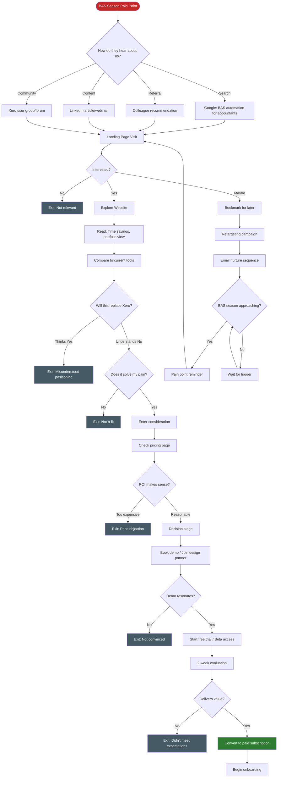

### Key Touchpoints

| Stage | Touchpoint | User Action | Emotion | Key Message |
|-------|------------|-------------|---------|-------------|
| **Awareness** | Search results / LinkedIn | Searching for BAS solutions | Frustrated, stressed | "There has to be a better way" |
| **Interest** | Landing page | Reading value proposition | Curious, hopeful | "Cut BAS prep time in half" |
| **Consideration** | Feature pages | Comparing to current tools | Analytical, skeptical | "Complements Xero, not replaces" |
| **Evaluation** | Demo call | Seeing portfolio dashboard | Impressed, intrigued | "This is exactly what I need" |
| **Trial** | First login | Connecting Xero, seeing data | Excited, cautious | "Let's see if this really works" |
| **Decision** | Trial results | Reviewing time saved | Confident, relieved | "This actually saves time" |

### Emotional Journey

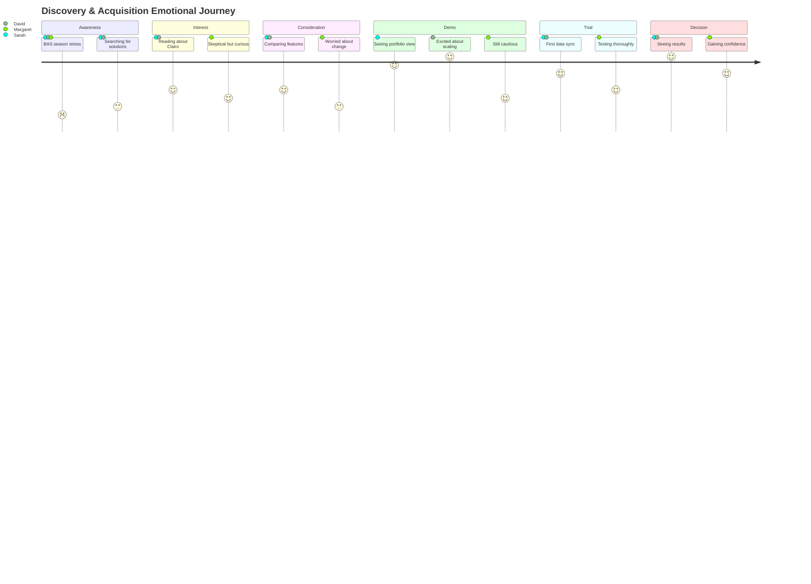

### Success Metrics

| Metric | Target | Measurement |
|--------|--------|-------------|
| Website visit to demo booking | 5-8% | Google Analytics conversion |
| Demo to trial signup | 40-50% | CRM tracking |
| Trial to paid conversion | 60-70% | Product analytics |
| Time to decision (from first visit) | 14-21 days | CRM lifecycle |
| Primary acquisition channel | Referral + Search | Attribution modeling |

### Pain Points & Opportunities

**Pain Points:**
- Confusion about positioning (Xero competitor vs complement)
- Price objection without understanding ROI
- Skepticism about AI/automation accuracy
- Change fatigue (already using multiple tools)

**Opportunities:**
- Clear messaging: "Built for accountants managing 20+ BAS clients"
- ROI calculator showing time savings and risk reduction
- Case studies from similar firms
- Free design partner program to reduce risk
- Comparison table: Clairo vs Xero Tax vs LodgeiT

---

## 2. Onboarding Journey

### Overview
The critical first experience after signup, from account setup through the "aha moment" where users realize Clairo's value.

### Journey Flow

```mermaid
flowchart LR
    subgraph "Day 1: Setup"
        Start([First Login]) --> Welcome[Welcome Screen]
        Welcome --> Profile[Complete firm profile]
        Profile --> Integration[Connect Xero/MYOB]
        Integration --> Auth[OAuth authorization]
        Auth --> Sync1[Initial data sync begins]
        Sync1 --> Wait1[Wait: 5-15 minutes]
    end

    subgraph "Day 1: First Insights"
        Wait1 --> Dashboard1[First dashboard view]
        Dashboard1 --> Aha1{Aha Moment 1}
        Aha1 -->|See all clients| Reaction1["I can see everyone at once!"]
        Reaction1 --> Explore1[Explore client list]
        Explore1 --> Score[View data quality scores]
        Score --> Aha2{Aha Moment 2}
        Aha2 -->|See issues| Reaction2["It already found problems!"]
    end

    subgraph "Days 2-3: Deep Dive"
        Reaction2 --> Client1[Click into problem client]
        Client1 --> Issues[Review specific issues]
        Issues --> Understand[Understand issue types]
        Understand --> Team[Invite team members]
        Team --> Assign[Assign clients to team]
    end

    subgraph "Week 1: First BAS"
        Assign --> SelectClient[Select client for first BAS]
        SelectClient --> Variance[Run variance analysis]
        Variance --> Aha3{Aha Moment 3}
        Aha3 -->|Instant insights| Reaction3["This just saved me 45 minutes!"]
        Reaction3 --> Prepare[Prepare BAS in Clairo]
        Prepare --> Review[Review & approve]
        Review --> Export[Export to Xero Tax]
        Export --> Complete[First BAS complete]
    end

    subgraph "Week 2: Adoption"
        Complete --> Expand[Add more clients to workflow]
        Expand --> Customize[Customize notifications]
        Customize --> Integrate2[Set up client communications]
        Integrate2 --> Adopted[Fully adopted]
    end

    style Start fill:#1565c0,color:#ffffff
    style Aha1 fill:#f57c00,color:#ffffff
    style Aha2 fill:#f57c00,color:#ffffff
    style Aha3 fill:#f57c00,color:#ffffff
    style Reaction1 fill:#2e7d32,color:#ffffff
    style Reaction2 fill:#2e7d32,color:#ffffff
    style Reaction3 fill:#2e7d32,color:#ffffff
    style Adopted fill:#1b5e20,color:#ffffff
```

### Detailed First-Day Experience

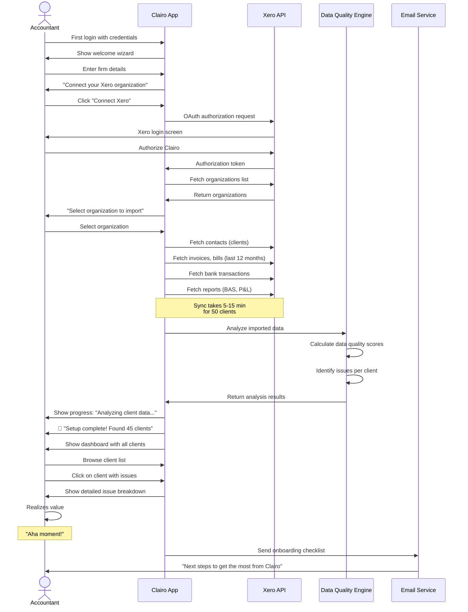

### Onboarding Checklist

Users see this checklist to guide their first week:

- [ ] Connect Xero/MYOB organization
- [ ] Review all imported clients
- [ ] Understand data quality scoring
- [ ] Invite team members
- [ ] Assign clients to team members
- [ ] Complete first BAS using variance analysis
- [ ] Set up client communication preferences
- [ ] Explore compliance dashboard
- [ ] Configure deadline alerts
- [ ] Join weekly office hours call (optional)

### "Aha Moments" Identification

| Aha Moment | When It Happens | What User Realizes | Emotional Impact |
|------------|-----------------|-------------------|------------------|
| **Portfolio View** | First dashboard load | "I can see all 50 clients in one view" | Relief, excitement |
| **Proactive Issues** | Reviewing quality scores | "It already found issues I didn't know about" | Impressed, validated |
| **Instant Variance** | First BAS prep | "This analysis took 45 minutes manually" | Delighted, time-saved |
| **Team Coordination** | Assigning clients | "My team can collaborate in real-time" | Confident, in control |
| **Client Insights** | Comparative analytics | "I can benchmark clients against each other" | Strategic, empowered |

### Key Touchpoints

| Day | Touchpoint | Goal | Support Provided |
|-----|------------|------|------------------|
| **Day 0** | Signup confirmation email | Build anticipation | Getting started video (2 min) |
| **Day 1** | First login | Successful Xero connection | In-app wizard, chat support |
| **Day 1** | Dashboard view | First "aha moment" | Tooltip tour of key features |
| **Day 2** | Follow-up email | Encourage first BAS | "Try your first variance analysis" |
| **Day 3** | Team setup | Collaboration adoption | Team roles guide |
| **Day 7** | Check-in call | Address questions, celebrate wins | Personal call from success team |
| **Day 14** | Adoption milestone | Confirm value delivery | Usage report + tips |

### Success Metrics

| Metric | Target | Definition |
|--------|--------|------------|
| Xero connection completion | 95%+ | Users who successfully connect within 24 hours |
| Time to first insight | <30 min | From signup to seeing dashboard with data |
| Time to first BAS | <7 days | From signup to completing first BAS in system |
| Team member invites | 60%+ | Firms with 2+ users who invite colleagues |
| Active usage (Week 2) | 70%+ | Users logging in 3+ times in second week |
| Aha moment achievement | 80%+ | Users who experience at least 2 aha moments |

### Pain Points & Opportunities

**Pain Points:**
- Xero OAuth can be confusing for less tech-savvy users
- Initial sync time creates anxiety (is it working?)
- Too many clients to review individually on Day 1
- Unclear what to do after setup completes
- Feature overwhelm (too many things to explore)

**Opportunities:**
- Progress indicators during sync with time estimates
- Guided tour highlighting top 3 features
- "Quick win" prompts: "Review these 5 clients with issues first"
- Daily email tips (Day 1-7) with specific actions
- Video library: "How to do your first BAS in 10 minutes"
- Onboarding checklist gamification (checkmarks, progress bar)

---

## 3. Quarterly BAS Workflow Journey

### Overview
The complete BAS cycle from preparation weeks before the deadline through lodgement and post-submission activities. This is the core workflow Clairo optimizes.

### Journey Flow

```mermaid
flowchart TD
    subgraph "Week -3: Pre-BAS Preparation"
        Start([BAS Quarter Begins]) --> Alert1[System: 21 days until deadline]
        Alert1 --> Dashboard1[View BAS pipeline dashboard]
        Dashboard1 --> Triage[Triage clients by readiness]
        Triage --> Red[Red: Blocking issues]
        Triage --> Yellow[Yellow: Minor issues]
        Triage --> Green[Green: Ready]

        Red --> Notify1[Auto-notify clients: Data needed]
        Yellow --> Assign1[Assign to junior for cleanup]
        Green --> Queue[Add to ready queue]
    end

    subgraph "Week -2: Data Quality Review"
        Notify1 --> Wait1[Wait for client response]
        Assign1 --> Junior1[Junior reviews & fixes issues]
        Wait1 --> Check1{Client responded?}
        Check1 -->|No| Escalate1[Escalate: Call client]
        Check1 -->|Yes| Junior1
        Escalate1 --> Junior1

        Junior1 --> Recheck[Re-run quality check]
        Recheck --> Status1{Status improved?}
        Status1 -->|No| Escalate2[Senior review needed]
        Status1 -->|Yes| Queue
    end

    subgraph "Week -1: BAS Preparation"
        Queue --> Priority[Prioritize by deadline/risk]
        Priority --> Batch[Batch prepare BAS]

        Batch --> Client1[Client 1: Run variance analysis]
        Client1 --> Review1{Anomalies?}
        Review1 -->|Yes| Investigate1[Investigate variance]
        Review1 -->|No| Approve1[Mark ready for review]
        Investigate1 --> Resolve1[Resolve or document]
        Resolve1 --> Approve1

        Approve1 --> Client2[Client 2: Run variance analysis]
        Client2 --> ClientN[... Continue for all clients]
    end

    subgraph "Deadline Week: Review & Approval"
        ClientN --> SeniorReview[Senior: Review all prepared BAS]
        SeniorReview --> Exceptions[Focus on exceptions only]
        Exceptions --> Approve2[Approve clean BAS]
        Exceptions --> Question[Question anomalies]

        Question --> Investigate2[Re-investigate flagged items]
        Investigate2 --> Resolution{Resolved?}
        Resolution -->|Yes| Approve2
        Resolution -->|No| ClientContact[Contact client for clarification]
        ClientContact --> Approve2

        Approve2 --> ClientApproval[Send to client for approval]
        ClientApproval --> ClientReview{Client approves?}
        ClientReview -->|Yes| Export
        ClientReview -->|No| Revise[Make revisions]
        Revise --> SeniorReview
    end

    subgraph "Lodgement: Export & Submit"
        Export[Export to Xero Tax/LodgeiT] --> Lodge[Lodge with ATO]
        Lodge --> Confirm[Receive ATO confirmation]
        Confirm --> Update[Update client status: Complete]
        Update --> Archive[Archive BAS documentation]
    end

    subgraph "Post-Submission: Follow-up"
        Archive --> Invoice[Generate invoice for BAS service]
        Invoice --> Notice[Monitor ATO notices]
        Notice --> NextQuarter[Prepare for next quarter]
        NextQuarter --> Insights[Review: What went well?]
        Insights --> Improve[Document process improvements]
        Improve --> End([Quarter Complete])
    end

    style Start fill:#1565c0,color:#ffffff
    style End fill:#2e7d32,color:#ffffff
    style Red fill:#b71c1c,color:#ffffff
    style Yellow fill:#f57c00,color:#ffffff
    style Green fill:#2e7d32,color:#ffffff
```

### Detailed BAS Preparation Workflow

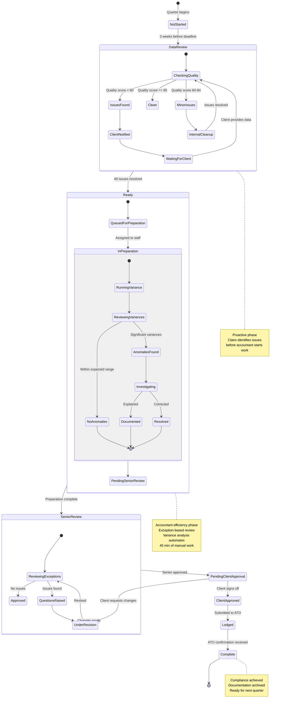

### Weekly Activity Patterns

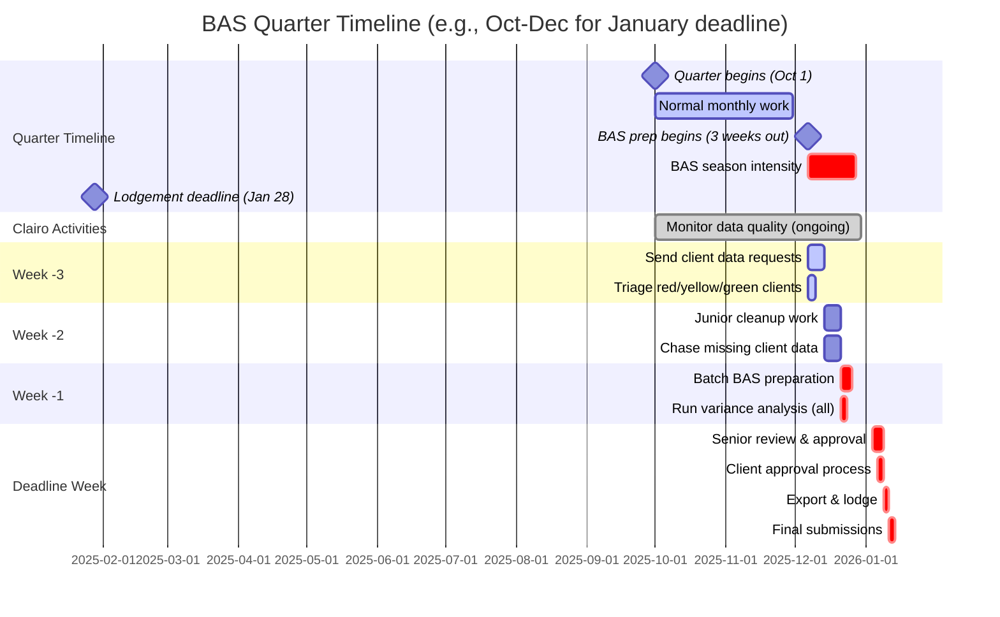

### Key Touchpoints

| Phase | Touchpoint | Actor | Action | Emotion |
|-------|------------|-------|--------|---------|
| **Week -3** | BAS deadline alert | System | Auto-email: "21 days until deadline" | Aware, not stressed yet |
| **Week -3** | Dashboard review | Accountant | Triage 50 clients by readiness | Organized, in control |
| **Week -3** | Client outreach | System | Auto-email to clients with issues | Proactive |
| **Week -2** | Quality re-check | Junior | Cleanup unreconciled transactions | Productive |
| **Week -2** | Escalation | Senior | Call client with missing data | Slightly frustrated |
| **Week -1** | Variance analysis | Accountant | Review automated variance report | Impressed, efficient |
| **Week -1** | Anomaly investigation | Accountant | Investigate 340% spike in expense | Curious, analytical |
| **Deadline week** | Batch approval | Senior | Review 40 BAS in 4 hours (not 20 hours) | Relieved, confident |
| **Deadline week** | Client portal | Client | Review and approve BAS draft | Informed, professional |
| **Lodgement** | Export | Accountant | Export to Xero Tax/LodgeiT | Satisfied |
| **Post-lodgement** | Confirmation | System | ATO confirmation received | Complete, accomplished |

### Success Metrics

| Metric | Target | How Clairo Helps |
|--------|--------|-------------------|
| **Average BAS prep time** | 2.5 hours (down from 5) | Variance analysis automation, exception-based review |
| **Data quality issues found** | 80%+ pre-BAS | Continuous monitoring, proactive alerts |
| **On-time lodgement rate** | 98%+ | Deadline tracking, status pipeline |
| **BAS requiring senior review** | 20% (down from 100%) | Exception-based workflow |
| **Client approval turnaround** | <48 hours | White-label portal, automated notifications |
| **Penalties avoided** | 100% | Risk scoring, deadline alerts |

### Pain Points & Opportunities

**Pain Points:**
- Still dependent on client providing clean data (Clairo can't fix that)
- Variance analysis requires accountant interpretation (AI can flag, not explain)
- Client approval step can delay lodgement if client is slow to respond
- Complex edge cases still require manual investigation

**Opportunities:**
- Predictive risk scoring: "This client is likely to have issues based on history"
- Auto-categorization suggestions based on prior quarters
- One-click client reminders when approval is pending
- Learning from accountant's variance explanations (future AI feature)
- Integration with Xero Tax for seamless export
- Batch operations: Approve 10 clean BAS at once

---

## 4. Daily/Weekly Usage Patterns

### Overview
How accountants interact with Clairo outside of BAS season, including monitoring, alerts, and team collaboration.

### Daily/Weekly Interaction Flow

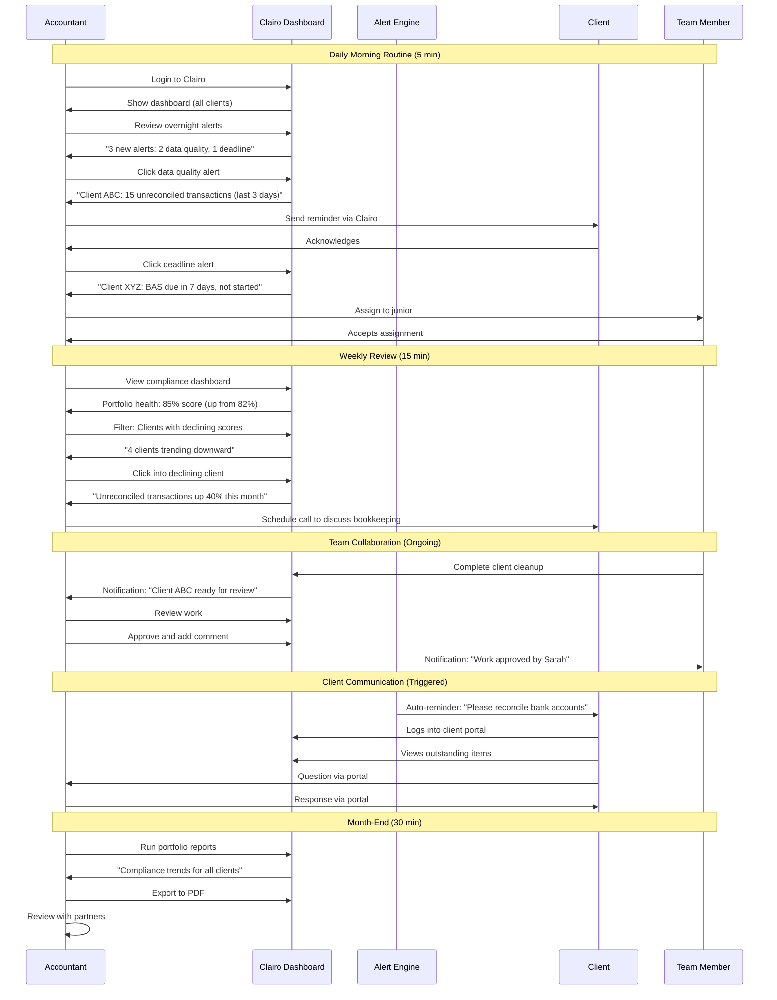

### Usage Patterns by User Type

```mermaid
flowchart TD
    subgraph "Sarah (Practice Manager) - Daily 10 min"
        SM1[Login: 8:30 AM] --> SM2[Review dashboard status]
        SM2 --> SM3[Check team assignments]
        SM3 --> SM4[Review escalated items]
        SM4 --> SM5[Prioritize work for team]
        SM5 --> SM6[Respond to client questions]
        SM6 --> SM7[Update practice manager on status]
    end

    subgraph "David (Solo + Junior) - Daily 15 min"
        D1[Login: Morning & Evening] --> D2[Check alerts]
        D2 --> D3[Review junior's work]
        D3 --> D4[Handle exceptions]
        D4 --> D5[Assign new clients to junior]
        D5 --> D6[Client communication]
        D6 --> D7[Quick BAS prep if needed]
    end

    subgraph "Margaret (Senior) - Weekly 20 min"
        M1[Login: Monday AM] --> M2[Review assigned clients]
        M2 --> M3[Check data quality scores]
        M3 --> M4[Review team's work]
        M4 --> M5[BAS approvals]
        M5 --> M6[Add notes/documentation]
        M6 --> M7[Client calls if needed]
    end

    subgraph "Junior Accountant - Daily 30-60 min"
        J1[Login: Multiple times daily] --> J2[Check assigned tasks]
        J2 --> J3[Work on client cleanup]
        J3 --> J4[Run quality checks]
        J4 --> J5[Mark ready for senior review]
        J5 --> J6[Respond to questions]
        J6 --> J7[Learn from senior feedback]
    end

    style SM1 fill:#7b1fa2,color:#ffffff
    style D1 fill:#00838f,color:#ffffff
    style M1 fill:#558b2f,color:#ffffff
    style J1 fill:#e65100,color:#ffffff
```

### Alert Types & Responses

| Alert Type | Frequency | User Action | Time Required |
|------------|-----------|-------------|---------------|
| **Deadline approaching (7 days)** | Per client | Assign or start BAS prep | 2 min |
| **Data quality degraded** | Daily digest | Send client reminder | 1 min |
| **Unreconciled transactions spike** | Real-time | Investigate or assign | 5 min |
| **GST coding anomaly** | Weekly | Review and correct | 10 min |
| **PAYG mismatch** | Monthly | Reconcile payroll | 15 min |
| **Client hasn't logged into Xero (14 days)** | Weekly | Call client | 10 min |
| **ATO notice received** | Real-time | Review and take action | Variable |
| **Team member completed work** | Real-time | Review and approve | 5 min |

### Key Touchpoints

| Frequency | Touchpoint | Purpose | Duration |
|-----------|------------|---------|----------|
| **Daily** | Dashboard check | Status awareness | 2-5 min |
| **Daily** | Alert review | Proactive issue management | 5-10 min |
| **Daily** | Team coordination | Task management, approvals | 5-15 min |
| **Weekly** | Compliance review | Portfolio health check | 15-20 min |
| **Weekly** | Client communication | Reminders, follow-ups | 10-20 min |
| **Monthly** | Reporting | Executive summary, trends | 20-30 min |
| **Quarterly** | BAS season | Intensive usage | 40-60 hours total |

### Success Metrics

| Metric | Target | Definition |
|--------|--------|------------|
| **Daily active users (DAU)** | 60%+ | Users logging in daily (non-BAS season) |
| **Weekly active users (WAU)** | 85%+ | Users logging in weekly |
| **Average session duration** | 8-12 min | Time per login session |
| **Alert response time** | <24 hours | Time from alert to action |
| **Team collaboration rate** | 70%+ | Firms using multi-user features |
| **Client portal adoption** | 40%+ | Clients using white-label portal |

### Pain Points & Opportunities

**Pain Points:**
- Alert fatigue (too many alerts = ignored alerts)
- Daily login adds to tool fragmentation
- Some alerts not actionable (FYI only)
- Mobile access limited (desktop-only usage)

**Opportunities:**
- Smart alert digesting: Bundle low-priority alerts into daily/weekly summary
- Mobile app for quick dashboard checks
- Slack/Teams integration for alerts in existing workflow
- AI-suggested actions: "Do you want to send client a reminder?"
- Customizable alert thresholds per firm

---

## 5. Client Management Journey

### Overview
The lifecycle of managing clients within Clairo, from adding new clients to monitoring health and handling offboarding.

### Journey Flow

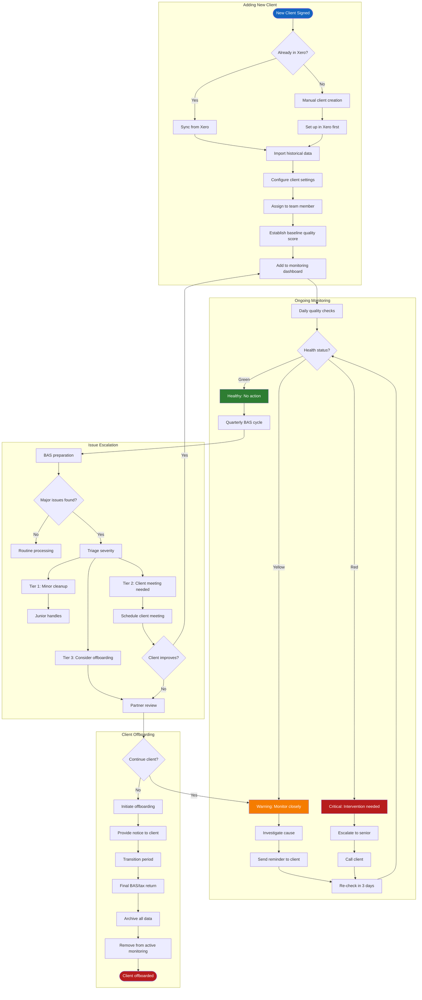

### Client Health Monitoring

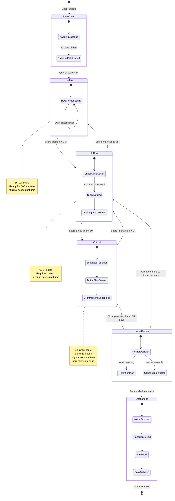

### Client Prioritization Matrix

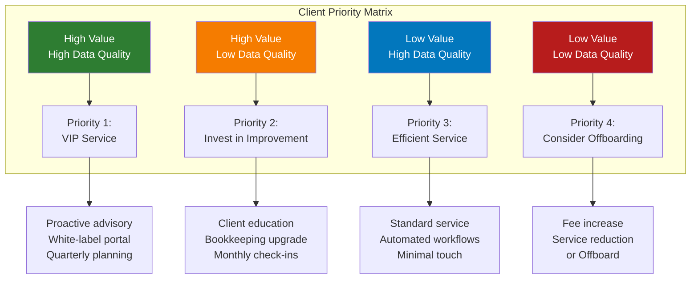

### Key Touchpoints

| Stage | Touchpoint | Actor | Action | Outcome |
|-------|------------|-------|--------|---------|
| **Onboarding** | Client added | Admin | Import from Xero | Client visible in dashboard |
| **Onboarding** | Baseline established | System | 30 days of monitoring | Initial quality score set |
| **Monitoring** | Daily health check | System | Auto-scan for issues | Alerts generated if needed |
| **Monitoring** | Quality degradation | System | Alert accountant | Proactive intervention |
| **Escalation** | Score drops <60 | Accountant | Call client | Action plan created |
| **Escalation** | No improvement | Partner | Review relationship | Decision to continue/exit |
| **Offboarding** | Notice provided | Partner | Formal communication | 90-day transition begins |
| **Offboarding** | Final work | Senior | Complete outstanding work | Client relationship ends |

### Success Metrics

| Metric | Target | Definition |
|--------|--------|------------|
| **Average client health score** | 80+ | Portfolio-wide quality score |
| **Clients in "Healthy" status** | 70%+ | Score 85+ consistently |
| **Clients in "Critical" status** | <10% | Score below 60 |
| **Time to resolve critical issues** | <14 days | From alert to score improvement |
| **Client churn rate (voluntary)** | <5% annually | Clients leaving on their own |
| **Client churn rate (firm-initiated)** | 5-10% annually | Offboarding low-quality clients |

### Pain Points & Opportunities

**Pain Points:**
- Hard to convince clients to improve bookkeeping habits
- Some clients will always be messy (industry/personality)
- Offboarding is emotionally difficult
- Portfolio mix shifts over time (need to re-evaluate)

**Opportunities:**
- Client education resources: "Why clean data matters"
- Tiered service offerings: Premium vs Standard
- Automated client scorecards sent monthly
- Industry benchmarking: "You're in the bottom 20% for data quality"
- Referral program: Replace low-quality clients with high-quality ones

---

## 6. Upgrade/Expansion Journey

### Overview
How firms grow their Clairo usage from Starter to Professional to Enterprise, including adding team members and activating white-label features.

### Journey Flow

```mermaid
flowchart LR
    subgraph "Starter Tier (Month 1-3)"
        Start([Signup: $49/mo]) --> Use1[Use with 10 clients]
        Use1 --> Value1[Experience value]
        Value1 --> Grow1[Add more clients]
        Grow1 --> Limit1{Approaching 15 client limit?}
    end

    subgraph "Upgrade to Professional"
        Limit1 -->|Yes| Prompt1[In-app upgrade prompt]
        Prompt1 --> Consider1{Worth $149?}
        Consider1 -->|No| Stay1[Stay on Starter]
        Consider1 -->|Yes| Upgrade1[Upgrade to Professional]

        Upgrade1 --> Unlock1[Unlock features:<br/>Variance analysis<br/>Team workflows<br/>Compliance analytics]
        Unlock1 --> Experience1[Experience new features]
        Experience1 --> ROI1{Delivers ROI?}
        ROI1 -->|Yes| Satisfied1[Satisfied Pro user]
        ROI1 -->|No| Downgrade1[Downgrade or churn]
    end

    subgraph "Team Expansion"
        Satisfied1 --> Hire[Hire new team member]
        Hire --> Invite[Invite to Clairo]
        Invite --> Onboard[Onboard team member]
        Onboard --> Collaborate[Team collaboration]
        Collaborate --> Efficiency[Increased efficiency]
    end

    subgraph "Upgrade to Enterprise"
        Efficiency --> Growth{Firm growing?}
        Growth -->|Yes| Consider2{Want white-label?}
        Consider2 -->|Yes| Sales[Talk to sales]
        Sales --> Demo[See white-label demo]
        Demo --> Decision{Worth $399?}
        Decision -->|Yes| Upgrade2[Upgrade to Enterprise]
        Decision -->|No| StayPro[Stay on Professional]

        Upgrade2 --> Setup[Custom branding setup]
        Setup --> Launch[Launch client portal]
        Launch --> ClientAdoption[Clients use portal]
        ClientAdoption --> Differentiation[Competitive advantage]
    end

    subgraph "Maximizing Value"
        Differentiation --> API[Explore API integrations]
        API --> Integrate[Connect practice mgmt tools]
        Integrate --> Optimize[Fully optimized practice]
        Optimize --> Advocate[Become advocate/referrer]
        Advocate --> End([Retained power user])
    end

    style Start fill:#1565c0,color:#ffffff
    style End fill:#2e7d32,color:#ffffff
    style Upgrade1 fill:#f57c00,color:#ffffff
    style Upgrade2 fill:#f57c00,color:#ffffff
```

### Upgrade Trigger Points

```mermaid
journey
    title Expansion Triggers Throughout Customer Lifecycle
    section Month 1-3: Starter
      Initial usage: 5: User
      Adding clients: 7: User
      Hitting client limit: 4: User
    section Month 3-6: Consider Pro
      Upgrade prompt: 5: User
      Evaluating ROI: 6: User
      Upgrading to Pro: 8: User
    section Month 6-12: Professional
      Advanced features: 9: User
      Hiring team member: 7: User
      Team collaboration: 8: User
    section Month 12+: Consider Enterprise
      Firm growth: 8: User
      Want differentiation: 7: User
      Evaluating white-label: 6: User
      Upgrading to Enterprise: 9: User
      Client portal launch: 10: User
```

### Detailed Team Member Addition Flow

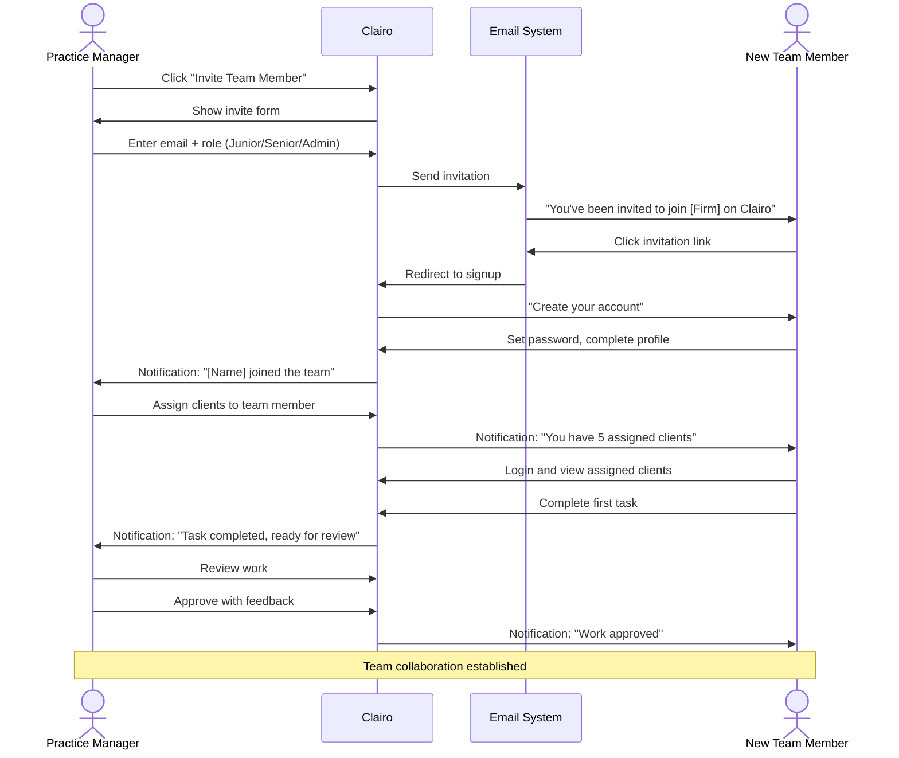

### Upgrade Decision Drivers

| Trigger | Starter to Professional | Professional to Enterprise |
|---------|-------------------------|----------------------------|
| **Client growth** | Approaching 15 clients | 50+ clients, want unlimited |
| **Feature need** | Need variance analysis, team workflows | Need white-label, API access |
| **Team size** | Hiring first junior | Multiple team members, complex workflows |
| **Value realized** | Clairo saves 3+ hours/week | Clairo critical to operations |
| **ROI calculation** | $149 < value of time saved | $399 < competitive advantage value |
| **Competitive pressure** | Peers using advanced tools | Need branded client experience |
| **Firm stage** | Growing practice | Established, scaling firm |

### Key Touchpoints

| Stage | Touchpoint | Message | CTA |
|-------|------------|---------|-----|
| **Starter: Client limit** | In-app banner | "You have 13/15 clients. Upgrade to Pro for 50 clients + advanced features" | "See Pro Features" |
| **Starter: Feature locked** | Feature gate | "Variance analysis available on Professional" | "Upgrade Now" |
| **Professional: Team value** | Onboarding | "Invite your team to collaborate" | "Invite Team Member" |
| **Professional: White-label tease** | Feature tour | "Enterprise users can white-label for clients" | "Learn More" |
| **Enterprise inquiry** | Sales outreach | "See how white-label transforms your client experience" | "Book Demo" |
| **Post-upgrade** | Email | "Welcome to [Tier]! Here's how to get the most value..." | "Watch Tutorial" |

### Success Metrics

| Metric | Target | Definition |
|--------|--------|------------|
| **Starter to Pro upgrade rate** | 40-50% | Users hitting client limit who upgrade |
| **Time to first upgrade** | 3-6 months | From signup to Pro upgrade |
| **Pro to Enterprise upgrade rate** | 15-20% | Pro users upgrading to Enterprise |
| **Team member invite rate** | 60%+ | Pro/Enterprise users inviting colleagues |
| **Average team size** | 2.5 users | Users per firm account |
| **White-label activation rate** | 70%+ | Enterprise users activating white-label |
| **Expansion MRR** | 30%+ of total MRR | Revenue from upgrades/add-ons |

### Pain Points & Opportunities

**Pain Points:**
- Price jump from $49 to $149 feels significant
- Unclear which features justify upgrade
- Enterprise at $399 seems expensive for smaller firms
- White-label setup requires effort (branding, domain)

**Opportunities:**
- ROI calculator showing time saved at each tier
- "Try Pro free for 14 days" to experience features
- Feature comparison table prominently displayed
- Usage-based prompts: "You used variance analysis 15 times this month—available on Pro"
- Video testimonials from firms at each tier
- Concierge white-label setup for Enterprise (included in price)
- Annual billing discount (save 2 months)

---

## 7. Key Touchpoints & Emotions

### Overview
Comprehensive mapping of emotional states, pain points, and opportunities across the entire user journey.

### Emotional Journey Map

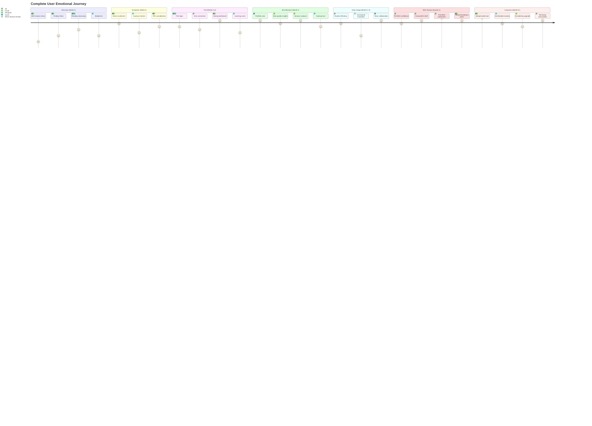

### Touchpoint Matrix

| Journey Stage | Touchpoint | Channel | Emotion | Pain Point | Opportunity |
|---------------|------------|---------|---------|------------|-------------|
| **Awareness** | BAS season begins | Email/Calendar | Dread, stress | "Here we go again..." | Targeted ad: "BAS doesn't have to be painful" |
| **Discovery** | Google search | Web | Frustrated, hopeful | Current tools inadequate | SEO for "BAS automation accountants" |
| **Interest** | Landing page | Web | Curious, skeptical | Too good to be true? | Clear value prop, social proof |
| **Consideration** | Feature comparison | Web | Analytical | "How is this different?" | Comparison table vs Xero Tax, LodgeiT |
| **Evaluation** | Demo call | Video | Engaged, impressed | Is it worth the switch? | Live demo with their data |
| **Trial** | First login | App | Excited, nervous | Will I understand this? | Guided onboarding tour |
| **Aha #1** | Portfolio dashboard | App | Amazed, relieved | Can't see all clients at once in Xero | Tooltip: "This is your command center" |
| **Aha #2** | Data quality scores | App | Validated, impressed | Didn't know these issues existed | Alert: "We found 23 issues across 12 clients" |
| **Aha #3** | Variance analysis | App | Delighted, time-saved | Manual analysis takes 45 min | "This analysis took 8 seconds" |
| **Daily use** | Morning dashboard check | App | Confident, in-control | Need situational awareness | Daily digest email option |
| **Team collab** | Assign work to junior | App | Empowered, efficient | Team coordination is chaotic | Workflow notifications |
| **Client comm** | Send client reminder | App | Proactive, professional | Clients forget to reconcile | Auto-reminders on schedule |
| **BAS prep** | Week before deadline | App | Focused, organized | Used to be panic mode | Status pipeline shows exactly where you are |
| **BAS review** | Senior approval | App | Thorough, confident | Used to review all 50 manually | Exception-based: review 10, approve 40 |
| **Lodgement** | Export to Xero Tax | App | Satisfied, complete | Multi-tool workflow | One-click export |
| **Post-BAS** | Quarter complete | Email | Accomplished, proud | Used to be exhausted | "You saved 127 hours this quarter" |
| **Renewal** | Subscription renewal | Email | Committed, loyal | Is it still worth it? | Usage report + ROI summary |
| **Advocacy** | Refer colleague | Word-of-mouth | Generous, confident | Peers still struggling | Referral incentive program |

### Pain Point Prioritization

| Pain Point | Frequency | Severity | Current State | Opportunity |
|------------|-----------|----------|---------------|-------------|
| **Can't see all clients at once** | Daily | High | Solved by portfolio dashboard | Core differentiator |
| **Discover issues too late** | Quarterly | Critical | Solved by proactive monitoring | Compliance value |
| **Manual variance analysis** | Quarterly | High | Solved by AI analysis | Time savings |
| **Team coordination chaos** | Daily | Medium | Solved by workflows | Team efficiency |
| **Client communication gaps** | Weekly | Medium | Solved by auto-reminders | Client satisfaction |
| **Don't know which clients to prioritize** | Quarterly | High | Solved by risk scoring | Strategic focus |
| **Fear of making errors** | Quarterly | Critical | Mitigated by audit trails | Trust & safety |
| **Overwhelmed during BAS season** | Quarterly | Critical | Reduced by efficiency gains | Well-being |

### Opportunity Map

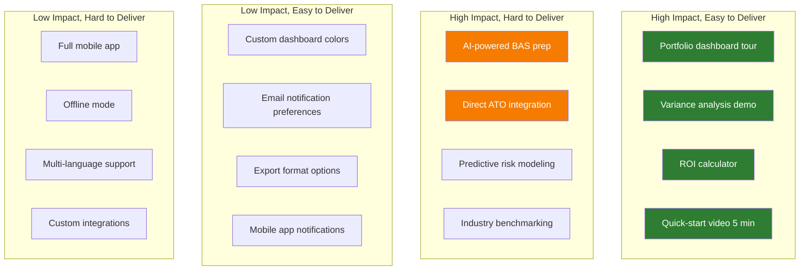

### Emotional States by Persona

| Stage | Sarah (Practice Mgr) | David (Solo Scaling) | Margaret (Traditional) |
|-------|----------------------|----------------------|------------------------|
| **Discovery** | Desperate for solution | Excited by potential | Skeptical of new tools |
| **Trial** | Impressed by portfolio view | Loves automation | Cautious, testing carefully |
| **First BAS** | Relief: team coordinated | Delight: did it in 2 hours | Surprise: actually easier |
| **Month 3** | Confident, empowered | Scaling successfully | Comfortable, trusting |
| **BAS Season** | In control, not stressed | Working normal hours | Impressed by efficiency |
| **Month 6** | Indispensable tool | Considering hiring | Recommending to peers |
| **Renewal** | No-brainer | Upgrading to Pro | Loyal subscriber |

---

## 8. Success Metrics Summary

### North Star Metrics

| Metric | Definition | Target | Why It Matters |
|--------|------------|--------|----------------|
| **BAS Prep Time Reduction** | Average hours saved per client per quarter | 50%+ (5hr → 2.5hr) | Core value proposition |
| **Active User Rate (BAS Season)** | % of subscribers actively using during BAS quarter | 90%+ | Product stickiness |
| **Net Promoter Score (NPS)** | Likelihood to recommend (0-10 scale) | 50+ | Customer satisfaction |
| **Net Revenue Retention** | MRR growth from existing customers (upgrades - churn) | 120%+ | Expansion revenue |

### Acquisition Metrics

| Metric | Target | Definition |
|--------|--------|------------|
| **Website → Demo** | 5-8% | Visitors who book demo |
| **Demo → Trial** | 40-50% | Demo attendees who start trial |
| **Trial → Paid** | 60-70% | Trial users who convert to paid |
| **Customer Acquisition Cost (CAC)** | <$500 | Total sales/marketing cost per new customer |
| **Time to Customer** | 14-21 days | First visit to paid subscription |

### Onboarding Metrics

| Metric | Target | Definition |
|--------|--------|------------|
| **Xero Connection Rate** | 95%+ | Users who successfully connect Xero within 24hr |
| **Time to First Insight** | <30 min | Signup to seeing dashboard with data |
| **Time to First BAS** | <7 days | Signup to completing first BAS in Clairo |
| **Aha Moment Rate** | 80%+ | Users experiencing 2+ aha moments in Week 1 |
| **Team Invite Rate** | 60%+ | Multi-user firms inviting colleagues |

### Engagement Metrics

| Metric | Target (Non-BAS) | Target (BAS Season) | Definition |
|--------|------------------|---------------------|------------|
| **Daily Active Users (DAU)** | 40-50% | 80%+ | Users logging in daily |
| **Weekly Active Users (WAU)** | 70%+ | 95%+ | Users logging in weekly |
| **Avg Session Duration** | 8-12 min | 30-45 min | Time per session |
| **Feature Adoption** | 60%+ | 90%+ | Users using variance analysis |
| **Client Portal Usage** | 30%+ | 50%+ | End clients using white-label portal |

### Retention Metrics

| Metric | Target | Definition |
|--------|--------|------------|
| **Monthly Churn** | <3% | Subscribers canceling per month |
| **Annual Retention** | >90% | Customers renewing after 12 months |
| **Expansion MRR** | 30%+ of total | Revenue from upgrades/add-ons |
| **Starter → Pro Upgrade** | 40-50% | Users hitting client limit who upgrade |
| **Pro → Enterprise Upgrade** | 15-20% | Pro users upgrading to Enterprise |

### Impact Metrics

| Metric | Target | Definition |
|--------|--------|------------|
| **Avg BAS Prep Time** | 2.5 hours | Down from 5 hours baseline |
| **Issues Found Pre-BAS** | 80%+ | Data quality issues identified proactively |
| **On-Time Lodgement Rate** | 98%+ | BAS lodged before deadline |
| **Penalties Avoided** | 100% | Firms reporting zero late penalties |
| **Client Data Quality Score** | 80+ | Portfolio-wide average quality score |

---

## Appendix: Mermaid Diagram Reference

### Diagram Types Used

This document uses the following Mermaid diagram types:

1. **flowchart TD/LR**: Process flows, decision trees, journey maps
2. **sequenceDiagram**: Interactions between user and system
3. **journey**: Emotional journey mapping with scores
4. **stateDiagram-v2**: State transitions (e.g., BAS status, client health)
5. **gantt**: Timeline visualization for BAS quarter
6. **graph**: Relationship and priority mapping

### Color Coding Convention

- **Blue (#e3f2fd)**: Start states, awareness
- **Green (#c8e6c9)**: Success states, positive outcomes
- **Yellow (#fff9c4)**: Warning states, consideration
- **Red (#ffcdd2)**: Critical states, exits, problems
- **Gray (#cfd8dc)**: Exits, inactive states
- **Purple/Orange/Cyan**: Different personas or user types

### Reading the Journeys

- **Circles** ([Start]): Entry/exit points
- **Rectangles** [Action]: Steps or states
- **Diamonds** {Decision?}: Decision points
- **Subgraphs**: Grouped phases or stages
- **Arrows**: Flow direction and dependencies

---

## Document Maintenance

**Version**: 1.0
**Last Updated**: December 9, 2024
**Maintained By**: Product Team
**Review Frequency**: Quarterly (aligned with BAS seasons)

**Next Review**: March 2025 (post-Q2 BAS season)

**Feedback**: Share insights with product@clairo.ai

---

*This user journey document is a living artifact. As we learn from real accountants using Clairo, we'll update these journeys to reflect actual user behavior, emotions, and opportunities for improvement.*
