# User Journey: SME Business Owners

**Understanding how business owners experience BAS through Clairo**

---

## Introduction

This document maps the journey of SME business owners as their accountants implement Clairo. These journeys focus on the client experience - from learning about the new system to experiencing quarterly BAS cycles with improved clarity, reduced stress, and better financial visibility.

**Key Principle**: Business owners don't need to do anything differently. The benefits come to them through their accountant's improved service delivery.

---

## 1. Introduction Journey

### Overview
How business owners first learn about Clairo and what their initial reaction might be.

### The Journey

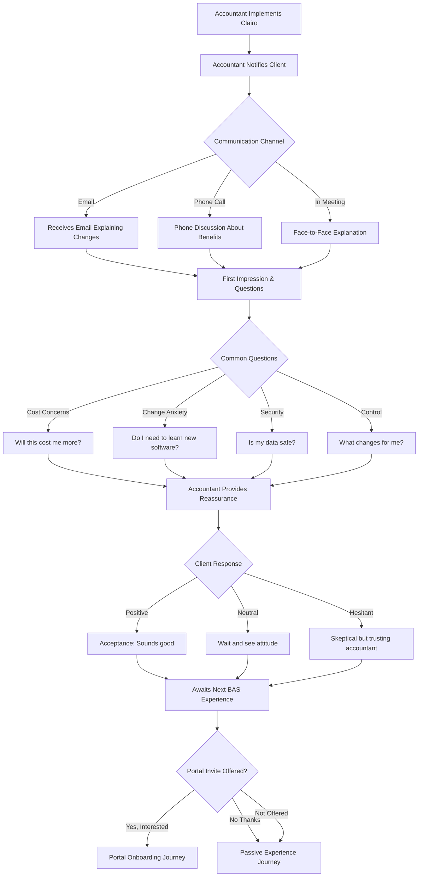

### Key Touchpoints

1. **Initial Notification**: Email, phone call, or meeting mention
2. **Information Provision**: What's changing and why
3. **Question Handling**: Addressing concerns about cost, complexity, security
4. **Portal Invitation**: Optional offer to use client portal

### Emotional States

| Stage | Emotion | What Helps |
|-------|---------|------------|
| First Hearing | Curiosity or Anxiety | Clear, jargon-free explanation |
| Understanding Benefits | Cautious Optimism | Focus on "no extra work for you" |
| Deciding on Portal | Interest or Indifference | "It's completely optional" message |
| Moving Forward | Relief or Neutrality | Trust in existing accountant relationship |

### Success Looks Like

- Client understands this improves their service without extra cost
- No anxiety about having to learn new systems
- Clear that they can use the portal or not - their choice
- Maintains trust in accountant relationship

---

## 2. Client Portal Onboarding Journey

### Overview
For business owners who choose to use the optional client portal.

### The Journey

```mermaid
flowchart LR
    Invite[Receives Email Invite] --> EmailOpen{Opens Email?}

    EmailOpen -->|Yes| ReadEmail[Reads Invitation]
    EmailOpen -->|No - Later| Reminder[Reminder Email in 3 Days]

    Reminder --> ReadEmail

    ReadEmail --> Click[Clicks 'Get Started' Link]
    Click --> SignUp[Simple Sign-Up Page]

    SignUp --> Form[Enter Basic Info:<br/>- Name<br/>- Email<br/>- Password<br/>- Mobile optional]

    Form --> Verify[Email Verification]
    Verify --> FirstLogin[First Login]

    FirstLogin --> Welcome[Welcome Screen]
    Welcome --> Tour[Optional Quick Tour<br/>- Skip button prominent]

    Tour --> Dashboard[Lands on Dashboard]
    Dashboard --> FirstView{What They See}

    FirstView --> Empty[No Current BAS Yet]
    Empty --> NextDue[Next BAS Due Date Shown]
    NextDue --> Explore[Optional: Explore Features]

    FirstView --> Active[Current BAS in Progress]
    Active --> Status[See BAS Status & Estimate]
    Status --> Review[Can Review Details]

    Explore --> Done[Onboarding Complete]
    Review --> Done

    Done --> WaitNotification[Waits for Next BAS Activity]
```

### Key Touchpoints

1. **Email Invitation**: Clear, simple, non-threatening
2. **Sign-Up Process**: 2-3 minutes, minimal fields
3. **Email Verification**: Standard security step
4. **Welcome Experience**: Brief, skippable tour
5. **First Dashboard View**: Clean, uncluttered interface

### Emotional States

| Stage | Emotion | Design Response |
|-------|---------|-----------------|
| Receiving Invite | Curiosity | Warm, welcoming email tone |
| Sign-Up | Mild Effort | Super simple form, 2-3 min max |
| First Login | Exploration | Clean interface, not overwhelming |
| Seeing Dashboard | Understanding or Confusion | Clear labels, helpful tooltips |
| Completion | Satisfaction | "That was easier than I thought" |

### Success Looks Like

- Sign-up completed in under 5 minutes
- Client understands what they're looking at
- No frustration with complexity
- Feels optional and low-pressure
- Returns when needed, not forgotten

---

## 3. Quarterly BAS Experience Journey

### Overview
The complete experience of a business owner through one BAS cycle.

### The Journey

```mermaid
flowchart TD
    Start[3 Weeks Before BAS Due] --> EarlyNotif[Early Notification:<br/>Your BAS is Coming Up]

    EarlyNotif --> Estimate[Receives Estimated Amount:<br/>Around $4,200]

    Estimate --> EmotionCheck1{Emotional Response}
    EmotionCheck1 -->|Expected| Relief1[Relief: I can plan for this]
    EmotionCheck1 -->|Higher Than Expected| Concern1[Concern: That's more than usual]
    EmotionCheck1 -->|Lower Than Expected| Pleased1[Pleased: Better than I thought]

    Relief1 --> Plan[Updates Cash Flow Plan]
    Concern1 --> Question[Asks Accountant Why]
    Pleased1 --> Plan

    Question --> Explanation[Gets Clear Explanation]
    Explanation --> Understanding[Understands the Variance]
    Understanding --> Plan

    Plan --> Wait[Waits for Review Period]

    Wait --> ReviewReady[1 Week Before:<br/>BAS Ready for Review]

    ReviewReady --> Channel{Access Method}

    Channel -->|Portal User| Portal[Logs Into Portal]
    Channel -->|Email User| EmailPDF[Opens Email with PDF]

    Portal --> PortalReview[Reviews BAS Summary:<br/>- Amount due<br/>- Key changes<br/>- Plain English explanations]

    EmailPDF --> EmailReview[Reviews PDF Summary]

    PortalReview --> Questions{Has Questions?}
    EmailReview --> Questions

    Questions -->|Yes| AskAccountant[Messages/Calls Accountant]
    Questions -->|No| ReadyApprove[Ready to Approve]

    AskAccountant --> Response[Gets Quick Response]
    Response --> Clarified[Questions Answered]
    Clarified --> ReadyApprove

    ReadyApprove --> ApprovalMethod{Approval Type}

    ApprovalMethod -->|Portal| ClickApprove[Clicks 'Approve' Button<br/>Takes 30 seconds]
    ApprovalMethod -->|Email| EmailConfirm[Replies 'Approved'<br/>or Clicks Link]

    ClickApprove --> Confirmation[Confirmation Message]
    EmailConfirm --> Confirmation

    Confirmation --> AccountantLodges[Accountant Lodges BAS]

    AccountantLodges --> LodgeNotif[Lodgement Notification:<br/>- Confirmation<br/>- Payment due date<br/>- Amount]

    LodgeNotif --> Payment[Makes Payment to ATO]
    Payment --> PaymentConfirm[Confirms Payment<br/>Optional: Updates Portal]

    PaymentConfirm --> Summary[Receives Quarter Summary:<br/>- What was different<br/>- Insights<br/>- Next quarter heads-up]

    Summary --> Complete[BAS Complete]
    Complete --> Relief2[Relief: Done for another quarter]

    Relief2 --> NextCycle[Cycle Repeats Next Quarter]

    style Start fill:#1565c0,color:#ffffff
    style Relief2 fill:#2e7d32,color:#ffffff
    style Concern1 fill:#f57c00,color:#ffffff
    style Complete fill:#2e7d32,color:#ffffff
```

### Key Touchpoints

1. **Early Warning (3 weeks before)**: Estimated amount provided
2. **Cash Flow Planning**: Time to prepare payment
3. **Review Period (1 week before)**: BAS ready for review
4. **Approval**: Simple one-click or email reply
5. **Lodgement Confirmation**: Peace of mind it's done
6. **Payment Reminder**: Due date and amount clear
7. **Quarter Summary**: Insights and forward-looking info

### Emotional Journey

| Touchpoint | Emotion | Why It Matters |
|------------|---------|----------------|
| Early Estimate | Relief → Planning | No surprises, can plan cash |
| Ready for Review | Engagement | Feels involved and informed |
| Explanation Clarity | Understanding | No confusion or worry |
| One-Click Approval | Satisfaction | So easy! |
| Lodgement Confirmation | Relief | It's done, correctly |
| Payment Reminder | Prepared | Won't forget |
| Quarter Summary | Confidence | Understanding their business |

### Success Looks Like

- No surprise bills
- Clear explanations in plain English
- 5-minute review and approval
- Confidence everything is correct
- Understanding why numbers changed
- Forward visibility to next quarter

---

## 4. Passive vs Active User Journeys

### Overview
Comparing the experience of business owners who use the portal vs those who don't.

### The Journey Comparison

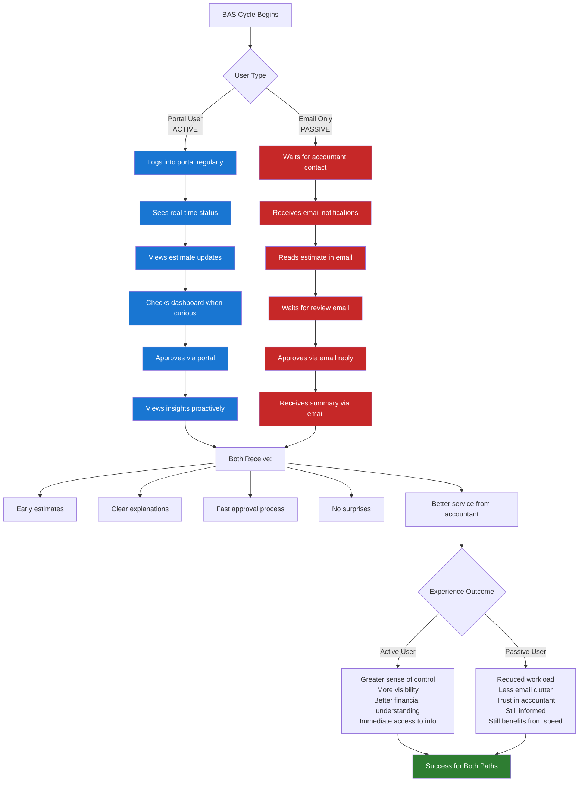

### Key Differences

| Aspect | Active (Portal) User | Passive (Email) User |
|--------|---------------------|---------------------|
| **Information Access** | On-demand via portal | Scheduled email updates |
| **Visibility** | Real-time status view | Email notifications only |
| **Approval Method** | Click button in portal | Reply to email |
| **Engagement Level** | High - checks regularly | Low - waits for contact |
| **Control Feeling** | Strong sense of control | Trust-based delegation |
| **Time Investment** | 10-15 min/quarter exploring | 5 min/quarter reading emails |
| **Best For** | Tech-savvy, likes visibility | Time-poor, trusts accountant |

### Both Paths Deliver

- Early BAS estimates (no surprises)
- Clear, plain-English explanations
- Simple approval process
- Faster turnaround than before
- Better service from accountant
- Confidence in compliance

### Success Looks Like

- Both user types feel well-served
- No pressure to use portal if not wanted
- Active users feel empowered
- Passive users feel unburdened
- Accountant can serve both effectively

---

## 5. Communication Touchpoints

### Overview
All the ways business owners hear from their accountant through a BAS cycle.

### Communication Flow

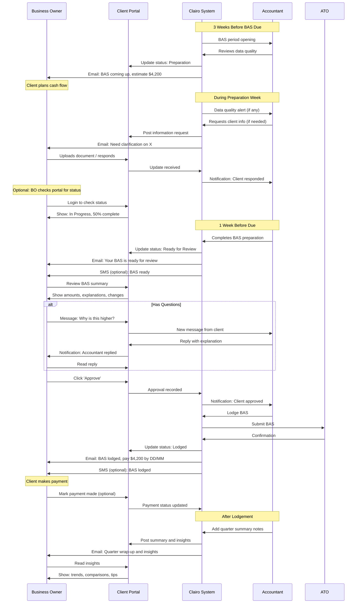

### Communication Channels

| Channel | Frequency | Purpose | Example |
|---------|-----------|---------|---------|
| **Email** | 3-5 per quarter | Major milestones and notifications | "Your BAS is ready for review" |
| **Portal Notifications** | Real-time | Status updates, new messages | Badge on dashboard |
| **SMS (Optional)** | 1-2 per quarter | Time-sensitive actions | "BAS approved - lodging now" |
| **In-Portal Messages** | As needed | Questions and clarifications | "Why is GST higher this quarter?" |
| **Phone/Video** | Rare | Complex issues only | "Let's discuss that unusual transaction" |

### Key Principles

1. **Don't Overwhelm**: 3-5 emails per quarter, not daily
2. **Meaningful Only**: Only send when action needed or major milestone
3. **Plain Language**: No accounting jargon in client communications
4. **Multi-Channel**: Email primary, portal secondary, SMS for urgency
5. **Accountant Control**: Accountant decides what triggers client notifications

### Success Looks Like

- Clients feel informed, not spammed
- Important messages don't get lost
- Clear action items when needed
- Easy to ask questions
- Trust and transparency maintained

---

## 6. Financial Insights Journey (Future Feature)

### Overview
How business owners benefit from proactive financial insights beyond just BAS compliance.

### The Journey

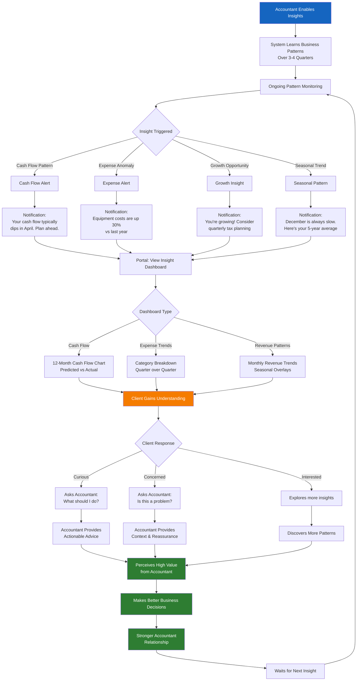

### Example Insights

| Insight Type | What Client Sees | Emotional Response | Value Delivered |
|--------------|------------------|-------------------|-----------------|
| **Cash Flow Warning** | "Your cash typically dips in April. You have $12k due. Start saving now." | Gratitude → Prepared | Avoids cash crunch |
| **Expense Anomaly** | "Your supplier costs jumped 25% this quarter. Check if this is expected." | Concern → Investigates | Catches billing errors |
| **GST Opportunity** | "You can claim GST on equipment purchases. Consider timing your next purchase." | Interest → Plans | Tax optimization |
| **Seasonal Pattern** | "December revenue is always 30% lower. Here's your average for planning." | Understanding → Prepared | Better forecasting |
| **Growth Alert** | "Revenue up 40%! May want to discuss tax strategy and cash reserves." | Pride → Plans | Proactive tax planning |

### Key Principles

1. **Simple Visuals**: Charts anyone can understand
2. **Plain Language**: No accounting jargon
3. **Actionable**: "Here's what you might do about this"
4. **Timely**: Right insight at the right moment
5. **Not Overwhelming**: 1-2 insights per month maximum

### Success Looks Like

- Business owner understands their patterns better
- No surprises - sees problems coming
- Makes better timing decisions
- Feels accountant is proactive, not reactive
- Relationship shifts from transactional to advisory

---

## 7. Issue/Exception Handling Journey

### Overview
What happens when something goes wrong or needs attention.

### The Journey

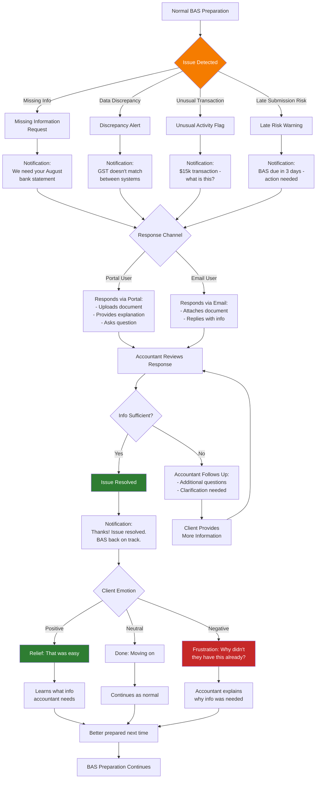

### Common Issues & Resolutions

| Issue Type | What Client Sees | Required Action | Typical Resolution Time |
|------------|------------------|-----------------|------------------------|
| **Missing Document** | "We need your August bank statement" | Upload or email document | 1-2 days |
| **Transaction Clarification** | "What was this $5k payment for?" | Provide explanation | Few hours |
| **Coding Error** | "This purchase - was it for business use?" | Confirm yes/no | Same day |
| **Reconciliation Gap** | "Bank balance doesn't match Xero - can you check?" | Review and confirm | 1-3 days |
| **Late Payment** | "Payment due tomorrow - have you paid?" | Confirm payment status | Same day |

### Communication During Issues

| Stage | Message Tone | Example |
|-------|--------------|---------|
| **Initial Alert** | Clear, non-alarming | "Quick question about your BAS" |
| **Explanation** | Simple, why it matters | "We need this to make sure your BAS is accurate" |
| **Urgency (if any)** | Honest, not panicking | "BAS due Friday - need this by Wednesday" |
| **Resolution** | Grateful, positive | "Perfect, thanks! All sorted now." |
| **Prevention** | Helpful, educational | "Next time, here's how to avoid this..." |

### Success Looks Like

- Issues caught early, not at deadline
- Client knows exactly what's needed
- Simple to provide information (upload, not email hunt)
- Fast resolution - hours or days, not weeks
- Client learns what to prepare for next time
- No blame, just problem-solving

---

## 8. Emotional Journey Mapping

### Overview
Tracking the emotional highs and lows throughout a BAS cycle.

### Emotional Journey Diagram

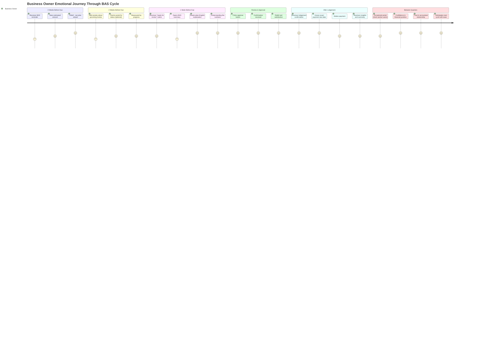

### Emotional States Explained

| Emotion Level | Description | What Causes It |
|---------------|-------------|----------------|
| **5 - Confident/Happy** | Feeling great, in control | Clear info, easy process, understanding |
| **4 - Satisfied/Calm** | Things are going well | Progress visible, trust maintained |
| **3 - Neutral/Mild Anxiety** | Normal caution | Routine reminder, standard process |
| **2 - Concerned** | Something feels off | Unexpected variance, unclear info |
| **1 - Stressed/Anxious** | Real worry | Surprise bill, missing info, deadline pressure |

### Moments of Truth

Critical touchpoints that make or break the experience:

1. **First Estimate Received** (Week -3)
   - **Make it**: Clear, early, accurate estimate
   - **Break it**: Surprise amount right before due date

2. **Review Explanation** (Week -1)
   - **Make it**: Plain English, understands why numbers changed
   - **Break it**: Jargon-filled, confusing, unexplained variances

3. **Approval Process** (Week -1)
   - **Make it**: One click, takes 30 seconds
   - **Break it**: Complex process, multiple steps, unclear

4. **Lodgement Confirmation** (Week 0)
   - **Make it**: Immediate confirmation, clear next steps
   - **Break it**: Radio silence after approval

5. **Payment Due Date** (Post-lodgement)
   - **Make it**: Clear reminder, exact amount, due date
   - **Break it**: Vague timing, missed payment, penalties

### Design Implications

| Moment | Emotion Goal | Design Response |
|--------|--------------|-----------------|
| Early notification | Reduce anxiety | 3-week advance notice, estimate provided |
| Review period | Build understanding | Plain language, visual explanations |
| Approval | Create satisfaction | One-click simplicity, immediate confirmation |
| Post-lodgement | Maintain confidence | Proactive insights, forward-looking info |
| Between quarters | Sustain trust | Optional engagement, no pressure |

### Success Looks Like

- Emotions stay mostly in 4-5 range (calm to confident)
- Anxiety moments brief and resolved quickly
- No moment drops to 1 (stressed/anxious)
- Overall trend: increasing confidence over time
- Client looks forward to BAS cycle (or at least doesn't dread it)

---

## 9. User Personas

### Overview
Three typical business owner types and how their journeys differ.

### Persona 1: Tech-Savvy Owner (Portal Power User)

**Meet Sarah - Digital Marketing Agency Owner**

**Profile**:
- Age: 35
- Business: 5 years old, growing fast
- Tech comfort: High - uses Xero daily, lots of SaaS tools
- BAS anxiety: Low - but wants visibility and control
- Time available: Moderate - checks systems regularly

**Needs**:
- Real-time visibility into financial position
- Understanding of trends and patterns
- Direct communication with accountant
- Insights to make business decisions

**Journey Highlights**:

**Touchpoints**:
- Logs into portal 2-3 times per week
- Reads every insight notification
- Messages accountant with strategic questions
- Appreciates dashboard visualizations
- Uses BAS data for business planning

**What Success Looks Like**:
- Feels empowered and informed
- Uses insights for strategic decisions
- Sees accountant as strategic partner
- Recommends portal to other business owners
- Engagement increases over time

---

### Persona 2: Time-Poor Owner (Email-Only User)

**Meet Marcus - Construction Business Owner**

**Profile**:
- Age: 48
- Business: 15 years old, stable
- Tech comfort: Moderate - uses phone for email, basic apps
- BAS anxiety: Moderate - wants it handled correctly
- Time available: Low - on job sites all day

**Needs**:
- Minimal time investment
- Clear, simple instructions
- Trust that it's done right
- No surprises on payment amounts

**Journey Highlights**:

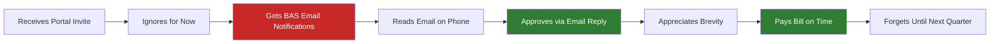

**Touchpoints**:
- Only interacts when emailed by accountant
- Skims emails, looks for dollar amount and due date
- Approves via quick email reply
- Calls if something looks wrong (rare)
- Appreciates brief, clear communications

**What Success Looks Like**:
- Spends under 5 minutes per quarter
- No missed deadlines
- Confident it's handled correctly
- Knows who to call if needed
- Never thinks about logging into portal (doesn't need to)

---

### Persona 3: Anxious Owner (Reassurance Seeker)

**Meet Linda - Retail Store Owner**

**Profile**:
- Age: 52
- Business: 8 years old, seasonal fluctuations
- Tech comfort: Low - intimidated by new systems
- BAS anxiety: High - worries about getting it wrong
- Time available: Moderate - but avoids "complicated" tasks

**Needs**:
- Reassurance everything is correct
- Understanding of changes (why is it different?)
- Personal touch from accountant
- Gradual comfort building with system

**Journey Highlights**:

```mermaid
flowchart LR
    L1[Hears About New System] --> L2[Initial Worry:<br/>Do I have to learn this?]
    L2 --> L3[Accountant Reassures:<br/>Nothing changes for you]
    L3 --> L4[Relief: I can keep doing<br/>what I'm doing]
    L4 --> L5[First BAS: Watches Carefully]
    L5 --> L6[Clear Explanation Received]
    L6 --> L7[Growing Confidence]
    L7 --> L8[Eventually Tries Portal]
    L8 --> L9[Surprised How Simple It Is]

    style L2 fill:#c62828,color:#ffffff
    style L3 fill:#f57c00,color:#ffffff
    style L7 fill:#2e7d32,color:#ffffff
    style L9 fill:#2e7d32,color:#ffffff
```

**Touchpoints**:
- Needs extra reassurance at first
- Appreciates phone calls for first BAS
- Gradually transitions to email comfort
- Eventually curious about portal (after 2-3 quarters)
- Needs plain English explanations

**What Success Looks Like**:
- Anxiety decreases significantly over 3-4 quarters
- Eventually tries portal (at her own pace)
- Trusts the system after seeing it work
- Stops worrying about BAS
- May become portal user by year 2

---

### Persona Comparison

| Aspect | Tech-Savvy Sarah | Time-Poor Marcus | Anxious Linda |
|--------|------------------|------------------|---------------|
| **Portal Adoption** | Immediate | Never | Eventually (6+ months) |
| **Engagement Level** | High - checks weekly | Minimal - email only | Growing - starts passive |
| **Communication Preference** | Portal messages | Email | Phone initially, then email |
| **Insight Interest** | High - reads everything | Low - just the basics | Moderate - once comfortable |
| **Approval Method** | Portal (loves one-click) | Email reply | Email (eventually portal) |
| **Relationship Style** | Strategic partnership | Transaction efficiency | Personal reassurance |
| **Time Investment** | 15-20 min/quarter | 5 min/quarter | 10 min/quarter (decreasing) |
| **Success Metric** | Feels empowered | Saves time | Reduces anxiety |

### Design Implications

The system must serve all three personas:

1. **Sarah needs**: Rich features, insights, dashboards, interactive tools
2. **Marcus needs**: Email simplicity, quick approval, minimal interaction
3. **Linda needs**: Gradual onboarding, clear explanations, optional portal

**Solution**: Multi-channel approach with progressive enhancement
- Core experience works via email (serves Marcus)
- Portal provides depth (serves Sarah)
- No pressure to use portal (serves Linda initially)
- Easy portal adoption when ready (serves Linda eventually)

---

## 10. Annual Lifecycle Journey

### Overview
How the client experience evolves over a full year and multiple BAS cycles.

### Annual Timeline

```mermaid
flowchart TD
    Start[Accountant Adopts Clairo] --> Q1Start[Quarter 1: First BAS]

    Q1Start --> Q1Exp[Q1 Experience:<br/>- Initial introduction<br/>- Portal invite optional<br/>- First early estimate<br/>- Learning the process]

    Q1Exp --> Q1Emotion[Emotions:<br/>Cautious curiosity<br/>Mild skepticism<br/>Wait and see]

    Q1Emotion --> Q1Complete[Q1 Complete]
    Q1Complete --> Q1Reflect[Reflection:<br/>That was easier<br/>than expected]

    Q1Reflect --> Q2Start[Quarter 2: Building Familiarity]

    Q2Start --> Q2Exp[Q2 Experience:<br/>- Knows what to expect<br/>- Faster approval<br/>- Maybe tries portal<br/>- Asks better questions]

    Q2Exp --> Q2Emotion[Emotions:<br/>Growing confidence<br/>Reduced anxiety<br/>Starting to trust]

    Q2Emotion --> Q2Complete[Q2 Complete]
    Q2Complete --> Q2Reflect[Reflection:<br/>I'm getting the<br/>hang of this]

    Q2Reflect --> Q3Start[Quarter 3: Confidence Building]

    Q3Start --> Q3Exp[Q3 Experience:<br/>- Routine established<br/>- Using portal more<br/>- Reading insights<br/>- Appreciating value]

    Q3Exp --> Q3Emotion[Emotions:<br/>Comfortable<br/>Confident<br/>Appreciative]

    Q3Emotion --> Q3Complete[Q3 Complete]
    Q3Complete --> Q3Reflect[Reflection:<br/>BAS is no longer<br/>stressful]

    Q3Reflect --> Q4Start[Quarter 4: Annual View]

    Q4Start --> Q4Exp[Q4 Experience:<br/>- Full year visibility<br/>- Year-end planning<br/>- Tax discussion<br/>- Annual insights]

    Q4Exp --> Q4Emotion[Emotions:<br/>Satisfaction<br/>Planning ahead<br/>Strategic thinking]

    Q4Emotion --> Q4Complete[Q4 Complete]
    Q4Complete --> YearEnd[Year-End Activities]

    YearEnd --> YEActivities[Year-End:<br/>- Annual BAS summary<br/>- Tax return prep<br/>- Year review meeting<br/>- Next year planning]

    YEActivities --> Outcome[Year 1 Outcomes]

    Outcome --> Benefits[Client Benefits:<br/>- Zero late fees<br/>- Zero surprises<br/>- Better cash planning<br/>- Stronger accountant relationship<br/>- Business insights gained]

    Benefits --> Year2[Year 2: Mature Relationship]

    Year2 --> Y2Char[Year 2 Characteristics:<br/>- Portal habitual use<br/>- Proactive engagement<br/>- Strategic questions<br/>- Referrals to other businesses<br/>- Higher service tier interest]

    Y2Char --> Advocacy[Client Becomes Advocate]

    style Q1Emotion fill:#f57c00,color:#ffffff
    style Q2Emotion fill:#1976d2,color:#ffffff
    style Q3Emotion fill:#2e7d32,color:#ffffff
    style Q4Emotion fill:#2e7d32,color:#ffffff
    style Benefits fill:#2e7d32,color:#ffffff
    style Advocacy fill:#2e7d32,color:#ffffff
```

### Quarter-by-Quarter Evolution

| Quarter | Primary Goal | Client Mindset | Key Activities | Success Indicator |
|---------|--------------|----------------|----------------|-------------------|
| **Q1** | Introduction & Learning | Cautious, observing | First estimate, first approval | Completes without friction |
| **Q2** | Familiarity Building | Growing trust | Faster process, maybe tries portal | Approval in <5 minutes |
| **Q3** | Confidence & Routine | Comfortable, confident | Regular portal use, reads insights | Asks strategic questions |
| **Q4** | Annual Planning | Strategic thinking | Year-end review, planning ahead | Discusses growth with accountant |

### Year-End Special Activities

**Q4 & Year-End are Different**:

1. **Full Year Review**
   - Complete annual summary
   - Year-over-year comparisons
   - What changed and why
   - Achievements and challenges

2. **Tax Planning Discussion**
   - Income tax return coordination
   - Tax optimization opportunities
   - Superannuation planning
   - Next year projections

3. **Strategic Planning**
   - Review business goals
   - Financial forecasting
   - Growth planning
   - Investment decisions

4. **Portal Features (Year-End)**
   - 12-month dashboard view
   - Annual trends and patterns
   - Industry benchmark comparisons
   - Year-end checklist

### Relationship Deepening

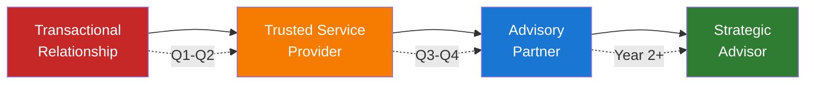

### Multi-Year Timeline

| Period | Relationship Stage | Client Behavior | Accountant Opportunity |
|--------|-------------------|-----------------|------------------------|
| **Months 1-3 (Q1)** | Introduction | Learning, cautious | Build trust, prove value |
| **Months 4-6 (Q2)** | Growing comfort | Engaging more | Deepen insights |
| **Months 7-9 (Q3)** | Established routine | Regular portal use | Introduce advisory |
| **Months 10-12 (Q4)** | Annual partner | Strategic thinking | Year-end planning |
| **Year 2** | Mature relationship | Proactive engagement | Upsell advisory services |
| **Year 3+** | Strategic advisor | Business partner mindset | Premium service tiers |

### Success Metrics Over Time

**Quarter 1**:
- 90%+ complete BAS on time
- <3 questions per client
- Approval within 24 hours

**Quarter 2**:
- 50%+ try portal (if invited)
- Approval within 12 hours
- <2 questions per client

**Quarter 3**:
- 70%+ portal adoption
- Proactive insight reading
- Strategic questions asked

**Quarter 4**:
- 80%+ portal habitual use
- Year-end meeting scheduled
- Referrals provided

**Year 2**:
- 90%+ portal adoption
- Advisory service interest
- Increased service tier

### Success Looks Like (Annual View)

By the end of Year 1:
- Client never missed a BAS deadline
- Zero late payment penalties
- Reduced BAS-related anxiety by 80%+
- Improved cash flow planning
- Stronger accountant relationship
- Better understanding of business finances
- Likely to renew accountant relationship
- Likely to refer other businesses

---

## Summary: What Makes These Journeys Successful

### Core Principles

1. **No Additional Burden**
   - Clients don't have to do more work
   - Portal is optional, not required
   - Email works perfectly fine
   - Time investment: 5-15 minutes per quarter

2. **Clear Communication**
   - Plain English, no jargon
   - Visual explanations
   - Timely notifications
   - Multi-channel flexibility

3. **Progressive Enhancement**
   - Start passive, become active over time
   - No pressure to use advanced features
   - Learn at own pace
   - Value delivered immediately

4. **Emotional Design**
   - Reduce anxiety (early estimates)
   - Build confidence (clear explanations)
   - Create satisfaction (easy approval)
   - Maintain trust (accountant oversight)

5. **Relationship Building**
   - Transactional → Advisory over time
   - Trust through consistency
   - Value beyond compliance
   - Strategic partnership potential

### Universal Success Indicators

Across all personas and journey types:
- No surprise BAS bills
- Clear understanding of numbers
- Fast approval process (<5 minutes)
- Confidence in compliance
- Stronger accountant relationship
- Reduced financial anxiety

### The Ultimate Goal

**BAS becomes background noise** - handled efficiently, clearly communicated, and stress-free, allowing business owners to focus on what they do best: running their business.

---

*This document maps the complete user journey for SME business owners experiencing BAS through Clairo. All journeys emphasize simplicity, clarity, and gradual confidence building while maintaining flexibility for different user preferences and comfort levels.*
