# Implementation Plan: Project Scaffolding

**Specification:** 001-project-scaffolding
**Version:** 1.0.0
**Date:** 2025-12-28
**Last Updated:** 2025-12-28

This implementation plan establishes the foundational development environment for Clairo - an Intelligent Business Advisory Platform for Australian Accounting Practices. Each task builds incrementally on previous tasks, following test-driven development where applicable.

---

## Completion Summary

| Phase | Status | Completed | Total |
|-------|--------|-----------|-------|
| 1. Project Root Setup | ✅ Complete | 5/5 | 100% |
| 2. Backend Project Configuration | ✅ Complete | 3/3 | 100% |
| 3. Backend Core Configuration | ✅ Complete | 2/2 | 100% |
| 4. Backend Core Module | ✅ Complete | 5/5 | 100% |
| 5. Backend Application Entry Point | ✅ Complete | 1/1 | 100% |
| 6. Backend Infrastructure | ✅ Complete | 5/5 | 100% |
| 7. Docker Compose Backend Integration | ✅ Complete | 2/2 | 100% |
| 8. Frontend Project Setup | ✅ Complete | 3/3 | 100% |
| 9. Frontend Styling Setup | ✅ Complete | 4/4 | 100% |
| 10. Frontend State Management | ✅ Complete | 3/3 | 100% |
| 11. Frontend API Integration | ✅ Complete | 4/4 | 100% |
| 12. Frontend Forms Setup | ✅ Complete | 1/1 | 100% |
| 13. Frontend App Structure | ✅ Complete | 2/2 | 100% |
| 14. Frontend Tooling Configuration | ✅ Complete | 3/3 | 100% |
| 15. Pre-commit Hooks Setup | ✅ Complete | 1/1 | 100% |
| 16. Development Scripts | ✅ Complete | 2/2 | 100% |
| 17. Integration Verification | ✅ Complete | 5/5 | 100% |
| **TOTAL** | **100%** | **51/51** | - |

### All Tasks Complete! ✅

All 51 implementation tasks have been completed successfully.

### Unit Tests (noted but optional for scaffolding)

The following unit test files were mentioned in task descriptions but not created as they are optional for initial scaffolding:
- `/backend/tests/unit/test_config.py`
- `/backend/tests/integration/test_database.py`
- `/backend/tests/unit/core/test_exceptions.py`
- `/backend/tests/unit/core/test_events.py`
- `/backend/tests/unit/core/test_logging.py`
- `/backend/tests/unit/core/test_security.py`
- `/backend/tests/unit/core/test_dependencies.py`
- `/backend/tests/integration/api/test_main.py`
- `/backend/tests/unit/tasks/test_celery_app.py`

---

## Task List

### 1. Project Root Setup

- [x] **1.1 Create root directory structure and .gitignore** ✅
  - Create the base `clairo/` directory structure with `backend/`, `frontend/`, `scripts/`, and `shared/` directories
  - Create comprehensive `.gitignore` covering Python, Node.js, IDE files, environment files, and Docker volumes
  - File: `/.gitignore`
  - _Requirements: 19.1, 19.2, 19.3, 19.4, 19.5_

- [x] **1.2 Create root environment configuration templates** ✅
  - Create `.env.example` with Docker Compose configuration variables (PostgreSQL, Redis, Qdrant, MinIO ports and credentials)
  - Document all environment variables with descriptive comments
  - Files: `/.env.example`
  - _Requirements: 16.1, 16.4_

- [x] **1.3 Create docker-compose.yml with all infrastructure services** ✅
  - Configure PostgreSQL 16 with pgvector extension, health checks, and persistent volumes
  - Configure Redis 7 with memory limits and health checks
  - Configure Qdrant with REST and gRPC ports exposed
  - Configure MinIO with console access and health checks
  - Add minio-init service for bucket creation
  - Configure port remapping via environment variables
  - Implement restart policies and dependency ordering with `depends_on` conditions
  - File: `/docker-compose.yml`
  - _Requirements: 1.1, 1.2, 1.3, 1.4, 1.5, 1.6, 1.7, 1.8_

- [x] **1.4 Create PostgreSQL initialization script** ✅
  - Create SQL script enabling uuid-ossp and pgcrypto extensions
  - Create application role with appropriate permissions
  - File: `/scripts/init-postgres.sql`
  - _Requirements: 1.2_

- [x] **1.5 Create project README.md** ✅
  - Write project overview describing Clairo purpose
  - Document prerequisites (Docker, Python 3.12+, Node.js 20+)
  - Include step-by-step quick start instructions
  - Document available scripts and their purposes
  - Link to specification documents
  - File: `/README.md`
  - _Requirements: 20.1, 20.2, 20.3, 20.4, 20.5_

---

### 2. Backend Project Configuration

- [x] **2.1 Create pyproject.toml with all dependencies** ✅
  - Define project metadata following PEP 621 standards
  - Add main dependencies: FastAPI, Pydantic v2, SQLAlchemy 2.0, asyncpg, Alembic, Redis, Celery, Qdrant client, MinIO, jose, structlog
  - Add dev dependencies: pytest, pytest-asyncio, pytest-cov, factory-boy, mypy, ruff, pre-commit
  - Add optional AI dependencies: anthropic, langchain, langgraph
  - Configure Ruff linting and formatting rules
  - Configure pytest settings with asyncio mode and coverage requirements (80% minimum)
  - Configure mypy with strict type checking
  - File: `/backend/pyproject.toml`
  - _Requirements: 17.1, 17.2, 17.3, 17.4, 17.5, 12.1, 12.2, 12.3, 15.1, 15.4, 15.5_

- [x] **2.2 Create backend directory structure** ✅
  - Create `app/` directory with `__init__.py`
  - Create `app/core/` directory with `__init__.py`
  - Create `app/modules/` directory with `__init__.py`
  - Create `app/modules/_template/` directory with placeholder files
  - Create `app/tasks/` directory with `__init__.py`
  - Create `tests/` directory structure with `unit/`, `integration/`, `e2e/` subdirectories
  - Create `tests/factories/` directory with `.gitkeep`
  - Files: `/backend/app/**/__init__.py`, `/backend/tests/**/.gitkeep`
  - _Requirements: 2.1, 2.3_

- [x] **2.3 Create backend .env.example** ✅
  - Document all backend-specific environment variables
  - Include database, Redis, Qdrant, MinIO, Celery, security, and CORS configurations
  - Add descriptive comments for each variable
  - File: `/backend/.env.example`
  - _Requirements: 16.1, 16.4_

---

### 3. Backend Core Configuration

- [x] **3.1 Create Pydantic Settings configuration (config.py)** ✅
  - Create nested settings classes: DatabaseSettings, RedisSettings, QdrantSettings, MinioSettings, CelerySettings, SecuritySettings, CorsSettings
  - Implement main Settings class with environment file loading (`.env`, `.env.local`)
  - Add validation with field constraints and descriptive error messages
  - Implement `get_settings()` with caching via `@lru_cache`
  - Use SecretStr for sensitive values (passwords, API keys, tokens)
  - File: `/backend/app/config.py`
  - ⚠️ Test file pending: `/backend/tests/unit/test_config.py`
  - _Requirements: 3.1, 3.2, 3.3, 3.4, 3.5, 3.6_

- [x] **3.2 Create async SQLAlchemy database setup (database.py)** ✅
  - Create DeclarativeBase class for all models
  - Create async engine with connection pooling (pool_size, max_overflow, pool_timeout, pool_recycle)
  - Create AsyncSession factory with proper configuration (expire_on_commit=False)
  - Implement `get_db()` async generator dependency with commit/rollback handling
  - Implement `get_db_context()` context manager for non-FastAPI usage
  - Create TimestampMixin (created_at, updated_at with server defaults)
  - Create TenantMixin (tenant_id with UUID and index)
  - Create BaseModel with UUID primary key and timestamps
  - File: `/backend/app/database.py`
  - ⚠️ Test file pending: `/backend/tests/integration/test_database.py`
  - _Requirements: 4.1, 4.2, 4.3, 4.4, 4.5, 4.6_

---

### 4. Backend Core Module

- [x] **4.1 Create domain exceptions (exceptions.py)** ✅
  - Implement DomainError base class with message, code, details, and status_code attributes
  - Implement NotFoundError (404) with resource_type and resource_id
  - Implement ValidationError (400) for business rule violations
  - Implement AuthorizationError (403) for permission errors
  - Implement ConflictError (409) for resource conflicts
  - Implement ExternalServiceError (502) for third-party failures
  - File: `/backend/app/core/exceptions.py`
  - ⚠️ Test file pending: `/backend/tests/unit/core/test_exceptions.py`
  - _Requirements: 2.6_

- [x] **4.2 Create in-process event bus (events.py)** ✅
  - Implement DomainEvent Pydantic model with event_id, event_type, occurred_at, aggregate_id, aggregate_type, and payload
  - Implement EventBus class with subscribe() and async publish() methods
  - Support both sync and async handlers
  - Implement concurrent async handler execution with error handling
  - Create global event_bus singleton
  - Implement clear() method for testing
  - File: `/backend/app/core/events.py`
  - ⚠️ Test file pending: `/backend/tests/unit/core/test_events.py`
  - _Requirements: 2.2_

- [x] **4.3 Create structured logging configuration (logging.py)** ✅
  - Configure structlog with appropriate processors for dev (ConsoleRenderer) and production (JSONRenderer)
  - Implement setup_logging() function
  - Implement get_logger() factory function
  - Implement mask_sensitive() utility for masking passwords, tokens, API keys in log output
  - Include timestamp, log level, logger name in all log entries
  - File: `/backend/app/core/logging.py`
  - ⚠️ Test file pending: `/backend/tests/unit/core/test_logging.py`
  - _Requirements: 3.6_

- [x] **4.4 Create security utilities (security.py)** ✅
  - Implement TokenPayload Pydantic model (sub, exp, iat, tenant_id, roles)
  - Implement create_access_token() function with configurable expiration
  - Implement decode_access_token() with proper error handling
  - Implement verify_tenant_access() for multi-tenancy checks
  - Use python-jose for JWT operations
  - File: `/backend/app/core/security.py`
  - ⚠️ Test file pending: `/backend/tests/unit/core/test_security.py`
  - _Requirements: 2.2_

- [x] **4.5 Create common dependencies (dependencies.py)** ✅
  - Implement get_current_user() dependency for extracting user from Authorization header
  - Create DbSession type alias (Annotated[AsyncSession, Depends(get_db)])
  - Create CurrentUser type alias (Annotated[TokenPayload, Depends(get_current_user)])
  - Handle missing/invalid authorization with AuthorizationError
  - File: `/backend/app/core/dependencies.py`
  - ⚠️ Test file pending: `/backend/tests/unit/core/test_dependencies.py`
  - _Requirements: 2.2, 4.2_

---

### 5. Backend Application Entry Point

- [x] **5.1 Create FastAPI main application (main.py)** ✅
  - Create FastAPI app with title, description, version from settings
  - Implement lifespan context manager for startup/shutdown logging
  - Configure CORS middleware from settings
  - Implement domain_error_handler() exception handler mapping DomainError to JSONResponse
  - Create /health endpoint returning status and version
  - Create / root endpoint returning app info
  - Conditionally expose /docs and /redoc based on debug mode
  - Always expose /openapi.json for type generation
  - File: `/backend/app/main.py`
  - ⚠️ Test file pending: `/backend/tests/integration/api/test_main.py`
  - _Requirements: 2.4, 2.6_

---

### 6. Backend Infrastructure

- [x] **6.1 Create Alembic migrations setup** ✅
  - Initialize Alembic with `alembic.ini` configuration
  - Create `alembic/env.py` configured for async SQLAlchemy
  - Implement run_migrations_offline() and run_async_migrations() functions
  - Configure to use database URL from settings
  - Set target_metadata from Base.metadata
  - Create `alembic/versions/` directory with `.gitkeep`
  - Create `alembic/script.py.mako` migration template
  - Files: `/backend/alembic.ini`, `/backend/alembic/env.py`, `/backend/alembic/script.py.mako`
  - _Requirements: 5.1, 5.2, 5.3, 5.4_

- [x] **6.2 Create Celery worker configuration** ✅
  - Create celery_app with Redis broker and result backend from settings
  - Configure task serialization (JSON), timezone (UTC), and task tracking
  - Set task time limits and soft time limits from settings
  - Configure worker_prefetch_multiplier for fair task distribution
  - Enable autodiscover_tasks for `app.tasks` package
  - Create example_task with retry configuration and exponential backoff
  - File: `/backend/app/tasks/celery_app.py`
  - ⚠️ Test file pending: `/backend/tests/unit/tasks/test_celery_app.py`
  - _Requirements: 6.1, 6.2, 6.3, 6.4, 6.6_

- [x] **6.3 Create backend development Dockerfile** ✅
  - Use Python 3.12-slim base image
  - Install system dependencies (libpq-dev, curl)
  - Install uv for fast dependency management
  - Copy and install dependencies from pyproject.toml
  - Configure uvicorn with hot reload
  - File: `/backend/Dockerfile.dev`
  - _Requirements: NFR-2_

- [x] **6.4 Create module template structure** ✅
  - Create `_template/` directory as reference for new modules
  - Create `router.py` template with APIRouter setup
  - Create `service.py` template with service class pattern
  - Create `schemas.py` template with Pydantic models
  - Create `models.py` template with SQLAlchemy model extending BaseModel
  - Create `repository.py` template with repository pattern
  - Files: `/backend/app/modules/_template/*.py`
  - _Requirements: 2.3_

- [x] **6.5 Create pytest configuration and conftest** ✅
  - Create `conftest.py` with shared fixtures
  - Implement test_engine fixture (session-scoped) creating test database
  - Implement db_session fixture with transaction rollback per test
  - Configure test client with httpx for async API testing
  - File: `/backend/tests/conftest.py`
  - _Requirements: 15.1, 15.2, 15.3_

---

### 7. Docker Compose Backend Integration

- [x] **7.1 Add backend service to docker-compose.yml** ✅
  - Configure backend service using Dockerfile.dev
  - Map port 8000 with environment variable override
  - Set all required environment variables for database, Redis, Qdrant, MinIO
  - Add volume mounts for hot reload (app/, tests/)
  - Configure depends_on with health check conditions for postgres, redis, qdrant, minio
  - File: `/docker-compose.yml` (update)
  - _Requirements: 1.1, NFR-1, NFR-2_

- [x] **7.2 Add Celery worker service to docker-compose.yml** ✅
  - Configure celery-worker service using same Dockerfile.dev
  - Override command for Celery worker with loglevel info
  - Set same environment variables as backend
  - Configure depends_on for backend and redis
  - Add volume mount for app/ for hot reload
  - File: `/docker-compose.yml` (update)
  - _Requirements: 6.5_

---

### 8. Frontend Project Setup

- [x] **8.1 Initialize Next.js 14 project with App Router** ✅
  - Create Next.js 14 project with TypeScript in `/frontend` directory
  - Configure App Router (src/app/ structure)
  - Configure TypeScript with strict mode
  - Set up path aliases (@/ for src/)
  - Create next.config.js with appropriate settings
  - Create tsconfig.json with strict settings
  - Files: `/frontend/package.json`, `/frontend/next.config.js`, `/frontend/tsconfig.json`
  - _Requirements: 7.1, 7.2_

- [x] **8.2 Create frontend directory structure** ✅
  - Create `src/app/` for App Router pages
  - Create `src/components/` with `ui/` subdirectory for shadcn/ui
  - Create `src/hooks/` for custom hooks
  - Create `src/stores/` for Zustand stores
  - Create `src/lib/` for utilities
  - Create `src/types/` for TypeScript types
  - Create `public/` for static assets
  - Add `.gitkeep` files to empty directories
  - Files: `/frontend/src/**/.gitkeep`
  - _Requirements: 7.1_

- [x] **8.3 Create frontend .env.example** ✅
  - Document NEXT_PUBLIC_API_URL
  - Add placeholders for Clerk configuration (commented)
  - File: `/frontend/.env.example`
  - _Requirements: 7.5_

---

### 9. Frontend Styling Setup

- [x] **9.1 Configure Tailwind CSS** ✅
  - Install Tailwind CSS, PostCSS, and Autoprefixer
  - Create tailwind.config.ts with shadcn/ui compatible theme
  - Configure content paths for all source files
  - Extend theme with CSS variable-based colors (background, foreground, primary, etc.)
  - Configure dark mode with class strategy
  - Add animation keyframes for accordion and other components
  - Create postcss.config.js
  - Files: `/frontend/tailwind.config.ts`, `/frontend/postcss.config.js`
  - _Requirements: 8.1, 8.4, 8.5, 8.6_

- [x] **9.2 Create global styles (globals.css)** ✅
  - Import Tailwind directives (@tailwind base, components, utilities)
  - Define CSS variables for light and dark themes
  - Configure body styles
  - File: `/frontend/src/app/globals.css`
  - _Requirements: 8.1_

- [x] **9.3 Configure shadcn/ui** ✅
  - Create components.json with New York style configuration
  - Configure aliases for components, utils, ui, lib, hooks
  - Set RSC: true for React Server Components
  - Configure Tailwind paths
  - File: `/frontend/components.json`
  - _Requirements: 8.2, 8.3_

- [x] **9.4 Create utility functions (utils.ts)** ✅
  - Install clsx and tailwind-merge
  - Implement cn() function for conditional class merging
  - File: `/frontend/src/lib/utils.ts`
  - _Requirements: 8.4_

---

### 10. Frontend State Management

- [x] **10.1 Configure TanStack Query** ✅
  - Install @tanstack/react-query and @tanstack/react-query-devtools
  - Create QueryClient with default options (staleTime: 5min, gcTime: 30min, retry: 3)
  - Configure exponential backoff for retries
  - Disable refetchOnWindowFocus
  - File: `/frontend/src/lib/query-client.ts`
  - _Requirements: 9.1, 9.4, 9.5_

- [x] **10.2 Create providers wrapper (providers.tsx)** ✅
  - Create client component wrapping QueryClientProvider
  - Include ReactQueryDevtools (initialIsOpen: false)
  - Export Providers component for use in layout
  - File: `/frontend/src/app/providers.tsx`
  - _Requirements: 9.1_

- [x] **10.3 Create Zustand store template** ✅
  - Install zustand
  - Create example store demonstrating typed state, actions, devtools, and persist middleware
  - Export typed store hook
  - File: `/frontend/src/stores/example.store.ts`
  - _Requirements: 9.3_

---

### 11. Frontend API Integration

- [x] **11.1 Create API client configuration** ✅
  - Install openapi-fetch
  - Create api client using createClient with baseUrl from NEXT_PUBLIC_API_URL
  - Implement setAuthToken() helper for authentication
  - File: `/frontend/src/lib/api.ts`
  - _Requirements: 10.3_

- [x] **11.2 Create OpenAPI type generation script** ✅
  - Create shell script to fetch OpenAPI schema and generate types
  - Check backend availability before generation
  - Use openapi-typescript to generate types to src/types/api.ts
  - File: `/scripts/generate-api-types.sh`
  - Add npm script "generate-api-types" to package.json
  - _Requirements: 10.1, 10.2, 10.4_

- [x] **11.3 Create placeholder API types file** ✅
  - Create empty types file that will be populated by generation script
  - Add comment explaining regeneration process
  - File: `/frontend/src/types/api.ts`
  - _Requirements: 10.1_

- [x] **11.4 Create shared type definitions** ✅
  - Create index.ts for shared frontend types
  - Add common utility types
  - File: `/frontend/src/types/index.ts`
  - _Requirements: 10.4_

---

### 12. Frontend Forms Setup

- [x] **12.1 Configure React Hook Form with Zod** ✅
  - Install react-hook-form, @hookform/resolvers, and zod
  - Verify packages are in package.json
  - Update package.json dependencies if needed
  - File: `/frontend/package.json` (update)
  - _Requirements: 11.1, 11.2_

---

### 13. Frontend App Structure

- [x] **13.1 Create root layout (layout.tsx)** ✅
  - Import Inter font from next/font/google
  - Set metadata (title: Clairo, description)
  - Import globals.css
  - Wrap children with Providers component
  - Configure html lang attribute
  - File: `/frontend/src/app/layout.tsx`
  - _Requirements: 7.3_

- [x] **13.2 Create home page (page.tsx)** ✅
  - Create simple placeholder home page
  - Use React Server Component
  - Display application name and status
  - File: `/frontend/src/app/page.tsx`
  - _Requirements: 7.1_

---

### 14. Frontend Tooling Configuration

- [x] **14.1 Configure ESLint** ✅
  - Extend next/core-web-vitals, prettier, and @typescript-eslint/recommended
  - Configure @typescript-eslint/parser
  - Add rules for unused vars (allow underscore prefix), no explicit any
  - Configure import order rules
  - File: `/frontend/.eslintrc.json`
  - _Requirements: 13.1, 13.6_

- [x] **14.2 Configure Prettier** ✅
  - Install prettier and prettier-plugin-tailwindcss
  - Configure semi, trailingComma, singleQuote, tabWidth, printWidth
  - Add Tailwind plugin
  - File: `/frontend/.prettierrc`
  - _Requirements: 13.2, 13.4_

- [x] **14.3 Update package.json scripts** ✅
  - Add lint script: "next lint && eslint . --ext .ts,.tsx"
  - Add lint:fix script
  - Add format script for Prettier
  - Add format:check script
  - Add type-check script: "tsc --noEmit"
  - Add generate-api-types script
  - File: `/frontend/package.json` (update)
  - _Requirements: 18.3, 13.3_

---

### 15. Pre-commit Hooks Setup

- [x] **15.1 Create pre-commit configuration** ✅
  - Configure pre-commit-hooks (trailing-whitespace, end-of-file-fixer, check-yaml, check-json, detect-private-key)
  - Configure ruff for Python linting and formatting (backend/ only)
  - Configure mypy for Python type checking (backend/app/ only)
  - Configure local ESLint hook for frontend
  - Configure local Prettier hook for frontend
  - Optionally add commitizen for conventional commits
  - File: `/.pre-commit-config.yaml`
  - _Requirements: 14.1, 14.2, 14.3, 14.4, 14.6, 12.4_

---

### 16. Development Scripts

- [x] **16.1 Create wait-for-it helper script** ✅
  - Create script to wait for service availability
  - Support host:port syntax
  - Configurable timeout
  - File: `/scripts/wait-for-it.sh`
  - _Requirements: 1.1_

- [x] **16.2 Create MinIO initialization script** ✅ (handled by minio-init service in docker-compose.yml)
  - Create script to initialize MinIO buckets
  - Use mc (MinIO Client) commands
  - Note: Implemented as minio-init service in docker-compose.yml instead of standalone script
  - _Requirements: 1.5_

---

### 17. Integration Verification

- [x] **17.1 Create backend health check test** ✅
  - Write integration test verifying /health endpoint returns expected response
  - Test that version matches settings
  - File: `/backend/tests/integration/api/test_health.py`
  - _Requirements: 2.4_

- [x] **17.2 Create Docker Compose validation test** ✅
  - Write script to validate docker-compose.yml syntax
  - Verify all services can be started
  - Check health endpoints respond
  - File: `/scripts/validate-compose.sh`
  - _Requirements: 1.1, 1.7_

- [x] **17.3 Run full linting on backend** ✅
  - Verify `ruff check` passes on all Python files
  - Verify `ruff format --check` passes
  - Fix any issues found
  - _Requirements: 12.2, 12.3, 12.6_

- [x] **17.4 Run full linting on frontend** ✅
  - Verify `npm run lint` passes
  - Verify `npm run format:check` passes
  - Fix any issues found
  - _Requirements: 13.3, 13.4_

- [x] **17.5 Verify type checking** ✅
  - Run `mypy` on backend with strict mode
  - Run `npm run type-check` on frontend
  - Fix any type errors
  - _Requirements: NFR-3_

---

## Tasks Dependency Diagram

```mermaid
flowchart TD
    subgraph "Phase 1: Project Root"
        T1_1[1.1 Create .gitignore]
        T1_2[1.2 Create .env.example]
        T1_3[1.3 Create docker-compose.yml]
        T1_4[1.4 Create PostgreSQL init script]
        T1_5[1.5 Create README.md]
    end

    subgraph "Phase 2: Backend Configuration"
        T2_1[2.1 Create pyproject.toml]
        T2_2[2.2 Create backend directory structure]
        T2_3[2.3 Create backend .env.example]
    end

    subgraph "Phase 3: Backend Core Config"
        T3_1[3.1 Create config.py]
        T3_2[3.2 Create database.py]
    end

    subgraph "Phase 4: Backend Core Module"
        T4_1[4.1 Create exceptions.py]
        T4_2[4.2 Create events.py]
        T4_3[4.3 Create logging.py]
        T4_4[4.4 Create security.py]
        T4_5[4.5 Create dependencies.py]
    end

    subgraph "Phase 5: Backend App Entry"
        T5_1[5.1 Create main.py]
    end

    subgraph "Phase 6: Backend Infrastructure"
        T6_1[6.1 Create Alembic setup]
        T6_2[6.2 Create Celery config]
        T6_3[6.3 Create Dockerfile.dev]
        T6_4[6.4 Create module template]
        T6_5[6.5 Create pytest conftest]
    end

    subgraph "Phase 7: Docker Backend Integration"
        T7_1[7.1 Add backend to docker-compose]
        T7_2[7.2 Add Celery to docker-compose]
    end

    subgraph "Phase 8: Frontend Setup"
        T8_1[8.1 Initialize Next.js project]
        T8_2[8.2 Create frontend directory structure]
        T8_3[8.3 Create frontend .env.example]
    end

    subgraph "Phase 9: Frontend Styling"
        T9_1[9.1 Configure Tailwind CSS]
        T9_2[9.2 Create globals.css]
        T9_3[9.3 Configure shadcn/ui]
        T9_4[9.4 Create utils.ts]
    end

    subgraph "Phase 10: Frontend State"
        T10_1[10.1 Configure TanStack Query]
        T10_2[10.2 Create providers.tsx]
        T10_3[10.3 Create Zustand store template]
    end

    subgraph "Phase 11: Frontend API"
        T11_1[11.1 Create API client]
        T11_2[11.2 Create OpenAPI generation script]
        T11_3[11.3 Create placeholder API types]
        T11_4[11.4 Create shared types]
    end

    subgraph "Phase 12: Frontend Forms"
        T12_1[12.1 Configure React Hook Form + Zod]
    end

    subgraph "Phase 13: Frontend App Structure"
        T13_1[13.1 Create root layout]
        T13_2[13.2 Create home page]
    end

    subgraph "Phase 14: Frontend Tooling"
        T14_1[14.1 Configure ESLint]
        T14_2[14.2 Configure Prettier]
        T14_3[14.3 Update package.json scripts]
    end

    subgraph "Phase 15: Pre-commit"
        T15_1[15.1 Create pre-commit config]
    end

    subgraph "Phase 16: Dev Scripts"
        T16_1[16.1 Create wait-for-it script]
        T16_2[16.2 Create MinIO init script]
    end

    subgraph "Phase 17: Verification"
        T17_1[17.1 Create health check test]
        T17_2[17.2 Create Docker validation]
        T17_3[17.3 Run backend linting]
        T17_4[17.4 Run frontend linting]
        T17_5[17.5 Verify type checking]
    end

    %% Dependencies
    T1_1 --> T2_1
    T1_2 --> T1_3
    T1_3 --> T1_4
    T1_4 --> T7_1

    T2_1 --> T2_2
    T2_2 --> T2_3
    T2_3 --> T3_1

    T3_1 --> T3_2
    T3_2 --> T4_1

    T4_1 --> T4_2
    T4_1 --> T4_3
    T4_1 --> T4_4
    T4_3 --> T4_5
    T4_4 --> T4_5
    T3_2 --> T4_5

    T4_5 --> T5_1
    T4_1 --> T5_1
    T4_2 --> T5_1
    T4_3 --> T5_1

    T3_2 --> T6_1
    T3_1 --> T6_2
    T2_1 --> T6_3
    T2_2 --> T6_4
    T3_2 --> T6_5
    T4_1 --> T6_5

    T6_3 --> T7_1
    T5_1 --> T7_1
    T7_1 --> T7_2
    T6_2 --> T7_2

    T8_1 --> T8_2
    T8_2 --> T8_3
    T8_3 --> T9_1

    T9_1 --> T9_2
    T9_1 --> T9_3
    T9_1 --> T9_4

    T8_1 --> T10_1
    T10_1 --> T10_2
    T10_2 --> T10_3

    T10_1 --> T11_1
    T11_1 --> T11_2
    T11_2 --> T11_3
    T11_3 --> T11_4

    T8_1 --> T12_1

    T10_2 --> T13_1
    T9_2 --> T13_1
    T13_1 --> T13_2

    T8_1 --> T14_1
    T8_1 --> T14_2
    T14_1 --> T14_3
    T14_2 --> T14_3

    T2_1 --> T15_1
    T14_1 --> T15_1
    T14_2 --> T15_1

    T1_3 --> T16_1
    T1_3 --> T16_2

    T5_1 --> T17_1
    T6_5 --> T17_1
    T7_2 --> T17_2
    T16_1 --> T17_2
    T15_1 --> T17_3
    T15_1 --> T17_4
    T17_3 --> T17_5
    T17_4 --> T17_5

    %% Styling for parallel tasks
    style T4_1 fill:#e1f5fe
    style T4_2 fill:#e1f5fe
    style T4_3 fill:#e1f5fe
    style T4_4 fill:#e1f5fe
    style T9_2 fill:#c8e6c9
    style T9_3 fill:#c8e6c9
    style T9_4 fill:#c8e6c9
    style T17_3 fill:#fff3e0
    style T17_4 fill:#fff3e0
```

**Legend:**
- Blue tasks (Phase 4 core modules) can be partially parallelized
- Green tasks (Phase 9 styling) can be parallelized after Tailwind setup
- Orange tasks (Phase 17 linting) can be parallelized

---

## Requirement Coverage Matrix

| Requirement | Tasks |
|-------------|-------|
| 1.1-1.8 (Docker Compose) | 1.3, 1.4, 7.1, 7.2, 16.1, 17.2 |
| 2.1-2.6 (Backend Structure) | 2.2, 4.1, 4.2, 4.3, 4.4, 4.5, 5.1, 6.4 |
| 3.1-3.6 (Pydantic Settings) | 3.1 |
| 4.1-4.6 (Async SQLAlchemy) | 3.2 |
| 5.1-5.6 (Alembic) | 6.1 |
| 6.1-6.6 (Celery) | 6.2 |
| 7.1-7.6 (Next.js) | 8.1, 8.2, 13.1, 13.2 |
| 8.1-8.6 (Tailwind/shadcn) | 9.1, 9.2, 9.3, 9.4 |
| 9.1-9.6 (State Management) | 10.1, 10.2, 10.3 |
| 10.1-10.6 (OpenAPI Types) | 11.1, 11.2, 11.3, 11.4 |
| 11.1-11.6 (Forms) | 12.1 |
| 12.1-12.6 (Ruff) | 2.1, 15.1, 17.3 |
| 13.1-13.6 (ESLint/Prettier) | 14.1, 14.2, 14.3, 17.4 |
| 14.1-14.6 (Pre-commit) | 15.1 |
| 15.1-15.6 (Pytest) | 2.1, 6.5 |
| 16.1-16.6 (Environment) | 1.2, 2.3, 8.3 |
| 17.1-17.6 (pyproject.toml) | 2.1 |
| 18.1-18.6 (package.json) | 8.1, 14.3 |
| 19.1-19.6 (.gitignore) | 1.1 |
| 20.1-20.6 (README) | 1.5 |
| NFR-1 (Startup Time) | 7.1 |
| NFR-2 (Hot Reload) | 6.3, 7.1, 7.2 |
| NFR-3 (Type Safety) | 17.5 |
