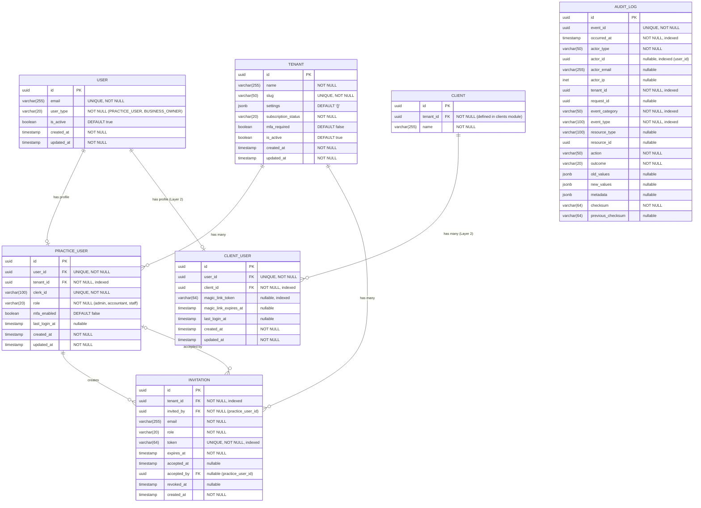

# Data Model: Auth & Multi-tenancy

**Spec**: 002-auth-multitenancy | **Date**: 2025-12-28

This document defines the complete SQLAlchemy models for the authentication and multi-tenancy module.

---

## Entity Relationship Diagram

> **Design Pattern**: Shared Identity + Separate Profiles
> The `users` table is the single source of identity for all user types.
> Profile tables (`practice_users`, `client_users`) contain type-specific attributes.



> **Note**: `CLIENT_USER` and `CLIENT` are shown for completeness but will be implemented in Layer 2 (Spec 012).
> This spec (002) implements only `USER`, `PRACTICE_USER`, `TENANT`, `INVITATION`, and `AUDIT_LOG`.

---

## SQLAlchemy Models

### Enums

```python
# backend/app/modules/auth/models.py

import enum


class UserType(str, enum.Enum):
    """Type of user in the system.

    Determines which profile table contains the user's details:
    - PRACTICE_USER: Accountant/staff, uses practice_users table, Clerk auth
    - BUSINESS_OWNER: Client user, uses client_users table, magic link auth (Layer 2)
    """

    PRACTICE_USER = "practice_user"
    BUSINESS_OWNER = "business_owner"


class UserRole(str, enum.Enum):
    """Roles for practice users within a tenant.

    Roles determine access permissions:
    - ADMIN: Full access including user management and tenant settings
    - ACCOUNTANT: Full access to client and BAS operations
    - STAFF: Read-only access to client data

    Note: Business owners don't have roles - they have fixed permissions per client.
    """

    ADMIN = "admin"
    ACCOUNTANT = "accountant"
    STAFF = "staff"


class SubscriptionStatus(str, enum.Enum):
    """Tenant subscription status.

    Controls tenant access and feature availability.
    """

    TRIAL = "trial"
    ACTIVE = "active"
    SUSPENDED = "suspended"
    CANCELLED = "cancelled"


class InvitationStatus(str, enum.Enum):
    """Derived status for invitations.

    Note: This is computed, not stored. Status is determined by:
    - pending: not accepted, not revoked, not expired
    - accepted: accepted_at is set
    - revoked: revoked_at is set
    - expired: expires_at < now
    """

    PENDING = "pending"
    ACCEPTED = "accepted"
    REVOKED = "revoked"
    EXPIRED = "expired"
```

### Tenant Model

```python
# backend/app/modules/auth/models.py

import uuid
from datetime import datetime
from typing import TYPE_CHECKING, Any

from sqlalchemy import Boolean, DateTime, Enum, String, func
from sqlalchemy.dialects.postgresql import JSONB, UUID
from sqlalchemy.orm import Mapped, mapped_column, relationship

from app.database import Base, TimestampMixin

if TYPE_CHECKING:
    from .models import Invitation, User


class Tenant(Base, TimestampMixin):
    """Accounting practice (organization) entity.

    A tenant represents an accounting practice that uses Clairo.
    All tenant-scoped data is isolated via PostgreSQL Row-Level Security.

    Attributes:
        id: Unique identifier (UUID).
        name: Display name of the practice.
        slug: URL-friendly unique identifier.
        settings: JSON configuration (MFA settings, preferences, etc.).
        subscription_status: Current subscription state.
        mfa_required: Whether MFA is mandatory for all users.
        is_active: Whether the tenant can access the platform.
        created_at: When the tenant was created.
        updated_at: When the tenant was last modified.

    Relationships:
        users: All users belonging to this tenant.
        invitations: All invitations for this tenant.
    """

    __tablename__ = "tenants"

    # Primary key
    id: Mapped[uuid.UUID] = mapped_column(
        UUID(as_uuid=True),
        primary_key=True,
        default=uuid.uuid4,
    )

    # Tenant identification
    name: Mapped[str] = mapped_column(
        String(255),
        nullable=False,
        comment="Display name of the accounting practice",
    )
    slug: Mapped[str] = mapped_column(
        String(50),
        unique=True,
        nullable=False,
        index=True,
        comment="URL-friendly unique identifier",
    )

    # Configuration
    settings: Mapped[dict[str, Any]] = mapped_column(
        JSONB,
        nullable=False,
        default=dict,
        server_default="'{}'::jsonb",
        comment="Tenant-specific configuration",
    )

    # Subscription
    subscription_status: Mapped[SubscriptionStatus] = mapped_column(
        Enum(SubscriptionStatus, name="subscription_status"),
        nullable=False,
        default=SubscriptionStatus.TRIAL,
        index=True,
        comment="Current subscription state",
    )

    # Security settings
    mfa_required: Mapped[bool] = mapped_column(
        Boolean,
        nullable=False,
        default=False,
        comment="Whether MFA is mandatory for all users",
    )

    # Status
    is_active: Mapped[bool] = mapped_column(
        Boolean,
        nullable=False,
        default=True,
        index=True,
        comment="Whether the tenant can access the platform",
    )

    # Relationships
    practice_users: Mapped[list["PracticeUser"]] = relationship(
        "PracticeUser",
        back_populates="tenant",
        cascade="all, delete-orphan",
        lazy="selectin",
    )
    invitations: Mapped[list["Invitation"]] = relationship(
        "Invitation",
        back_populates="tenant",
        cascade="all, delete-orphan",
        lazy="selectin",
    )

    def __repr__(self) -> str:
        return f"<Tenant(id={self.id}, name={self.name}, slug={self.slug})>"

    @property
    def is_trial(self) -> bool:
        """Check if tenant is in trial period."""
        return self.subscription_status == SubscriptionStatus.TRIAL

    @property
    def is_suspended(self) -> bool:
        """Check if tenant is suspended."""
        return self.subscription_status == SubscriptionStatus.SUSPENDED

    @property
    def can_access(self) -> bool:
        """Check if tenant can access the platform."""
        return self.is_active and self.subscription_status in {
            SubscriptionStatus.TRIAL,
            SubscriptionStatus.ACTIVE,
        }
```

### User Model (Base Identity)

```python
# backend/app/modules/auth/models.py (continued)

class User(Base, TimestampMixin):
    """Base user identity entity.

    This is the single source of truth for ALL user types in the system.
    It contains only core identity fields; type-specific attributes are
    stored in profile tables (PracticeUser, ClientUser).

    Design Pattern: Shared Identity + Separate Profiles
    - PRACTICE_USER → PracticeUser profile (accountants, Clerk auth)
    - BUSINESS_OWNER → ClientUser profile (clients, magic link auth - Layer 2)

    Attributes:
        id: Unique identifier (UUID).
        email: User's email address (unique across all user types).
        user_type: Discriminator for profile table lookup.
        is_active: Whether the user can access the platform.
        created_at: When the user was created.
        updated_at: When the user was last modified.

    Relationships:
        practice_profile: PracticeUser profile (if user_type=PRACTICE_USER).
        client_profile: ClientUser profile (if user_type=BUSINESS_OWNER, Layer 2).
    """

    __tablename__ = "users"

    # Primary key
    id: Mapped[uuid.UUID] = mapped_column(
        UUID(as_uuid=True),
        primary_key=True,
        default=uuid.uuid4,
    )

    # User identity
    email: Mapped[str] = mapped_column(
        String(255),
        unique=True,
        nullable=False,
        index=True,
        comment="Email address (unique across all user types)",
    )

    # User type discriminator
    user_type: Mapped[UserType] = mapped_column(
        Enum(UserType, name="user_type"),
        nullable=False,
        index=True,
        comment="Type of user (determines profile table)",
    )

    # Status
    is_active: Mapped[bool] = mapped_column(
        Boolean,
        nullable=False,
        default=True,
        index=True,
        comment="Whether the user can access the platform",
    )

    # Relationships (1:1 with profile tables)
    practice_profile: Mapped["PracticeUser | None"] = relationship(
        "PracticeUser",
        back_populates="user",
        uselist=False,
        lazy="joined",
    )
    # client_profile: Mapped["ClientUser | None"] = relationship(...)  # Layer 2

    def __repr__(self) -> str:
        return f"<User(id={self.id}, email={self.email}, type={self.user_type})>"

    @property
    def is_practice_user(self) -> bool:
        """Check if user is a practice user (accountant/staff)."""
        return self.user_type == UserType.PRACTICE_USER

    @property
    def is_business_owner(self) -> bool:
        """Check if user is a business owner (client portal)."""
        return self.user_type == UserType.BUSINESS_OWNER
```

### PracticeUser Model (Accountant Profile)

```python
# backend/app/modules/auth/models.py (continued)

class PracticeUser(Base, TimestampMixin):
    """Practice user profile for accountants/staff.

    Contains practice-specific attributes for users authenticated via Clerk.
    Has a 1:1 relationship with User where user_type=PRACTICE_USER.

    This model is tenant-scoped with RLS enforced at the database level.

    Attributes:
        id: Unique identifier (UUID).
        user_id: Foreign key to base User (unique, 1:1).
        tenant_id: Foreign key to the tenant (RLS enforced).
        clerk_id: Unique identifier from Clerk.
        role: User's role within the tenant (Admin/Accountant/Staff).
        mfa_enabled: Whether the user has MFA configured.
        last_login_at: Timestamp of the last successful login.
        created_at: When the profile was created.
        updated_at: When the profile was last modified.

    Relationships:
        user: Base User identity.
        tenant: The tenant this practice user belongs to.
        invitations_sent: Invitations created by this user.
    """

    __tablename__ = "practice_users"

    # Primary key
    id: Mapped[uuid.UUID] = mapped_column(
        UUID(as_uuid=True),
        primary_key=True,
        default=uuid.uuid4,
    )

    # 1:1 relationship with base User
    user_id: Mapped[uuid.UUID] = mapped_column(
        UUID(as_uuid=True),
        unique=True,
        nullable=False,
        index=True,
        comment="Foreign key to base User (1:1)",
    )

    # Tenant association (RLS enforced)
    tenant_id: Mapped[uuid.UUID] = mapped_column(
        UUID(as_uuid=True),
        nullable=False,
        index=True,
        comment="Foreign key to tenant (RLS enforced)",
    )

    # Clerk integration
    clerk_id: Mapped[str] = mapped_column(
        String(100),
        unique=True,
        nullable=False,
        index=True,
        comment="Unique identifier from Clerk",
    )

    # Authorization
    role: Mapped[UserRole] = mapped_column(
        Enum(UserRole, name="user_role"),
        nullable=False,
        default=UserRole.ACCOUNTANT,
        index=True,
        comment="Role within the tenant",
    )

    # Security
    mfa_enabled: Mapped[bool] = mapped_column(
        Boolean,
        nullable=False,
        default=False,
        comment="Whether the user has MFA configured",
    )

    # Activity tracking
    last_login_at: Mapped[datetime | None] = mapped_column(
        DateTime(timezone=True),
        nullable=True,
        comment="Timestamp of the last successful login",
    )

    # Relationships
    user: Mapped["User"] = relationship(
        "User",
        back_populates="practice_profile",
        lazy="joined",
    )
    tenant: Mapped["Tenant"] = relationship(
        "Tenant",
        back_populates="practice_users",
        lazy="joined",
    )
    invitations_sent: Mapped[list["Invitation"]] = relationship(
        "Invitation",
        back_populates="inviter",
        foreign_keys="Invitation.invited_by",
        lazy="selectin",
    )

    def __repr__(self) -> str:
        return f"<PracticeUser(id={self.id}, clerk_id={self.clerk_id}, role={self.role})>"

    @property
    def email(self) -> str:
        """Get email from base User."""
        return self.user.email

    @property
    def is_admin(self) -> bool:
        """Check if user has admin role."""
        return self.role == UserRole.ADMIN

    @property
    def can_manage_users(self) -> bool:
        """Check if user can manage other users."""
        return self.role == UserRole.ADMIN

    @property
    def can_write_clients(self) -> bool:
        """Check if user can create/update clients."""
        return self.role in {UserRole.ADMIN, UserRole.ACCOUNTANT}

    @property
    def can_lodge_bas(self) -> bool:
        """Check if user can lodge BAS."""
        return self.role in {UserRole.ADMIN, UserRole.ACCOUNTANT}
```

### ClientUser Model (Business Owner Profile - Layer 2)

```python
# backend/app/modules/auth/models.py (continued)
# NOTE: Implementation deferred to Spec 012 (Business Owner Portal)

# class ClientUser(Base, TimestampMixin):
#     """Business owner profile for client portal access.
#
#     Contains client-specific attributes for users authenticated via magic links.
#     Has a 1:1 relationship with User where user_type=BUSINESS_OWNER.
#
#     Attributes:
#         id: Unique identifier (UUID).
#         user_id: Foreign key to base User (unique, 1:1).
#         client_id: Foreign key to client (determines tenant access).
#         magic_link_token: Current active magic link token.
#         magic_link_expires_at: When the current magic link expires.
#         last_login_at: Timestamp of the last successful login.
#     """
#
#     __tablename__ = "client_users"
#     # Implementation in Spec 012
```

### Invitation Model

```python
# backend/app/modules/auth/models.py (continued)

import secrets
from datetime import timedelta


def generate_invitation_token() -> str:
    """Generate a secure random invitation token."""
    return secrets.token_urlsafe(32)


def default_expiry() -> datetime:
    """Generate default expiry date (7 days from now)."""
    from datetime import UTC
    return datetime.now(UTC) + timedelta(days=7)


class Invitation(Base):
    """User invitation entity.

    Represents a pending invitation for a new user to join a tenant.
    Invitations have an expiration date and can be revoked.

    Attributes:
        id: Unique identifier (UUID).
        tenant_id: Foreign key to the tenant.
        invited_by: Foreign key to the user who created the invitation.
        email: Email address of the invitee.
        role: Role to assign upon acceptance.
        token: Unique token for invitation URL.
        expires_at: When the invitation expires.
        accepted_at: When the invitation was accepted (null if pending).
        accepted_by: Foreign key to the user who accepted (null if pending).
        revoked_at: When the invitation was revoked (null if not revoked).
        created_at: When the invitation was created.

    Relationships:
        tenant: The tenant this invitation is for.
        inviter: The user who created the invitation.
        acceptor: The user who accepted the invitation.
    """

    __tablename__ = "invitations"

    # Primary key
    id: Mapped[uuid.UUID] = mapped_column(
        UUID(as_uuid=True),
        primary_key=True,
        default=uuid.uuid4,
    )

    # Tenant association (RLS enforced)
    tenant_id: Mapped[uuid.UUID] = mapped_column(
        UUID(as_uuid=True),
        nullable=False,
        index=True,
        comment="Foreign key to tenant (RLS enforced)",
    )

    # Inviter
    invited_by: Mapped[uuid.UUID] = mapped_column(
        UUID(as_uuid=True),
        nullable=False,
        comment="User who created the invitation",
    )

    # Invitation details
    email: Mapped[str] = mapped_column(
        String(255),
        nullable=False,
        index=True,
        comment="Email address of the invitee",
    )

    role: Mapped[UserRole] = mapped_column(
        Enum(UserRole, name="user_role"),
        nullable=False,
        default=UserRole.ACCOUNTANT,
        comment="Role to assign upon acceptance",
    )

    # Security token
    token: Mapped[str] = mapped_column(
        String(64),
        unique=True,
        nullable=False,
        index=True,
        default=generate_invitation_token,
        comment="Unique token for invitation URL",
    )

    # Lifecycle timestamps
    expires_at: Mapped[datetime] = mapped_column(
        DateTime(timezone=True),
        nullable=False,
        default=default_expiry,
        index=True,
        comment="When the invitation expires",
    )

    accepted_at: Mapped[datetime | None] = mapped_column(
        DateTime(timezone=True),
        nullable=True,
        comment="When the invitation was accepted",
    )

    accepted_by: Mapped[uuid.UUID | None] = mapped_column(
        UUID(as_uuid=True),
        nullable=True,
        comment="User who accepted the invitation",
    )

    revoked_at: Mapped[datetime | None] = mapped_column(
        DateTime(timezone=True),
        nullable=True,
        comment="When the invitation was revoked",
    )

    created_at: Mapped[datetime] = mapped_column(
        DateTime(timezone=True),
        server_default=func.now(),
        nullable=False,
    )

    # Relationships
    tenant: Mapped["Tenant"] = relationship(
        "Tenant",
        back_populates="invitations",
        lazy="joined",
    )
    inviter: Mapped["PracticeUser"] = relationship(
        "PracticeUser",
        back_populates="invitations_sent",
        foreign_keys=[invited_by],
        lazy="joined",
    )

    def __repr__(self) -> str:
        return f"<Invitation(id={self.id}, email={self.email}, status={self.status})>"

    @property
    def status(self) -> InvitationStatus:
        """Compute the current status of the invitation."""
        from datetime import UTC

        if self.accepted_at is not None:
            return InvitationStatus.ACCEPTED
        if self.revoked_at is not None:
            return InvitationStatus.REVOKED
        if datetime.now(UTC) > self.expires_at:
            return InvitationStatus.EXPIRED
        return InvitationStatus.PENDING

    @property
    def is_valid(self) -> bool:
        """Check if the invitation can still be accepted."""
        return self.status == InvitationStatus.PENDING

    @property
    def is_expired(self) -> bool:
        """Check if the invitation has expired."""
        from datetime import UTC
        return datetime.now(UTC) > self.expires_at
```

---

## Audit Log Model

```python
# backend/app/core/audit.py

import uuid
from datetime import datetime
from typing import Any

from sqlalchemy import DateTime, String, func, text
from sqlalchemy.dialects.postgresql import INET, JSONB, UUID
from sqlalchemy.orm import Mapped, mapped_column

from app.database import Base


class AuditLog(Base):
    """Immutable audit log entry.

    Stores all authentication, authorization, and data modification events
    for compliance and security purposes. This table is append-only with
    database-level rules preventing updates and deletes.

    Attributes:
        id: Unique identifier (UUID).
        event_id: Idempotency key for deduplication.
        occurred_at: When the event happened.
        actor_type: Type of actor (user, system, api_key).
        actor_id: ID of the actor (if applicable).
        actor_email: Email of the actor (if applicable).
        actor_ip: IP address of the actor.
        tenant_id: Tenant context for the event.
        request_id: Correlation ID for request tracing.
        event_category: Category (auth, data, compliance).
        event_type: Specific event type.
        resource_type: Type of resource affected.
        resource_id: ID of the resource affected.
        action: Action performed (create, read, update, delete).
        outcome: Result (success, failure).
        old_values: Previous state (for updates).
        new_values: New state (for creates/updates).
        metadata: Additional context.
        checksum: Hash for integrity verification.
        previous_checksum: Link to previous entry (chain).

    Database Rules:
        - UPDATE and DELETE are blocked via PostgreSQL rules
        - Checksum chain provides tamper detection
    """

    __tablename__ = "audit_logs"

    # Primary key
    id: Mapped[uuid.UUID] = mapped_column(
        UUID(as_uuid=True),
        primary_key=True,
        default=uuid.uuid4,
    )

    # Idempotency
    event_id: Mapped[uuid.UUID] = mapped_column(
        UUID(as_uuid=True),
        unique=True,
        nullable=False,
        default=uuid.uuid4,
        comment="Idempotency key for deduplication",
    )

    # Timestamp
    occurred_at: Mapped[datetime] = mapped_column(
        DateTime(timezone=True),
        nullable=False,
        server_default=func.now(),
        index=True,
        comment="When the event occurred",
    )

    # Actor information
    actor_type: Mapped[str] = mapped_column(
        String(50),
        nullable=False,
        comment="Type of actor: user, system, api_key",
    )
    actor_id: Mapped[uuid.UUID | None] = mapped_column(
        UUID(as_uuid=True),
        nullable=True,
        index=True,
        comment="ID of the actor",
    )
    actor_email: Mapped[str | None] = mapped_column(
        String(255),
        nullable=True,
        comment="Email of the actor (masked for privacy)",
    )
    actor_ip: Mapped[str | None] = mapped_column(
        INET,
        nullable=True,
        comment="IP address (masked to /24)",
    )

    # Context
    tenant_id: Mapped[uuid.UUID] = mapped_column(
        UUID(as_uuid=True),
        nullable=False,
        index=True,
        comment="Tenant context",
    )
    request_id: Mapped[uuid.UUID | None] = mapped_column(
        UUID(as_uuid=True),
        nullable=True,
        comment="Request correlation ID",
    )

    # Event classification
    event_category: Mapped[str] = mapped_column(
        String(50),
        nullable=False,
        index=True,
        comment="Category: auth, data, compliance, integration",
    )
    event_type: Mapped[str] = mapped_column(
        String(100),
        nullable=False,
        index=True,
        comment="Specific event type",
    )
    resource_type: Mapped[str | None] = mapped_column(
        String(100),
        nullable=True,
        comment="Type of resource affected",
    )
    resource_id: Mapped[uuid.UUID | None] = mapped_column(
        UUID(as_uuid=True),
        nullable=True,
        comment="ID of the resource affected",
    )

    # Action and outcome
    action: Mapped[str] = mapped_column(
        String(50),
        nullable=False,
        comment="Action: create, read, update, delete, login, etc.",
    )
    outcome: Mapped[str] = mapped_column(
        String(20),
        nullable=False,
        comment="Result: success, failure",
    )

    # Data capture
    old_values: Mapped[dict[str, Any] | None] = mapped_column(
        JSONB,
        nullable=True,
        comment="Previous state for updates",
    )
    new_values: Mapped[dict[str, Any] | None] = mapped_column(
        JSONB,
        nullable=True,
        comment="New state for creates/updates",
    )
    metadata: Mapped[dict[str, Any] | None] = mapped_column(
        JSONB,
        nullable=True,
        comment="Additional context",
    )

    # Integrity chain
    checksum: Mapped[str] = mapped_column(
        String(64),
        nullable=False,
        comment="SHA-256 hash for integrity",
    )
    previous_checksum: Mapped[str | None] = mapped_column(
        String(64),
        nullable=True,
        comment="Link to previous entry",
    )

    def __repr__(self) -> str:
        return (
            f"<AuditLog(id={self.id}, event_type={self.event_type}, "
            f"outcome={self.outcome})>"
        )
```

---

## Alembic Migration

```python
# backend/alembic/versions/002_auth_multitenancy.py

"""Auth and multi-tenancy tables with RLS.

Revision ID: 002_auth_multitenancy
Revises: 001_initial
Create Date: 2025-12-28

"""
from typing import Sequence

import sqlalchemy as sa
from sqlalchemy.dialects import postgresql

from alembic import op

# revision identifiers, used by Alembic.
revision: str = "002_auth_multitenancy"
down_revision: str | None = "001_initial"
branch_labels: str | Sequence[str] | None = None
depends_on: str | Sequence[str] | None = None


def upgrade() -> None:
    # Create enums
    user_role = postgresql.ENUM(
        "admin", "accountant", "staff",
        name="user_role",
        create_type=True,
    )
    user_role.create(op.get_bind(), checkfirst=True)

    subscription_status = postgresql.ENUM(
        "trial", "active", "suspended", "cancelled",
        name="subscription_status",
        create_type=True,
    )
    subscription_status.create(op.get_bind(), checkfirst=True)

    # Create tenants table
    op.create_table(
        "tenants",
        sa.Column("id", postgresql.UUID(as_uuid=True), primary_key=True),
        sa.Column("name", sa.String(255), nullable=False),
        sa.Column("slug", sa.String(50), unique=True, nullable=False),
        sa.Column(
            "settings",
            postgresql.JSONB,
            nullable=False,
            server_default="'{}'::jsonb",
        ),
        sa.Column(
            "subscription_status",
            postgresql.ENUM(
                "trial", "active", "suspended", "cancelled",
                name="subscription_status",
                create_type=False,
            ),
            nullable=False,
            server_default="trial",
        ),
        sa.Column("mfa_required", sa.Boolean(), nullable=False, server_default="false"),
        sa.Column("is_active", sa.Boolean(), nullable=False, server_default="true"),
        sa.Column(
            "created_at",
            sa.DateTime(timezone=True),
            nullable=False,
            server_default=sa.func.now(),
        ),
        sa.Column(
            "updated_at",
            sa.DateTime(timezone=True),
            nullable=False,
            server_default=sa.func.now(),
            onupdate=sa.func.now(),
        ),
    )
    op.create_index("ix_tenants_slug", "tenants", ["slug"])
    op.create_index("ix_tenants_subscription_status", "tenants", ["subscription_status"])
    op.create_index("ix_tenants_is_active", "tenants", ["is_active"])

    # Create users table
    op.create_table(
        "users",
        sa.Column("id", postgresql.UUID(as_uuid=True), primary_key=True),
        sa.Column("tenant_id", postgresql.UUID(as_uuid=True), nullable=False),
        sa.Column("clerk_id", sa.String(100), unique=True, nullable=False),
        sa.Column("email", sa.String(255), nullable=False),
        sa.Column(
            "role",
            postgresql.ENUM(
                "admin", "accountant", "staff",
                name="user_role",
                create_type=False,
            ),
            nullable=False,
            server_default="accountant",
        ),
        sa.Column("is_active", sa.Boolean(), nullable=False, server_default="true"),
        sa.Column("mfa_enabled", sa.Boolean(), nullable=False, server_default="false"),
        sa.Column("last_login_at", sa.DateTime(timezone=True), nullable=True),
        sa.Column(
            "created_at",
            sa.DateTime(timezone=True),
            nullable=False,
            server_default=sa.func.now(),
        ),
        sa.Column(
            "updated_at",
            sa.DateTime(timezone=True),
            nullable=False,
            server_default=sa.func.now(),
            onupdate=sa.func.now(),
        ),
    )
    op.create_index("ix_users_tenant_id", "users", ["tenant_id"])
    op.create_index("ix_users_clerk_id", "users", ["clerk_id"])
    op.create_index("ix_users_email", "users", ["email"])
    op.create_index("ix_users_role", "users", ["role"])
    op.create_index("ix_users_is_active", "users", ["is_active"])

    # Create invitations table
    op.create_table(
        "invitations",
        sa.Column("id", postgresql.UUID(as_uuid=True), primary_key=True),
        sa.Column("tenant_id", postgresql.UUID(as_uuid=True), nullable=False),
        sa.Column("invited_by", postgresql.UUID(as_uuid=True), nullable=False),
        sa.Column("email", sa.String(255), nullable=False),
        sa.Column(
            "role",
            postgresql.ENUM(
                "admin", "accountant", "staff",
                name="user_role",
                create_type=False,
            ),
            nullable=False,
            server_default="accountant",
        ),
        sa.Column("token", sa.String(64), unique=True, nullable=False),
        sa.Column("expires_at", sa.DateTime(timezone=True), nullable=False),
        sa.Column("accepted_at", sa.DateTime(timezone=True), nullable=True),
        sa.Column("accepted_by", postgresql.UUID(as_uuid=True), nullable=True),
        sa.Column("revoked_at", sa.DateTime(timezone=True), nullable=True),
        sa.Column(
            "created_at",
            sa.DateTime(timezone=True),
            nullable=False,
            server_default=sa.func.now(),
        ),
    )
    op.create_index("ix_invitations_tenant_id", "invitations", ["tenant_id"])
    op.create_index("ix_invitations_email", "invitations", ["email"])
    op.create_index("ix_invitations_token", "invitations", ["token"])
    op.create_index("ix_invitations_expires_at", "invitations", ["expires_at"])

    # Create audit_logs table
    op.create_table(
        "audit_logs",
        sa.Column("id", postgresql.UUID(as_uuid=True), primary_key=True),
        sa.Column("event_id", postgresql.UUID(as_uuid=True), unique=True, nullable=False),
        sa.Column(
            "occurred_at",
            sa.DateTime(timezone=True),
            nullable=False,
            server_default=sa.func.now(),
        ),
        sa.Column("actor_type", sa.String(50), nullable=False),
        sa.Column("actor_id", postgresql.UUID(as_uuid=True), nullable=True),
        sa.Column("actor_email", sa.String(255), nullable=True),
        sa.Column("actor_ip", postgresql.INET, nullable=True),
        sa.Column("tenant_id", postgresql.UUID(as_uuid=True), nullable=False),
        sa.Column("request_id", postgresql.UUID(as_uuid=True), nullable=True),
        sa.Column("event_category", sa.String(50), nullable=False),
        sa.Column("event_type", sa.String(100), nullable=False),
        sa.Column("resource_type", sa.String(100), nullable=True),
        sa.Column("resource_id", postgresql.UUID(as_uuid=True), nullable=True),
        sa.Column("action", sa.String(50), nullable=False),
        sa.Column("outcome", sa.String(20), nullable=False),
        sa.Column("old_values", postgresql.JSONB, nullable=True),
        sa.Column("new_values", postgresql.JSONB, nullable=True),
        sa.Column("metadata", postgresql.JSONB, nullable=True),
        sa.Column("checksum", sa.String(64), nullable=False),
        sa.Column("previous_checksum", sa.String(64), nullable=True),
    )
    op.create_index("ix_audit_logs_occurred_at", "audit_logs", ["occurred_at"])
    op.create_index("ix_audit_logs_actor_id", "audit_logs", ["actor_id"])
    op.create_index("ix_audit_logs_tenant_id", "audit_logs", ["tenant_id"])
    op.create_index("ix_audit_logs_event_category", "audit_logs", ["event_category"])
    op.create_index("ix_audit_logs_event_type", "audit_logs", ["event_type"])

    # Enable Row-Level Security
    op.execute("ALTER TABLE users ENABLE ROW LEVEL SECURITY")
    op.execute("ALTER TABLE users FORCE ROW LEVEL SECURITY")
    op.execute("ALTER TABLE invitations ENABLE ROW LEVEL SECURITY")
    op.execute("ALTER TABLE invitations FORCE ROW LEVEL SECURITY")

    # Create RLS policies for users table
    op.execute("""
        CREATE POLICY tenant_isolation_users ON users
            FOR ALL
            USING (tenant_id = NULLIF(current_setting('app.current_tenant_id', true), '')::uuid)
    """)

    # Create RLS policies for invitations table
    op.execute("""
        CREATE POLICY tenant_isolation_invitations ON invitations
            FOR ALL
            USING (tenant_id = NULLIF(current_setting('app.current_tenant_id', true), '')::uuid)
    """)

    # Create policy for public invitation lookup (by token)
    op.execute("""
        CREATE POLICY public_invitation_by_token ON invitations
            FOR SELECT
            USING (
                token IS NOT NULL
                AND accepted_at IS NULL
                AND revoked_at IS NULL
                AND expires_at > NOW()
            )
    """)

    # Prevent audit log modifications
    op.execute("""
        CREATE RULE audit_no_update AS ON UPDATE TO audit_logs
            DO INSTEAD NOTHING
    """)
    op.execute("""
        CREATE RULE audit_no_delete AS ON DELETE TO audit_logs
            DO INSTEAD NOTHING
    """)


def downgrade() -> None:
    # Remove audit log rules
    op.execute("DROP RULE IF EXISTS audit_no_delete ON audit_logs")
    op.execute("DROP RULE IF EXISTS audit_no_update ON audit_logs")

    # Remove RLS policies
    op.execute("DROP POLICY IF EXISTS public_invitation_by_token ON invitations")
    op.execute("DROP POLICY IF EXISTS tenant_isolation_invitations ON invitations")
    op.execute("DROP POLICY IF EXISTS tenant_isolation_users ON users")

    # Disable RLS
    op.execute("ALTER TABLE invitations DISABLE ROW LEVEL SECURITY")
    op.execute("ALTER TABLE users DISABLE ROW LEVEL SECURITY")

    # Drop tables
    op.drop_table("audit_logs")
    op.drop_table("invitations")
    op.drop_table("users")
    op.drop_table("tenants")

    # Drop enums
    op.execute("DROP TYPE IF EXISTS subscription_status")
    op.execute("DROP TYPE IF EXISTS user_role")
```

---

## Pydantic Schemas

```python
# backend/app/modules/auth/schemas.py

from datetime import datetime
from uuid import UUID

from pydantic import BaseModel, ConfigDict, EmailStr, Field

from .models import InvitationStatus, SubscriptionStatus, UserRole


# === Base Schemas ===

class TenantBase(BaseModel):
    """Base tenant schema with common fields."""

    name: str = Field(..., min_length=1, max_length=255)


class UserBase(BaseModel):
    """Base user schema with common fields."""

    email: EmailStr


class InvitationBase(BaseModel):
    """Base invitation schema with common fields."""

    email: EmailStr
    role: UserRole = UserRole.ACCOUNTANT


# === Create Schemas ===

class TenantCreate(TenantBase):
    """Schema for creating a new tenant."""

    slug: str | None = Field(
        None,
        min_length=3,
        max_length=50,
        pattern=r"^[a-z0-9-]+$",
    )


class UserCreate(UserBase):
    """Schema for creating a new user (internal use)."""

    clerk_id: str = Field(..., min_length=1, max_length=100)
    role: UserRole = UserRole.ACCOUNTANT


class InvitationCreate(InvitationBase):
    """Schema for creating a new invitation."""

    pass


# === Update Schemas ===

class TenantUpdate(BaseModel):
    """Schema for updating tenant settings."""

    model_config = ConfigDict(extra="forbid")

    name: str | None = Field(None, min_length=1, max_length=255)
    mfa_required: bool | None = None
    settings: dict | None = None


class UserRoleUpdate(BaseModel):
    """Schema for changing a user's role."""

    model_config = ConfigDict(extra="forbid")

    role: UserRole


class UserDeactivate(BaseModel):
    """Schema for deactivating a user."""

    model_config = ConfigDict(extra="forbid")

    reason: str = Field(..., min_length=1, max_length=500)


# === Response Schemas ===

class TenantResponse(TenantBase):
    """Schema for tenant in API responses."""

    model_config = ConfigDict(from_attributes=True)

    id: UUID
    slug: str
    subscription_status: SubscriptionStatus
    mfa_required: bool
    is_active: bool
    created_at: datetime
    updated_at: datetime


class TenantSummary(BaseModel):
    """Minimal tenant info for embedded responses."""

    model_config = ConfigDict(from_attributes=True)

    id: UUID
    name: str
    slug: str


class UserResponse(UserBase):
    """Schema for user in API responses."""

    model_config = ConfigDict(from_attributes=True)

    id: UUID
    tenant_id: UUID
    clerk_id: str
    role: UserRole
    is_active: bool
    mfa_enabled: bool
    last_login_at: datetime | None
    created_at: datetime
    updated_at: datetime


class UserSummary(BaseModel):
    """Minimal user info for embedded responses."""

    model_config = ConfigDict(from_attributes=True)

    id: UUID
    email: str
    role: UserRole


class UserWithTenant(UserResponse):
    """User response with tenant details."""

    tenant: TenantSummary


class InvitationResponse(InvitationBase):
    """Schema for invitation in API responses."""

    model_config = ConfigDict(from_attributes=True)

    id: UUID
    tenant_id: UUID
    invited_by: UUID
    token: str
    status: InvitationStatus
    expires_at: datetime
    accepted_at: datetime | None
    created_at: datetime

    inviter: UserSummary | None = None


class InvitationPublic(BaseModel):
    """Public invitation details (no sensitive info)."""

    model_config = ConfigDict(from_attributes=True)

    email: str
    role: UserRole
    status: InvitationStatus
    expires_at: datetime
    tenant_name: str


# === Auth Schemas ===

class RegisterRequest(BaseModel):
    """Request schema for completing registration."""

    invitation_token: str | None = None


class RegisterResponse(BaseModel):
    """Response schema for registration."""

    user: UserResponse
    tenant: TenantResponse
    is_new_tenant: bool


class MeResponse(BaseModel):
    """Response schema for current user info."""

    user: UserWithTenant
    permissions: list[str]


class LogoutRequest(BaseModel):
    """Request schema for logout."""

    all_devices: bool = False
```

---

## Indexes and Performance Considerations

### Index Strategy

| Table | Column(s) | Type | Purpose |
|-------|-----------|------|---------|
| tenants | slug | UNIQUE | Fast lookup by URL slug |
| tenants | subscription_status | BTREE | Filter active tenants |
| tenants | is_active | BTREE | Filter active tenants |
| users | tenant_id | BTREE | RLS + tenant queries |
| users | clerk_id | UNIQUE | Clerk user lookup |
| users | email | BTREE | Email-based queries |
| users | role | BTREE | Role-based filtering |
| users | is_active | BTREE | Active user filtering |
| invitations | tenant_id | BTREE | RLS + tenant queries |
| invitations | token | UNIQUE | Token lookup |
| invitations | email | BTREE | Duplicate check |
| invitations | expires_at | BTREE | Expiry queries |
| audit_logs | occurred_at | BTREE | Time-range queries |
| audit_logs | tenant_id | BTREE | Tenant filtering |
| audit_logs | event_type | BTREE | Event filtering |
| audit_logs | actor_id | BTREE | Actor queries |

### Query Optimization Notes

1. **Tenant Isolation**: All queries automatically filtered by RLS; no additional WHERE needed
2. **Invitation Lookup**: Token-based lookup is O(1) with unique index
3. **Audit Queries**: Consider partitioning by `occurred_at` for large datasets
4. **User Listing**: `(tenant_id, is_active, role)` compound index for filtered lists

---

## References

- [Implementation Plan](./plan.md)
- [Feature Specification](./spec.md)
- [SQLAlchemy 2.0 Documentation](https://docs.sqlalchemy.org/en/20/)
- [PostgreSQL RLS](https://www.postgresql.org/docs/current/ddl-rowsecurity.html)
