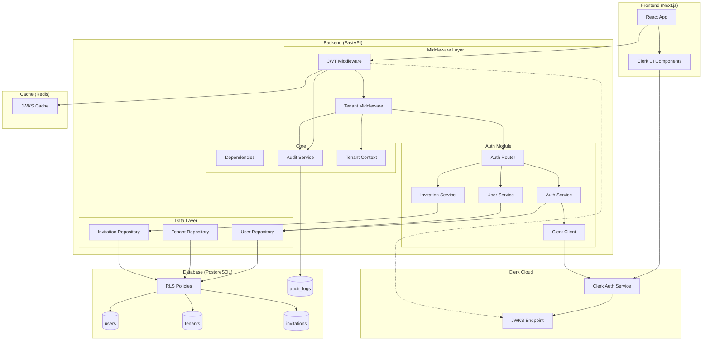
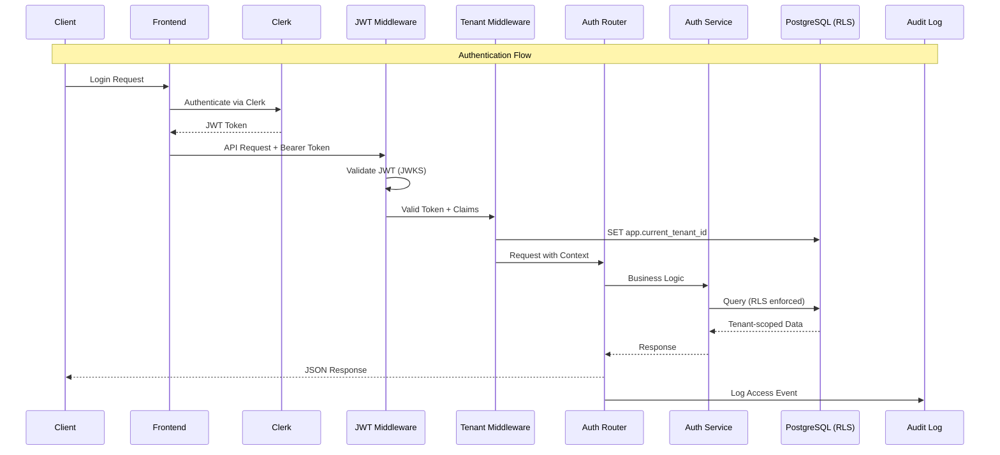
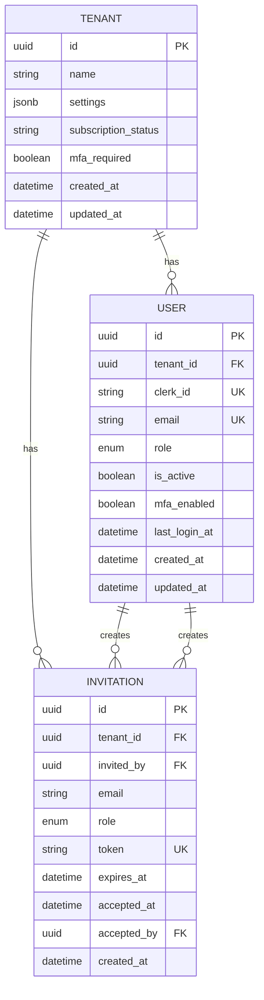
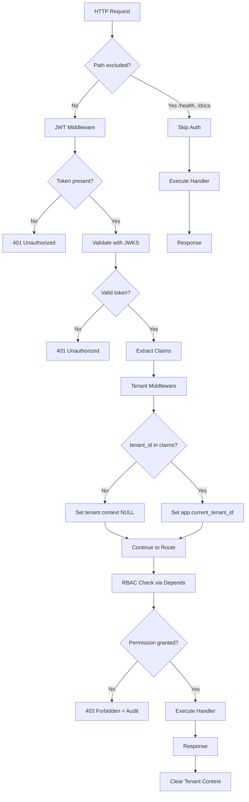
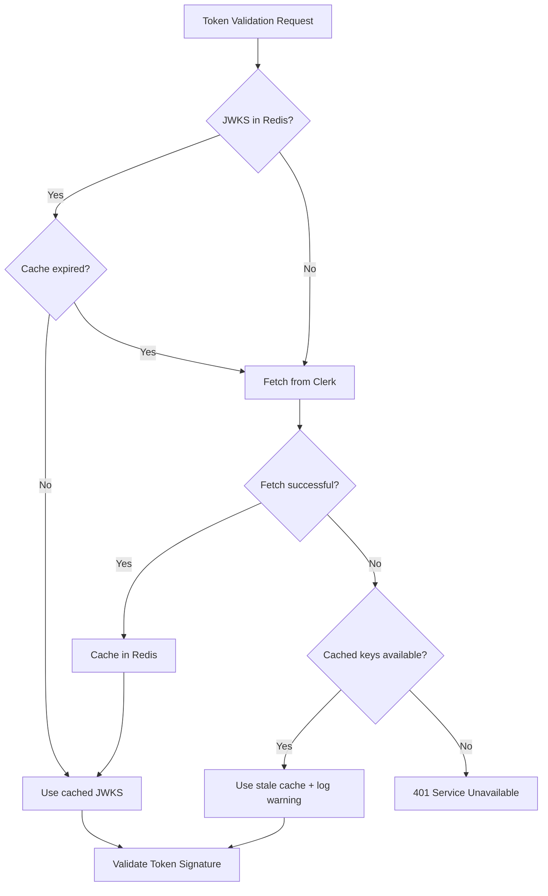
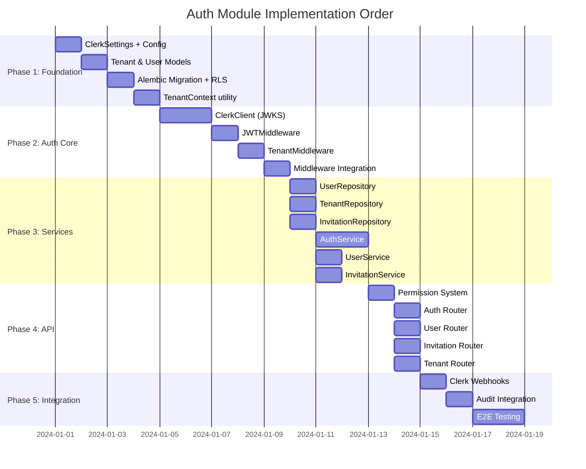
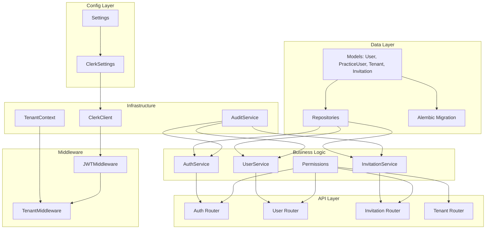

# Implementation Plan: Auth & Multi-tenancy

**Branch**: `feature/002-auth` | **Date**: 2025-12-28 | **Spec**: [002-auth-multitenancy/spec.md](./spec.md)
**Input**: Feature specification from `/specs/002-auth-multitenancy/spec.md`

---

## Summary

This plan implements secure JWT-based authentication with Clerk integration and PostgreSQL Row-Level Security (RLS) for complete tenant isolation. The system supports three roles (Admin, Accountant, Staff) with role-based access control enforced via FastAPI dependency injection. All authentication and authorization events are captured in an immutable audit log for 7-year compliance.

---

## Technical Context

**Language/Version**: Python 3.11+ (project uses 3.12+)
**Primary Dependencies**: FastAPI, SQLAlchemy 2.0 async, python-jose, httpx (for JWKS), Pydantic v2
**Storage**: PostgreSQL 16 with RLS policies, Redis for JWKS caching
**Testing**: pytest, pytest-asyncio, httpx for async API testing, factory_boy
**Target Platform**: Linux server (AWS Sydney region), Docker containers
**Project Type**: Web application (modular monolith)
**Performance Goals**: JWT validation P95 < 50ms, middleware overhead < 5ms, 1000 concurrent users/tenant
**Constraints**: Australian data residency, 7-year audit retention, fail-closed on tenant context failure
**Scale/Scope**: Multi-tenant SaaS, initial pilot with 10-50 practices

---

## Constitution Check

*GATE: Must pass before Phase 0 research. Re-check after Phase 1 design.*

| Principle | Status | Notes |
|-----------|--------|-------|
| Modular Monolith Architecture | PASS | Auth module under `backend/app/modules/auth/` |
| Repository Pattern | PASS | UserRepository, PracticeUserRepository, TenantRepository, InvitationRepository |
| Multi-tenancy (RLS) | PASS | Core focus of this spec |
| Type Hints Everywhere | PASS | All functions fully typed |
| Pydantic for Schemas | PASS | Request/response schemas defined |
| Domain Exceptions | PASS | Uses existing AuthenticationError, AuthorizationError |
| 80% Unit Test Coverage | PASS | Testing strategy included |
| UUID Primary Keys | PASS | All entities use UUID |
| Audit Logging | PASS | First-class concern with defined events |
| Pre-commit Hooks | PASS | Existing infrastructure from Spec 001 |

---

## Project Structure

### Documentation (this feature)

```text
specs/002-auth-multitenancy/
├── spec.md              # Feature specification
├── plan.md              # This implementation plan
├── data-model.md        # SQLAlchemy models and ERD
└── tasks.md             # Actionable task list (generated by /speckit.tasks)
```

### Source Code (repository root)

```text
backend/
├── app/
│   ├── core/
│   │   ├── security.py          # EXISTING - extend for Clerk JWKS
│   │   ├── dependencies.py      # EXISTING - extend auth dependencies
│   │   ├── exceptions.py        # EXISTING - auth exceptions present
│   │   ├── audit.py             # NEW - audit logging infrastructure
│   │   └── tenant_context.py    # NEW - tenant context management
│   │
│   ├── modules/
│   │   └── auth/                # NEW MODULE
│   │       ├── __init__.py
│   │       ├── router.py        # Auth & user management endpoints
│   │       ├── service.py       # AuthService, UserService, InvitationService
│   │       ├── repository.py    # UserRepository, PracticeUserRepository, TenantRepository, InvitationRepository
│   │       ├── models.py        # User (base), PracticeUser (profile), Tenant, Invitation models
│   │       ├── schemas.py       # Pydantic request/response schemas
│   │       ├── clerk.py         # Clerk SDK integration & JWKS client
│   │       ├── middleware.py    # TenantMiddleware, JWTMiddleware
│   │       ├── permissions.py   # Role definitions and permission checking
│   │       ├── audit_events.py  # Auth-specific audit event types
│   │       └── webhooks.py      # Clerk webhook handlers
│   │
│   ├── database.py              # EXISTING - add RLS setup utilities
│   ├── config.py                # EXISTING - add ClerkSettings
│   └── main.py                  # EXISTING - register auth middleware/routes
│
├── alembic/
│   └── versions/
│       └── 002_auth_multitenancy.py  # NEW - migration for auth tables + RLS
│
└── tests/
    ├── unit/
    │   └── modules/
    │       └── auth/
    │           ├── test_service.py
    │           ├── test_clerk.py
    │           ├── test_permissions.py
    │           └── test_middleware.py
    ├── integration/
    │   └── api/
    │       ├── test_auth_endpoints.py
    │       └── test_tenant_isolation.py
    └── factories/
        └── auth.py              # User, PracticeUser, Tenant, Invitation factories
```

**Structure Decision**: Following the established modular monolith pattern from Spec 001, the auth module is created under `backend/app/modules/auth/` with the standard file structure (router, service, repository, models, schemas). Core security utilities are extended in `backend/app/core/`.

**Data Model Design Decision**: Shared Identity + Separate Profiles pattern

The system supports two distinct user types (Practice Users and Business Owners) with different authentication methods. To avoid refactoring when adding Business Owner portal in Layer 2, we implement:

```
users (base identity)           ← Single source of truth for all user types
├── id, email, user_type, is_active
│
├── practice_users (profile)    ← Accountants/Staff (Clerk auth) - implemented now
│   └── user_id (1:1), tenant_id, clerk_id, role, mfa_enabled
│
└── client_users (profile)      ← Business Owners (magic link) - Layer 2 (Spec 012)
    └── user_id (1:1), client_id, magic_link_token
```

Benefits:
- Single `users` table for auth lookups (avoids "which table to check" problem)
- `UserType` enum discriminates which profile table to join
- No nullable fields in profile tables (each has only relevant columns)
- Clean RLS policies per profile table
- Extensible for future user types (External Auditor, Partner, etc.)

---

## Complexity Tracking

> No constitution violations. All patterns align with established standards.

---

## Component Architecture

### System Architecture Diagram



### Data Flow Diagram



---

## Component Design

### Core Components

#### 1. TenantContext (core/tenant_context.py)

**Responsibilities**:
- Store and retrieve tenant context using Python contextvars
- Provide async context manager for tenant scope
- Set PostgreSQL session variable for RLS

**Interface**:
```python
class TenantContext:
    @staticmethod
    def get_current_tenant_id() -> UUID | None

    @staticmethod
    def set_current_tenant_id(tenant_id: UUID) -> None

    @staticmethod
    def clear() -> None

    @staticmethod
    async def set_db_context(session: AsyncSession, tenant_id: UUID) -> None

@asynccontextmanager
async def tenant_scope(session: AsyncSession, tenant_id: UUID) -> AsyncGenerator[None, None]
```

**Dependencies**: contextvars, SQLAlchemy AsyncSession

---

#### 2. ClerkClient (modules/auth/clerk.py)

**Responsibilities**:
- Fetch and cache JWKS keys from Clerk
- Validate JWT tokens using Clerk's public keys
- Extract user claims from validated tokens
- Handle Clerk API calls for user management

**Interface**:
```python
class ClerkClient:
    def __init__(self, settings: ClerkSettings, cache: Redis)

    async def get_jwks(self) -> dict[str, Any]
    async def validate_token(self, token: str) -> ClerkTokenPayload
    async def get_user(self, clerk_user_id: str) -> ClerkUser
    async def create_user(self, data: ClerkUserCreate) -> ClerkUser
    async def delete_user(self, clerk_user_id: str) -> None

class ClerkTokenPayload(BaseModel):
    sub: str  # Clerk user ID
    email: str
    email_verified: bool
    tenant_id: UUID | None  # From custom claims
    roles: list[str]
    exp: datetime
    iat: datetime
    azp: str  # Authorized party (frontend URL)
```

**Dependencies**: httpx, python-jose, Redis

---

#### 3. JWTMiddleware (modules/auth/middleware.py)

**Responsibilities**:
- Extract Bearer token from Authorization header
- Validate token using ClerkClient
- Set request state with validated claims
- Handle token expiration and clock skew (60s tolerance)
- Return 401 for invalid/missing tokens on protected routes

**Interface**:
```python
class JWTMiddleware:
    def __init__(
        self,
        app: ASGIApp,
        clerk_client: ClerkClient,
        exclude_paths: list[str] = ["/health", "/docs", "/openapi.json"]
    )

    async def __call__(self, scope: Scope, receive: Receive, send: Send) -> None
```

**Dependencies**: ClerkClient, Starlette

---

#### 4. TenantMiddleware (modules/auth/middleware.py)

**Responsibilities**:
- Extract tenant_id from validated JWT claims
- Set tenant context in contextvars
- Set PostgreSQL session variable `app.current_tenant_id`
- Ensure tenant context cleanup on request completion
- Handle concurrent requests with isolated contexts

**Interface**:
```python
class TenantMiddleware:
    def __init__(self, app: ASGIApp)

    async def __call__(self, scope: Scope, receive: Receive, send: Send) -> None
```

**Dependencies**: TenantContext, AsyncSession

---

#### 5. AuthService (modules/auth/service.py)

**Responsibilities**:
- Handle user registration (link Clerk user to tenant)
- Provision new tenant on first registration
- Process invitation acceptance
- Manage user sessions (via Clerk)
- Coordinate with audit logging

**Interface**:
```python
class AuthService:
    def __init__(
        self,
        session: AsyncSession,
        clerk_client: ClerkClient,
        user_repo: UserRepository,
        tenant_repo: TenantRepository,
    )

    async def register_user(
        self,
        clerk_user_id: str,
        email: str,
        invitation_token: str | None = None
    ) -> tuple[User, Tenant]

    async def get_current_user(self, clerk_user_id: str) -> User

    async def sync_user_from_clerk(self, clerk_user_id: str) -> User

    async def handle_logout(self, user_id: UUID, logout_all: bool = False) -> None
```

**Dependencies**: UserRepository, TenantRepository, ClerkClient, AuditService

---

#### 6. UserService (modules/auth/service.py)

**Responsibilities**:
- CRUD operations for users within a tenant
- Role management (assign, change, validate)
- User activation/deactivation
- Enforce RBAC rules

**Interface**:
```python
class UserService:
    def __init__(
        self,
        session: AsyncSession,
        user_repo: UserRepository,
    )

    async def get_user(self, user_id: UUID) -> User
    async def list_users(self, tenant_id: UUID, skip: int = 0, limit: int = 100) -> list[User]
    async def update_role(self, user_id: UUID, new_role: UserRole, changed_by: UUID) -> User
    async def deactivate_user(self, user_id: UUID, deactivated_by: UUID, reason: str) -> User
    async def activate_user(self, user_id: UUID, activated_by: UUID) -> User
```

**Dependencies**: UserRepository, AuditService

---

#### 7. InvitationService (modules/auth/service.py)

**Responsibilities**:
- Create and send user invitations
- Validate invitation tokens
- Handle invitation acceptance/expiration
- Prevent duplicate invitations

**Interface**:
```python
class InvitationService:
    def __init__(
        self,
        session: AsyncSession,
        invitation_repo: InvitationRepository,
        user_repo: UserRepository,
    )

    async def create_invitation(
        self,
        email: str,
        role: UserRole,
        tenant_id: UUID,
        invited_by: UUID,
    ) -> Invitation

    async def get_invitation(self, token: str) -> Invitation | None
    async def accept_invitation(self, token: str, clerk_user_id: str) -> User
    async def revoke_invitation(self, invitation_id: UUID, revoked_by: UUID) -> None
    async def cleanup_expired() -> int  # Background task
```

**Dependencies**: InvitationRepository, UserRepository, EmailService (future)

---

#### 8. Permission System (modules/auth/permissions.py)

**Responsibilities**:
- Define role hierarchy and permissions
- Provide dependency injection for route protection
- Check permissions for specific actions

**Interface**:
```python
class UserRole(str, Enum):
    ADMIN = "admin"
    ACCOUNTANT = "accountant"
    STAFF = "staff"

class Permission(str, Enum):
    # User Management
    USER_READ = "user:read"
    USER_WRITE = "user:write"
    USER_DELETE = "user:delete"

    # Tenant Settings
    TENANT_READ = "tenant:read"
    TENANT_WRITE = "tenant:write"

    # Client Management
    CLIENT_READ = "client:read"
    CLIENT_WRITE = "client:write"
    CLIENT_DELETE = "client:delete"

    # BAS Operations
    BAS_READ = "bas:read"
    BAS_WRITE = "bas:write"
    BAS_LODGE = "bas:lodge"

ROLE_PERMISSIONS: dict[UserRole, set[Permission]] = {
    UserRole.ADMIN: {Permission.USER_READ, Permission.USER_WRITE, ...},  # All
    UserRole.ACCOUNTANT: {Permission.CLIENT_READ, Permission.CLIENT_WRITE, ...},
    UserRole.STAFF: {Permission.CLIENT_READ, Permission.BAS_READ},  # Read-only
}

def require_permission(*permissions: Permission) -> Depends
def require_role(*roles: UserRole) -> Depends
def require_any_permission(*permissions: Permission) -> Depends
```

**Dependencies**: FastAPI Depends, TokenPayload

---

## API Endpoints Design

### Auth Endpoints (`/api/v1/auth`)

| Method | Path | Description | Auth | Roles |
|--------|------|-------------|------|-------|
| POST | `/auth/register` | Complete registration after Clerk signup | Clerk JWT | - |
| POST | `/auth/webhook` | Clerk webhook receiver | Webhook signature | - |
| GET | `/auth/me` | Get current user profile | JWT | Any |
| POST | `/auth/logout` | Logout current session | JWT | Any |
| POST | `/auth/logout-all` | Logout all sessions | JWT | Any |

### User Management Endpoints (`/api/v1/users`)

| Method | Path | Description | Auth | Roles |
|--------|------|-------------|------|-------|
| GET | `/users` | List users in tenant | JWT | Admin |
| GET | `/users/{user_id}` | Get user details | JWT | Admin |
| PATCH | `/users/{user_id}/role` | Change user role | JWT | Admin |
| PATCH | `/users/{user_id}/deactivate` | Deactivate user | JWT | Admin |
| PATCH | `/users/{user_id}/activate` | Activate user | JWT | Admin |

### Invitation Endpoints (`/api/v1/invitations`)

| Method | Path | Description | Auth | Roles |
|--------|------|-------------|------|-------|
| POST | `/invitations` | Create invitation | JWT | Admin |
| GET | `/invitations` | List pending invitations | JWT | Admin |
| GET | `/invitations/{token}` | Get invitation details (public) | - | - |
| DELETE | `/invitations/{invitation_id}` | Revoke invitation | JWT | Admin |
| POST | `/invitations/{token}/accept` | Accept invitation | Clerk JWT | - |

### Tenant Settings Endpoints (`/api/v1/tenant`)

| Method | Path | Description | Auth | Roles |
|--------|------|-------------|------|-------|
| GET | `/tenant` | Get tenant settings | JWT | Admin |
| PATCH | `/tenant` | Update tenant settings | JWT | Admin |
| PATCH | `/tenant/mfa-requirement` | Toggle MFA requirement | JWT | Admin |

---

## Database Schema Design

### Entity Relationship Diagram



### PostgreSQL RLS Policies

```sql
-- Enable RLS on tenant-scoped tables
ALTER TABLE users ENABLE ROW LEVEL SECURITY;
ALTER TABLE invitations ENABLE ROW LEVEL SECURITY;

-- Force RLS for table owners (important for security)
ALTER TABLE users FORCE ROW LEVEL SECURITY;
ALTER TABLE invitations FORCE ROW LEVEL SECURITY;

-- User table policies
CREATE POLICY tenant_isolation_users ON users
    FOR ALL
    USING (tenant_id = current_setting('app.current_tenant_id', true)::uuid);

-- Invitation table policies
CREATE POLICY tenant_isolation_invitations ON invitations
    FOR ALL
    USING (tenant_id = current_setting('app.current_tenant_id', true)::uuid);

-- Allow public read of invitations by token (for acceptance flow)
CREATE POLICY public_invitation_read ON invitations
    FOR SELECT
    USING (token IS NOT NULL);  -- Token-based access checked in application

-- Bypass policy for service account (migrations, background tasks)
CREATE POLICY service_bypass_users ON users
    FOR ALL
    TO clairo_service
    USING (true);
```

---

## Middleware Architecture

### Request Flow



### Middleware Stack Order

```python
# In main.py - order matters!
app.add_middleware(TenantMiddleware)  # 2nd - sets DB context
app.add_middleware(JWTMiddleware, clerk_client=clerk_client)  # 1st - validates token
app.add_middleware(CORSMiddleware, ...)  # 0th - handles CORS preflight
```

---

## Clerk Integration Approach

### Configuration

```python
# config.py additions
class ClerkSettings(BaseSettings):
    model_config = SettingsConfigDict(env_prefix="CLERK_")

    publishable_key: str = Field(..., description="Clerk publishable key")
    secret_key: SecretStr = Field(..., description="Clerk secret key")
    jwks_url: str = Field(
        default="https://{domain}.clerk.accounts.dev/.well-known/jwks.json",
        description="JWKS endpoint URL"
    )
    webhook_secret: SecretStr = Field(..., description="Webhook signing secret")
    jwt_clock_skew_seconds: int = Field(default=60, description="Clock skew tolerance")
    jwks_cache_ttl_seconds: int = Field(default=3600, description="JWKS cache TTL")
```

### JWKS Caching Strategy



### Webhook Events

| Clerk Event | Clairo Action |
|-------------|----------------|
| `user.created` | Sync user metadata |
| `user.updated` | Sync user metadata |
| `user.deleted` | Deactivate user, log event |
| `session.created` | Log login event |
| `session.ended` | Log logout event |
| `organization.created` | (Future) Multi-org support |

---

## Audit Event Implementation

### Auth Module Audit Events

```python
# modules/auth/audit_events.py
AUTH_AUDIT_EVENTS = {
    "auth.login.success": {"retention": "7y", "sensitive": ["ip"]},
    "auth.login.failure": {"retention": "7y", "sensitive": ["email", "ip"]},
    "auth.logout": {"retention": "7y", "sensitive": []},
    "auth.token.invalid": {"retention": "7y", "sensitive": ["ip"]},
    "user.created": {"retention": "7y", "sensitive": []},
    "user.role.changed": {"retention": "7y", "sensitive": []},
    "user.deactivated": {"retention": "7y", "sensitive": []},
    "user.activated": {"retention": "7y", "sensitive": []},
    "user.invitation.created": {"retention": "7y", "sensitive": ["email"]},
    "user.invitation.accepted": {"retention": "7y", "sensitive": []},
    "user.invitation.expired": {"retention": "7y", "sensitive": ["email"]},
    "user.invitation.revoked": {"retention": "7y", "sensitive": []},
    "tenant.settings.changed": {"retention": "7y", "sensitive": []},
    "rbac.access.denied": {"retention": "7y", "sensitive": []},
}
```

### Audit Decorator Usage

```python
from app.core.audit import audited

class UserService:
    @audited("user.role.changed", resource_type="user")
    async def update_role(
        self,
        user_id: UUID,
        new_role: UserRole,
        changed_by: UUID
    ) -> User:
        user = await self.user_repo.get(user_id)
        old_role = user.role
        user.role = new_role
        await self.session.flush()
        # Audit decorator captures old_values/new_values automatically
        return user
```

---

## Dependencies and Component Order

### Implementation Order



### Dependency Graph



---

## Testing Strategy

### Unit Tests

| Component | Test Focus | Coverage Target |
|-----------|------------|-----------------|
| ClerkClient | JWKS fetching, token validation, error handling | 90% |
| Permissions | Role-permission mappings, dependency injection | 100% |
| TenantContext | Context isolation, cleanup, concurrent access | 100% |
| Services | Business logic, validation, error paths | 80% |
| Repositories | Query correctness (with mocked DB) | 80% |

### Integration Tests

| Scenario | Test Focus |
|----------|------------|
| JWT Validation | Valid/invalid/expired tokens, clock skew |
| RLS Enforcement | Cross-tenant query prevention |
| Middleware Chain | Request flow, context propagation |
| API Endpoints | Auth flows, role enforcement |
| Webhook Processing | Clerk event handling |

### E2E Tests

| User Journey | Steps |
|--------------|-------|
| Registration | Clerk signup -> Backend registration -> Tenant provisioning |
| Login | Clerk auth -> JWT -> API access |
| Invitation | Create -> Email -> Accept -> Login |
| Role Change | Admin changes role -> User permissions update |
| Tenant Isolation | Two tenants -> Verify no data leakage |

### Test Fixtures (factory_boy)

```python
# tests/factories/auth.py
class TenantFactory(factory.Factory):
    class Meta:
        model = Tenant

    id = factory.LazyFunction(uuid4)
    name = factory.Faker("company")
    settings = factory.LazyFunction(lambda: {})
    subscription_status = "active"

class UserFactory(factory.Factory):
    class Meta:
        model = User

    id = factory.LazyFunction(uuid4)
    tenant_id = factory.SubFactory(TenantFactory)
    clerk_id = factory.LazyFunction(lambda: f"user_{uuid4().hex[:12]}")
    email = factory.Faker("email")
    role = UserRole.ACCOUNTANT
    is_active = True

class InvitationFactory(factory.Factory):
    class Meta:
        model = Invitation

    id = factory.LazyFunction(uuid4)
    tenant_id = factory.SubFactory(TenantFactory)
    invited_by = factory.SubFactory(UserFactory)
    email = factory.Faker("email")
    role = UserRole.STAFF
    token = factory.LazyFunction(lambda: secrets.token_urlsafe(32))
    expires_at = factory.LazyFunction(lambda: datetime.now(UTC) + timedelta(days=7))
```

---

## Error Handling

### Error Response Format

All errors follow the established `DomainError` pattern from `core/exceptions.py`:

```json
{
  "error": {
    "code": "AUTHENTICATION_ERROR",
    "message": "Invalid or expired token",
    "details": {
      "reason": "token_expired"
    }
  }
}
```

### Auth-Specific Errors

| Error Code | HTTP Status | Scenario |
|------------|-------------|----------|
| `AUTHENTICATION_ERROR` | 401 | Missing/invalid/expired token |
| `AUTHORIZATION_ERROR` | 403 | Insufficient permissions |
| `NOT_FOUND` | 404 | User/resource not found (includes cross-tenant) |
| `CONFLICT_ERROR` | 409 | Duplicate email, existing invitation |
| `VALIDATION_ERROR` | 400 | Invalid input data |
| `RATE_LIMIT_ERROR` | 429 | Too many failed login attempts |

### Tenant Isolation Error Handling

Per spec requirement, cross-tenant access returns 404 (not 403) to prevent tenant enumeration:

```python
async def get_user(self, user_id: UUID) -> User:
    user = await self.user_repo.get(user_id)
    if not user:
        # Same response whether user doesn't exist OR belongs to another tenant
        raise NotFoundError("User", str(user_id))
    return user
```

---

## Security Considerations

### Token Security

1. **JWKS Validation**: Always validate against Clerk's public JWKS endpoint
2. **Clock Skew**: Allow 60-second tolerance for token expiration
3. **Token Claims**: Never trust client-provided tenant_id; use JWT claims only
4. **Refresh Strategy**: Frontend handles token refresh via Clerk SDK

### RLS Security

1. **Force RLS**: Use `FORCE ROW LEVEL SECURITY` to prevent bypass
2. **Service Account**: Separate role for migrations/background tasks
3. **Default Deny**: RLS policies default to deny if context not set
4. **Fail Closed**: If tenant context cannot be established, deny access

### Rate Limiting

1. **Login Attempts**: Max 5 failed attempts per email per minute
2. **API Endpoints**: Standard rate limits apply via API gateway
3. **Invitation Creation**: Max 10 per tenant per hour

---

## Configuration Requirements

### Environment Variables

```bash
# Clerk Configuration
CLERK_PUBLISHABLE_KEY=pk_test_...
CLERK_SECRET_KEY=sk_test_...
CLERK_WEBHOOK_SECRET=whsec_...
CLERK_JWKS_URL=https://YOUR_CLERK_DOMAIN/.well-known/jwks.json

# JWT Settings (override defaults)
JWT_CLOCK_SKEW_SECONDS=60
JWKS_CACHE_TTL_SECONDS=3600

# Rate Limiting
AUTH_MAX_LOGIN_ATTEMPTS=5
AUTH_LOGIN_LOCKOUT_MINUTES=15
```

### Feature Flags (Future)

```python
class FeatureFlags:
    MFA_ENFORCEMENT_ENABLED: bool = True
    INVITATION_WORKFLOW_ENABLED: bool = True
    AUDIT_LOGGING_ENABLED: bool = True
```

---

## Open Items for Implementation

1. **Clerk Plan Confirmation**: Verify required Clerk plan supports custom claims and webhooks
2. **Email Service Integration**: InvitationService requires email sending capability
3. **Audit Infrastructure**: Core audit module should be implemented first (may be separate task)
4. **Frontend Clerk Setup**: Coordinate with frontend for Clerk React components

---

## References

- [Feature Specification](./spec.md)
- [Data Model](./data-model.md)
- [Constitution - Multi-tenancy](/.specify/memory/constitution.md#iv-multi-tenancy-non-negotiable)
- [Constitution - Security](/.specify/memory/constitution.md#ix-security-requirements-non-negotiable)
- [Clerk Documentation](https://clerk.com/docs)
- [PostgreSQL RLS](https://www.postgresql.org/docs/current/ddl-rowsecurity.html)
