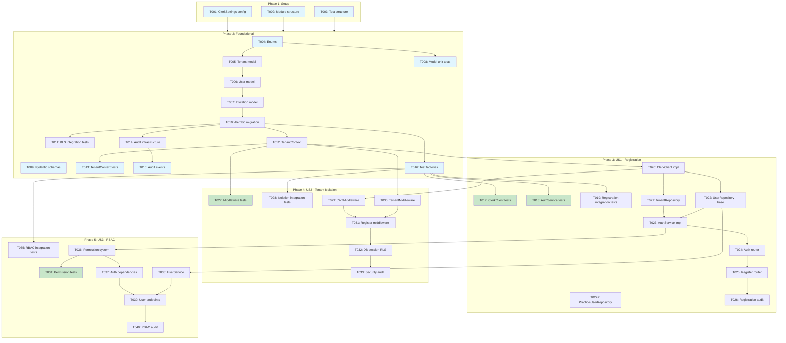

# Tasks: Auth & Multi-tenancy

**Spec**: 002-auth-multitenancy | **Date**: 2025-12-28
**Input**: Design documents from `/specs/002-auth-multitenancy/`
**Prerequisites**: spec.md, plan.md, data-model.md

**Tests**: Included - TDD approach with tests written before implementation where appropriate.

**Organization**: Tasks are grouped by user story to enable independent implementation and testing of each story.

---

## Format: `[ID] [P?] [Story] Description`

- **[P]**: Can run in parallel (different files, no dependencies)
- **[Story]**: Which user story this task belongs to (e.g., US1, US2)
- Include exact file paths in descriptions

---

## Phase 1: Setup (Shared Infrastructure)

**Purpose**: Configuration and project structure for auth module

- [x] T001 [P] Add Clerk configuration settings to `backend/app/config.py`
  - Add `ClerkSettings` class with: `publishable_key`, `secret_key`, `jwks_url`, `webhook_secret`, `jwt_clock_skew_seconds`, `jwks_cache_ttl_seconds`
  - Update `Settings` class to include `clerk: ClerkSettings`
  - _Requirements: FR-001, FR-002, FR-003_

- [x] T002 [P] Create auth module directory structure
  - Create `backend/app/modules/auth/__init__.py`
  - Create placeholder files: `router.py`, `service.py`, `repository.py`, `models.py`, `schemas.py`, `clerk.py`, `middleware.py`, `permissions.py`, `audit_events.py`, `webhooks.py`
  - _Requirements: Constitution - Modular Monolith Architecture_

- [x] T003 [P] Create test directory structure for auth module
  - Create `backend/tests/unit/modules/auth/__init__.py`
  - Create placeholder test files: `test_service.py`, `test_clerk.py`, `test_permissions.py`, `test_middleware.py`
  - Create `backend/tests/integration/api/test_auth_endpoints.py`, `test_tenant_isolation.py`
  - Create `backend/tests/factories/auth.py`
  - _Requirements: Constitution - 80% Unit Test Coverage_

---

## Phase 2: Foundational (Blocking Prerequisites)

**Purpose**: Core infrastructure that MUST be complete before ANY user story can be implemented

**CRITICAL**: No user story work can begin until this phase is complete

### 2.1 Data Models and Enums

> **Design Pattern**: Shared Identity + Separate Profiles
> The `users` table is the base identity for all user types.
> Profile tables (`practice_users`, `client_users`) contain type-specific attributes.

- [x] T004 [P] Create enum definitions in `backend/app/modules/auth/models.py`
  - Implement `UserType` enum (PRACTICE_USER, BUSINESS_OWNER) - discriminator for profile tables
  - Implement `UserRole` enum (ADMIN, ACCOUNTANT, STAFF) - roles for practice users
  - Implement `SubscriptionStatus` enum (TRIAL, ACTIVE, SUSPENDED, CANCELLED)
  - Implement `InvitationStatus` enum (PENDING, ACCEPTED, REVOKED, EXPIRED)
  - _Requirements: FR-011, Key Entities_

- [x] T005 Create `Tenant` SQLAlchemy model in `backend/app/modules/auth/models.py`
  - Implement all fields: id, name, slug, settings (JSONB), subscription_status, mfa_required, is_active, created_at, updated_at
  - Add relationships to `PracticeUser` and `Invitation`
  - Add computed properties: `is_trial`, `is_suspended`, `can_access`
  - _Requirements: FR-006, FR-024, Key Entities - Tenant_

- [x] T006 Create `User` base identity model in `backend/app/modules/auth/models.py`
  - Implement core identity fields: id, email (unique), user_type, is_active, created_at, updated_at
  - Add 1:1 relationship to `PracticeUser` (practice_profile)
  - Add computed properties: `is_practice_user`, `is_business_owner`
  - Note: This is the single source of truth for all user types
  - _Requirements: FR-005, Key Entities - User (Base Identity)_

- [x] T006a Create `PracticeUser` profile model in `backend/app/modules/auth/models.py` (depends on T005, T006)
  - Implement practice-specific fields: id, user_id (1:1 FK unique), tenant_id, clerk_id, role, mfa_enabled, last_login_at, created_at, updated_at
  - Add relationships to `User`, `Tenant`, and `Invitation`
  - Add computed properties: `email` (from User), `is_admin`, `can_manage_users`, `can_write_clients`, `can_lodge_bas`
  - _Requirements: FR-005, FR-011, Key Entities - PracticeUser_

- [x] T007 Create `Invitation` SQLAlchemy model in `backend/app/modules/auth/models.py` (depends on T005, T006a)
  - Implement all fields: id, tenant_id, invited_by (FK to practice_users), email, role, token, expires_at, accepted_at, accepted_by, revoked_at, created_at
  - Add `generate_invitation_token()` and `default_expiry()` helper functions
  - Add computed properties: `status`, `is_valid`, `is_expired`
  - _Requirements: FR-020, FR-021, Key Entities - Invitation_

- [x] T008 [P] Write unit tests for auth models in `backend/tests/unit/modules/auth/test_models.py`
  - Test enum values and string representations (including UserType)
  - Test User ↔ PracticeUser 1:1 relationship
  - Test model computed properties
  - Test token generation and expiry defaults
  - _Requirements: Constitution - 80% Unit Test Coverage_

### 2.2 Pydantic Schemas

- [x] T009 Create Pydantic schemas in `backend/app/modules/auth/schemas.py`
  - Base schemas: `TenantBase`, `UserBase`, `PracticeUserBase`, `InvitationBase`
  - Create schemas: `TenantCreate`, `PracticeUserCreate`, `InvitationCreate`
  - Update schemas: `TenantUpdate`, `PracticeUserRoleUpdate`, `PracticeUserDeactivate`
  - Response schemas: `TenantResponse`, `TenantSummary`, `UserResponse`, `PracticeUserResponse`, `PracticeUserSummary`, `PracticeUserWithTenant`, `InvitationResponse`, `InvitationPublic`
  - Auth schemas: `RegisterRequest`, `RegisterResponse`, `MeResponse`, `LogoutRequest`
  - Note: `UserResponse` returns base identity; `PracticeUserResponse` includes profile data
  - _Requirements: Constitution - Pydantic for Schemas_

### 2.3 Database Migration with RLS

- [x] T010 Create Alembic migration `backend/alembic/versions/001_auth_multitenancy.py`
  - Create enums: `user_type`, `user_role`, `subscription_status`
  - Create `tenants` table with all columns and indexes
  - Create `users` table (base identity) with: id, email (unique), user_type, is_active, timestamps
  - Create `practice_users` table (profile) with: id, user_id (1:1 FK unique), tenant_id, clerk_id, role, mfa_enabled, last_login_at, timestamps
  - Create `invitations` table with all columns, indexes, and FK to practice_users
  - Create `audit_logs` table with all columns and indexes
  - Enable RLS on `practice_users` and `invitations` tables (NOT on `users` base table)
  - Create RLS policies: `tenant_isolation_practice_users`, `tenant_isolation_invitations`, `public_invitation_by_token`
  - Create audit log immutability rules (no update/delete)
  - Include proper downgrade function
  - _Requirements: FR-006, FR-007, FR-008, FR-009_

- [x] T011 Write integration test for RLS policies in `backend/tests/integration/test_rls_policies.py`
  - Test tenant isolation on practice_users table
  - Test tenant isolation on invitations table
  - Test public invitation lookup by token
  - Test RLS enforcement when context not set (returns empty)
  - Test that users base table is NOT tenant-scoped (shared identity)
  - _Requirements: FR-009, User Story 2 - Tenant Data Isolation_

### 2.4 Core Infrastructure

- [x] T012 Create TenantContext utility in `backend/app/core/tenant_context.py`
  - Implement `TenantContext` class with: `get_current_tenant_id()`, `set_current_tenant_id()`, `clear()`
  - Implement `set_db_context()` async method to set PostgreSQL session variable
  - Implement `tenant_scope()` async context manager
  - Use Python `contextvars` for request-scoped tenant context
  - _Requirements: FR-008, User Story 5 - Tenant Middleware_

- [x] T013 [P] Write unit tests for TenantContext in `backend/tests/unit/core/test_tenant_context.py`
  - Test context isolation between concurrent contexts
  - Test proper cleanup on context exit
  - Test DB session variable setting
  - _Requirements: User Story 5 - Acceptance Scenario 4_

- [x] T014 Create audit infrastructure in `backend/app/core/audit.py`
  - Implement `AuditLog` SQLAlchemy model (as defined in data-model.md)
  - Implement `AuditService` class with `log_event()` method
  - Implement `@audited` decorator for automatic audit logging
  - Implement checksum generation for integrity chain
  - _Requirements: Audit Events Required, FR-016_

- [x] T015 [P] Define auth-specific audit events in `backend/app/modules/auth/audit_events.py`
  - Define `AUTH_AUDIT_EVENTS` dictionary with all event types from spec
  - Events: `auth.login.success`, `auth.login.failure`, `auth.logout`, `auth.token.invalid`, `user.created`, `user.role.changed`, `user.deactivated`, `user.activated`, `user.invitation.created`, `user.invitation.accepted`, `user.invitation.expired`, `user.invitation.revoked`, `tenant.settings.changed`, `rbac.access.denied`
  - _Requirements: Audit Implementation Requirements_

### 2.5 Test Factories

- [x] T016 Create test factories in `backend/tests/factories/auth.py`
  - Implement `TenantFactory` with factory_boy
  - Implement `UserFactory` with factory_boy
  - Implement `InvitationFactory` with factory_boy
  - Add async SQLAlchemy support for factories
  - _Requirements: Testing Strategy_

**Checkpoint**: Foundation ready - user story implementation can now begin

---

## Phase 3: User Story 1 - Accountant Registration and First Login (Priority: P1)

**Goal**: Enable new accountants to sign up via Clerk, provision a tenant, and access the dashboard

**Independent Test**: Complete registration flow and verify user can access their dashboard

### Tests for User Story 1

- [x] T017 [P] [US1] Write unit tests for ClerkClient in `backend/tests/unit/modules/auth/test_clerk.py`
  - Test JWKS fetching and caching
  - Test token validation with valid token
  - Test token validation with expired token
  - Test token validation with invalid signature
  - Test fallback to cached JWKS on fetch failure
  - _Requirements: FR-002, FR-003, FR-004_

- [x] T018 [P] [US1] Write unit tests for AuthService in `backend/tests/unit/modules/auth/test_service.py`
  - Test `register_user()` creates new tenant for fresh registration
  - Test `register_user()` with invitation token joins existing tenant
  - Test `get_current_user()` returns user with tenant context
  - Test `sync_user_from_clerk()` updates user data
  - _Requirements: User Story 1 - Acceptance Scenarios 1, 3_

- [x] T019 [US1] Write integration tests for registration flow in `backend/tests/integration/api/test_auth_endpoints.py`
  - Test POST `/api/v1/auth/register` creates user and tenant
  - Test POST `/api/v1/auth/register` with duplicate email returns error
  - Test GET `/api/v1/auth/me` returns current user with permissions
  - _Requirements: User Story 1 - Acceptance Scenarios 1, 2_

### Implementation for User Story 1

- [x] T020 [US1] Create ClerkClient in `backend/app/modules/auth/clerk.py`
  - Implement `__init__` with ClerkSettings and Redis cache
  - Implement `get_jwks()` with Redis caching and TTL
  - Implement `validate_token()` using python-jose with JWKS
  - Implement `ClerkTokenPayload` Pydantic model for token claims
  - Handle clock skew tolerance (configurable, default 60s)
  - Implement fallback to stale cache on JWKS fetch failure
  - _Requirements: FR-002, FR-003, FR-004, FR-005_

- [x] T021 [US1] Create TenantRepository in `backend/app/modules/auth/repository.py`
  - Implement `create()` method
  - Implement `get_by_id()` method
  - Implement `get_by_slug()` method
  - Implement `update()` method
  - Use async SQLAlchemy patterns
  - _Requirements: Constitution - Repository Pattern_

- [x] T022 [US1] Create UserRepository (base identity) in `backend/app/modules/auth/repository.py`
  - Implement `create()` method - creates base User with user_type
  - Implement `get_by_id()` method
  - Implement `get_by_email()` method - looks up across all user types
  - Note: This is for base identity lookups only (email uniqueness check, etc.)
  - _Requirements: Constitution - Repository Pattern_

- [x] T022a [US1] Create PracticeUserRepository (practice profile) in `backend/app/modules/auth/repository.py`
  - Implement `create()` method - creates PracticeUser linked to User
  - Implement `get_by_id()` method
  - Implement `get_by_user_id()` method - get profile by base User ID
  - Implement `get_by_clerk_id()` method
  - Implement `list_by_tenant()` method with pagination
  - Implement `update()` method
  - _Requirements: Constitution - Repository Pattern_

- [x] T023 [US1] Create AuthService in `backend/app/modules/auth/service.py`
  - Implement `register_user()` - creates User (base) + PracticeUser (profile) and provisions tenant (if no invitation)
  - Implement `get_current_user()` - retrieves PracticeUser by clerk_id (with User joined)
  - Implement `sync_user_from_clerk()` - syncs user metadata from Clerk
  - Implement `handle_logout()` - logs audit event
  - Inject dependencies: UserRepository, PracticeUserRepository, TenantRepository, ClerkClient, AuditService
  - _Requirements: User Story 1 - Acceptance Scenarios 1, 3_

- [x] T024 [US1] Create auth router endpoints in `backend/app/modules/auth/router.py`
  - POST `/api/v1/auth/register` - complete registration after Clerk signup
  - GET `/api/v1/auth/me` - get current user profile and permissions
  - POST `/api/v1/auth/logout` - logout current session
  - POST `/api/v1/auth/logout-all` - logout all sessions
  - _Requirements: API Endpoints Design_

- [x] T025 [US1] Register auth router in `backend/app/main.py`
  - Import and include auth router with prefix `/api/v1`
  - _Requirements: Constitution - Modular Monolith_

- [x] T026 [US1] Add audit logging to registration flow
  - Log `user.created` event on successful registration
  - Log `auth.login.success` event on first login
  - _Requirements: Audit Events - user.created, auth.login.success_

**Checkpoint**: User Story 1 complete - new users can register and login

---

## Phase 4: User Story 2 - Tenant Data Isolation (Priority: P1)

**Goal**: Ensure complete tenant isolation via PostgreSQL RLS

**Independent Test**: Create two tenants with data, verify zero cross-tenant visibility

### Tests for User Story 2

- [x] T027 [P] [US2] Write unit tests for TenantMiddleware in `backend/tests/unit/modules/auth/test_middleware.py`
  - Test tenant context is set from JWT claims
  - Test PostgreSQL session variable is set
  - Test context cleanup on request completion
  - Test context isolation for concurrent requests
  - Test error handling when tenant context cannot be established
  - _Requirements: User Story 5 - Acceptance Scenarios 1-5_

- [x] T028 [US2] Write integration tests for tenant isolation in `backend/tests/integration/api/test_tenant_isolation.py`
  - Test API returns only current tenant's data
  - Test cross-tenant resource access returns 404 (not 403)
  - Test request body tenant_id is ignored, JWT tenant_id is used
  - Test direct DB query without tenant context returns empty
  - _Requirements: User Story 2 - Acceptance Scenarios 1-5_

### Implementation for User Story 2

- [x] T029 [US2] Create JWTMiddleware in `backend/app/modules/auth/middleware.py`
  - Extract Bearer token from Authorization header
  - Validate token using ClerkClient
  - Set request state with validated claims (user_id, tenant_id, roles)
  - Return 401 for missing/invalid/expired tokens
  - Configure excluded paths: `/health`, `/docs`, `/openapi.json`, `/api/v1/auth/webhook`
  - _Requirements: FR-001, FR-002, FR-004, User Story 4_

- [x] T030 [US2] Create TenantMiddleware in `backend/app/modules/auth/middleware.py`
  - Extract tenant_id from JWT claims (set by JWTMiddleware)
  - Set tenant context using TenantContext utility
  - Set PostgreSQL session variable `app.current_tenant_id`
  - Ensure cleanup on request completion (success or failure)
  - Handle requests without tenant_id (registration flow)
  - _Requirements: FR-008, User Story 5_

- [x] T031 [US2] Register middleware in `backend/app/main.py`
  - Add TenantMiddleware (executes second)
  - Add JWTMiddleware (executes first)
  - Ensure correct middleware order
  - _Requirements: Middleware Architecture_

- [x] T032 [US2] Update database session to support RLS context
  - Modify `get_db()` in `backend/app/database.py` to set tenant context on session
  - Ensure tenant context is propagated to all queries
  - _Requirements: FR-008, FR-009_

- [x] T033 [US2] Add audit logging for security events
  - Log `auth.token.invalid` for rejected tokens
  - Log IP address (masked to /24) with events
  - _Requirements: Audit Events - auth.token.invalid_

**Checkpoint**: User Story 2 complete - complete tenant isolation enforced

---

## Phase 5: User Story 3 - Role-Based Access Control (Priority: P2)

**Goal**: Implement Admin, Accountant, Staff roles with permission checking

**Independent Test**: Create users with different roles, verify permission enforcement

### Tests for User Story 3

- [x] T034 [P] [US3] Write unit tests for permissions in `backend/tests/unit/modules/auth/test_permissions.py`
  - Test role-permission mappings are correct
  - Test `require_permission()` dependency allows authorized access
  - Test `require_permission()` dependency denies unauthorized access
  - Test `require_role()` dependency
  - Test `require_any_permission()` dependency
  - _Requirements: FR-011, FR-012, FR-013, FR-014, FR-015_

- [x] T035 [US3] Write integration tests for RBAC in `backend/tests/integration/api/test_rbac.py`
  - Test Admin can access user management endpoints
  - Test Accountant cannot access user management endpoints (403)
  - Test Staff has read-only access
  - Test permission denied events are logged
  - _Requirements: User Story 3 - Acceptance Scenarios 1-4_

### Implementation for User Story 3

- [x] T036 [US3] Create permission system in `backend/app/modules/auth/permissions.py`
  - Define `Permission` enum with all permissions (USER_READ, USER_WRITE, USER_DELETE, TENANT_READ, TENANT_WRITE, CLIENT_READ, CLIENT_WRITE, CLIENT_DELETE, BAS_READ, BAS_WRITE, BAS_LODGE)
  - Define `ROLE_PERMISSIONS` mapping dictionary
  - Implement `require_permission()` FastAPI dependency
  - Implement `require_role()` FastAPI dependency
  - Implement `require_any_permission()` FastAPI dependency
  - _Requirements: FR-011, FR-012, FR-013, FR-014, FR-015_

- [x] T037 [US3] Create auth dependencies in `backend/app/core/dependencies.py`
  - Add `get_current_user()` dependency that extracts user from request state
  - Add `get_current_tenant_id()` dependency
  - Add `get_current_active_user()` dependency (checks is_active)
  - _Requirements: FR-012_

- [x] T038 [US3] Create UserService in `backend/app/modules/auth/service.py`
  - Implement `get_user()` method
  - Implement `list_users()` method with pagination
  - Implement `update_role()` method with audit logging
  - Implement `deactivate_user()` method with audit logging
  - Implement `activate_user()` method with audit logging
  - _Requirements: FR-019, FR-023, User Story 3_

- [x] T039 [US3] Create user management endpoints in `backend/app/modules/auth/router.py`
  - GET `/api/v1/users` - list users in tenant (Admin only)
  - GET `/api/v1/users/{user_id}` - get user details (Admin only)
  - PATCH `/api/v1/users/{user_id}/role` - change user role (Admin only)
  - PATCH `/api/v1/users/{user_id}/deactivate` - deactivate user (Admin only)
  - PATCH `/api/v1/users/{user_id}/activate` - activate user (Admin only)
  - _Requirements: API Endpoints Design - User Management_

- [x] T040 [US3] Add audit logging for RBAC events
  - Log `user.role.changed` with old_role, new_role, changed_by
  - Log `user.deactivated` with reason
  - Log `user.activated`
  - Log `rbac.access.denied` on permission check failure
  - _Requirements: Audit Events, FR-016_

**Checkpoint**: User Story 3 complete - RBAC fully enforced

---

## Phase 6: User Story 4 - JWT Token Management (Priority: P2)

**Goal**: Robust JWT validation with JWKS caching and proper error handling

**Independent Test**: Validate various token scenarios (valid, expired, tampered, missing)

### Tests for User Story 4

- [x] T041 [P] [US4] Write unit tests for JWT handling edge cases in `backend/tests/unit/modules/auth/test_jwt.py`
  - Test clock skew tolerance (60s default)
  - Test JWKS cache expiry and refresh
  - Test JWKS fetch retry on failure
  - Test graceful degradation with stale cache
  - _Requirements: User Story 4 - Acceptance Scenarios 1-6_

### Implementation for User Story 4

- [x] T042 [US4] Enhance ClerkClient with robust JWKS handling in `backend/app/modules/auth/clerk.py`
  - Add retry logic for JWKS fetch (3 retries with exponential backoff)
  - Add stale-while-revalidate cache pattern
  - Add JWKS key rotation detection
  - Add metrics/logging for cache hits/misses
  - _Requirements: FR-003, NFR-001, NFR-002_

- [x] T043 [US4] Add token validation performance logging
  - Log token validation duration
  - Log JWKS cache performance
  - Ensure P95 < 50ms (NFR-001)
  - _Requirements: NFR-001_

**Checkpoint**: User Story 4 complete - robust JWT handling

---

## Phase 7: User Story 5 - Tenant Middleware and Context Propagation (Priority: P2)

**Goal**: Reliable request context propagation for RLS and auditing

**Independent Test**: Trace request context through middleware chain

*Note: Most implementation covered in US2. This phase adds enhanced testing and edge cases.*

### Tests for User Story 5

- [x] T044 [US5] Write comprehensive middleware integration tests in `backend/tests/integration/api/test_middleware_chain.py`
  - Test full request flow: JWT -> Tenant -> Route -> Response
  - Test context availability in services and repositories
  - Test context cleanup on exceptions
  - Test concurrent request isolation (asyncio)
  - _Requirements: User Story 5 - Acceptance Scenarios 1-5_

### Implementation for User Story 5

- [x] T045 [US5] Add request ID propagation
  - Generate request_id in middleware
  - Add to tenant context
  - Include in all audit logs
  - _Requirements: User Story 5 - Acceptance Scenario 3_

- [x] T046 [US5] Add middleware error handling enhancements
  - Ensure context cleanup on any exception
  - Add error recovery for partial context setup
  - Log context-related errors
  - _Requirements: User Story 5 - Acceptance Scenario 5, Edge Cases_

**Checkpoint**: User Story 5 complete - reliable context propagation

---

## Phase 8: User Story 6 - User Invitation and Onboarding (Priority: P3)

**Goal**: Admin can invite team members who complete registration via Clerk

**Independent Test**: Send invitation, complete onboarding flow, verify user joins tenant

### Tests for User Story 6

- [x] T047 [P] [US6] Write unit tests for InvitationService in `backend/tests/unit/modules/auth/test_invitation_service.py`
  - Test `create_invitation()` generates secure token
  - Test `create_invitation()` prevents duplicate emails
  - Test `get_invitation()` validates token
  - Test `accept_invitation()` links user to tenant
  - Test invitation expiry handling
  - _Requirements: User Story 6 - Acceptance Scenarios 1-5_

- [x] T048 [US6] Write integration tests for invitation flow in `backend/tests/integration/api/test_invitations.py`
  - Test POST `/api/v1/invitations` creates invitation (Admin only)
  - Test GET `/api/v1/invitations` lists pending invitations
  - Test GET `/api/v1/invitations/{token}` returns public invitation details
  - Test DELETE `/api/v1/invitations/{id}` revokes invitation
  - Test POST `/api/v1/invitations/{token}/accept` accepts invitation
  - _Requirements: API Endpoints Design - Invitations_

### Implementation for User Story 6

- [x] T049 [US6] Create InvitationRepository in `backend/app/modules/auth/repository.py`
  - Implement `create()` method
  - Implement `get_by_id()` method
  - Implement `get_by_token()` method (bypasses RLS for public access)
  - Implement `get_by_email()` method
  - Implement `list_by_tenant()` method with filtering
  - Implement `update()` method
  - _Requirements: Constitution - Repository Pattern_

- [x] T050 [US6] Create InvitationService in `backend/app/modules/auth/service.py`
  - Implement `create_invitation()` with duplicate check
  - Implement `get_invitation()` with token validation
  - Implement `accept_invitation()` that creates user and links to tenant
  - Implement `revoke_invitation()` method
  - Implement `cleanup_expired()` background task method
  - Set default expiry to 7 days (configurable)
  - _Requirements: FR-020, FR-021, FR-022, User Story 6_

- [x] T051 [US6] Create invitation endpoints in `backend/app/modules/auth/router.py`
  - POST `/api/v1/invitations` - create invitation (Admin only)
  - GET `/api/v1/invitations` - list pending invitations (Admin only)
  - GET `/api/v1/invitations/{token}` - get public invitation details (no auth)
  - DELETE `/api/v1/invitations/{invitation_id}` - revoke invitation (Admin only)
  - POST `/api/v1/invitations/{token}/accept` - accept invitation (Clerk JWT)
  - _Requirements: API Endpoints Design - Invitations_

- [x] T052 [US6] Update registration flow to handle invitations
  - Modify `AuthService.register_user()` to accept invitation_token
  - When invitation provided, join existing tenant with specified role
  - Mark invitation as accepted
  - _Requirements: User Story 6 - Acceptance Scenario 2_

- [x] T053 [US6] Add audit logging for invitation events
  - Log `user.invitation.created` with email, role, invited_by
  - Log `user.invitation.accepted` with invitation_id, user_id
  - Log `user.invitation.expired` (via cleanup task)
  - Log `user.invitation.revoked` with revoked_by
  - _Requirements: Audit Events_

**Checkpoint**: User Story 6 complete - invitation workflow functional

---

## Phase 9: User Story 7 - Session Management and Logout (Priority: P3)

**Goal**: Users can manage their sessions and logout securely

**Independent Test**: Login from multiple devices, verify session controls

### Tests for User Story 7

- [x] T054 [US7] Write integration tests for session management in `backend/tests/integration/api/test_sessions.py`
  - Test POST `/api/v1/auth/logout` revokes current session
  - Test POST `/api/v1/auth/logout-all` revokes all sessions
  - Test revoked token returns 401
  - _Requirements: User Story 7 - Acceptance Scenarios 1-5_

### Implementation for User Story 7

- [x] T055 [US7] Implement logout functionality in AuthService
  - Implement `handle_logout()` with audit logging
  - Implement `handle_logout_all()` for all sessions
  - Note: Actual session revocation handled by Clerk
  - _Requirements: FR-017, FR-018_

- [x] T056 [US7] Add audit logging for session events
  - Log `auth.logout` with session_id, logout_type (single/all)
  - _Requirements: Audit Events - auth.logout_

**Checkpoint**: User Story 7 complete - session management working

---

## Phase 10: User Story 8 - MFA Enforcement (Priority: P3)

**Goal**: Tenant-level MFA requirement and individual MFA status tracking

**Independent Test**: Enable MFA requirement, verify enforcement during login

### Tests for User Story 8

- [x] T057 [US8] Write integration tests for MFA in `backend/tests/integration/api/test_mfa.py`
  - Test PATCH `/api/v1/tenant` can toggle mfa_required
  - Test user mfa_enabled status is synced from Clerk
  - Test tenant MFA requirement is respected
  - _Requirements: User Story 8 - Acceptance Scenarios 1-5_

### Implementation for User Story 8

- [x] T058 [US8] Create tenant settings endpoints in `backend/app/modules/auth/router.py`
  - GET `/api/v1/tenant` - get tenant settings (Admin only)
  - PATCH `/api/v1/tenant` - update tenant settings (Admin only)
  - PATCH `/api/v1/tenant/mfa-requirement` - toggle MFA requirement (Admin only)
  - _Requirements: FR-024, API Endpoints Design - Tenant Settings_

- [x] T059 [US8] Add MFA status sync from Clerk webhooks
  - Update user mfa_enabled when Clerk sends MFA status change
  - _Requirements: FR-025_

- [x] T060 [US8] Add audit logging for MFA events
  - Log `auth.mfa.enabled` when user enables MFA
  - Log `auth.mfa.disabled` when user disables MFA
  - Log `tenant.settings.changed` when MFA requirement changes
  - _Requirements: Audit Events_

**Checkpoint**: User Story 8 complete - MFA enforcement working

---

## Phase 11: Clerk Webhooks Integration

**Purpose**: Handle Clerk events for user lifecycle management

- [x] T061 [P] Write unit tests for webhook handlers in `backend/tests/unit/modules/auth/test_webhooks.py`
  - Test webhook signature verification
  - Test `user.created` event handling
  - Test `user.updated` event handling
  - Test `user.deleted` event handling
  - Test `session.created` event handling
  - Test `session.ended` event handling
  - _Requirements: Clerk Webhook Events_

- [x] T062 Create webhook handlers in `backend/app/modules/auth/webhooks.py`
  - Implement webhook signature verification using Clerk secret
  - Implement `handle_user_created()` - sync user metadata
  - Implement `handle_user_updated()` - sync user metadata changes
  - Implement `handle_user_deleted()` - deactivate user
  - Implement `handle_session_created()` - log login event
  - Implement `handle_session_ended()` - log logout event
  - _Requirements: Clerk Webhook Events_

- [x] T063 Create webhook endpoint in `backend/app/modules/auth/router.py`
  - POST `/api/v1/auth/webhook` - Clerk webhook receiver (no JWT auth, signature verification)
  - Route to appropriate handler based on event type
  - _Requirements: API Endpoints Design_

- [x] T064 Add audit logging for webhook events
  - Log `auth.login.success` from session.created
  - Log `auth.login.failure` from failed authentication attempts
  - Log `auth.password.changed` from password change events
  - _Requirements: Audit Events_

---

## Phase 12: Polish & Cross-Cutting Concerns

**Purpose**: Improvements that affect multiple user stories

- [x] T065 [P] Add error handling middleware for auth exceptions
  - Handle `AuthenticationError` -> 401 response
  - Handle `AuthorizationError` -> 403 response
  - Handle token validation errors consistently
  - _Requirements: Error Handling_

- [x] T066 [P] Add rate limiting for auth endpoints
  - Implement rate limiting for login failures (5 per minute per email)
  - Implement rate limiting for invitation creation (10 per tenant per hour)
  - _Requirements: NFR-006, Rate Limiting_

- [x] T067 [P] Add OpenAPI documentation for auth endpoints
  - Add response schemas to all endpoints
  - Add security requirements (Bearer token)
  - Add example requests/responses
  - _Requirements: API Documentation_

- [x] T068 Code cleanup and refactoring
  - Ensure consistent error messages
  - Remove any duplicate code
  - Verify all type hints are complete
  - _Requirements: Constitution - Type Hints Everywhere_

- [x] T069 Performance validation
  - Verify JWT validation P95 < 50ms (NFR-001)
  - Verify middleware overhead < 5ms (NFR-003)
  - _Requirements: NFR-001, NFR-003_

- [x] T070 Security hardening review
  - Verify all sensitive data is masked in logs
  - Verify RLS cannot be bypassed
  - Verify token validation is comprehensive
  - _Requirements: Security Considerations_

---

## Dependencies & Execution Order

### Phase Dependencies

```
Phase 1 (Setup) ─────────────────────────────────────────┐
                                                          │
Phase 2 (Foundational) ──────────────────────────────────┤
    ├── T004-T008 (Models & Tests)                        │
    ├── T009 (Schemas)                                    │
    ├── T010-T011 (Migration & RLS Tests)                 │
    ├── T012-T015 (Core Infrastructure)                   │
    └── T016 (Test Factories)                             │
                                                          │
              ┌───────────────────────────────────────────┘
              │
              ▼
┌─────────────────────────────────────────────────────────┐
│  User Stories can proceed in parallel after Phase 2     │
│                                                          │
│  ┌──────────┐  ┌──────────┐  ┌──────────┐              │
│  │   US1    │  │   US2    │  │   US3    │              │
│  │ (P1)     │  │ (P1)     │  │ (P2)     │              │
│  │ Phase 3  │  │ Phase 4  │  │ Phase 5  │              │
│  └────┬─────┘  └────┬─────┘  └────┬─────┘              │
│       │             │             │                     │
│       └─────────────┼─────────────┘                     │
│                     │                                    │
│                     ▼                                    │
│  ┌──────────────────────────────────────────┐          │
│  │  US4, US5, US6, US7, US8 (P2/P3)         │          │
│  │  Phases 6-10                              │          │
│  └──────────────────────────────────────────┘          │
│                                                          │
└─────────────────────────────────────────────────────────┘
                              │
                              ▼
              Phase 11 (Webhooks) & Phase 12 (Polish)
```

### Critical Path

1. **Phase 1**: Setup (can run all tasks in parallel)
2. **Phase 2**: Foundational - BLOCKS all user stories
   - T004 -> T005 -> T006 -> T007 (model dependencies)
   - T010 (migration) depends on models
   - T012, T014 can run in parallel after migration
3. **US1 + US2**: Can run in parallel (both P1)
4. **US3-US8**: Can run after US1/US2 complete
5. **Phase 11-12**: After all user stories

### Parallel Opportunities

**Phase 1 (all parallel)**:
- T001, T002, T003

**Phase 2 (partial parallel)**:
- T004, T008 (in parallel)
- T009 (independent)
- T013, T015, T016 (in parallel after T012, T014)

**After Phase 2 (user stories can run in parallel)**:
- US1 Tasks: T017-T026
- US2 Tasks: T027-T033
- US3 Tasks: T034-T040

**Phase 12 (all parallel)**:
- T065, T066, T067

---

## Task Dependency Diagram



---

## Implementation Strategy

### MVP First (US1 + US2 Only)

1. Complete Phase 1: Setup
2. Complete Phase 2: Foundational (CRITICAL - blocks all stories)
3. Complete Phase 3: User Story 1 (Registration)
4. Complete Phase 4: User Story 2 (Tenant Isolation)
5. **STOP and VALIDATE**: Test registration and isolation independently
6. Deploy/demo if ready - basic auth working

### Incremental Delivery

1. Setup + Foundational -> Foundation ready
2. Add US1 -> Test independently -> Users can register
3. Add US2 -> Test independently -> Tenant isolation enforced
4. Add US3 -> Test independently -> RBAC working
5. Add US4-US8 -> Test independently -> Full feature set
6. Polish phase -> Production ready

### Parallel Team Strategy

With multiple developers:

1. Team completes Setup + Foundational together
2. Once Foundational is done:
   - Developer A: US1 (Registration)
   - Developer B: US2 (Tenant Isolation)
   - Developer C: US3 (RBAC)
3. Merge and validate P1 stories
4. Continue with P2/P3 stories

---

## Phase 13: Frontend Vertical Slice (Added to Complete Spec)

**Purpose**: Frontend implementation to enable end-to-end testing via UI

**Status**: Complete - Vertical slice testable via frontend

### 13.1 Authentication UI

- [x] T071 [P] Add Clerk dependencies to `frontend/package.json`
  - Add `@clerk/nextjs` for Next.js 14 integration
  - _Requirements: Vertical Slice - Frontend Auth_

- [x] T072 Create ClerkProvider in `frontend/src/app/providers.tsx`
  - Configure ClerkProvider with custom theming
  - Support dark/light mode
  - _Requirements: Vertical Slice - Frontend Auth_

- [x] T073 Create Next.js middleware in `frontend/src/middleware.ts`
  - Use `clerkMiddleware` and `createRouteMatcher`
  - Configure public routes: `/`, `/sign-in`, `/sign-up`, `/invitation`, `/api/health`, `/api/webhooks`
  - Protect all other routes with `auth().protect()`
  - _Requirements: Vertical Slice - Route Protection_

- [x] T074 Create auth layout in `frontend/src/app/(auth)/layout.tsx`
  - Center-aligned layout for auth pages
  - Consistent styling across sign-in/sign-up
  - _Requirements: Vertical Slice - Frontend Auth_

- [x] T075 Create sign-in page in `frontend/src/app/(auth)/sign-in/[[...sign-in]]/page.tsx`
  - Clerk SignIn component with custom appearance
  - Redirect to dashboard after sign-in
  - _Requirements: Vertical Slice - Frontend Auth_

- [x] T076 Create sign-up page in `frontend/src/app/(auth)/sign-up/[[...sign-up]]/page.tsx`
  - Clerk SignUp component with custom appearance
  - Redirect to onboarding after sign-up
  - _Requirements: Vertical Slice - Frontend Auth_

### 13.2 Protected Pages

- [x] T077 Create protected layout in `frontend/src/app/(protected)/layout.tsx`
  - Sidebar navigation with icons
  - User button with sign-out
  - Theme toggle support
  - _Requirements: Vertical Slice - Protected Routes_

- [x] T078 Create onboarding page in `frontend/src/app/(protected)/onboarding/page.tsx`
  - Practice setup form with name and ABN
  - Call backend `/api/v1/auth/register` endpoint
  - Redirect to dashboard on success
  - _Requirements: US1 - Registration Flow, Vertical Slice_

- [x] T079 Create dashboard page in `frontend/src/app/(protected)/dashboard/page.tsx`
  - Welcome message with user info
  - Placeholder for future dashboard content
  - _Requirements: Vertical Slice - Protected Routes_

### 13.3 API Client

- [x] T080 Create API client in `frontend/src/lib/api-client.ts`
  - Fetch wrapper with auth token handling
  - Backend URL configuration from env
  - JSON request/response handling
  - _Requirements: Vertical Slice - Backend Integration_

### 13.4 Email Service (Resend)

- [x] T081 [P] Add Resend dependency to `backend/pyproject.toml`
  - Add `resend` package
  - _Requirements: Email Communications_

- [x] T082 Create ResendSettings in `backend/app/config.py`
  - Add `api_key`, `from_email`, `enabled` fields
  - Default sender: `Clairo <noreply@clairo.ai>`
  - _Requirements: Email Configuration_

- [x] T083 Create email service in `backend/app/modules/notifications/email_service.py`
  - `send_welcome_email()` - new user welcome
  - `send_team_invitation()` - invitation with link and role
  - `send_bas_reminder()` - upcoming BAS deadline
  - `send_lodgement_confirmation()` - submission confirmation
  - _Requirements: Email Communications_

- [x] T084 Create email templates in `backend/app/modules/notifications/templates.py`
  - HTML templates for: welcome, invitation, BAS reminder, lodgement confirmation
  - Professional styling with brand colors
  - _Requirements: Email Communications_

- [x] T085 Integrate email sending in AuthService
  - Send welcome email on registration
  - Send invitation email on team invite
  - _Requirements: US1, US6 - Email Notifications_

### 13.5 Landing Page

- [x] T086 Create marketing landing page in `frontend/src/app/page.tsx`
  - Hero section with value proposition
  - Features section (Data, Compliance, Strategy pillars)
  - How it works section
  - Stats/metrics section
  - Testimonials section
  - Pricing section
  - CTA section
  - Footer with navigation
  - _Requirements: Vertical Slice - Marketing Site_

- [x] T087 Update fonts and animations in `frontend/src/app/globals.css`
  - Custom animations: float, pulse-glow, slide-up, shimmer
  - Glass morphism effects
  - Gradient text utilities
  - _Requirements: Frontend Polish_

- [x] T088 Configure fonts in `frontend/src/app/layout.tsx`
  - Sora for headings (`--font-heading`)
  - Plus Jakarta Sans for body (`--font-sans`)
  - _Requirements: Frontend Polish_

### 13.6 Environment Configuration

- [x] T089 Create `frontend/.env.local` with Clerk keys
  - `NEXT_PUBLIC_CLERK_PUBLISHABLE_KEY`
  - `CLERK_SECRET_KEY`
  - Clerk URL configuration
  - _Requirements: Vertical Slice - Configuration_

- [x] T090 Update `docker-compose.yml` with email config
  - Add Resend environment variables to backend service
  - _Requirements: Email Configuration_

**Checkpoint**: Spec 002 complete as vertical slice - testable via frontend UI

---

## Notes

- [P] tasks = different files, no dependencies
- [USn] label maps task to specific user story for traceability
- Each user story should be independently completable and testable
- Verify tests fail before implementing (TDD)
- Commit after each task or logical group
- Stop at any checkpoint to validate story independently
- All file paths are relative to repository root
