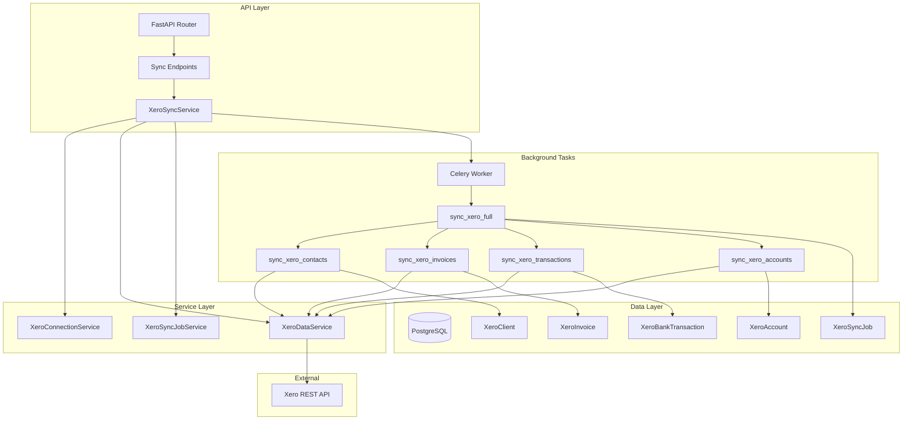
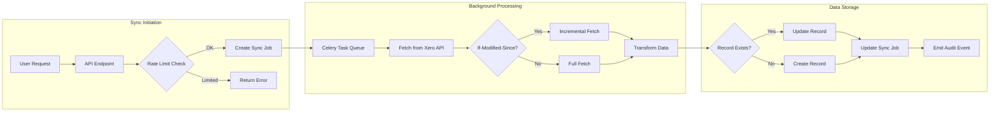
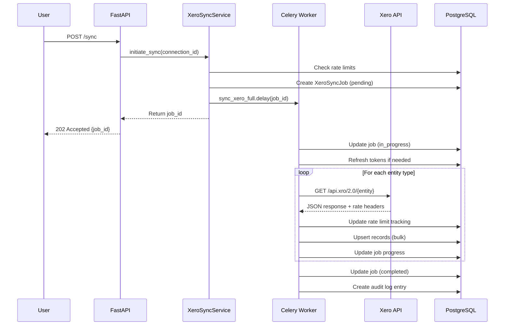
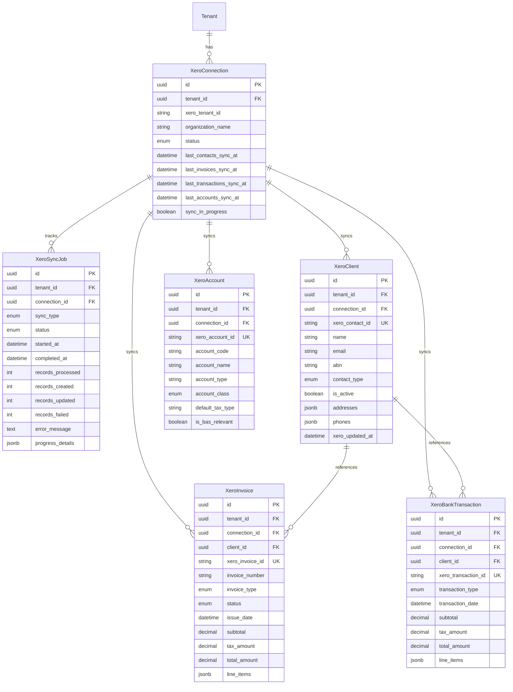
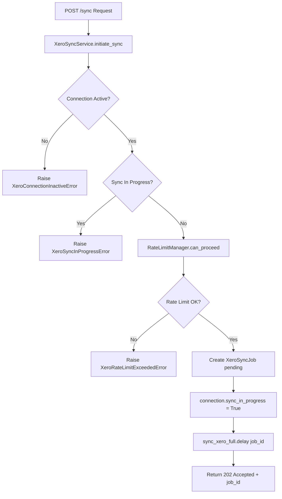
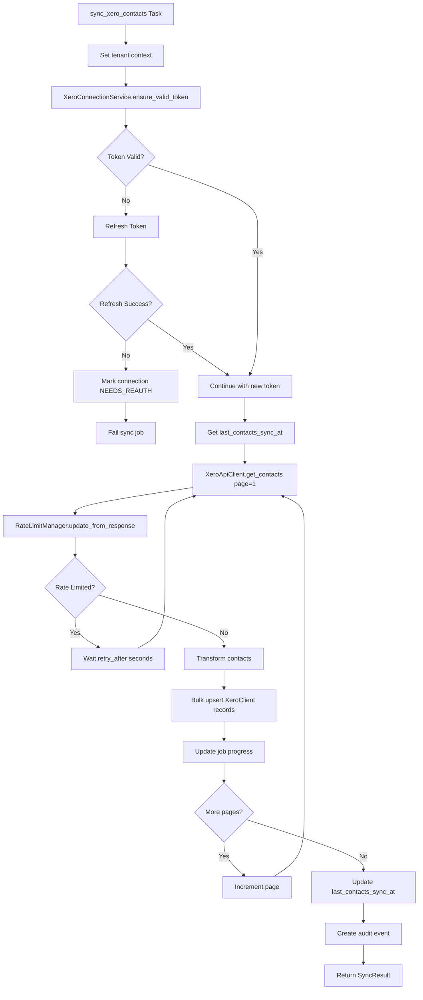
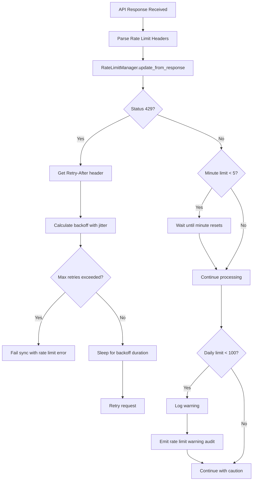
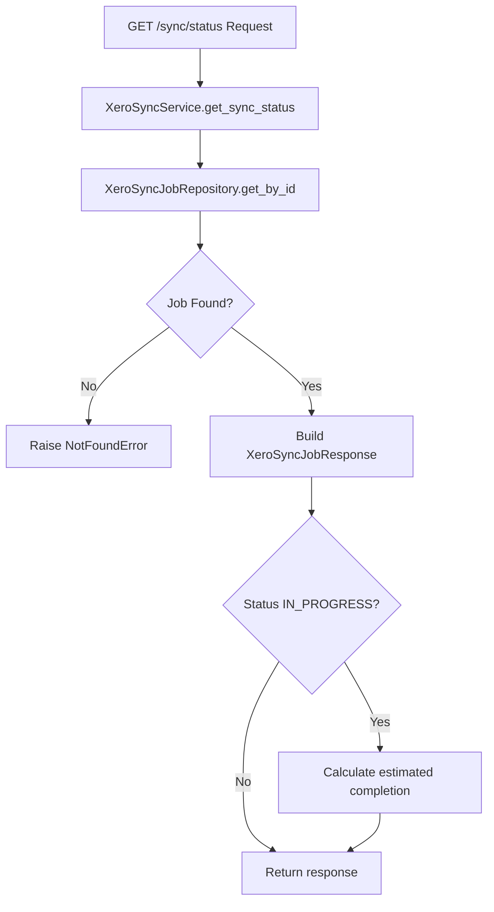

# Design Document: Xero Data Sync

## Overview

This document defines the technical design for synchronizing data from connected Xero organizations to Clairo. Building upon the completed Xero OAuth integration (Spec 003), this feature enables accountants to pull client contacts, invoices, bank transactions, and chart of accounts from Xero into Clairo for processing and analysis.

### Design Goals

1. **Reliable Data Synchronization**: Robust sync mechanism with incremental updates, proper error handling, and recovery
2. **Rate Limit Compliance**: Respect Xero's API limits (60 calls/minute, 5000 calls/day) with intelligent throttling
3. **Background Processing**: Non-blocking sync operations via Celery with progress tracking
4. **Data Integrity**: Maintain referential integrity between synced entities with proper upsert logic
5. **Auditability**: Full audit trail for all sync operations per constitution requirements
6. **Multi-Tenant Isolation**: Strict RLS enforcement on all synced data

### Scope

**In Scope:**
- Contact synchronization (Xero Contacts -> XeroClient)
- Invoice synchronization (Xero Invoices -> XeroInvoice)
- Bank transaction synchronization (Xero Bank Transactions -> XeroBankTransaction)
- Chart of accounts synchronization (Xero Accounts -> XeroAccount)
- Sync job tracking and status reporting
- Incremental sync with If-Modified-Since support
- Rate limit management with exponential backoff

**Out of Scope:**
- Bi-directional sync (writing back to Xero)
- Webhook-based real-time sync
- Scheduled automatic sync (future spec)
- BAS calculation from synced data (Spec 005)

---

## Architecture Design

### System Architecture Diagram



### Data Flow Diagram



### Sync Orchestration Flow



---

## Components and Interfaces

### Module Structure

```
backend/app/modules/integrations/xero/
├── __init__.py
├── models.py              # Extended with sync models
├── schemas.py             # Extended with sync schemas
├── repository.py          # Extended with sync repositories
├── service.py             # Extended with XeroSyncService
├── client.py              # Extended with data fetch methods
├── encryption.py          # Existing token encryption
├── oauth.py               # Existing OAuth utilities
├── router.py              # Extended with sync endpoints
├── sync/
│   ├── __init__.py
│   ├── tasks.py           # Celery sync tasks
│   ├── transformers.py    # Xero -> Clairo data mappers
│   ├── rate_limiter.py    # Rate limit management
│   └── audit_events.py    # Sync-specific audit events
```

### Component: XeroSyncService

**Responsibilities:**
- Orchestrate sync operations
- Validate connection state before sync
- Create and manage sync jobs
- Coordinate with Celery for background execution

**Interface:**
```python
class XeroSyncService:
    """Service for managing Xero data synchronization."""

    def __init__(
        self,
        session: AsyncSession,
        settings: Settings,
    ) -> None: ...

    async def initiate_sync(
        self,
        connection_id: UUID,
        sync_type: XeroSyncType,
        force_full: bool = False,
    ) -> XeroSyncJob:
        """Start a new sync job for the connection.

        Args:
            connection_id: The Xero connection to sync.
            sync_type: Type of sync (contacts, invoices, etc., or full).
            force_full: If True, ignore last sync timestamp.

        Returns:
            Created XeroSyncJob with pending status.

        Raises:
            XeroConnectionNotFoundError: If connection doesn't exist.
            XeroConnectionInactiveError: If connection is not active.
            XeroSyncInProgressError: If a sync is already running.
            XeroRateLimitExceededError: If rate limits are exhausted.
        """

    async def get_sync_status(
        self,
        job_id: UUID,
    ) -> XeroSyncJobResponse:
        """Get current status of a sync job."""

    async def get_sync_history(
        self,
        connection_id: UUID,
        limit: int = 20,
        offset: int = 0,
    ) -> XeroSyncHistoryResponse:
        """Get sync history for a connection."""

    async def cancel_sync(
        self,
        job_id: UUID,
    ) -> None:
        """Cancel a pending or in-progress sync job."""
```

**Dependencies:**
- XeroConnectionRepository
- XeroSyncJobRepository
- Celery task queue

### Component: XeroDataService

**Responsibilities:**
- Fetch data from Xero API with pagination
- Handle rate limit responses
- Transform Xero data to Clairo models
- Perform bulk upsert operations

**Interface:**
```python
class XeroDataService:
    """Service for fetching and transforming Xero data."""

    def __init__(
        self,
        session: AsyncSession,
        settings: Settings,
        connection: XeroConnection,
    ) -> None: ...

    async def sync_contacts(
        self,
        modified_since: datetime | None = None,
    ) -> SyncResult:
        """Sync contacts from Xero.

        Args:
            modified_since: Only fetch contacts modified after this time.

        Returns:
            SyncResult with counts of created, updated, failed records.
        """

    async def sync_invoices(
        self,
        modified_since: datetime | None = None,
    ) -> SyncResult:
        """Sync invoices from Xero."""

    async def sync_bank_transactions(
        self,
        modified_since: datetime | None = None,
    ) -> SyncResult:
        """Sync bank transactions from Xero."""

    async def sync_accounts(
        self,
        modified_since: datetime | None = None,
    ) -> SyncResult:
        """Sync chart of accounts from Xero."""
```

**Dependencies:**
- XeroApiClient (extended)
- XeroClientRepository
- XeroInvoiceRepository
- XeroBankTransactionRepository
- XeroAccountRepository
- TokenEncryption

### Component: XeroApiClient (Extended)

**Responsibilities:**
- Make authenticated API calls to Xero
- Handle pagination automatically
- Parse and return rate limit headers
- Implement retry logic for transient failures

**Interface Extensions:**
```python
class XeroClient:
    """Extended Xero API client with data fetch methods."""

    # ... existing methods ...

    async def get_contacts(
        self,
        access_token: str,
        xero_tenant_id: str,
        modified_since: datetime | None = None,
        page: int = 1,
    ) -> tuple[list[XeroContactResponse], bool, RateLimitInfo]:
        """Fetch contacts from Xero API.

        Args:
            access_token: Valid Xero access token.
            xero_tenant_id: Xero organization ID.
            modified_since: Filter by modification date.
            page: Page number for pagination.

        Returns:
            Tuple of (contacts, has_more_pages, rate_limit_info).
        """

    async def get_invoices(
        self,
        access_token: str,
        xero_tenant_id: str,
        modified_since: datetime | None = None,
        page: int = 1,
    ) -> tuple[list[XeroInvoiceResponse], bool, RateLimitInfo]: ...

    async def get_bank_transactions(
        self,
        access_token: str,
        xero_tenant_id: str,
        modified_since: datetime | None = None,
        page: int = 1,
    ) -> tuple[list[XeroBankTransactionResponse], bool, RateLimitInfo]: ...

    async def get_accounts(
        self,
        access_token: str,
        xero_tenant_id: str,
    ) -> tuple[list[XeroAccountResponse], RateLimitInfo]: ...
```

### Component: RateLimitManager

**Responsibilities:**
- Track rate limit state per connection
- Determine if sync can proceed
- Calculate wait times for throttling
- Implement exponential backoff on 429

**Interface:**
```python
class RateLimitManager:
    """Manages Xero API rate limit compliance."""

    def __init__(
        self,
        session: AsyncSession,
        connection: XeroConnection,
    ) -> None: ...

    async def can_proceed(self) -> bool:
        """Check if API calls can be made.

        Returns:
            True if within rate limits, False if should wait.
        """

    async def get_wait_time(self) -> float:
        """Get seconds to wait before next API call.

        Returns:
            Seconds to wait (0 if can proceed immediately).
        """

    async def update_from_response(
        self,
        rate_info: RateLimitInfo,
    ) -> None:
        """Update rate limit state from API response headers."""

    async def handle_429(
        self,
        retry_after: int,
        attempt: int,
    ) -> float:
        """Calculate backoff time for 429 response.

        Args:
            retry_after: Seconds from Retry-After header.
            attempt: Current retry attempt number.

        Returns:
            Seconds to wait before retry.
        """
```

### Component: Celery Sync Tasks

**Responsibilities:**
- Execute sync operations in background
- Update job progress during execution
- Handle failures gracefully
- Ensure proper tenant context in workers

**Interface:**
```python
# tasks.py

@celery_app.task(bind=True, name="app.tasks.xero.sync_full")
def sync_xero_full(
    self: Task,
    job_id: str,
    connection_id: str,
    tenant_id: str,
    force_full: bool = False,
) -> dict[str, Any]:
    """Orchestrate full Xero sync.

    Syncs entities in order: accounts, contacts, invoices, transactions.
    """

@celery_app.task(bind=True, name="app.tasks.xero.sync_contacts")
def sync_xero_contacts(
    self: Task,
    job_id: str,
    connection_id: str,
    tenant_id: str,
    modified_since: str | None = None,
) -> dict[str, Any]:
    """Sync contacts from Xero."""

@celery_app.task(bind=True, name="app.tasks.xero.sync_invoices")
def sync_xero_invoices(
    self: Task,
    job_id: str,
    connection_id: str,
    tenant_id: str,
    modified_since: str | None = None,
) -> dict[str, Any]:
    """Sync invoices from Xero."""

@celery_app.task(bind=True, name="app.tasks.xero.sync_bank_transactions")
def sync_xero_bank_transactions(
    self: Task,
    job_id: str,
    connection_id: str,
    tenant_id: str,
    modified_since: str | None = None,
) -> dict[str, Any]:
    """Sync bank transactions from Xero."""

@celery_app.task(bind=True, name="app.tasks.xero.sync_accounts")
def sync_xero_accounts(
    self: Task,
    job_id: str,
    connection_id: str,
    tenant_id: str,
) -> dict[str, Any]:
    """Sync chart of accounts from Xero."""
```

---

## Data Models

### Core Data Structure Definitions

```python
# models.py - New models for synced entities

import enum
import uuid
from datetime import datetime
from decimal import Decimal
from typing import Any

from sqlalchemy import (
    Boolean, DateTime, Enum, ForeignKey, Index, Integer,
    Numeric, String, Text, UniqueConstraint
)
from sqlalchemy.dialects.postgresql import ARRAY, JSONB, UUID
from sqlalchemy.orm import Mapped, mapped_column, relationship

from app.database import Base, TimestampMixin


# =============================================================================
# Enums
# =============================================================================

class XeroSyncType(str, enum.Enum):
    """Type of sync operation."""
    CONTACTS = "contacts"
    INVOICES = "invoices"
    BANK_TRANSACTIONS = "bank_transactions"
    ACCOUNTS = "accounts"
    FULL = "full"


class XeroSyncStatus(str, enum.Enum):
    """Status of a sync job."""
    PENDING = "pending"
    IN_PROGRESS = "in_progress"
    COMPLETED = "completed"
    FAILED = "failed"
    CANCELLED = "cancelled"


class XeroContactType(str, enum.Enum):
    """Type of Xero contact."""
    CUSTOMER = "customer"
    SUPPLIER = "supplier"
    BOTH = "both"


class XeroInvoiceType(str, enum.Enum):
    """Type of Xero invoice."""
    ACCREC = "accrec"    # Accounts Receivable (sales)
    ACCPAY = "accpay"    # Accounts Payable (purchases)


class XeroInvoiceStatus(str, enum.Enum):
    """Status of Xero invoice."""
    DRAFT = "draft"
    SUBMITTED = "submitted"
    AUTHORISED = "authorised"
    PAID = "paid"
    VOIDED = "voided"
    DELETED = "deleted"


class XeroBankTransactionType(str, enum.Enum):
    """Type of bank transaction."""
    RECEIVE = "receive"
    SPEND = "spend"
    RECEIVE_OVERPAYMENT = "receive_overpayment"
    SPEND_OVERPAYMENT = "spend_overpayment"
    RECEIVE_PREPAYMENT = "receive_prepayment"
    SPEND_PREPAYMENT = "spend_prepayment"


class XeroAccountType(str, enum.Enum):
    """Type of Xero account."""
    BANK = "bank"
    CURRENT = "current"
    CURRLIAB = "currliab"
    DEPRECIATN = "depreciatn"
    DIRECTCOSTS = "directcosts"
    EQUITY = "equity"
    EXPENSE = "expense"
    FIXED = "fixed"
    INVENTORY = "inventory"
    LIABILITY = "liability"
    NONCURRENT = "noncurrent"
    OTHERINCOME = "otherincome"
    OVERHEADS = "overheads"
    PREPAYMENT = "prepayment"
    REVENUE = "revenue"
    SALES = "sales"
    TERMLIAB = "termliab"
    PAYGLIABILITY = "paygliability"
    SUPERANNUATIONEXPENSE = "superannuationexpense"
    SUPERANNUATIONLIABILITY = "superannuationliability"
    WAGESEXPENSE = "wagesexpense"


class XeroAccountClass(str, enum.Enum):
    """Classification of Xero account."""
    ASSET = "asset"
    EQUITY = "equity"
    EXPENSE = "expense"
    LIABILITY = "liability"
    REVENUE = "revenue"


# =============================================================================
# XeroConnection Extensions
# =============================================================================

# Add these columns to XeroConnection model via migration:
# - last_contacts_sync_at: DateTime(timezone=True), nullable=True
# - last_invoices_sync_at: DateTime(timezone=True), nullable=True
# - last_transactions_sync_at: DateTime(timezone=True), nullable=True
# - last_accounts_sync_at: DateTime(timezone=True), nullable=True
# - last_full_sync_at: DateTime(timezone=True), nullable=True
# - sync_in_progress: Boolean, default=False


# =============================================================================
# XeroSyncJob Model
# =============================================================================

class XeroSyncJob(Base, TimestampMixin):
    """Tracks sync job execution and progress.

    Attributes:
        id: Unique job identifier.
        tenant_id: Owning tenant (RLS enforced).
        connection_id: Xero connection being synced.
        sync_type: Type of sync operation.
        status: Current job status.
        started_at: When sync started.
        completed_at: When sync completed (success or failure).
        records_processed: Total records processed.
        records_created: New records created.
        records_updated: Existing records updated.
        records_failed: Records that failed to sync.
        error_message: Error details if failed.
        progress_details: Detailed progress per entity type.
    """

    __tablename__ = "xero_sync_jobs"

    id: Mapped[uuid.UUID] = mapped_column(
        UUID(as_uuid=True),
        primary_key=True,
        default=uuid.uuid4,
    )

    tenant_id: Mapped[uuid.UUID] = mapped_column(
        UUID(as_uuid=True),
        ForeignKey("tenants.id", ondelete="CASCADE"),
        nullable=False,
        index=True,
    )

    connection_id: Mapped[uuid.UUID] = mapped_column(
        UUID(as_uuid=True),
        ForeignKey("xero_connections.id", ondelete="CASCADE"),
        nullable=False,
        index=True,
    )

    sync_type: Mapped[XeroSyncType] = mapped_column(
        Enum(XeroSyncType, name="xero_sync_type", native_enum=True),
        nullable=False,
    )

    status: Mapped[XeroSyncStatus] = mapped_column(
        Enum(XeroSyncStatus, name="xero_sync_status", native_enum=True),
        nullable=False,
        default=XeroSyncStatus.PENDING,
        index=True,
    )

    started_at: Mapped[datetime | None] = mapped_column(
        DateTime(timezone=True),
        nullable=True,
    )

    completed_at: Mapped[datetime | None] = mapped_column(
        DateTime(timezone=True),
        nullable=True,
    )

    records_processed: Mapped[int] = mapped_column(
        Integer,
        nullable=False,
        default=0,
    )

    records_created: Mapped[int] = mapped_column(
        Integer,
        nullable=False,
        default=0,
    )

    records_updated: Mapped[int] = mapped_column(
        Integer,
        nullable=False,
        default=0,
    )

    records_failed: Mapped[int] = mapped_column(
        Integer,
        nullable=False,
        default=0,
    )

    error_message: Mapped[str | None] = mapped_column(
        Text,
        nullable=True,
    )

    progress_details: Mapped[dict[str, Any] | None] = mapped_column(
        JSONB,
        nullable=True,
    )

    # Relationships
    connection: Mapped["XeroConnection"] = relationship(
        "XeroConnection",
        lazy="joined",
    )

    __table_args__ = (
        Index("ix_xero_sync_jobs_connection_status", "connection_id", "status"),
    )


# =============================================================================
# XeroClient Model
# =============================================================================

class XeroClient(Base, TimestampMixin):
    """Synced Xero contact representing a client.

    Maps Xero Contact data to Clairo client record.

    Attributes:
        id: Clairo record ID.
        tenant_id: Owning tenant (RLS enforced).
        connection_id: Source Xero connection.
        xero_contact_id: Xero's contact identifier.
        name: Contact/company name.
        email: Primary email address.
        contact_number: Xero contact number.
        abn: Australian Business Number (validated 11 digits).
        contact_type: Customer, supplier, or both.
        is_active: Whether contact is active in Xero.
        addresses: Structured address data.
        phones: Structured phone data.
        xero_updated_at: Last update time in Xero.
    """

    __tablename__ = "xero_clients"

    id: Mapped[uuid.UUID] = mapped_column(
        UUID(as_uuid=True),
        primary_key=True,
        default=uuid.uuid4,
    )

    tenant_id: Mapped[uuid.UUID] = mapped_column(
        UUID(as_uuid=True),
        ForeignKey("tenants.id", ondelete="CASCADE"),
        nullable=False,
        index=True,
    )

    connection_id: Mapped[uuid.UUID] = mapped_column(
        UUID(as_uuid=True),
        ForeignKey("xero_connections.id", ondelete="CASCADE"),
        nullable=False,
        index=True,
    )

    xero_contact_id: Mapped[str] = mapped_column(
        String(50),
        nullable=False,
        index=True,
    )

    name: Mapped[str] = mapped_column(
        String(500),
        nullable=False,
    )

    email: Mapped[str | None] = mapped_column(
        String(255),
        nullable=True,
    )

    contact_number: Mapped[str | None] = mapped_column(
        String(50),
        nullable=True,
    )

    abn: Mapped[str | None] = mapped_column(
        String(11),
        nullable=True,
        comment="Validated 11-digit ABN",
    )

    contact_type: Mapped[XeroContactType] = mapped_column(
        Enum(XeroContactType, name="xero_contact_type", native_enum=True),
        nullable=False,
        default=XeroContactType.CUSTOMER,
    )

    is_active: Mapped[bool] = mapped_column(
        Boolean,
        nullable=False,
        default=True,
    )

    addresses: Mapped[list[dict[str, Any]] | None] = mapped_column(
        JSONB,
        nullable=True,
    )

    phones: Mapped[list[dict[str, Any]] | None] = mapped_column(
        JSONB,
        nullable=True,
    )

    xero_updated_at: Mapped[datetime | None] = mapped_column(
        DateTime(timezone=True),
        nullable=True,
    )

    # Relationships
    connection: Mapped["XeroConnection"] = relationship(
        "XeroConnection",
        lazy="joined",
    )
    invoices: Mapped[list["XeroInvoice"]] = relationship(
        "XeroInvoice",
        back_populates="client",
        lazy="selectin",
    )

    __table_args__ = (
        UniqueConstraint(
            "connection_id", "xero_contact_id",
            name="uq_xero_client_connection_contact",
        ),
        Index("ix_xero_clients_tenant_name", "tenant_id", "name"),
    )


# =============================================================================
# XeroInvoice Model
# =============================================================================

class XeroInvoice(Base, TimestampMixin):
    """Synced Xero invoice with line items.

    Attributes:
        id: Clairo record ID.
        tenant_id: Owning tenant (RLS enforced).
        connection_id: Source Xero connection.
        client_id: Related XeroClient (optional if contact not synced).
        xero_invoice_id: Xero's invoice identifier.
        xero_contact_id: Xero's contact ID for reference.
        invoice_number: Invoice reference number.
        invoice_type: ACCREC (sales) or ACCPAY (purchases).
        status: Invoice status.
        issue_date: Invoice date.
        due_date: Payment due date.
        subtotal: Amount before tax.
        tax_amount: Total tax.
        total_amount: Total including tax.
        currency: Currency code (default AUD).
        line_items: Structured line item data with tax details.
        xero_updated_at: Last update time in Xero.
    """

    __tablename__ = "xero_invoices"

    id: Mapped[uuid.UUID] = mapped_column(
        UUID(as_uuid=True),
        primary_key=True,
        default=uuid.uuid4,
    )

    tenant_id: Mapped[uuid.UUID] = mapped_column(
        UUID(as_uuid=True),
        ForeignKey("tenants.id", ondelete="CASCADE"),
        nullable=False,
        index=True,
    )

    connection_id: Mapped[uuid.UUID] = mapped_column(
        UUID(as_uuid=True),
        ForeignKey("xero_connections.id", ondelete="CASCADE"),
        nullable=False,
        index=True,
    )

    client_id: Mapped[uuid.UUID | None] = mapped_column(
        UUID(as_uuid=True),
        ForeignKey("xero_clients.id", ondelete="SET NULL"),
        nullable=True,
        index=True,
    )

    xero_invoice_id: Mapped[str] = mapped_column(
        String(50),
        nullable=False,
        index=True,
    )

    xero_contact_id: Mapped[str | None] = mapped_column(
        String(50),
        nullable=True,
        comment="Stored for reference even if client not synced",
    )

    invoice_number: Mapped[str | None] = mapped_column(
        String(255),
        nullable=True,
    )

    invoice_type: Mapped[XeroInvoiceType] = mapped_column(
        Enum(XeroInvoiceType, name="xero_invoice_type", native_enum=True),
        nullable=False,
    )

    status: Mapped[XeroInvoiceStatus] = mapped_column(
        Enum(XeroInvoiceStatus, name="xero_invoice_status", native_enum=True),
        nullable=False,
    )

    issue_date: Mapped[datetime] = mapped_column(
        DateTime(timezone=True),
        nullable=False,
    )

    due_date: Mapped[datetime | None] = mapped_column(
        DateTime(timezone=True),
        nullable=True,
    )

    subtotal: Mapped[Decimal] = mapped_column(
        Numeric(precision=15, scale=2),
        nullable=False,
        default=Decimal("0.00"),
    )

    tax_amount: Mapped[Decimal] = mapped_column(
        Numeric(precision=15, scale=2),
        nullable=False,
        default=Decimal("0.00"),
    )

    total_amount: Mapped[Decimal] = mapped_column(
        Numeric(precision=15, scale=2),
        nullable=False,
        default=Decimal("0.00"),
    )

    currency: Mapped[str] = mapped_column(
        String(3),
        nullable=False,
        default="AUD",
    )

    line_items: Mapped[list[dict[str, Any]] | None] = mapped_column(
        JSONB,
        nullable=True,
        comment="Line items with account_code, tax_type, amounts",
    )

    xero_updated_at: Mapped[datetime | None] = mapped_column(
        DateTime(timezone=True),
        nullable=True,
    )

    # Relationships
    connection: Mapped["XeroConnection"] = relationship(
        "XeroConnection",
        lazy="joined",
    )
    client: Mapped["XeroClient | None"] = relationship(
        "XeroClient",
        back_populates="invoices",
        lazy="joined",
    )

    __table_args__ = (
        UniqueConstraint(
            "connection_id", "xero_invoice_id",
            name="uq_xero_invoice_connection_invoice",
        ),
        Index("ix_xero_invoices_tenant_date", "tenant_id", "issue_date"),
        Index("ix_xero_invoices_tenant_type", "tenant_id", "invoice_type"),
    )


# =============================================================================
# XeroBankTransaction Model
# =============================================================================

class XeroBankTransaction(Base, TimestampMixin):
    """Synced Xero bank transaction.

    Attributes:
        id: Clairo record ID.
        tenant_id: Owning tenant (RLS enforced).
        connection_id: Source Xero connection.
        client_id: Related XeroClient (if applicable).
        xero_transaction_id: Xero's transaction identifier.
        xero_contact_id: Xero's contact ID for reference.
        xero_bank_account_id: Xero's bank account ID.
        transaction_type: Type of transaction.
        status: Transaction status.
        transaction_date: Date of transaction.
        reference: Transaction reference.
        subtotal: Amount before tax.
        tax_amount: Total tax.
        total_amount: Total including tax.
        line_items: Structured line item data.
        xero_updated_at: Last update time in Xero.
    """

    __tablename__ = "xero_bank_transactions"

    id: Mapped[uuid.UUID] = mapped_column(
        UUID(as_uuid=True),
        primary_key=True,
        default=uuid.uuid4,
    )

    tenant_id: Mapped[uuid.UUID] = mapped_column(
        UUID(as_uuid=True),
        ForeignKey("tenants.id", ondelete="CASCADE"),
        nullable=False,
        index=True,
    )

    connection_id: Mapped[uuid.UUID] = mapped_column(
        UUID(as_uuid=True),
        ForeignKey("xero_connections.id", ondelete="CASCADE"),
        nullable=False,
        index=True,
    )

    client_id: Mapped[uuid.UUID | None] = mapped_column(
        UUID(as_uuid=True),
        ForeignKey("xero_clients.id", ondelete="SET NULL"),
        nullable=True,
        index=True,
    )

    xero_transaction_id: Mapped[str] = mapped_column(
        String(50),
        nullable=False,
        index=True,
    )

    xero_contact_id: Mapped[str | None] = mapped_column(
        String(50),
        nullable=True,
    )

    xero_bank_account_id: Mapped[str | None] = mapped_column(
        String(50),
        nullable=True,
    )

    transaction_type: Mapped[XeroBankTransactionType] = mapped_column(
        Enum(XeroBankTransactionType, name="xero_bank_transaction_type", native_enum=True),
        nullable=False,
    )

    status: Mapped[str] = mapped_column(
        String(50),
        nullable=False,
    )

    transaction_date: Mapped[datetime] = mapped_column(
        DateTime(timezone=True),
        nullable=False,
    )

    reference: Mapped[str | None] = mapped_column(
        String(255),
        nullable=True,
    )

    subtotal: Mapped[Decimal] = mapped_column(
        Numeric(precision=15, scale=2),
        nullable=False,
        default=Decimal("0.00"),
    )

    tax_amount: Mapped[Decimal] = mapped_column(
        Numeric(precision=15, scale=2),
        nullable=False,
        default=Decimal("0.00"),
    )

    total_amount: Mapped[Decimal] = mapped_column(
        Numeric(precision=15, scale=2),
        nullable=False,
        default=Decimal("0.00"),
    )

    line_items: Mapped[list[dict[str, Any]] | None] = mapped_column(
        JSONB,
        nullable=True,
    )

    xero_updated_at: Mapped[datetime | None] = mapped_column(
        DateTime(timezone=True),
        nullable=True,
    )

    # Relationships
    connection: Mapped["XeroConnection"] = relationship(
        "XeroConnection",
        lazy="joined",
    )
    client: Mapped["XeroClient | None"] = relationship(
        "XeroClient",
        lazy="joined",
    )

    __table_args__ = (
        UniqueConstraint(
            "connection_id", "xero_transaction_id",
            name="uq_xero_transaction_connection_txn",
        ),
        Index("ix_xero_transactions_tenant_date", "tenant_id", "transaction_date"),
    )


# =============================================================================
# XeroAccount Model
# =============================================================================

class XeroAccount(Base, TimestampMixin):
    """Synced Xero chart of accounts entry.

    Attributes:
        id: Clairo record ID.
        tenant_id: Owning tenant (RLS enforced).
        connection_id: Source Xero connection.
        xero_account_id: Xero's account identifier.
        account_code: Account code.
        account_name: Account name.
        account_type: Type of account.
        account_class: Classification (asset, liability, etc.).
        default_tax_type: Default GST treatment.
        is_active: Whether account is active.
        reporting_code: BAS reporting code mapping.
        is_bas_relevant: Whether relevant to BAS calculations.
    """

    __tablename__ = "xero_accounts"

    id: Mapped[uuid.UUID] = mapped_column(
        UUID(as_uuid=True),
        primary_key=True,
        default=uuid.uuid4,
    )

    tenant_id: Mapped[uuid.UUID] = mapped_column(
        UUID(as_uuid=True),
        ForeignKey("tenants.id", ondelete="CASCADE"),
        nullable=False,
        index=True,
    )

    connection_id: Mapped[uuid.UUID] = mapped_column(
        UUID(as_uuid=True),
        ForeignKey("xero_connections.id", ondelete="CASCADE"),
        nullable=False,
        index=True,
    )

    xero_account_id: Mapped[str] = mapped_column(
        String(50),
        nullable=False,
        index=True,
    )

    account_code: Mapped[str | None] = mapped_column(
        String(10),
        nullable=True,
    )

    account_name: Mapped[str] = mapped_column(
        String(255),
        nullable=False,
    )

    account_type: Mapped[str] = mapped_column(
        String(50),
        nullable=False,
    )

    account_class: Mapped[XeroAccountClass | None] = mapped_column(
        Enum(XeroAccountClass, name="xero_account_class", native_enum=True),
        nullable=True,
    )

    default_tax_type: Mapped[str | None] = mapped_column(
        String(50),
        nullable=True,
    )

    is_active: Mapped[bool] = mapped_column(
        Boolean,
        nullable=False,
        default=True,
    )

    reporting_code: Mapped[str | None] = mapped_column(
        String(50),
        nullable=True,
        comment="BAS reporting code for mapping",
    )

    is_bas_relevant: Mapped[bool] = mapped_column(
        Boolean,
        nullable=False,
        default=False,
        comment="True if relevant to BAS calculations",
    )

    # Relationships
    connection: Mapped["XeroConnection"] = relationship(
        "XeroConnection",
        lazy="joined",
    )

    __table_args__ = (
        UniqueConstraint(
            "connection_id", "xero_account_id",
            name="uq_xero_account_connection_account",
        ),
        Index("ix_xero_accounts_tenant_code", "tenant_id", "account_code"),
    )
```

### Data Model Diagram



---

## Business Process

### Process 1: Initiate Full Sync



### Process 2: Execute Contact Sync



### Process 3: Handle Rate Limit Response



### Process 4: Query Sync Status



---

## API Endpoints

### Sync Operations

```
POST   /api/v1/integrations/xero/connections/{id}/sync
       Body: { "sync_type": "full" | "contacts" | "invoices" | "bank_transactions" | "accounts", "force_full": false }
       Response: 202 Accepted { "job_id": "uuid", "status": "pending" }

GET    /api/v1/integrations/xero/connections/{id}/sync/status
       Response: 200 OK { "job_id": "uuid", "status": "in_progress", "progress": {...} }

GET    /api/v1/integrations/xero/connections/{id}/sync/history
       Query: limit=20, offset=0
       Response: 200 OK { "jobs": [...], "total": 100 }

DELETE /api/v1/integrations/xero/connections/{id}/sync/{job_id}
       Response: 204 No Content (cancels pending job)
```

### Synced Data Access

```
GET    /api/v1/integrations/xero/clients
       Query: connection_id, is_active, search, limit, offset
       Response: 200 OK { "clients": [...], "total": 100 }

GET    /api/v1/integrations/xero/clients/{id}
       Response: 200 OK { "id": "uuid", "name": "...", ... }

GET    /api/v1/integrations/xero/invoices
       Query: connection_id, client_id, invoice_type, status, date_from, date_to, limit, offset
       Response: 200 OK { "invoices": [...], "total": 100 }

GET    /api/v1/integrations/xero/invoices/{id}
       Response: 200 OK { "id": "uuid", "invoice_number": "...", ... }

GET    /api/v1/integrations/xero/transactions
       Query: connection_id, client_id, transaction_type, date_from, date_to, limit, offset
       Response: 200 OK { "transactions": [...], "total": 100 }

GET    /api/v1/integrations/xero/accounts
       Query: connection_id, is_active, is_bas_relevant
       Response: 200 OK { "accounts": [...], "total": 100 }
```

---

## Error Handling Strategy

### Error Categories and Handling

| Error Type | HTTP Status | Handling Strategy | Recovery |
|------------|-------------|-------------------|----------|
| Connection Inactive | 400 | Return error immediately | User re-authorizes |
| Sync In Progress | 409 | Return conflict error | Wait for current sync |
| Rate Limit Exceeded | 429 | Pause/retry with backoff | Automatic with limits |
| Token Expired | 401 | Refresh token | Automatic |
| Refresh Failed | 401 | Mark NEEDS_REAUTH | User re-authorizes |
| Xero API Error | 502 | Log and fail sync | Manual retry |
| Network Error | 503 | Retry with backoff | Automatic (3 retries) |
| Data Transform Error | N/A | Log, skip record, continue | Manual review |
| Database Error | 500 | Rollback transaction | Manual retry |

### Domain Exceptions

```python
# exceptions.py

class XeroSyncError(Exception):
    """Base exception for sync operations."""
    pass

class XeroConnectionInactiveError(XeroSyncError):
    """Connection is not active for syncing."""
    pass

class XeroSyncInProgressError(XeroSyncError):
    """A sync is already in progress for this connection."""
    pass

class XeroRateLimitExceededError(XeroSyncError):
    """Rate limits exhausted, cannot proceed."""
    def __init__(self, message: str, wait_seconds: int):
        super().__init__(message)
        self.wait_seconds = wait_seconds

class XeroSyncJobNotFoundError(XeroSyncError):
    """Sync job not found."""
    pass

class XeroDataTransformError(XeroSyncError):
    """Error transforming Xero data to Clairo format."""
    def __init__(self, message: str, xero_id: str, entity_type: str):
        super().__init__(message)
        self.xero_id = xero_id
        self.entity_type = entity_type
```

### Retry Strategy

```python
# Retry configuration for Celery tasks
SYNC_TASK_CONFIG = {
    "max_retries": 3,
    "default_retry_delay": 60,  # seconds
    "retry_backoff": True,
    "retry_backoff_max": 600,  # 10 minutes max
    "retry_jitter": True,
    "autoretry_for": (
        XeroRateLimitExceededError,
        httpx.NetworkError,
        httpx.TimeoutException,
    ),
}

# Rate limit backoff calculation
def calculate_backoff(attempt: int, retry_after: int = 60) -> float:
    """Calculate exponential backoff with jitter."""
    base_delay = min(retry_after * (2 ** attempt), 600)
    jitter = random.uniform(0, base_delay * 0.1)
    return base_delay + jitter
```

---

## Testing Strategy

### Unit Tests

| Component | Test Coverage | Key Test Cases |
|-----------|---------------|----------------|
| XeroSyncService | 90% | initiate_sync validation, job creation, status queries |
| XeroDataService | 85% | data transformation, bulk upsert, error handling |
| RateLimitManager | 95% | limit checking, wait calculation, 429 handling |
| Data Transformers | 95% | all field mappings, edge cases, validation |

### Integration Tests

| Scenario | Coverage |
|----------|----------|
| Full sync flow | End-to-end with mocked Xero API |
| Incremental sync | Verify If-Modified-Since filtering |
| Rate limit handling | Simulate 429 responses |
| Token refresh during sync | Expired token mid-sync |
| Partial failure recovery | Some records fail, sync continues |

### Contract Tests

| API | Test Focus |
|-----|------------|
| GET /api.xro/2.0/Contacts | Response schema, pagination |
| GET /api.xro/2.0/Invoices | Response schema, line items structure |
| GET /api.xro/2.0/BankTransactions | Response schema, date handling |
| GET /api.xro/2.0/Accounts | Response schema, type mappings |

### Test Fixtures

```python
# factories.py

class XeroSyncJobFactory(factory.Factory):
    class Meta:
        model = XeroSyncJob

    id = factory.LazyFunction(uuid.uuid4)
    tenant_id = factory.LazyFunction(uuid.uuid4)
    connection_id = factory.LazyFunction(uuid.uuid4)
    sync_type = XeroSyncType.FULL
    status = XeroSyncStatus.PENDING

class XeroClientFactory(factory.Factory):
    class Meta:
        model = XeroClient

    id = factory.LazyFunction(uuid.uuid4)
    tenant_id = factory.LazyFunction(uuid.uuid4)
    connection_id = factory.LazyFunction(uuid.uuid4)
    xero_contact_id = factory.Sequence(lambda n: f"contact-{n}")
    name = factory.Faker("company")
    email = factory.Faker("email")
    contact_type = XeroContactType.CUSTOMER
    is_active = True
```

---

## Audit Events

### Sync-Specific Audit Events

| Event Type | Category | Description |
|------------|----------|-------------|
| `xero.sync.started` | integration | Sync job initiated |
| `xero.sync.completed` | integration | Sync job completed successfully |
| `xero.sync.failed` | integration | Sync job failed |
| `xero.sync.cancelled` | integration | Sync job cancelled by user |
| `xero.sync.rate_limited` | integration | Rate limit threshold reached |
| `xero.client.created` | data | New client synced from Xero |
| `xero.client.updated` | data | Existing client updated from sync |
| `xero.client.archived` | data | Client marked inactive from sync |
| `xero.invoice.created` | data | New invoice synced |
| `xero.invoice.updated` | data | Existing invoice updated |
| `xero.transaction.created` | data | New bank transaction synced |
| `xero.account.created` | data | New account synced |

### Audit Event Implementation

```python
# audit_events.py

SYNC_AUDIT_EVENTS = {
    "xero.sync.started": {
        "category": "integration",
        "action": "sync",
        "resource_type": "xero_sync_job",
    },
    "xero.sync.completed": {
        "category": "integration",
        "action": "sync",
        "resource_type": "xero_sync_job",
    },
    # ... more events
}

async def emit_sync_audit(
    session: AsyncSession,
    event_type: str,
    job: XeroSyncJob,
    metadata: dict[str, Any] | None = None,
) -> None:
    """Emit audit event for sync operation."""
    config = SYNC_AUDIT_EVENTS.get(event_type, {})
    audit_service = AuditService(session)

    await audit_service.log_event(
        event_type=event_type,
        event_category=config.get("category", "integration"),
        actor_type="system",
        tenant_id=job.tenant_id,
        resource_type=config.get("resource_type", "xero_sync_job"),
        resource_id=job.id,
        action=config.get("action", "sync"),
        outcome="success",
        new_values={
            "sync_type": job.sync_type.value,
            "records_processed": job.records_processed,
            "records_created": job.records_created,
            "records_updated": job.records_updated,
            "records_failed": job.records_failed,
        },
        metadata=metadata,
    )
```

---

## Non-Functional Requirements

### Performance Targets

| Metric | Target | Measurement |
|--------|--------|-------------|
| Sync initiation response | < 500ms | Time to return job_id |
| Contact sync rate | 100+ records/sec | Excluding API wait |
| Invoice sync rate | 50+ records/sec | Complex line item processing |
| Bulk upsert batch size | 100 records | Optimal DB performance |
| Memory per sync worker | < 512MB | Celery worker limit |

### Reliability Targets

| Metric | Target |
|--------|--------|
| Sync job completion rate | > 99% |
| Data consistency | 100% (no partial states) |
| Rate limit compliance | 100% (never exceed) |
| Token refresh success | > 99.9% |

### Observability

```python
# Structured logging format
SYNC_LOG_FORMAT = {
    "timestamp": "ISO8601",
    "level": "INFO|WARN|ERROR",
    "correlation_id": "request_id or job_id",
    "tenant_id": "uuid",
    "connection_id": "uuid",
    "sync_type": "contacts|invoices|...",
    "message": "human readable",
    "metrics": {
        "records_processed": 0,
        "duration_ms": 0,
        "api_calls": 0,
    },
}
```

---

## Implementation Notes

### Xero API Reference

| Endpoint | Base URL | Pagination | Rate Limit Header |
|----------|----------|------------|-------------------|
| Contacts | `api.xro/2.0/Contacts` | page param, 100/page | X-MinLimit-Remaining |
| Invoices | `api.xro/2.0/Invoices` | page param, 100/page | X-MinLimit-Remaining |
| BankTransactions | `api.xro/2.0/BankTransactions` | page param, 100/page | X-MinLimit-Remaining |
| Accounts | `api.xro/2.0/Accounts` | No pagination | X-MinLimit-Remaining |

### Incremental Sync Headers

```python
# If-Modified-Since for incremental sync
headers = {
    "Authorization": f"Bearer {access_token}",
    "Xero-tenant-id": xero_tenant_id,
    "If-Modified-Since": last_sync_at.strftime("%a, %d %b %Y %H:%M:%S GMT"),
}
```

### ABN Validation

```python
def validate_abn(abn: str | None) -> str | None:
    """Validate and normalize ABN.

    Returns:
        Validated 11-digit ABN or None if invalid.
    """
    if not abn:
        return None

    # Remove spaces and non-digits
    cleaned = re.sub(r'\D', '', abn)

    if len(cleaned) != 11:
        return None

    # ABN checksum validation (Australian standard)
    weights = [10, 1, 3, 5, 7, 9, 11, 13, 15, 17, 19]
    digits = [int(d) for d in cleaned]
    digits[0] -= 1  # Subtract 1 from first digit

    checksum = sum(d * w for d, w in zip(digits, weights))

    if checksum % 89 != 0:
        return None

    return cleaned
```

---

## Migration Strategy

### Database Migrations

1. **Migration 1**: Add sync timestamp columns to `xero_connections`
2. **Migration 2**: Create `xero_sync_jobs` table
3. **Migration 3**: Create `xero_clients` table
4. **Migration 4**: Create `xero_invoices` table
5. **Migration 5**: Create `xero_bank_transactions` table
6. **Migration 6**: Create `xero_accounts` table
7. **Migration 7**: Create RLS policies for all new tables

### RLS Policies

```sql
-- xero_clients RLS
ALTER TABLE xero_clients ENABLE ROW LEVEL SECURITY;

CREATE POLICY xero_clients_tenant_isolation ON xero_clients
    USING (tenant_id = current_setting('app.current_tenant_id')::uuid);

-- Similar policies for other tables...
```

---

## Dependencies

| Dependency | Version | Purpose |
|------------|---------|---------|
| Celery | 5.3+ | Background task processing |
| Redis | 7.0+ | Celery broker and result backend |
| httpx | 0.25+ | Async HTTP client for Xero API |
| SQLAlchemy | 2.0+ | Async ORM for data persistence |
| Pydantic | 2.0+ | Request/response validation |

---

## Open Questions

1. **Deleted Record Handling**: Should we detect and soft-delete records that no longer exist in Xero? This requires fetching full datasets periodically.

2. **Concurrent Sync Jobs**: Should we allow parallel syncs for different entity types on the same connection?

3. **Data Retention**: How long should we retain synced data after a connection is disconnected?

---

**Document Version**: 1.0.0
**Created**: 2025-12-28
**Author**: Specify AI Agent
**Review Status**: Pending Approval
