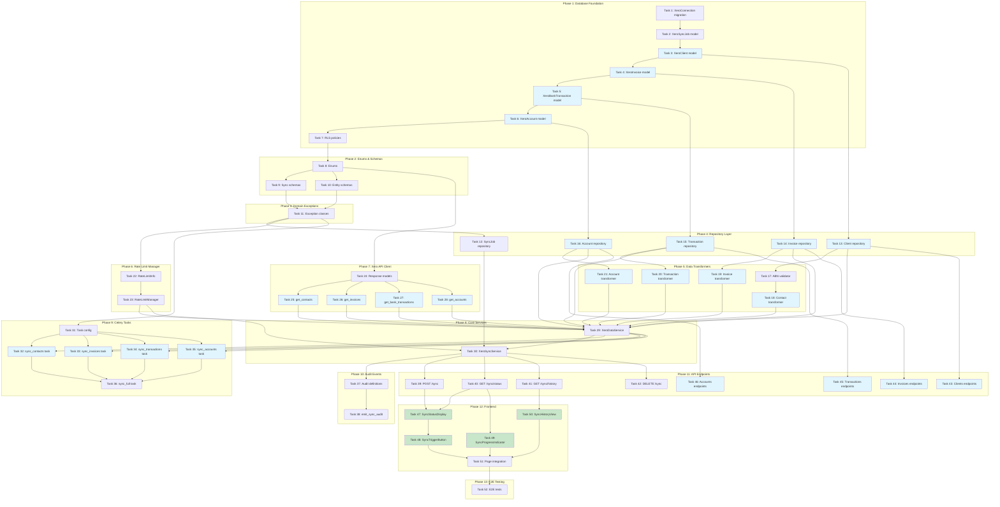

# Implementation Plan: Xero Data Sync

This document outlines the implementation tasks for synchronizing data from connected Xero organizations to Clairo. Each task follows TDD methodology (RED -> GREEN -> REFACTOR) and builds incrementally on previous tasks.

**Reference Documents:**
- Requirements: `/specs/004-xero-sync/spec.md`
- Design: `/specs/004-xero-sync/plan.md`
- Constitution: `/.specify/memory/constitution.md`

---

## Phase 1: Database Foundation

- [x] 1. Create database migration for XeroConnection sync timestamp extensions
  - Add `last_contacts_sync_at`, `last_invoices_sync_at`, `last_transactions_sync_at`, `last_accounts_sync_at`, `last_full_sync_at` columns to `xero_connections` table
  - Add `sync_in_progress` boolean column with default `false`
  - Write unit tests to verify migration runs successfully and columns are accessible
  - _Requirements: 6.4 (Incremental sync timestamps)_

- [x] 2. Create XeroSyncJob model and migration
  - [x] 2.1 Write unit tests for XeroSyncJob model
    - Test model instantiation with all required fields
    - Test enum validation for `sync_type` and `status`
    - Test progress_details JSONB field serialization
    - _Requirements: 5.2 (Sync job metadata tracking)_
  - [x] 2.2 Implement XeroSyncJob SQLAlchemy model
    - Create model with id, tenant_id, connection_id, sync_type, status fields
    - Add timing fields: started_at, completed_at
    - Add metrics fields: records_processed, records_created, records_updated, records_failed
    - Add error_message and progress_details JSONB field
    - Create indexes on connection_id and status
    - _Requirements: 5.1, 5.2_
  - [x] 2.3 Create Alembic migration for xero_sync_jobs table
    - Generate migration with proper foreign keys to tenants and xero_connections
    - Include composite index on (connection_id, status)
    - _Requirements: 5.2_

- [x] 3. Create XeroClient model and migration
  - [x] 3.1 Write unit tests for XeroClient model
    - Test model instantiation and field mapping
    - Test XeroContactType enum validation
    - Test unique constraint on (connection_id, xero_contact_id)
    - Test JSONB fields for addresses and phones
    - _Requirements: 1.2 (Contact field mapping)_
  - [x] 3.2 Implement XeroClient SQLAlchemy model
    - Create model with id, tenant_id, connection_id, xero_contact_id fields
    - Add contact fields: name, email, contact_number, abn, contact_type, is_active
    - Add JSONB fields: addresses, phones
    - Add xero_updated_at timestamp
    - Create indexes on tenant_id, connection_id, xero_contact_id
    - _Requirements: 1.2, 1.3, 1.4_
  - [x] 3.3 Create Alembic migration for xero_clients table
    - Include unique constraint on (connection_id, xero_contact_id)
    - Include composite index on (tenant_id, name)
    - _Requirements: 1.3, 9.5_

- [x] 4. Create XeroInvoice model and migration
  - [x] 4.1 Write unit tests for XeroInvoice model
    - Test model instantiation with all invoice fields
    - Test XeroInvoiceType and XeroInvoiceStatus enum validation
    - Test Decimal precision for monetary fields
    - Test JSONB line_items field structure
    - _Requirements: 2.2, 2.3_
  - [x] 4.2 Implement XeroInvoice SQLAlchemy model
    - Create model with id, tenant_id, connection_id, client_id, xero_invoice_id fields
    - Add invoice fields: invoice_number, invoice_type, status, issue_date, due_date
    - Add monetary fields: subtotal, tax_amount, total_amount, currency
    - Add JSONB line_items field for BAS-relevant data
    - Add xero_contact_id for reference tracking
    - _Requirements: 2.2, 2.3_
  - [x] 4.3 Create Alembic migration for xero_invoices table
    - Include unique constraint on (connection_id, xero_invoice_id)
    - Include indexes on (tenant_id, issue_date) and (tenant_id, invoice_type)
    - _Requirements: 2.4_

- [x] 5. Create XeroBankTransaction model and migration
  - [x] 5.1 Write unit tests for XeroBankTransaction model
    - Test model instantiation with transaction fields
    - Test XeroBankTransactionType enum validation
    - Test monetary field precision
    - Test JSONB line_items with GST data structure
    - _Requirements: 3.2, 3.3_
  - [x] 5.2 Implement XeroBankTransaction SQLAlchemy model
    - Create model with id, tenant_id, connection_id, client_id fields
    - Add transaction fields: xero_transaction_id, xero_contact_id, xero_bank_account_id
    - Add transaction_type, status, transaction_date, reference
    - Add monetary fields: subtotal, tax_amount, total_amount
    - Add JSONB line_items for GST details
    - _Requirements: 3.2, 3.3_
  - [x] 5.3 Create Alembic migration for xero_bank_transactions table
    - Include unique constraint on (connection_id, xero_transaction_id)
    - Include index on (tenant_id, transaction_date)
    - _Requirements: 3.4_

- [x] 6. Create XeroAccount model and migration
  - [x] 6.1 Write unit tests for XeroAccount model
    - Test model instantiation with account fields
    - Test XeroAccountClass enum validation
    - Test is_bas_relevant flag logic
    - _Requirements: 4.2, 4.3_
  - [x] 6.2 Implement XeroAccount SQLAlchemy model
    - Create model with id, tenant_id, connection_id, xero_account_id fields
    - Add account fields: account_code, account_name, account_type, account_class
    - Add default_tax_type, is_active, reporting_code, is_bas_relevant
    - _Requirements: 4.2, 4.3_
  - [x] 6.3 Create Alembic migration for xero_accounts table
    - Include unique constraint on (connection_id, xero_account_id)
    - Include index on (tenant_id, account_code)
    - _Requirements: 4.4_

- [x] 7. Create RLS policies for all sync tables
  - [x] 7.1 Write integration tests for RLS policy enforcement
    - Test that queries without tenant context return no rows
    - Test that queries with tenant context return only tenant's data
    - Test cross-tenant access prevention
    - _Requirements: 9.2, 9.3_
  - [x] 7.2 Create migration with RLS policies
    - Enable RLS on xero_sync_jobs, xero_clients, xero_invoices, xero_bank_transactions, xero_accounts
    - Create tenant_isolation policy using `app.current_tenant_id` session variable
    - Add no_update and no_delete rules for audit compliance
    - _Requirements: 9.1, 9.2, 9.3, 9.4_

---

## Phase 2: Enums and Schemas

- [x] 8. Create sync-related enums
  - [x] 8.1 Write unit tests for enum values
    - Test XeroSyncType enum values: contacts, invoices, bank_transactions, accounts, full
    - Test XeroSyncStatus enum values: pending, in_progress, completed, failed, cancelled
    - Test XeroContactType, XeroInvoiceType, XeroInvoiceStatus enums
    - Test XeroBankTransactionType and XeroAccountClass enums
    - _Requirements: 5.2 (sync_type), 1.2 (contact_type), 2.2 (invoice_type)_
  - [x] 8.2 Implement all enums in models.py
    - Create all enum classes as str subclasses for JSON serialization
    - Ensure enum values match Xero API responses
    - _Requirements: 1.2, 2.2, 3.2, 4.2_

- [x] 9. Create Pydantic schemas for sync operations
  - [x] 9.1 Write unit tests for request/response schemas
    - Test XeroSyncRequest validation with sync_type and force_full
    - Test XeroSyncJobResponse serialization
    - Test XeroSyncHistoryResponse pagination fields
    - _Requirements: 5.1, 8.1, 8.4_
  - [x] 9.2 Implement sync request/response schemas
    - Create XeroSyncRequest with sync_type and force_full fields
    - Create XeroSyncJobResponse with all job metadata
    - Create XeroSyncHistoryResponse with jobs list and pagination
    - Create SyncResult schema for task return values
    - _Requirements: 5.1, 5.6, 8.1_

- [x] 10. Create Pydantic schemas for synced entities
  - [x] 10.1 Write unit tests for entity schemas
    - Test XeroClientResponse with all mapped fields
    - Test XeroInvoiceResponse with line_items structure
    - Test XeroBankTransactionResponse with GST data
    - Test XeroAccountResponse with BAS relevance
    - _Requirements: 1.2, 2.2, 3.2, 4.2_
  - [x] 10.2 Implement entity response schemas
    - Create XeroClientResponse, XeroClientListResponse
    - Create XeroInvoiceResponse, XeroInvoiceListResponse
    - Create XeroBankTransactionResponse, XeroBankTransactionListResponse
    - Create XeroAccountResponse, XeroAccountListResponse
    - Include proper datetime serialization and Decimal handling
    - _Requirements: 1.2, 2.2, 3.2, 4.2_

---

## Phase 3: Domain Exceptions

- [x] 11. Create sync-specific domain exceptions
  - [x] 11.1 Write unit tests for exception classes
    - Test XeroSyncError base exception
    - Test XeroConnectionInactiveError with connection details
    - Test XeroSyncInProgressError with job reference
    - Test XeroRateLimitExceededError with wait_seconds attribute
    - Test XeroSyncJobNotFoundError with job_id
    - Test XeroDataTransformError with xero_id and entity_type
    - _Requirements: 10.1, 10.2, 7.5_
  - [x] 11.2 Implement exception classes in exceptions.py
    - Create XeroSyncError as base class
    - Create XeroConnectionInactiveError for inactive connection attempts
    - Create XeroSyncInProgressError for concurrent sync prevention
    - Create XeroRateLimitExceededError with wait_seconds
    - Create XeroSyncJobNotFoundError for missing jobs
    - Create XeroDataTransformError for transformation failures
    - _Requirements: 10.1, 10.2, 10.3, 7.5_

---

## Phase 4: Repository Layer

- [x] 12. Create XeroSyncJobRepository
  - [x] 12.1 Write unit tests for repository methods
    - Test create method with pending status
    - Test get_by_id with tenant context
    - Test get_active_for_connection returns in_progress/pending jobs
    - Test update_status method
    - Test update_progress method
    - Test list_by_connection with pagination
    - _Requirements: 5.2, 5.3, 5.6_
  - [x] 12.2 Implement XeroSyncJobRepository
    - Create method with automatic pending status
    - Get methods with tenant isolation
    - Update methods for status and progress
    - List method with ordering by created_at desc
    - _Requirements: 5.2, 5.3, 5.6, 5.7_

- [x] 13. Create XeroClientRepository
  - [x] 13.1 Write unit tests for repository methods
    - Test create and bulk_create methods
    - Test get_by_xero_contact_id method
    - Test upsert_from_xero method (create or update)
    - Test list_by_connection with filtering and pagination
    - Test soft_delete (set is_active=false)
    - _Requirements: 1.3, 1.4, 1.5_
  - [x] 13.2 Implement XeroClientRepository
    - Create single and bulk create methods
    - Implement upsert_from_xero with conflict handling
    - List with filters: is_active, search by name
    - Soft delete method for archived contacts
    - _Requirements: 1.3, 1.4, 1.5, 1.6_

- [x] 14. Create XeroInvoiceRepository
  - [x] 14.1 Write unit tests for repository methods
    - Test create and bulk_create methods
    - Test get_by_xero_invoice_id method
    - Test upsert_from_xero method
    - Test list_by_connection with date range and type filters
    - Test link_to_client method
    - _Requirements: 2.4, 2.5_
  - [x] 14.2 Implement XeroInvoiceRepository
    - Create single and bulk create methods
    - Implement upsert_from_xero with conflict handling
    - List with filters: client_id, invoice_type, status, date_from, date_to
    - Link invoice to XeroClient when contact is synced
    - _Requirements: 2.4, 2.5, 2.6_

- [x] 15. Create XeroBankTransactionRepository
  - [x] 15.1 Write unit tests for repository methods
    - Test create and bulk_create methods
    - Test get_by_xero_transaction_id method
    - Test upsert_from_xero method
    - Test list_by_connection with date range filters
    - _Requirements: 3.4_
  - [x] 15.2 Implement XeroBankTransactionRepository
    - Create single and bulk create methods
    - Implement upsert_from_xero with conflict handling
    - List with filters: client_id, transaction_type, date_from, date_to
    - _Requirements: 3.4, 3.5_

- [x] 16. Create XeroAccountRepository
  - [x] 16.1 Write unit tests for repository methods
    - Test create and bulk_create methods
    - Test get_by_xero_account_id method
    - Test upsert_from_xero method
    - Test list_by_connection with BAS relevance filter
    - _Requirements: 4.4_
  - [x] 16.2 Implement XeroAccountRepository
    - Create single and bulk create methods
    - Implement upsert_from_xero with conflict handling
    - List with filters: is_active, is_bas_relevant
    - _Requirements: 4.4, 4.5_

---

## Phase 5: Data Transformers

- [x] 17. Create ABN validator utility
  - [x] 17.1 Write unit tests for ABN validation
    - Test valid 11-digit ABN returns cleaned string
    - Test ABN with spaces is cleaned and validated
    - Test invalid length returns None
    - Test invalid checksum returns None
    - Test None input returns None
    - _Requirements: 1.7_
  - [x] 17.2 Implement validate_abn function
    - Remove non-digit characters
    - Check length is 11 digits
    - Implement Australian ABN checksum algorithm
    - Return cleaned ABN or None
    - _Requirements: 1.7_

- [x] 18. Create contact data transformer
  - [x] 18.1 Write unit tests for contact transformation
    - Test mapping all Xero contact fields to XeroClient fields
    - Test ContactStatus ACTIVE/ARCHIVED to is_active boolean
    - Test IsCustomer/IsSupplier to contact_type enum
    - Test ABN extraction from TaxNumber field
    - Test address and phone structure transformation
    - Test handling of missing optional fields
    - _Requirements: 1.2_
  - [x] 18.2 Implement ContactTransformer class
    - Create transform_contact method with Xero response input
    - Map all required fields per spec
    - Handle optional fields gracefully
    - Call validate_abn for ABN field
    - Return XeroClient-compatible dict
    - _Requirements: 1.2, 1.7_

- [x] 19. Create invoice data transformer
  - [x] 19.1 Write unit tests for invoice transformation
    - Test mapping all Xero invoice fields
    - Test Type ACCREC/ACCPAY to invoice_type enum
    - Test line_items transformation with BAS-relevant fields
    - Test Decimal precision for monetary fields
    - Test date parsing for issue_date and due_date
    - _Requirements: 2.2, 2.3_
  - [x] 19.2 Implement InvoiceTransformer class
    - Create transform_invoice method
    - Map invoice header fields
    - Transform line_items preserving account_code, tax_type, amounts
    - Handle currency code defaulting to AUD
    - _Requirements: 2.2, 2.3_

- [x] 20. Create bank transaction data transformer
  - [x] 20.1 Write unit tests for transaction transformation
    - Test mapping all Xero transaction fields
    - Test transaction_type mapping
    - Test line_items with GST data preservation
    - Test Decimal precision for amounts
    - _Requirements: 3.2, 3.3_
  - [x] 20.2 Implement BankTransactionTransformer class
    - Create transform_transaction method
    - Map transaction fields including bank_account_id
    - Transform line_items with account_code and tax details
    - _Requirements: 3.2, 3.3_

- [x] 21. Create account data transformer
  - [x] 21.1 Write unit tests for account transformation
    - Test mapping all Xero account fields
    - Test account_class enum mapping
    - Test is_bas_relevant calculation from tax_type
    - Test identification of PAYG and superannuation accounts
    - _Requirements: 4.2, 4.3_
  - [x] 21.2 Implement AccountTransformer class
    - Create transform_account method
    - Map account fields
    - Calculate is_bas_relevant based on GST tax types
    - Identify PAYG Withholding and Superannuation accounts
    - _Requirements: 4.2, 4.3_

---

## Phase 6: Rate Limit Manager

- [x] 22. Create RateLimitInfo data class
  - [x] 22.1 Write unit tests for RateLimitInfo
    - Test parsing from response headers
    - Test minute_remaining and daily_remaining extraction
    - Test retry_after parsing from 429 response
    - _Requirements: 7.1_
  - [x] 22.2 Implement RateLimitInfo class
    - Create dataclass with minute_remaining, daily_remaining, reset_at fields
    - Add classmethod from_response_headers for parsing
    - Add retry_after field for 429 handling
    - _Requirements: 7.1_

- [x] 23. Create RateLimitManager
  - [x] 23.1 Write unit tests for rate limit management
    - Test can_proceed returns True when limits OK
    - Test can_proceed returns False when minute limit < 5
    - Test get_wait_time calculation
    - Test update_from_response stores limits correctly
    - Test handle_429 with exponential backoff
    - Test daily limit warning threshold (< 100)
    - _Requirements: 7.2, 7.3, 7.4, 7.5_
  - [x] 23.2 Implement RateLimitManager class
    - Implement can_proceed checking minute and daily limits
    - Implement get_wait_time based on reset timestamp
    - Implement update_from_response to persist limits
    - Implement handle_429 with exponential backoff and jitter
    - Add logging for rate limit warnings
    - _Requirements: 7.2, 7.3, 7.4, 7.5, 7.6_

---

## Phase 7: Xero API Client Extensions

- [x] 24. Create Xero API response models
  - [x] 24.1 Write unit tests for response parsing
    - Test XeroContactResponse parsing from API JSON
    - Test XeroInvoiceResponse with nested line items
    - Test XeroBankTransactionResponse parsing
    - Test XeroAccountResponse parsing
    - Test pagination detection (has_more_pages)
    - _Requirements: 1.2, 2.2, 3.2, 4.2_
  - [x] 24.2 Implement Xero API response Pydantic models
    - Create XeroContactResponse matching Xero API schema
    - Create XeroInvoiceResponse with LineItem nested model
    - Create XeroBankTransactionResponse with LineItem model
    - Create XeroAccountResponse
    - Handle optional fields and date parsing
    - _Requirements: 1.2, 2.2, 3.2, 4.2_

- [x] 25. Extend XeroClient with get_contacts method
  - [x] 25.1 Write contract tests for Contacts API
    - Mock Xero Contacts API response
    - Test pagination handling (page parameter)
    - Test If-Modified-Since header usage
    - Test rate limit header extraction
    - Test error response handling
    - _Requirements: 1.1, 6.2, 7.1_
  - [x] 25.2 Implement get_contacts method
    - Add pagination support with page parameter
    - Add modified_since parameter for incremental sync
    - Parse rate limit headers from response
    - Return tuple of (contacts, has_more_pages, rate_limit_info)
    - _Requirements: 1.1, 6.2_

- [x] 26. Extend XeroClient with get_invoices method
  - [x] 26.1 Write contract tests for Invoices API
    - Mock Xero Invoices API response with line items
    - Test pagination handling
    - Test If-Modified-Since header
    - Test filtering by status if supported
    - _Requirements: 2.1, 6.2_
  - [x] 26.2 Implement get_invoices method
    - Add pagination support
    - Add modified_since parameter
    - Include line items in response
    - Return tuple of (invoices, has_more_pages, rate_limit_info)
    - _Requirements: 2.1, 6.2_

- [x] 27. Extend XeroClient with get_bank_transactions method
  - [x] 27.1 Write contract tests for BankTransactions API
    - Mock Xero BankTransactions API response
    - Test pagination handling
    - Test If-Modified-Since header
    - _Requirements: 3.1, 6.2_
  - [x] 27.2 Implement get_bank_transactions method
    - Add pagination support
    - Add modified_since parameter
    - Include line items in response
    - Return tuple of (transactions, has_more_pages, rate_limit_info)
    - _Requirements: 3.1, 6.2_

- [x] 28. Extend XeroClient with get_accounts method
  - [x] 28.1 Write contract tests for Accounts API
    - Mock Xero Accounts API response
    - Test no pagination needed for accounts
    - Test rate limit header extraction
    - _Requirements: 4.1_
  - [x] 28.2 Implement get_accounts method
    - No pagination needed for chart of accounts
    - Return tuple of (accounts, rate_limit_info)
    - _Requirements: 4.1_

---

## Phase 8: Core Sync Services

- [x] 29. Create XeroDataService
  - [x] 29.1 Write unit tests for sync_contacts
    - Test successful contact sync creates/updates XeroClient records
    - Test incremental sync uses modified_since
    - Test pagination handling fetches all pages
    - Test rate limit compliance with pauses
    - Test partial failure continues processing
    - Test returns SyncResult with accurate counts
    - _Requirements: 1.1, 1.3, 1.4, 6.2, 7.3, 10.1_
  - [x] 29.2 Implement sync_contacts method
    - Fetch contacts with pagination loop
    - Transform using ContactTransformer
    - Bulk upsert via XeroClientRepository
    - Handle rate limits via RateLimitManager
    - Track and return SyncResult
    - _Requirements: 1.1-1.7_
  - [x] 29.3 Write unit tests for sync_invoices
    - Test invoice sync creates/updates XeroInvoice records
    - Test client linking via xero_contact_id
    - Test missing contact queues for sync (Req 2.5)
    - Test line_items are preserved
    - _Requirements: 2.1, 2.4, 2.5_
  - [x] 29.4 Implement sync_invoices method
    - Fetch invoices with pagination
    - Transform using InvoiceTransformer
    - Link to XeroClient if exists
    - Bulk upsert via XeroInvoiceRepository
    - _Requirements: 2.1-2.6_
  - [x] 29.5 Write unit tests for sync_bank_transactions
    - Test transaction sync creates/updates records
    - Test client linking when contact present
    - Test line_items GST data preserved
    - _Requirements: 3.1, 3.4_
  - [x] 29.6 Implement sync_bank_transactions method
    - Fetch transactions with pagination
    - Transform using BankTransactionTransformer
    - Bulk upsert via XeroBankTransactionRepository
    - _Requirements: 3.1-3.5_
  - [x] 29.7 Write unit tests for sync_accounts
    - Test account sync creates/updates records
    - Test is_bas_relevant flag calculation
    - _Requirements: 4.1, 4.3_
  - [x] 29.8 Implement sync_accounts method
    - Fetch all accounts (no pagination)
    - Transform using AccountTransformer
    - Bulk upsert via XeroAccountRepository
    - _Requirements: 4.1-4.5_

- [x] 30. Create XeroSyncService
  - [x] 30.1 Write unit tests for initiate_sync
    - Test validates connection is active
    - Test checks no sync already in progress
    - Test checks rate limits before starting
    - Test creates XeroSyncJob with pending status
    - Test queues Celery task
    - Test returns job_id immediately
    - _Requirements: 5.1, 5.7, 7.6, 10.6_
  - [x] 30.2 Implement initiate_sync method
    - Validate XeroConnection.status is ACTIVE
    - Check for existing in_progress sync
    - Verify rate limits via RateLimitManager
    - Create XeroSyncJob record
    - Queue appropriate Celery task
    - Return job with pending status
    - _Requirements: 5.1, 5.7, 10.6_
  - [x] 30.3 Write unit tests for get_sync_status
    - Test returns current job status
    - Test includes progress metrics
    - Test calculates estimated completion for in_progress
    - _Requirements: 5.6, 8.2_
  - [x] 30.4 Implement get_sync_status method
    - Fetch XeroSyncJob by id
    - Build XeroSyncJobResponse
    - Calculate estimated completion if in_progress
    - _Requirements: 5.6, 8.2_
  - [x] 30.5 Write unit tests for get_sync_history
    - Test returns paginated job list
    - Test orders by created_at descending
    - Test includes total count
    - _Requirements: 8.4_
  - [x] 30.6 Implement get_sync_history method
    - Fetch jobs for connection with pagination
    - Return XeroSyncHistoryResponse
    - _Requirements: 8.4_
  - [x] 30.7 Write unit tests for cancel_sync
    - Test cancels pending job
    - Test marks in_progress job as cancelled
    - Test clears sync_in_progress flag on connection
    - _Requirements: 5.4_
  - [x] 30.8 Implement cancel_sync method
    - Verify job exists and is cancellable
    - Update status to cancelled
    - Clear connection.sync_in_progress
    - _Requirements: 5.4_

---

## Phase 9: Celery Tasks

- [x] 31. Configure Celery task settings
  - [x] 31.1 Write unit tests for task configuration
    - Test retry configuration values
    - Test backoff calculation
    - Test autoretry exception list
    - _Requirements: 10.4, NFR Reliability_
  - [x] 31.2 Implement SYNC_TASK_CONFIG
    - Set max_retries to 3
    - Set retry_backoff with max 600 seconds
    - Configure autoretry_for exceptions
    - Add jitter to prevent thundering herd
    - _Requirements: 10.4, NFR Reliability_

- [x] 32. Create sync_xero_contacts Celery task
  - [x] 32.1 Write integration tests for contacts task
    - Test sets tenant context correctly
    - Test refreshes token if needed
    - Test calls XeroDataService.sync_contacts
    - Test updates job status to in_progress then completed
    - Test handles failure and updates job status
    - Test creates audit events
    - _Requirements: 5.3, 5.4, 5.5, 9.3_
  - [x] 32.2 Implement sync_xero_contacts task
    - Set tenant context via PostgreSQL session variable
    - Ensure valid token (refresh if needed)
    - Get last_contacts_sync_at for incremental
    - Call XeroDataService.sync_contacts
    - Update XeroSyncJob progress and status
    - Update XeroConnection.last_contacts_sync_at
    - Emit audit events
    - _Requirements: 5.3, 5.4, 5.5, 6.1, 6.4_

- [x] 33. Create sync_xero_invoices Celery task
  - [x] 33.1 Write integration tests for invoices task
    - Test similar patterns to contacts task
    - Test updates last_invoices_sync_at
    - _Requirements: 5.3, 5.5_
  - [x] 33.2 Implement sync_xero_invoices task
    - Similar structure to contacts task
    - Use last_invoices_sync_at for incremental
    - _Requirements: 5.3, 5.5, 6.4_

- [x] 34. Create sync_xero_bank_transactions Celery task
  - [x] 34.1 Write integration tests for transactions task
    - Test similar patterns to contacts task
    - Test updates last_transactions_sync_at
    - _Requirements: 5.3, 5.5_
  - [x] 34.2 Implement sync_xero_bank_transactions task
    - Similar structure to contacts task
    - Use last_transactions_sync_at for incremental
    - _Requirements: 5.3, 5.5, 6.4_

- [x] 35. Create sync_xero_accounts Celery task
  - [x] 35.1 Write integration tests for accounts task
    - Test similar patterns to contacts task
    - Test updates last_accounts_sync_at
    - _Requirements: 5.3, 5.5_
  - [x] 35.2 Implement sync_xero_accounts task
    - Similar structure to contacts task
    - Use last_accounts_sync_at for incremental
    - _Requirements: 5.3, 5.5, 6.4_

- [x] 36. Create sync_xero_full orchestration task
  - [x] 36.1 Write integration tests for full sync task
    - Test syncs entities in order: accounts, contacts, invoices, transactions
    - Test aggregates results from all sub-syncs
    - Test updates job progress after each entity type
    - Test handles partial failure (some entity types fail)
    - Test updates last_full_sync_at on success
    - _Requirements: 5.1, 5.3, 5.5, 6.5_
  - [x] 36.2 Implement sync_xero_full task
    - Orchestrate sub-sync tasks in sequence
    - Update progress_details after each entity
    - Aggregate SyncResult totals
    - Handle partial failures gracefully
    - Update all timestamp fields on completion
    - _Requirements: 5.1, 5.3, 5.5, 6.4, 6.5_

---

## Phase 10: Audit Events

- [x] 37. Create sync audit event definitions
  - [x] 37.1 Write unit tests for audit event configuration
    - Test SYNC_AUDIT_EVENTS dictionary structure
    - Test all required event types are defined
    - _Requirements: NFR Observability_
  - [x] 37.2 Implement SYNC_AUDIT_EVENTS configuration
    - Define xero.sync.started event
    - Define xero.sync.completed event
    - Define xero.sync.failed event
    - Define xero.sync.cancelled event
    - Define xero.sync.rate_limited event
    - Define xero.client.created/updated/archived events
    - Define xero.invoice.created/updated events
    - Define xero.transaction.created events
    - Define xero.account.created events
    - _Requirements: NFR Observability_

- [x] 38. Create emit_sync_audit helper function
  - [x] 38.1 Write unit tests for audit emission
    - Test emits correct event type
    - Test includes job metadata
    - Test masks sensitive data
    - _Requirements: NFR Security_
  - [x] 38.2 Implement emit_sync_audit function
    - Build event payload from XeroSyncJob
    - Include sync metrics in new_values
    - Call AuditService.log_event
    - _Requirements: NFR Observability_

---

## Phase 11: API Endpoints

- [x] 39. Create sync initiation endpoint
  - [x] 39.1 Write integration tests for POST /sync
    - Test returns 202 Accepted with job_id
    - Test validates connection exists
    - Test returns 400 for inactive connection
    - Test returns 409 for sync in progress
    - Test returns 429 for rate limit exceeded
    - Test respects tenant isolation
    - _Requirements: 5.1, 8.1_
  - [x] 39.2 Implement POST /connections/{id}/sync endpoint
    - Parse XeroSyncRequest body
    - Call XeroSyncService.initiate_sync
    - Return 202 with job_id and status
    - Handle domain exceptions with appropriate HTTP status
    - _Requirements: 5.1, 8.1_

- [x] 40. Create sync status endpoint
  - [x] 40.1 Write integration tests for GET /sync/status
    - Test returns current job status
    - Test includes progress metrics
    - Test returns 404 for unknown job
    - _Requirements: 5.6, 8.2_
  - [x] 40.2 Implement GET /connections/{id}/sync/status endpoint
    - Call XeroSyncService.get_sync_status
    - Return XeroSyncJobResponse
    - _Requirements: 5.6, 8.2_

- [x] 41. Create sync history endpoint
  - [x] 41.1 Write integration tests for GET /sync/history
    - Test returns paginated job list
    - Test respects limit and offset parameters
    - Test returns total count
    - _Requirements: 8.4_
  - [x] 41.2 Implement GET /connections/{id}/sync/history endpoint
    - Parse pagination parameters
    - Call XeroSyncService.get_sync_history
    - Return XeroSyncHistoryResponse
    - _Requirements: 8.4_

- [x] 42. Create sync cancel endpoint
  - [x] 42.1 Write integration tests for DELETE /sync/{job_id}
    - Test cancels pending job
    - Test returns 204 No Content
    - Test returns 404 for unknown job
    - Test returns 400 for already completed job
    - _Requirements: 5.4_
  - [x] 42.2 Implement DELETE /connections/{id}/sync/{job_id} endpoint
    - Call XeroSyncService.cancel_sync
    - Return 204 on success
    - _Requirements: 5.4_

- [x] 43. Create synced clients endpoints
  - [x] 43.1 Write integration tests for clients endpoints
    - Test GET /clients returns paginated list
    - Test filters by connection_id, is_active, search
    - Test GET /clients/{id} returns single client
    - Test returns 404 for unknown client
    - Test respects tenant isolation
    - _Requirements: 8.1_
  - [x] 43.2 Implement clients endpoints
    - GET /clients with query parameters
    - GET /clients/{id} with path parameter
    - Use XeroClientRepository for data access
    - _Requirements: 8.1_

- [x] 44. Create synced invoices endpoints
  - [x] 44.1 Write integration tests for invoices endpoints
    - Test GET /invoices returns paginated list
    - Test filters by connection_id, client_id, invoice_type, status, date range
    - Test GET /invoices/{id} returns single invoice with line_items
    - _Requirements: 8.1_
  - [x] 44.2 Implement invoices endpoints
    - GET /invoices with query parameters
    - GET /invoices/{id} with path parameter
    - Use XeroInvoiceRepository for data access
    - _Requirements: 8.1_

- [x] 45. Create synced transactions endpoints
  - [x] 45.1 Write integration tests for transactions endpoints
    - Test GET /transactions returns paginated list
    - Test filters by connection_id, client_id, transaction_type, date range
    - Test GET /transactions/{id} returns single transaction
    - _Requirements: 8.1_
  - [x] 45.2 Implement transactions endpoints
    - GET /transactions with query parameters
    - GET /transactions/{id} with path parameter
    - Use XeroBankTransactionRepository for data access
    - _Requirements: 8.1_

- [x] 46. Create synced accounts endpoints
  - [x] 46.1 Write integration tests for accounts endpoints
    - Test GET /accounts returns list (no pagination needed)
    - Test filters by connection_id, is_active, is_bas_relevant
    - _Requirements: 8.1_
  - [x] 46.2 Implement accounts endpoints
    - GET /accounts with query parameters
    - Use XeroAccountRepository for data access
    - _Requirements: 8.1_

---

## Phase 12: Frontend Integration

- [x] 47. Create sync status display component
  - [x] 47.1 Write component unit tests
    - Test displays idle state correctly
    - Test displays syncing state with progress
    - Test displays error state with retry option
    - Test displays last sync timestamp
    - Test shows stale data warning (> 24 hours)
    - _Requirements: 8.1, 8.2, 8.3, 8.5_
  - [x] 47.2 Implement SyncStatusDisplay component
    - Create React component with sync state props
    - Display appropriate UI for each status
    - Show progress bar when syncing
    - Show last sync timestamps per entity type
    - Show stale data warning indicator
    - _Requirements: 8.1, 8.2, 8.3, 8.5_

- [x] 48. Create sync trigger button component
  - [x] 48.1 Write component unit tests
    - Test button is enabled when no sync in progress
    - Test button is disabled during sync
    - Test calls sync API on click
    - Test shows loading state during API call
    - _Requirements: 8.1_
  - [x] 48.2 Implement SyncTriggerButton component
    - Create button with sync icon
    - Disable during active sync
    - Call POST /sync API on click
    - Show loading spinner during request
    - Handle error responses
    - _Requirements: 8.1_

- [x] 49. Create sync progress indicator component
  - [x] 49.1 Write component unit tests
    - Test shows records processed / estimated total
    - Test shows current entity type being synced
    - Test updates progress in real-time (polling)
    - _Requirements: 8.2_
  - [x] 49.2 Implement SyncProgressIndicator component
    - Create progress bar component
    - Display current entity type
    - Poll GET /sync/status for updates
    - Calculate and display estimated completion
    - _Requirements: 8.2_

- [x] 50. Create sync history view component
  - [x] 50.1 Write component unit tests
    - Test displays list of recent sync jobs
    - Test shows job type, start/end time, status
    - Test shows records affected
    - Test pagination works correctly
    - _Requirements: 8.4_
  - [x] 50.2 Implement SyncHistoryView component
    - Create table/list component for sync jobs
    - Display sync type, timestamps, status
    - Show records created/updated/failed
    - Implement pagination controls
    - _Requirements: 8.4_

- [x] 51. Integrate sync components into Xero connection page
  - [x] 51.1 Write integration tests for connection page
    - Test sync status displays for each connection
    - Test sync button triggers sync correctly
    - Test progress updates during sync
    - Test history is accessible
    - _Requirements: 8.1, 8.2, 8.4_
  - [x] 51.2 Integrate all sync components
    - Add SyncStatusDisplay to connection card
    - Add SyncTriggerButton with dropdown for sync type
    - Add SyncProgressIndicator modal during sync
    - Add link to SyncHistoryView page
    - Wire up API calls with TanStack Query
    - _Requirements: 8.1, 8.2, 8.4_

---

## Phase 13: End-to-End Testing

- [x] 52. Create automated E2E tests for sync workflow
  - [x] 52.1 Write E2E test for full sync flow
    - Test user can initiate full sync from UI
    - Test progress indicator shows updates
    - Test completion updates UI correctly
    - Test synced data appears in client list
    - _Requirements: All (E2E validation)_
  - [x] 52.2 Write E2E test for incremental sync
    - Test incremental sync after initial full sync
    - Test only modified records are updated
    - Test sync timestamps are updated correctly
    - _Requirements: 6.1, 6.2, 6.4_
  - [x] 52.3 Write E2E test for error handling
    - Test sync failure displays error message
    - Test retry option works correctly
    - Test partial failure shows appropriate status
    - _Requirements: 8.3, 10.1, 10.2_
  - [x] 52.4 Write E2E test for rate limit handling
    - Test rate limit warning displays
    - Test sync pauses and resumes correctly
    - _Requirements: 7.3, 7.4_

---

## Tasks Dependency Diagram

**Legend:**
- Blue shaded tasks can be executed in parallel within their group
- Green shaded tasks are frontend tasks that can be developed in parallel

---

**Document Version**: 1.1.0
**Created**: 2025-12-28
**Completed**: 2025-12-29
**Author**: Specify AI Agent
**Review Status**: COMPLETE

---

## Completion Notes

All 52 tasks across 13 phases have been implemented and tested. Key bug fixes applied during final testing:

1. **Celery Configuration**: Added `CELERY_BROKER_URL` and `CELERY_RESULT_BACKEND` to backend container
2. **Model Imports**: Imported auth models in tasks module for SQLAlchemy mapper resolution
3. **SET LOCAL Syntax**: Fixed asyncpg parameter binding for tenant context
4. **XeroSettings**: Added missing `api_url` field
5. **RateLimitState**: Added missing `last_request_at` field
6. **Rate Limit Logic**: Fixed false positive rate limit detection
7. **Sync Timestamps**: Added fields to schema and update logic in tasks
8. **API Response**: Added `last_full_sync_at` to connection list response
9. **Frontend Polling**: Fixed infinite loop when sync completes
