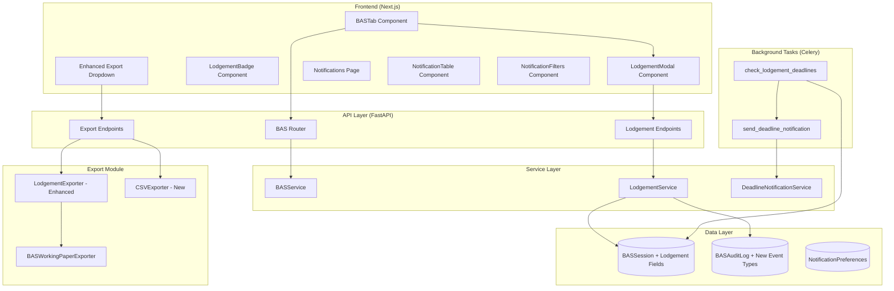
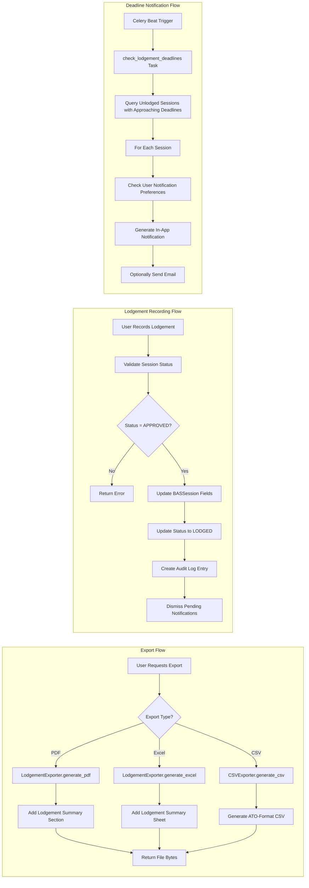
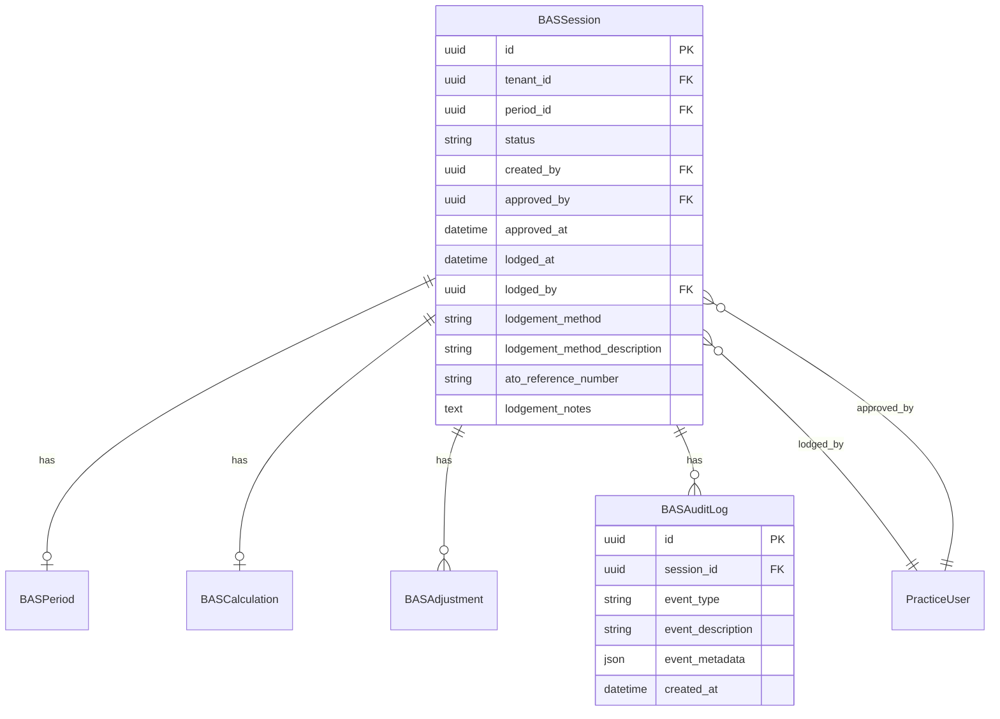
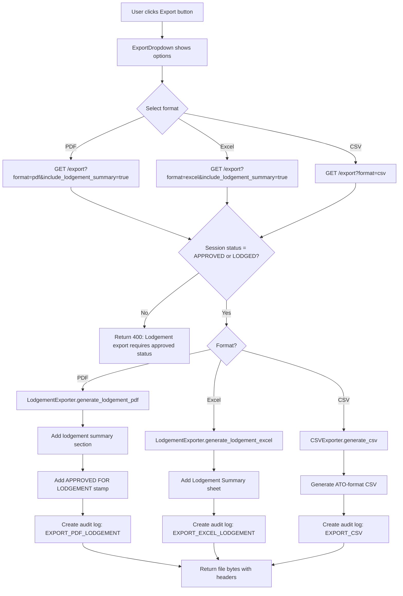
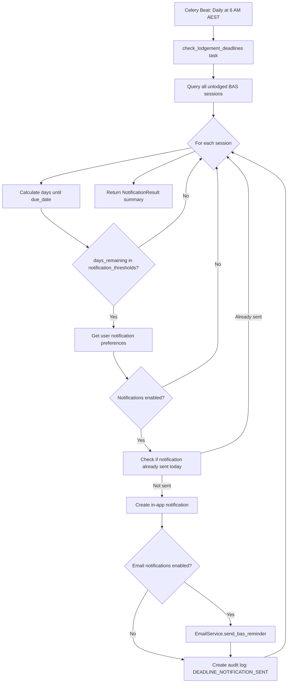
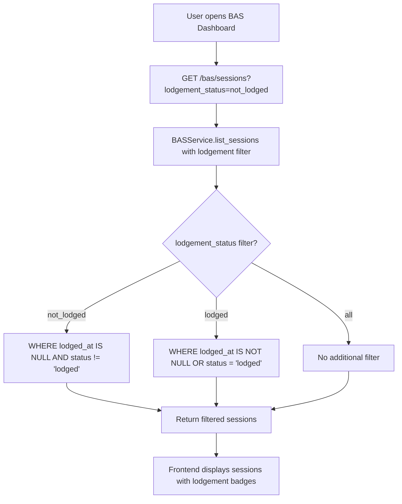

# Design Document: Interim Lodgement

## Overview

This design document details the technical implementation for the Interim Lodgement feature (Spec 011) in Clairo. The feature enhances the existing BAS workflow by adding ATO-compliant export formatting, CSV export capability, lodgement status tracking, and deadline notifications.

### Design Goals

1. **Enhance existing BAS exports** with ATO-compliant lodgement summary sections (PDF and Excel)
2. **Add CSV export format** for data transfer to other systems
3. **Extend BASSession model** with lodgement tracking fields
4. **Integrate deadline notifications** using the existing notification system
5. **Update frontend BAS components** with lodgement UI elements

### Key Constraints

- Must extend existing `BASWorkingPaperExporter` class (not replace)
- Must use existing `BASSessionStatus.LODGED` status
- Must integrate with existing Celery task scheduler for notifications
- Must maintain backward compatibility with current export functionality
- All amounts in lodgement exports must be rounded to whole dollars per ATO requirements

---

## Architecture Design

### System Architecture Diagram



### Data Flow Diagram



---

## Component Design

### Component 1: LodgementService

**Location:** `backend/app/modules/bas/lodgement_service.py`

**Responsibilities:**
- Record lodgement details for approved BAS sessions
- Update ATO reference numbers after initial lodgement
- Validate lodgement method requirements
- Create audit log entries for lodgement events

**Interface:**

```python
class LodgementService:
    """Service for BAS lodgement operations."""

    def __init__(self, session: AsyncSession):
        self.session = session
        self.repo = BASRepository(session)

    async def record_lodgement(
        self,
        session_id: UUID,
        lodged_by: UUID,
        tenant_id: UUID,
        lodgement_date: date,
        lodgement_method: LodgementMethod,
        lodgement_method_description: str | None = None,
        ato_reference_number: str | None = None,
        lodgement_notes: str | None = None,
    ) -> BASSessionResponse:
        """Record lodgement for an approved BAS session."""
        ...

    async def update_lodgement_details(
        self,
        session_id: UUID,
        user_id: UUID,
        tenant_id: UUID,
        ato_reference_number: str | None = None,
        lodgement_notes: str | None = None,
    ) -> BASSessionResponse:
        """Update lodgement details (reference number, notes only)."""
        ...

    async def get_lodgement_summary(
        self,
        session_id: UUID,
    ) -> LodgementSummaryResponse:
        """Get lodgement summary for a session."""
        ...
```

**Dependencies:**
- `BASRepository` - Database operations
- `BASAuditLog` - Audit trail creation

---

### Component 2: LodgementExporter (Enhanced BASWorkingPaperExporter)

**Location:** `backend/app/modules/bas/lodgement_exporter.py`

**Responsibilities:**
- Extend existing PDF export with ATO-compliant lodgement summary section
- Extend existing Excel export with dedicated "Lodgement Summary" sheet
- Round all amounts to whole dollars per ATO requirements
- Add "APPROVED FOR LODGEMENT" watermark/stamp

**Interface:**

```python
class LodgementExporter(BASWorkingPaperExporter):
    """Enhanced BAS exporter with ATO-compliant lodgement summaries."""

    def __init__(
        self,
        session: BASSession,
        period: BASPeriod,
        calculation: BASCalculation | None,
        organization_name: str,
        abn: str | None = None,
    ):
        super().__init__(session, period, calculation, organization_name)
        self.abn = abn

    def generate_lodgement_pdf(self) -> bytes:
        """Generate PDF with ATO-compliant lodgement summary section."""
        ...

    def generate_lodgement_excel(self) -> bytes:
        """Generate Excel with dedicated Lodgement Summary sheet."""
        ...

    def _build_lodgement_summary_data(self) -> list[LodgementField]:
        """Build list of BAS fields formatted for ATO portal entry."""
        ...

    def _round_to_whole_dollars(self, amount: Decimal) -> int:
        """Round amount to whole dollars per ATO requirements."""
        ...
```

**Dependencies:**
- `BASWorkingPaperExporter` - Base export functionality (inheritance)
- `reportlab` - PDF generation
- `openpyxl` - Excel generation

---

### Component 3: CSVExporter (New)

**Location:** `backend/app/modules/bas/csv_exporter.py`

**Responsibilities:**
- Generate CSV export with ATO field codes and values
- Include metadata rows (client name, ABN, period, export date)
- Format for Excel compatibility (UTF-8, proper quoting)

**Interface:**

```python
class CSVExporter:
    """CSV exporter for BAS data transfer."""

    def __init__(
        self,
        session: BASSession,
        period: BASPeriod,
        calculation: BASCalculation,
        organization_name: str,
        abn: str | None = None,
    ):
        ...

    def generate_csv(self) -> bytes:
        """Generate CSV file as bytes.

        Returns:
            UTF-8 encoded CSV content with:
            - Metadata rows at top
            - Field Code, Field Description, Amount columns
            - Whole dollar amounts (no currency symbols)
        """
        ...
```

**Dependencies:**
- Python `csv` module
- `io.StringIO` for buffer handling

---

### Component 4: DeadlineNotificationService

**Location:** `backend/app/modules/bas/deadline_notification_service.py`

**Responsibilities:**
- Query BAS sessions with approaching deadlines
- Check user notification preferences
- Generate in-app notifications
- Optionally trigger email notifications via existing EmailService

**Interface:**

```python
class DeadlineNotificationService:
    """Service for BAS deadline notifications."""

    def __init__(self, session: AsyncSession):
        self.session = session
        self.email_service = get_email_service()

    async def get_approaching_deadlines(
        self,
        tenant_id: UUID,
        days_ahead: int = 7,
    ) -> list[ApproachingDeadline]:
        """Get BAS sessions with deadlines approaching within specified days."""
        ...

    async def generate_deadline_notifications(
        self,
        check_date: date | None = None,
    ) -> NotificationResult:
        """Generate notifications for all approaching deadlines.

        Called by scheduled Celery task.
        """
        ...

    async def dismiss_notifications_for_session(
        self,
        session_id: UUID,
    ) -> int:
        """Dismiss pending deadline notifications when BAS is lodged."""
        ...
```

**Dependencies:**
- `BASRepository` - Query sessions
- `EmailService` - Send email notifications
- Notification storage (in-app notifications table)

---

### Component 5: NotificationsPage

**Location:** `frontend/src/app/(protected)/notifications/page.tsx`

**Responsibilities:**
- Display paginated table of all notifications
- Provide filtering by status, type, priority, client, date range
- Provide full-text search across notification content
- Support sorting by priority, due date, created date, client name
- Enable bulk actions (mark as read, dismiss)
- Display summary statistics (unread, high priority, overdue counts)
- Navigate to relevant entities on notification click

**Interface:**

```typescript
interface NotificationsPageProps {
  // Page component - no external props needed
}

// Query parameters for filtering/sorting
interface NotificationQueryParams {
  status?: 'all' | 'unread' | 'read';
  type?: NotificationType[];
  priority?: 'high' | 'medium' | 'low' | 'all';
  clientId?: string;
  dateFrom?: string;
  dateTo?: string;
  search?: string;
  sortBy?: 'priority' | 'due_date' | 'created_at' | 'client_name';
  sortOrder?: 'asc' | 'desc';
  page?: number;
  limit?: number;
}

// Summary statistics
interface NotificationSummary {
  totalUnread: number;
  highPriority: number;
  overdue: number;
  dueThisWeek: number;
}
```

**Dependencies:**
- React hooks, TanStack Query
- Notification API client functions
- NotificationTable component
- NotificationFilters component

---

### Component 6: NotificationTable

**Location:** `frontend/src/components/notifications/NotificationTable.tsx`

**Responsibilities:**
- Render notifications in a sortable, selectable table
- Display priority indicators with color coding
- Show notification type icons
- Display client name, due date, days remaining
- Enable row selection for bulk actions
- Handle click-to-navigate to entity

**Interface:**

```typescript
interface NotificationTableProps {
  notifications: Notification[];
  isLoading: boolean;
  selectedIds: Set<string>;
  onSelectionChange: (ids: Set<string>) => void;
  onNotificationClick: (notification: Notification) => void;
  sortBy: string;
  sortOrder: 'asc' | 'desc';
  onSort: (column: string) => void;
}
```

---

### Component 7: NotificationFilters

**Location:** `frontend/src/components/notifications/NotificationFilters.tsx`

**Responsibilities:**
- Render filter controls (dropdowns, search box, date pickers)
- Emit filter change events to parent
- Display active filter count/chips

**Interface:**

```typescript
interface NotificationFiltersProps {
  filters: NotificationQueryParams;
  onFiltersChange: (filters: NotificationQueryParams) => void;
  clients: { id: string; name: string }[];
}
```

---

### Component 8: Extended Notification API Endpoints

**Location:** `backend/app/modules/notifications/router.py`

**New Endpoints:**

```python
# List notifications with filtering, search, pagination
@router.get(
    "",
    response_model=NotificationListResponse,
    summary="List notifications with filtering",
)
async def list_notifications(
    db: Annotated[AsyncSession, Depends(get_db)],
    user: Annotated[PracticeUser, Depends(get_current_practice_user)],
    status: Literal["all", "unread", "read"] = Query("all"),
    notification_type: list[str] | None = Query(None),
    priority: Literal["all", "high", "medium", "low"] = Query("all"),
    client_id: UUID | None = Query(None),
    date_from: date | None = Query(None),
    date_to: date | None = Query(None),
    search: str | None = Query(None, max_length=100),
    sort_by: Literal["priority", "due_date", "created_at", "client_name"] = Query("priority"),
    sort_order: Literal["asc", "desc"] = Query("desc"),
    limit: int = Query(50, ge=1, le=100),
    offset: int = Query(0, ge=0),
) -> NotificationListResponse:
    ...

# Get notification summary statistics
@router.get(
    "/summary",
    response_model=NotificationSummaryResponse,
    summary="Get notification summary statistics",
)
async def get_notification_summary(
    db: Annotated[AsyncSession, Depends(get_db)],
    user: Annotated[PracticeUser, Depends(get_current_practice_user)],
) -> NotificationSummaryResponse:
    ...

# Bulk mark as read
@router.post(
    "/bulk/read",
    response_model=BulkActionResponse,
    summary="Mark multiple notifications as read",
)
async def bulk_mark_read(
    request: BulkNotificationRequest,
    db: Annotated[AsyncSession, Depends(get_db)],
    user: Annotated[PracticeUser, Depends(get_current_practice_user)],
) -> BulkActionResponse:
    ...

# Bulk dismiss
@router.post(
    "/bulk/dismiss",
    response_model=BulkActionResponse,
    summary="Dismiss multiple notifications",
)
async def bulk_dismiss(
    request: BulkNotificationRequest,
    db: Annotated[AsyncSession, Depends(get_db)],
    user: Annotated[PracticeUser, Depends(get_current_practice_user)],
) -> BulkActionResponse:
    ...
```

---

### Component 9: BAS Lodgement Workboard Page

**Location:** `frontend/src/app/(protected)/lodgements/page.tsx`

**Responsibilities:**
- Display aggregated view of all BAS periods across all clients
- Show lodgement deadlines with days remaining
- Support filtering by status, deadline urgency, quarter, financial year
- Support sorting by due date, client name, status
- Provide quick access to individual client BAS pages
- Display summary statistics (overdue, due this week, upcoming)

**Interface:**

```typescript
interface LodgementsPageProps {
  // Page component - no external props needed
}

// Query parameters for filtering/sorting
interface LodgementQueryParams {
  status?: 'all' | 'overdue' | 'due_this_week' | 'upcoming' | 'lodged';
  urgency?: 'overdue' | 'critical' | 'warning' | 'normal' | 'all';
  quarter?: 'Q1' | 'Q2' | 'Q3' | 'Q4' | 'all';
  financialYear?: string;  // e.g., "2024-25"
  search?: string;
  sortBy?: 'due_date' | 'client_name' | 'status' | 'days_remaining';
  sortOrder?: 'asc' | 'desc';
  page?: number;
  limit?: number;
}

// Summary statistics
interface LodgementWorkboardSummary {
  total_periods: int;
  overdue: int;
  due_this_week: int;
  due_this_month: int;
  lodged: int;
  not_started: int;
}

// Workboard row
interface LodgementWorkboardItem {
  connection_id: string;
  client_name: string;
  period_id: string;
  period_display_name: string;
  quarter: string;
  financial_year: string;
  due_date: string;
  days_remaining: int;
  session_id: string | null;
  session_status: string | null;
  is_lodged: bool;
  lodged_at: string | null;
  urgency: 'overdue' | 'critical' | 'warning' | 'normal';
}
```

**Dependencies:**
- React hooks, apiClient
- LodgementWorkboardTable component
- LodgementWorkboardFilters component

---

### Component 10: Backend Lodgement Workboard API

**Location:** `backend/app/modules/bas/router.py`

**New Endpoints:**

```python
# Get lodgement workboard data
@router.get(
    "/workboard",
    response_model=LodgementWorkboardResponse,
    summary="Get lodgement workboard data",
    description="Get aggregated BAS periods across all clients with deadline information.",
)
async def get_lodgement_workboard(
    db: Annotated[AsyncSession, Depends(get_db)],
    user: Annotated[PracticeUser, Depends(get_current_practice_user)],
    status: Literal["all", "overdue", "due_this_week", "upcoming", "lodged"] = Query("all"),
    urgency: Literal["all", "overdue", "critical", "warning", "normal"] = Query("all"),
    quarter: Literal["all", "Q1", "Q2", "Q3", "Q4"] = Query("all"),
    financial_year: str | None = Query(None),
    search: str | None = Query(None, max_length=100),
    sort_by: Literal["due_date", "client_name", "status", "days_remaining"] = Query("due_date"),
    sort_order: Literal["asc", "desc"] = Query("asc"),
    limit: int = Query(50, ge=1, le=100),
    page: int = Query(1, ge=1),
) -> LodgementWorkboardResponse:
    """Get all BAS periods with deadline information for workboard view."""
    ...


# Get workboard summary
@router.get(
    "/workboard/summary",
    response_model=LodgementWorkboardSummaryResponse,
    summary="Get workboard summary statistics",
)
async def get_workboard_summary(
    db: Annotated[AsyncSession, Depends(get_db)],
    user: Annotated[PracticeUser, Depends(get_current_practice_user)],
) -> LodgementWorkboardSummaryResponse:
    """Get summary counts for workboard dashboard."""
    ...
```

**Schemas:**

```python
class LodgementWorkboardItem(BaseModel):
    """Single item in lodgement workboard."""

    connection_id: UUID
    client_name: str
    period_id: UUID
    period_display_name: str
    quarter: str
    financial_year: str
    due_date: date
    days_remaining: int
    session_id: UUID | None
    session_status: str | None
    is_lodged: bool
    lodged_at: datetime | None
    urgency: Literal["overdue", "critical", "warning", "normal"]


class LodgementWorkboardResponse(BaseModel):
    """Response for lodgement workboard."""

    items: list[LodgementWorkboardItem]
    total: int
    page: int
    limit: int
    total_pages: int


class LodgementWorkboardSummaryResponse(BaseModel):
    """Summary statistics for workboard."""

    total_periods: int
    overdue: int
    due_this_week: int
    due_this_month: int
    lodged: int
    not_started: int
```

---

### Component 11: Frontend LodgementModal

**Location:** `frontend/src/components/bas/LodgementModal.tsx`

**Responsibilities:**
- Display lodgement recording form
- Validate required fields
- Handle "Other" method description
- Submit lodgement to API

**Interface:**

```typescript
interface LodgementModalProps {
  isOpen: boolean;
  onClose: () => void;
  onSuccess: (session: BASSession) => void;
  sessionId: string;
  connectionId: string;
  periodDisplayName: string;
  getToken: () => Promise<string | null>;
}

// Form fields
interface LodgementFormData {
  lodgementDate: string;
  lodgementMethod: 'ATO_PORTAL' | 'XERO' | 'OTHER';
  lodgementMethodDescription?: string;
  atoReferenceNumber?: string;
  lodgementNotes?: string;
}
```

**Dependencies:**
- React hooks
- BAS API client functions

---

## Data Model

### BASSession Model Extensions

Add the following fields to the existing `BASSession` model:

```python
# backend/app/modules/bas/models.py

class BASSession(Base, TimestampMixin):
    # ... existing fields ...

    # Lodgement tracking fields (NEW)
    lodged_at: Mapped[datetime | None] = mapped_column(
        DateTime(timezone=True),
        nullable=True,
        comment="Timestamp when BAS was marked as lodged",
    )
    lodged_by: Mapped[uuid.UUID | None] = mapped_column(
        UUID(as_uuid=True),
        ForeignKey("practice_users.id", ondelete="SET NULL"),
        nullable=True,
        comment="User who recorded the lodgement",
    )
    lodgement_method: Mapped[str | None] = mapped_column(
        String(20),
        nullable=True,
        comment="Lodgement method: ATO_PORTAL, XERO, OTHER",
    )
    lodgement_method_description: Mapped[str | None] = mapped_column(
        String(255),
        nullable=True,
        comment="Description for OTHER lodgement method",
    )
    ato_reference_number: Mapped[str | None] = mapped_column(
        String(50),
        nullable=True,
        comment="ATO lodgement reference number",
    )
    lodgement_notes: Mapped[str | None] = mapped_column(
        Text,
        nullable=True,
        comment="Additional notes about the lodgement",
    )

    # Relationship for lodged_by user
    lodged_by_user: Mapped["PracticeUser | None"] = relationship(
        "PracticeUser",
        foreign_keys=[lodged_by],
        lazy="joined",
    )
```

### LodgementMethod Enum

```python
# backend/app/modules/bas/models.py

class LodgementMethod(str, enum.Enum):
    """Method used to lodge BAS with the ATO."""

    ATO_PORTAL = "ATO_PORTAL"
    XERO = "XERO"
    OTHER = "OTHER"

    def __str__(self) -> str:
        return self.value
```

### BASAuditEventType Extensions

Add new event types for lodgement-related actions:

```python
# backend/app/modules/bas/models.py

class BASAuditEventType(str, enum.Enum):
    # ... existing events ...

    # Lodgement events (NEW)
    LODGEMENT_RECORDED = "lodgement_recorded"
    LODGEMENT_UPDATED = "lodgement_updated"

    # Export events (NEW)
    EXPORT_PDF_LODGEMENT = "export_pdf_lodgement"
    EXPORT_EXCEL_LODGEMENT = "export_excel_lodgement"
    EXPORT_CSV = "export_csv"

    # Notification events (NEW)
    DEADLINE_NOTIFICATION_SENT = "deadline_notification_sent"
```

### Pydantic Schemas

```python
# backend/app/modules/bas/schemas.py

class LodgementRecordRequest(BaseModel):
    """Request to record BAS lodgement."""

    lodgement_date: date
    lodgement_method: Literal["ATO_PORTAL", "XERO", "OTHER"]
    lodgement_method_description: str | None = Field(
        None,
        max_length=255,
        description="Required when lodgement_method is OTHER"
    )
    ato_reference_number: str | None = Field(None, max_length=50)
    lodgement_notes: str | None = None

    @model_validator(mode='after')
    def validate_other_method(self) -> Self:
        if self.lodgement_method == "OTHER" and not self.lodgement_method_description:
            raise ValueError("Description is required when lodgement method is OTHER")
        return self


class LodgementUpdateRequest(BaseModel):
    """Request to update lodgement details."""

    ato_reference_number: str | None = Field(None, max_length=50)
    lodgement_notes: str | None = None


class LodgementSummaryResponse(BaseModel):
    """Lodgement summary for a BAS session."""

    session_id: UUID
    is_lodged: bool
    lodged_at: datetime | None
    lodged_by: UUID | None
    lodged_by_name: str | None
    lodgement_method: str | None
    lodgement_method_description: str | None
    ato_reference_number: str | None
    lodgement_notes: str | None


class ExportRequest(BaseModel):
    """Request to export BAS data."""

    format: Literal["pdf", "excel", "csv"] = "pdf"
    include_lodgement_summary: bool = True


class ApproachingDeadline(BaseModel):
    """BAS session with approaching deadline."""

    session_id: UUID
    connection_id: UUID
    client_name: str
    period_display_name: str
    due_date: date
    days_remaining: int
    status: str


class DeadlineNotificationSettings(BaseModel):
    """User preferences for deadline notifications."""

    enabled: bool = True
    days_before: list[int] = Field(default=[7, 3, 1])
    email_enabled: bool = False


class NotificationSummaryResponse(BaseModel):
    """Summary statistics for notifications."""

    total_unread: int
    high_priority: int
    overdue: int
    due_this_week: int


class BulkNotificationRequest(BaseModel):
    """Request for bulk notification actions."""

    notification_ids: list[UUID] = Field(..., min_length=1, max_length=100)


class BulkActionResponse(BaseModel):
    """Response for bulk notification actions."""

    affected_count: int


class NotificationWithPriority(BaseModel):
    """Notification with calculated priority."""

    id: UUID
    notification_type: str
    title: str
    message: str | None
    entity_type: str | None
    entity_id: UUID | None
    entity_context: dict | None
    is_read: bool
    read_at: datetime | None
    created_at: datetime
    priority: Literal["high", "medium", "low"]
    due_date: date | None
    days_remaining: int | None
    client_name: str | None
    connection_id: UUID | None

    model_config = {"from_attributes": True}
```

### Database Migration

```python
# backend/alembic/versions/xxx_add_lodgement_fields.py

"""Add lodgement tracking fields to BAS sessions

Revision ID: xxx
Revises: previous_revision
Create Date: 2025-01-XX
"""

from alembic import op
import sqlalchemy as sa
from sqlalchemy.dialects.postgresql import UUID

revision = 'xxx'
down_revision = 'previous_revision'
branch_labels = None
depends_on = None


def upgrade() -> None:
    # Add lodgement fields to bas_sessions
    op.add_column('bas_sessions', sa.Column(
        'lodged_at',
        sa.DateTime(timezone=True),
        nullable=True,
    ))
    op.add_column('bas_sessions', sa.Column(
        'lodged_by',
        UUID(as_uuid=True),
        sa.ForeignKey('practice_users.id', ondelete='SET NULL'),
        nullable=True,
    ))
    op.add_column('bas_sessions', sa.Column(
        'lodgement_method',
        sa.String(20),
        nullable=True,
    ))
    op.add_column('bas_sessions', sa.Column(
        'lodgement_method_description',
        sa.String(255),
        nullable=True,
    ))
    op.add_column('bas_sessions', sa.Column(
        'ato_reference_number',
        sa.String(50),
        nullable=True,
    ))
    op.add_column('bas_sessions', sa.Column(
        'lodgement_notes',
        sa.Text(),
        nullable=True,
    ))

    # Add index for lodgement status queries
    op.create_index(
        'ix_bas_sessions_lodged_at',
        'bas_sessions',
        ['lodged_at'],
        postgresql_where=sa.text('lodged_at IS NOT NULL'),
    )


def downgrade() -> None:
    op.drop_index('ix_bas_sessions_lodged_at', 'bas_sessions')
    op.drop_column('bas_sessions', 'lodgement_notes')
    op.drop_column('bas_sessions', 'ato_reference_number')
    op.drop_column('bas_sessions', 'lodgement_method_description')
    op.drop_column('bas_sessions', 'lodgement_method')
    op.drop_column('bas_sessions', 'lodged_by')
    op.drop_column('bas_sessions', 'lodged_at')
```

### Entity Relationship Diagram



---

## Business Process

### Process 1: Record Lodgement

```mermaid
flowchart TD
    A[User clicks Record Lodgement] --> B[LodgementModal opens]
    B --> C[User fills lodgement form]
    C --> D{Validates form}
    D -->|Invalid| E[Show validation errors]
    E --> C
    D -->|Valid| F[POST /bas/sessions/{id}/lodgement]
    F --> G[LodgementService.record_lodgement]
    G --> H{Session status = APPROVED?}
    H -->|No| I[Return 400 Bad Request]
    H -->|Yes| J[Update BASSession lodgement fields]
    J --> K[Update status to LODGED]
    K --> L[Create audit log: LODGEMENT_RECORDED]
    L --> M[DeadlineNotificationService.dismiss_notifications_for_session]
    M --> N[Return updated BASSessionResponse]
    N --> O[Close modal, update UI]
```

### Process 2: Export with Lodgement Summary



### Process 3: Deadline Notification Check (Scheduled Task)



### Process 4: Dashboard Lodgement Status Filtering



---

## API Endpoints

### New Endpoints

```python
# backend/app/modules/bas/router.py

# Record lodgement
@router.post(
    "/{connection_id}/bas/sessions/{session_id}/lodgement",
    response_model=BASSessionResponse,
    status_code=status.HTTP_200_OK,
    summary="Record BAS lodgement",
    description="Record lodgement details for an approved BAS session.",
)
async def record_lodgement(
    connection_id: UUID,
    session_id: UUID,
    request: LodgementRecordRequest,
    session: Annotated[AsyncSession, Depends(get_db)],
    user: Annotated[PracticeUser, Depends(get_current_practice_user)],
) -> BASSessionResponse:
    ...

# Update lodgement details
@router.patch(
    "/{connection_id}/bas/sessions/{session_id}/lodgement",
    response_model=BASSessionResponse,
    summary="Update lodgement details",
    description="Update ATO reference number or notes for a lodged BAS.",
)
async def update_lodgement(
    connection_id: UUID,
    session_id: UUID,
    request: LodgementUpdateRequest,
    session: Annotated[AsyncSession, Depends(get_db)],
    user: Annotated[PracticeUser, Depends(get_current_practice_user)],
) -> BASSessionResponse:
    ...

# Get lodgement summary
@router.get(
    "/{connection_id}/bas/sessions/{session_id}/lodgement",
    response_model=LodgementSummaryResponse,
    summary="Get lodgement summary",
    description="Get lodgement details for a BAS session.",
)
async def get_lodgement_summary(
    connection_id: UUID,
    session_id: UUID,
    session: Annotated[AsyncSession, Depends(get_db)],
    user: Annotated[PracticeUser, Depends(get_current_practice_user)],
) -> LodgementSummaryResponse:
    ...
```

### Modified Endpoints

```python
# Enhanced export endpoint
@router.get(
    "/{connection_id}/bas/sessions/{session_id}/export",
    summary="Export BAS working papers",
    description="Export BAS working papers as PDF, Excel, or CSV with optional lodgement summary.",
)
async def export_working_papers(
    connection_id: UUID,
    session_id: UUID,
    session: Annotated[AsyncSession, Depends(get_db)],
    user: Annotated[PracticeUser, Depends(get_current_practice_user)],
    format: Literal["pdf", "excel", "csv"] = Query("pdf", description="Export format"),
    include_lodgement_summary: bool = Query(True, description="Include ATO lodgement summary"),
) -> Response:
    ...

# Enhanced list sessions endpoint with lodgement filter
@router.get(
    "/{connection_id}/bas/sessions",
    response_model=BASSessionListResponse,
    summary="List BAS sessions",
    description="List BAS sessions with optional lodgement status filter.",
)
async def list_sessions(
    connection_id: UUID,
    session: Annotated[AsyncSession, Depends(get_db)],
    user: Annotated[PracticeUser, Depends(get_current_practice_user)],
    limit: int = Query(20, ge=1, le=50),
    lodgement_status: Literal["all", "lodged", "not_lodged"] = Query("all"),
) -> BASSessionListResponse:
    ...
```

---

## Error Handling Strategy

### Error Categories

| Error Type | HTTP Status | Description | User Message |
|------------|-------------|-------------|--------------|
| `LodgementNotAllowedError` | 400 | Session not in APPROVED status | "BAS must be approved before lodgement can be recorded" |
| `LodgementAlreadyRecordedError` | 409 | Session already lodged | "Lodgement has already been recorded for this BAS" |
| `InvalidLodgementMethodError` | 400 | "OTHER" method without description | "Description is required when lodgement method is 'Other'" |
| `ExportNotAllowedError` | 400 | Export lodgement summary for unapproved BAS | "Lodgement exports require an approved BAS session" |
| `SessionNotFoundError` | 404 | BAS session not found | "BAS session not found" |
| `ConcurrentModificationError` | 409 | Optimistic locking conflict | "This record was modified by another user. Please refresh and try again." |

### Exception Classes

```python
# backend/app/modules/bas/exceptions.py

class BasLodgementError(Exception):
    """Base exception for lodgement errors."""
    pass

class LodgementNotAllowedError(BasLodgementError):
    """Raised when lodgement is attempted on non-approved session."""
    pass

class LodgementAlreadyRecordedError(BasLodgementError):
    """Raised when lodgement is already recorded."""
    pass

class InvalidLodgementMethodError(BasLodgementError):
    """Raised when OTHER method lacks description."""
    pass

class ExportNotAllowedError(BasLodgementError):
    """Raised when lodgement export is attempted on unapproved session."""
    pass
```

### Optimistic Locking

Use SQLAlchemy's `version_id_col` for optimistic locking on `BASSession`:

```python
class BASSession(Base, TimestampMixin):
    # ... existing fields ...

    version: Mapped[int] = mapped_column(
        Integer,
        nullable=False,
        default=1,
        server_default="1",
    )

    __mapper_args__ = {
        "version_id_col": version,
    }
```

---

## Testing Strategy

### Unit Tests

```python
# backend/tests/unit/modules/bas/test_lodgement_service.py

class TestLodgementService:
    async def test_record_lodgement_success(self):
        """Should record lodgement for approved session."""
        ...

    async def test_record_lodgement_not_approved(self):
        """Should raise error when session is not approved."""
        ...

    async def test_record_lodgement_already_lodged(self):
        """Should raise error when already lodged."""
        ...

    async def test_record_lodgement_other_method_requires_description(self):
        """Should require description for OTHER method."""
        ...

    async def test_update_lodgement_reference_number(self):
        """Should allow updating ATO reference after lodgement."""
        ...

    async def test_lodgement_creates_audit_log(self):
        """Should create audit log entry on lodgement."""
        ...

# backend/tests/unit/modules/bas/test_lodgement_exporter.py

class TestLodgementExporter:
    def test_generate_lodgement_pdf_includes_summary(self):
        """PDF should include ATO-compliant lodgement summary section."""
        ...

    def test_generate_lodgement_pdf_rounds_to_whole_dollars(self):
        """All amounts should be rounded to whole dollars."""
        ...

    def test_generate_lodgement_pdf_includes_approval_stamp(self):
        """PDF should include APPROVED FOR LODGEMENT stamp."""
        ...

    def test_generate_lodgement_excel_includes_summary_sheet(self):
        """Excel should include dedicated Lodgement Summary sheet."""
        ...

# backend/tests/unit/modules/bas/test_csv_exporter.py

class TestCSVExporter:
    def test_generate_csv_includes_metadata(self):
        """CSV should include metadata rows at top."""
        ...

    def test_generate_csv_has_correct_columns(self):
        """CSV should have Field Code, Description, Amount columns."""
        ...

    def test_generate_csv_whole_dollars(self):
        """Amounts should be whole dollars without currency symbols."""
        ...

    def test_generate_csv_utf8_encoding(self):
        """CSV should be UTF-8 encoded."""
        ...
```

### Integration Tests

```python
# backend/tests/integration/api/test_lodgement_endpoints.py

class TestLodgementEndpoints:
    async def test_record_lodgement_api(self, client, auth_headers, approved_session):
        """POST /lodgement should record lodgement."""
        ...

    async def test_export_pdf_with_lodgement_summary(self, client, auth_headers, approved_session):
        """GET /export?format=pdf should include lodgement summary."""
        ...

    async def test_export_csv(self, client, auth_headers, approved_session):
        """GET /export?format=csv should return valid CSV."""
        ...

    async def test_filter_sessions_by_lodgement_status(self, client, auth_headers):
        """GET /sessions?lodgement_status=not_lodged should filter correctly."""
        ...
```

### E2E Tests

```python
# backend/tests/e2e/test_lodgement_workflow.py

class TestLodgementWorkflow:
    async def test_complete_lodgement_workflow(self):
        """Test full workflow: approve -> export -> record lodgement."""
        # 1. Create and calculate BAS session
        # 2. Mark as ready for review
        # 3. Approve session
        # 4. Export with lodgement summary
        # 5. Record lodgement
        # 6. Verify status is LODGED
        # 7. Verify audit trail
        ...

    async def test_deadline_notification_workflow(self):
        """Test deadline notification generation."""
        # 1. Create BAS session with due date in 3 days
        # 2. Run check_lodgement_deadlines task
        # 3. Verify notification created
        # 4. Record lodgement
        # 5. Verify notification dismissed
        ...
```

---

## Frontend Updates

### BASTab Component Modifications

**File:** `frontend/src/components/bas/BASTab.tsx`

**Changes:**
1. Add "Record Lodgement" button for APPROVED sessions
2. Add lodgement status badge display
3. Add CSV export option to export dropdown
4. Add LodgementModal integration
5. Update export button to show "Lodgement Summary" label for approved/lodged sessions

### New Components

1. **LodgementModal.tsx** - Modal for recording lodgement details
2. **LodgementBadge.tsx** - Status badge showing lodged/not lodged state
3. **LodgementDetails.tsx** - Display lodgement details in session view

### Updated API Client

**File:** `frontend/src/lib/bas.ts`

```typescript
// New functions
export async function recordLodgement(
  token: string,
  connectionId: string,
  sessionId: string,
  data: LodgementRecordRequest
): Promise<BASSession>;

export async function updateLodgement(
  token: string,
  connectionId: string,
  sessionId: string,
  data: LodgementUpdateRequest
): Promise<BASSession>;

export async function getLodgementSummary(
  token: string,
  connectionId: string,
  sessionId: string
): Promise<LodgementSummary>;

// Updated export function
export async function exportBAS(
  token: string,
  connectionId: string,
  sessionId: string,
  format: 'pdf' | 'excel' | 'csv',
  includeLodgementSummary?: boolean
): Promise<void>;

// New types
export interface LodgementRecordRequest {
  lodgementDate: string;
  lodgementMethod: 'ATO_PORTAL' | 'XERO' | 'OTHER';
  lodgementMethodDescription?: string;
  atoReferenceNumber?: string;
  lodgementNotes?: string;
}

export interface LodgementSummary {
  sessionId: string;
  isLodged: boolean;
  lodgedAt: string | null;
  lodgedByName: string | null;
  lodgementMethod: string | null;
  atoReferenceNumber: string | null;
}
```

---

## Scheduled Tasks

### Deadline Notification Task

**File:** `backend/app/tasks/bas.py`

```python
@celery_app.task(
    name="app.tasks.bas.check_lodgement_deadlines",
    bind=True,
    max_retries=1,
    default_retry_delay=300,
)
def check_lodgement_deadlines(self) -> dict:
    """Check for approaching BAS deadlines and send notifications.

    Runs daily at 6 AM AEST.

    Returns:
        Dict with notification statistics.
    """
    import asyncio

    async def _check_deadlines():
        from app.modules.bas.deadline_notification_service import DeadlineNotificationService

        session = await _get_async_session()
        try:
            service = DeadlineNotificationService(session)
            result = await service.generate_deadline_notifications()
            return {
                "checked_at": datetime.now(UTC).isoformat(),
                "sessions_checked": result.sessions_checked,
                "notifications_sent": result.notifications_sent,
                "emails_sent": result.emails_sent,
            }
        finally:
            await session.close()

    return asyncio.run(_check_deadlines())
```

### Celery Beat Schedule

**File:** `backend/app/tasks/celery_app.py`

```python
celery_app.conf.beat_schedule = {
    # ... existing schedules ...

    # BAS deadline notifications - daily at 6 AM AEST (20:00 UTC previous day)
    "check-lodgement-deadlines": {
        "task": "app.tasks.bas.check_lodgement_deadlines",
        "schedule": crontab(hour=20, minute=0),  # 6 AM AEST = 20:00 UTC (previous day)
    },
}
```

---

## Implementation Plan

### Phase 1: Backend Foundation (Days 1-2)
1. Create database migration for lodgement fields
2. Implement `LodgementMethod` enum
3. Extend `BASSession` model with lodgement fields
4. Add new `BASAuditEventType` values
5. Create Pydantic schemas for lodgement

### Phase 2: Services & Business Logic (Days 2-3)
1. Implement `LodgementService`
2. Implement `LodgementExporter` (extend `BASWorkingPaperExporter`)
3. Implement `CSVExporter`
4. Add lodgement validation logic
5. Add audit logging for lodgement events

### Phase 3: API Endpoints (Day 3)
1. Add lodgement recording endpoint
2. Add lodgement update endpoint
3. Enhance export endpoint with CSV and lodgement summary options
4. Add lodgement status filter to list sessions endpoint

### Phase 4: Notifications (Day 4)
1. Implement `DeadlineNotificationService`
2. Create `check_lodgement_deadlines` Celery task
3. Add Celery Beat schedule
4. Integrate with existing email notification system

### Phase 5: Frontend (Days 4-5)
1. Create `LodgementModal` component
2. Create `LodgementBadge` component
3. Update `BASTab` with lodgement UI
4. Add CSV export option
5. Update API client functions

### Phase 6: Testing & Documentation (Day 5)
1. Write unit tests for all new services
2. Write integration tests for API endpoints
3. Write E2E tests for complete workflow
4. Update API documentation

---

## Files to Create/Modify

### New Files

| File Path | Description |
|-----------|-------------|
| `backend/app/modules/bas/lodgement_service.py` | Lodgement business logic |
| `backend/app/modules/bas/lodgement_exporter.py` | Enhanced PDF/Excel exporter |
| `backend/app/modules/bas/csv_exporter.py` | CSV export functionality |
| `backend/app/modules/bas/deadline_notification_service.py` | Deadline notifications |
| `backend/app/modules/bas/exceptions.py` | Custom exception classes |
| `backend/alembic/versions/xxx_add_lodgement_fields.py` | Database migration |
| `frontend/src/components/bas/LodgementModal.tsx` | Lodgement recording UI |
| `frontend/src/components/bas/LodgementBadge.tsx` | Status badge component |
| `frontend/src/components/bas/LodgementDetails.tsx` | Lodgement details display |
| `frontend/src/app/(protected)/notifications/page.tsx` | Notifications & Actions page |
| `frontend/src/components/notifications/NotificationTable.tsx` | Sortable, selectable notification table |
| `frontend/src/components/notifications/NotificationFilters.tsx` | Filter controls for notifications |
| `frontend/src/components/notifications/NotificationSummary.tsx` | Summary statistics cards |

### Modified Files

| File Path | Changes |
|-----------|---------|
| `backend/app/modules/bas/models.py` | Add lodgement fields, enums |
| `backend/app/modules/bas/schemas.py` | Add lodgement schemas |
| `backend/app/modules/bas/router.py` | Add lodgement endpoints, enhance export |
| `backend/app/modules/bas/service.py` | Add lodgement filter to list_sessions |
| `backend/app/modules/bas/repository.py` | Add lodgement queries |
| `backend/app/tasks/bas.py` | Add deadline check task |
| `backend/app/tasks/celery_app.py` | Add beat schedule |
| `frontend/src/components/bas/BASTab.tsx` | Add lodgement UI |
| `frontend/src/lib/bas.ts` | Add lodgement API functions |
| `backend/app/modules/notifications/router.py` | Add filtering, search, bulk actions, summary endpoints |
| `backend/app/modules/notifications/service.py` | Add filtering, priority calculation, bulk operations |
| `backend/app/modules/notifications/schemas.py` | Add summary, bulk action, priority schemas |
| `frontend/src/components/NotificationBell.tsx` | Add "View all" link to notifications page |

---

## Security Considerations

1. **Authorization**: All lodgement operations require `PracticeUser` authentication and tenant verification
2. **Audit Trail**: All lodgement actions create immutable audit log entries
3. **Data Validation**: Strict Pydantic validation on all inputs
4. **Export Security**: Time-limited download URLs (existing pattern)
5. **Optimistic Locking**: Prevents race conditions on concurrent updates

---

## Performance Considerations

1. **Export Generation**: Target < 5 seconds for PDF/Excel, < 2 seconds for CSV
2. **Deadline Check Task**: Batch process with pagination for large tenant counts
3. **Index Strategy**: Index on `lodged_at` for efficient filtering
4. **Caching**: Consider caching deadline calculations per session (future optimization)

---

Does the design look good? If so, we can move on to the implementation plan.
