# Implementation Plan: Interim Lodgement

This document provides a comprehensive task list for implementing the Interim Lodgement feature (Spec 011). Each task is designed to be actionable by a coding agent with test-driven development in mind.

---

## Phase 1: Backend Foundation

- [ ] 1. Create database migration for lodgement fields
  - [ ] 1.1 Create Alembic migration file to add lodgement fields to `bas_sessions` table
    - Add columns: `lodged_at`, `lodged_by`, `lodgement_method`, `lodgement_method_description`, `ato_reference_number`, `lodgement_notes`
    - Add foreign key constraint from `lodged_by` to `practice_users.id` with `ON DELETE SET NULL`
    - Add partial index `ix_bas_sessions_lodged_at` on `lodged_at` where `lodged_at IS NOT NULL`
    - Add `version` column for optimistic locking (Integer, default 1)
    - File: `backend/alembic/versions/xxx_add_lodgement_fields.py`
    - _Requirements: FR-004, FR-005, Data Model Additions_
    - **Complexity: M**

- [ ] 2. Implement LodgementMethod enum and extend BASSession model
  - [ ] 2.1 Add `LodgementMethod` enum to models
    - Create enum with values: `ATO_PORTAL`, `XERO`, `OTHER`
    - Include `__str__` method returning the value
    - File: `backend/app/modules/bas/models.py`
    - _Requirements: Data Model - Lodgement Method Enum_
    - **Complexity: S**

  - [ ] 2.2 Extend `BASSession` model with lodgement tracking fields
    - Add `lodged_at` (DateTime, nullable, timezone-aware)
    - Add `lodged_by` (UUID, FK to practice_users, nullable)
    - Add `lodgement_method` (String(20), nullable)
    - Add `lodgement_method_description` (String(255), nullable)
    - Add `ato_reference_number` (String(50), nullable)
    - Add `lodgement_notes` (Text, nullable)
    - Add `version` column for optimistic locking
    - Add `lodged_by_user` relationship
    - Configure `__mapper_args__` with `version_id_col`
    - File: `backend/app/modules/bas/models.py`
    - _Requirements: Data Model - BAS Session Extensions_
    - **Complexity: M**

  - [ ] 2.3 Add new audit event types to `BASAuditEventType` enum
    - Add: `LODGEMENT_RECORDED`, `LODGEMENT_UPDATED`
    - Add: `EXPORT_PDF_LODGEMENT`, `EXPORT_EXCEL_LODGEMENT`, `EXPORT_CSV`
    - Add: `DEADLINE_NOTIFICATION_SENT`
    - File: `backend/app/modules/bas/models.py`
    - _Requirements: Data Model - Audit Events_
    - **Complexity: S**

- [ ] 3. Create Pydantic schemas for lodgement operations
  - [ ] 3.1 Create `LodgementRecordRequest` schema
    - Fields: `lodgement_date`, `lodgement_method`, `lodgement_method_description`, `ato_reference_number`, `lodgement_notes`
    - Add model validator to require description when method is `OTHER`
    - File: `backend/app/modules/bas/schemas.py`
    - _Requirements: 2.2, 2.4_
    - **Complexity: S**

  - [ ] 3.2 Create `LodgementUpdateRequest` schema
    - Fields: `ato_reference_number`, `lodgement_notes` (both optional)
    - File: `backend/app/modules/bas/schemas.py`
    - _Requirements: 2.6_
    - **Complexity: S**

  - [ ] 3.3 Create `LodgementSummaryResponse` schema
    - Fields: `session_id`, `is_lodged`, `lodged_at`, `lodged_by`, `lodged_by_name`, `lodgement_method`, `lodgement_method_description`, `ato_reference_number`, `lodgement_notes`
    - File: `backend/app/modules/bas/schemas.py`
    - _Requirements: 2.5_
    - **Complexity: S**

  - [ ] 3.4 Create `ExportRequest` and `ApproachingDeadline` schemas
    - `ExportRequest`: `format` (pdf/excel/csv), `include_lodgement_summary` (bool)
    - `ApproachingDeadline`: `session_id`, `connection_id`, `client_name`, `period_display_name`, `due_date`, `days_remaining`, `status`
    - `DeadlineNotificationSettings`: `enabled`, `days_before`, `email_enabled`
    - File: `backend/app/modules/bas/schemas.py`
    - _Requirements: 3.1, 3.2, 3.5_
    - **Complexity: S**

  - [ ] 3.5 Update `BASSessionResponse` schema to include lodgement fields
    - Add lodgement fields to existing response schema
    - Ensure backward compatibility with existing API consumers
    - File: `backend/app/modules/bas/schemas.py`
    - _Requirements: 2.5, 4.1_
    - **Complexity: S**

- [ ] 4. Create custom exception classes for lodgement errors
  - [ ] 4.1 Create exception classes in new exceptions file
    - `BasLodgementError` (base class)
    - `LodgementNotAllowedError` (session not approved)
    - `LodgementAlreadyRecordedError` (already lodged)
    - `InvalidLodgementMethodError` (OTHER without description)
    - `ExportNotAllowedError` (export lodgement summary for unapproved)
    - File: `backend/app/modules/bas/exceptions.py`
    - _Requirements: Edge Cases_
    - **Complexity: S**

- [ ] 5. Write unit tests for Phase 1 components
  - [ ] 5.1 Write tests for `LodgementRecordRequest` validation
    - Test valid request with all fields
    - Test OTHER method requires description
    - Test optional fields
    - File: `backend/tests/unit/modules/bas/test_lodgement_schemas.py`
    - _Requirements: 2.2, 2.4_
    - **Complexity: S**

  - [ ] 5.2 Write tests for `LodgementUpdateRequest` validation
    - Test partial updates (reference only, notes only, both)
    - File: `backend/tests/unit/modules/bas/test_lodgement_schemas.py`
    - _Requirements: 2.6_
    - **Complexity: S**

---

## Phase 2: Services & Business Logic

- [ ] 6. Implement LodgementService
  - [ ] 6.1 Create `LodgementService` class with `record_lodgement` method
    - Validate session exists and belongs to tenant
    - Validate session status is APPROVED
    - Check session not already lodged
    - Update lodgement fields on BASSession
    - Transition status to LODGED
    - Create LODGEMENT_RECORDED audit log entry
    - Handle optimistic locking conflicts
    - File: `backend/app/modules/bas/lodgement_service.py`
    - _Requirements: 2.1, 2.2, 2.3, 2.7, FR-004, FR-005, FR-006_
    - **Complexity: L**

  - [ ] 6.2 Add `update_lodgement_details` method to LodgementService
    - Validate session is lodged
    - Only allow updating `ato_reference_number` and `lodgement_notes`
    - Create LODGEMENT_UPDATED audit log entry
    - File: `backend/app/modules/bas/lodgement_service.py`
    - _Requirements: 2.6, FR-013_
    - **Complexity: M**

  - [ ] 6.3 Add `get_lodgement_summary` method to LodgementService
    - Return lodgement details for a session
    - Include lodged_by user name resolution
    - File: `backend/app/modules/bas/lodgement_service.py`
    - _Requirements: 2.5_
    - **Complexity: S**

- [ ] 7. Implement LodgementExporter (Enhanced PDF/Excel)
  - [ ] 7.1 Create `LodgementExporter` class extending `BASWorkingPaperExporter`
    - Initialize with additional `abn` parameter
    - Add `_round_to_whole_dollars` utility method
    - Add `_build_lodgement_summary_data` method to format BAS fields for ATO portal
    - File: `backend/app/modules/bas/lodgement_exporter.py`
    - _Requirements: 1.2, 5.2, FR-010_
    - **Complexity: M**

  - [ ] 7.2 Implement `generate_lodgement_pdf` method
    - Call parent PDF generation
    - Add lodgement summary section with ATO field order (G1, G2, G3, G10, G11, 1A, 1B, W1, W2)
    - Add client name, ABN, period information
    - Add "APPROVED FOR LODGEMENT" watermark/stamp
    - Add approval date, approver name, generation timestamp
    - Round all amounts to whole dollars
    - File: `backend/app/modules/bas/lodgement_exporter.py`
    - _Requirements: 1.2, 5.1, 5.2, 5.3, 5.4, 5.5_
    - **Complexity: L**

  - [ ] 7.3 Implement `generate_lodgement_excel` method
    - Call parent Excel generation
    - Add dedicated "Lodgement Summary" sheet as first sheet
    - Include all BAS fields in ATO form order
    - Add clear formatting and field descriptions
    - Round all amounts to whole dollars
    - File: `backend/app/modules/bas/lodgement_exporter.py`
    - _Requirements: 1.3, FR-002_
    - **Complexity: L**

- [ ] 8. Implement CSVExporter (New Export Format)
  - [ ] 8.1 Create `CSVExporter` class
    - Initialize with session, period, calculation, organization_name, abn
    - Add `_round_to_whole_dollars` utility method
    - File: `backend/app/modules/bas/csv_exporter.py`
    - _Requirements: 6.1, 6.2, 6.3_
    - **Complexity: S**

  - [ ] 8.2 Implement `generate_csv` method
    - Generate metadata rows at top (Client Name, ABN, Period, Export Date)
    - Add header row: Field Code, Field Description, Amount
    - Add rows for each BAS field (G1, G2, G3, G10, G11, 1A, 1B, W1, W2)
    - Use UTF-8 encoding with proper quoting
    - Numeric amounts without currency symbols, rounded to whole dollars
    - Return bytes for file download
    - File: `backend/app/modules/bas/csv_exporter.py`
    - _Requirements: 6.1, 6.2, 6.3, 6.4, FR-003_
    - **Complexity: M**

- [ ] 9. Update BASRepository with lodgement queries
  - [ ] 9.1 Add `filter_by_lodgement_status` method
    - Support filtering: `all`, `lodged`, `not_lodged`
    - Use `lodged_at IS NULL` for not_lodged
    - File: `backend/app/modules/bas/repository.py`
    - _Requirements: 4.2, FR-007_
    - **Complexity: S**

  - [ ] 9.2 Add `get_sessions_with_approaching_deadlines` method
    - Query sessions where status != LODGED and due_date within N days
    - Return session with related period and connection data
    - File: `backend/app/modules/bas/repository.py`
    - _Requirements: 3.1_
    - **Complexity: M**

- [ ] 10. Write unit tests for Phase 2 components
  - [ ] 10.1 Write tests for `LodgementService.record_lodgement`
    - Test successful lodgement recording
    - Test rejection when session not approved
    - Test rejection when already lodged
    - Test OTHER method requires description
    - Test audit log creation
    - Test optimistic locking conflict handling
    - File: `backend/tests/unit/modules/bas/test_lodgement_service.py`
    - _Requirements: 2.1, 2.2, 2.3, 2.7_
    - **Complexity: M**

  - [ ] 10.2 Write tests for `LodgementService.update_lodgement_details`
    - Test updating reference number after lodgement
    - Test updating notes
    - Test audit log creation for updates
    - File: `backend/tests/unit/modules/bas/test_lodgement_service.py`
    - _Requirements: 2.6, FR-013_
    - **Complexity: S**

  - [ ] 10.3 Write tests for `LodgementExporter`
    - Test PDF includes lodgement summary section
    - Test amounts rounded to whole dollars
    - Test PDF includes approval stamp
    - Test Excel includes Lodgement Summary sheet
    - Test field order matches ATO form
    - File: `backend/tests/unit/modules/bas/test_lodgement_exporter.py`
    - _Requirements: 1.2, 1.3, 5.1, 5.2_
    - **Complexity: M**

  - [ ] 10.4 Write tests for `CSVExporter`
    - Test metadata rows included at top
    - Test correct column headers
    - Test whole dollar amounts without currency symbols
    - Test UTF-8 encoding
    - Test Excel compatibility (numbers not text)
    - File: `backend/tests/unit/modules/bas/test_csv_exporter.py`
    - _Requirements: 6.1, 6.2, 6.3, 6.4_
    - **Complexity: M**

---

## Phase 3: API Endpoints

- [ ] 11. Add lodgement recording endpoint
  - [ ] 11.1 Implement `POST /{connection_id}/bas/sessions/{session_id}/lodgement` endpoint
    - Accept `LodgementRecordRequest` body
    - Call `LodgementService.record_lodgement`
    - Return updated `BASSessionResponse`
    - Handle validation errors with appropriate HTTP status codes
    - File: `backend/app/modules/bas/router.py`
    - _Requirements: 2.2, 2.3, 4.5, 4.6, FR-012_
    - **Complexity: M**

- [ ] 12. Add lodgement update endpoint
  - [ ] 12.1 Implement `PATCH /{connection_id}/bas/sessions/{session_id}/lodgement` endpoint
    - Accept `LodgementUpdateRequest` body
    - Call `LodgementService.update_lodgement_details`
    - Return updated `BASSessionResponse`
    - File: `backend/app/modules/bas/router.py`
    - _Requirements: 2.6, FR-013_
    - **Complexity: S**

- [ ] 13. Add lodgement summary endpoint
  - [ ] 13.1 Implement `GET /{connection_id}/bas/sessions/{session_id}/lodgement` endpoint
    - Call `LodgementService.get_lodgement_summary`
    - Return `LodgementSummaryResponse`
    - File: `backend/app/modules/bas/router.py`
    - _Requirements: 2.5_
    - **Complexity: S**

- [ ] 14. Enhance export endpoint with CSV and lodgement summary
  - [ ] 14.1 Update `GET /{connection_id}/bas/sessions/{session_id}/export` endpoint
    - Add `format` query parameter (pdf, excel, csv)
    - Add `include_lodgement_summary` query parameter (default true)
    - Route to appropriate exporter based on format
    - Validate session is APPROVED or LODGED for lodgement exports
    - Create appropriate audit log entry (EXPORT_PDF_LODGEMENT, EXPORT_EXCEL_LODGEMENT, EXPORT_CSV)
    - Return file with appropriate content type and filename
    - File: `backend/app/modules/bas/router.py`
    - _Requirements: 1.1, 1.4, 1.5, FR-001, FR-002, FR-003_
    - **Complexity: M**

- [ ] 15. Add lodgement status filter to list sessions endpoint
  - [ ] 15.1 Update `GET /{connection_id}/bas/sessions` endpoint
    - Add `lodgement_status` query parameter (all, lodged, not_lodged)
    - Call repository with filter
    - File: `backend/app/modules/bas/router.py`
    - _Requirements: 4.2, FR-007_
    - **Complexity: S**

- [ ] 16. Write integration tests for API endpoints
  - [ ] 16.1 Write integration tests for lodgement recording endpoint
    - Test successful lodgement recording
    - Test 400 when session not approved
    - Test 409 when already lodged
    - Test validation errors return 400
    - File: `backend/tests/integration/api/test_lodgement_endpoints.py`
    - _Requirements: 2.1, 2.2, 2.3_
    - **Complexity: M**

  - [ ] 16.2 Write integration tests for lodgement update endpoint
    - Test updating reference number
    - Test updating notes
    - Test 404 for non-existent session
    - File: `backend/tests/integration/api/test_lodgement_endpoints.py`
    - _Requirements: 2.6_
    - **Complexity: S**

  - [ ] 16.3 Write integration tests for enhanced export endpoint
    - Test PDF export with lodgement summary
    - Test Excel export with lodgement summary
    - Test CSV export
    - Test 400 when session not approved
    - Test audit log creation
    - File: `backend/tests/integration/api/test_lodgement_endpoints.py`
    - _Requirements: 1.1, 1.2, 1.3, 1.4, 1.5_
    - **Complexity: M**

  - [ ] 16.4 Write integration tests for session list filtering
    - Test filtering by lodged status
    - Test filtering by not_lodged status
    - Test no filter returns all
    - File: `backend/tests/integration/api/test_lodgement_endpoints.py`
    - _Requirements: 4.2_
    - **Complexity: S**

---

## Phase 4: Notifications

- [ ] 17. Implement DeadlineNotificationService
  - [ ] 17.1 Create `DeadlineNotificationService` class
    - Initialize with async session
    - Add `get_approaching_deadlines` method
    - Query unlodged sessions with due dates within specified days
    - Return list of `ApproachingDeadline` objects
    - File: `backend/app/modules/bas/deadline_notification_service.py`
    - _Requirements: 3.1, 3.2_
    - **Complexity: M**

  - [ ] 17.2 Add `generate_deadline_notifications` method
    - Query all unlodged sessions across tenants
    - Check notification thresholds (7, 3, 1 days)
    - Check user notification preferences
    - Avoid duplicate notifications (check if already sent today)
    - Create in-app notifications
    - Optionally trigger email via EmailService
    - Create DEADLINE_NOTIFICATION_SENT audit log entries
    - Return notification statistics
    - File: `backend/app/modules/bas/deadline_notification_service.py`
    - _Requirements: 3.1, 3.2, 3.4, 3.5_
    - **Complexity: L**

  - [ ] 17.3 Add `dismiss_notifications_for_session` method
    - Mark pending deadline notifications as dismissed when BAS is lodged
    - Called from `LodgementService.record_lodgement`
    - Return count of dismissed notifications
    - File: `backend/app/modules/bas/deadline_notification_service.py`
    - _Requirements: 3.3, FR-009_
    - **Complexity: S**

- [ ] 18. Create Celery task for deadline checking
  - [ ] 18.1 Implement `check_lodgement_deadlines` Celery task
    - Create async wrapper for `DeadlineNotificationService.generate_deadline_notifications`
    - Configure retry policy (max 1 retry, 5 minute delay)
    - Return statistics dict with checked_at, sessions_checked, notifications_sent, emails_sent
    - File: `backend/app/tasks/bas.py`
    - _Requirements: 3.1, FR-008_
    - **Complexity: M**

  - [ ] 18.2 Add Celery Beat schedule for deadline task
    - Schedule task to run daily at 6 AM AEST (20:00 UTC)
    - Add to `celery_app.conf.beat_schedule`
    - File: `backend/app/tasks/celery_app.py`
    - _Requirements: 3.1_
    - **Complexity: S**

- [ ] 19. Integrate notification dismissal with lodgement recording
  - [ ] 19.1 Update `LodgementService.record_lodgement` to dismiss notifications
    - Call `DeadlineNotificationService.dismiss_notifications_for_session` after recording lodgement
    - File: `backend/app/modules/bas/lodgement_service.py`
    - _Requirements: 3.3, FR-009_
    - **Complexity: S**

- [ ] 20. Write tests for notification components
  - [ ] 20.1 Write unit tests for `DeadlineNotificationService`
    - Test get_approaching_deadlines returns correct sessions
    - Test generate_deadline_notifications respects user preferences
    - Test duplicate notifications not created
    - Test dismiss_notifications_for_session works correctly
    - File: `backend/tests/unit/modules/bas/test_deadline_notification_service.py`
    - _Requirements: 3.1, 3.3, 3.5_
    - **Complexity: M**

  - [ ] 20.2 Write tests for `check_lodgement_deadlines` Celery task
    - Test task executes successfully
    - Test task returns correct statistics
    - Test retry behavior on failure
    - File: `backend/tests/unit/tasks/test_bas_tasks.py`
    - _Requirements: 3.1_
    - **Complexity: S**

---

## Phase 5: Frontend

- [ ] 21. Create LodgementModal component
  - [ ] 21.1 Create `LodgementModal.tsx` component
    - Accept props: `isOpen`, `onClose`, `onSuccess`, `sessionId`, `connectionId`, `periodDisplayName`, `getToken`
    - Create form with fields: lodgement date (date picker), lodgement method (dropdown), description (conditional), ATO reference (optional), notes (optional)
    - Show/hide description field based on method selection (required for OTHER)
    - Implement form validation
    - Submit to POST /lodgement endpoint
    - Handle loading and error states
    - Call onSuccess with updated session on success
    - File: `frontend/src/components/bas/LodgementModal.tsx`
    - _Requirements: 2.2, 2.4, 4.4, 4.5_
    - **Complexity: L**

- [ ] 22. Create LodgementBadge component
  - [ ] 22.1 Create `LodgementBadge.tsx` component
    - Accept props: `isLodged`, `lodgedAt`, `className`
    - Display green badge with checkmark for lodged sessions
    - Display yellow/warning badge for not lodged sessions
    - Show lodgement date on hover for lodged sessions
    - File: `frontend/src/components/bas/LodgementBadge.tsx`
    - _Requirements: 4.3, FR-011_
    - **Complexity: S**

- [ ] 23. Create LodgementDetails component
  - [ ] 23.1 Create `LodgementDetails.tsx` component
    - Accept props: `lodgementSummary`
    - Display lodgement date, method, reference number, notes
    - Display lodged by user name
    - Show "Not Lodged" state appropriately
    - File: `frontend/src/components/bas/LodgementDetails.tsx`
    - _Requirements: 2.5_
    - **Complexity: S**

- [ ] 24. Update BASTab component with lodgement UI
  - [ ] 24.1 Add "Record Lodgement" button for APPROVED sessions
    - Show button only when session status is APPROVED
    - Open LodgementModal on click
    - Update session state after successful lodgement
    - File: `frontend/src/components/bas/BASTab.tsx`
    - _Requirements: 4.4, 4.5_
    - **Complexity: M**

  - [ ] 24.2 Add LodgementBadge display to session view
    - Show badge next to session status
    - Use consistent styling with existing status indicators
    - File: `frontend/src/components/bas/BASTab.tsx`
    - _Requirements: 4.1, 4.3, FR-011_
    - **Complexity: S**

  - [ ] 24.3 Add CSV export option to export dropdown
    - Add "CSV" option to export format dropdown
    - Update export button labels to show "Lodgement Summary" for approved/lodged sessions
    - Call updated export API with format parameter
    - File: `frontend/src/components/bas/BASTab.tsx`
    - _Requirements: 1.1, 6.1_
    - **Complexity: S**

  - [ ] 24.4 Display LodgementDetails for lodged sessions
    - Show lodgement details section when session is lodged
    - Include option to update ATO reference number
    - File: `frontend/src/components/bas/BASTab.tsx`
    - _Requirements: 2.5, 2.6_
    - **Complexity: M**

  - [ ] 24.5 Add workflow timeline showing lodgement step
    - Display timeline: Created -> Calculated -> Approved -> Lodged
    - Show timestamps and user names for each step
    - File: `frontend/src/components/bas/BASTab.tsx`
    - _Requirements: 4.7_
    - **Complexity: M**

- [ ] 25. Update BAS API client functions
  - [ ] 25.1 Add `recordLodgement` function
    - POST to /{connectionId}/bas/sessions/{sessionId}/lodgement
    - Accept `LodgementRecordRequest` data
    - Return updated `BASSession`
    - File: `frontend/src/lib/bas.ts`
    - _Requirements: 2.2_
    - **Complexity: S**

  - [ ] 25.2 Add `updateLodgement` function
    - PATCH to /{connectionId}/bas/sessions/{sessionId}/lodgement
    - Accept `LodgementUpdateRequest` data
    - Return updated `BASSession`
    - File: `frontend/src/lib/bas.ts`
    - _Requirements: 2.6_
    - **Complexity: S**

  - [ ] 25.3 Add `getLodgementSummary` function
    - GET /{connectionId}/bas/sessions/{sessionId}/lodgement
    - Return `LodgementSummary`
    - File: `frontend/src/lib/bas.ts`
    - _Requirements: 2.5_
    - **Complexity: S**

  - [ ] 25.4 Update `exportBAS` function with format and lodgement summary options
    - Add `format` parameter (pdf, excel, csv)
    - Add `includeLodgementSummary` parameter
    - Update query parameters in API call
    - File: `frontend/src/lib/bas.ts`
    - _Requirements: 1.1_
    - **Complexity: S**

  - [ ] 25.5 Add TypeScript interfaces for lodgement types
    - `LodgementRecordRequest`, `LodgementUpdateRequest`, `LodgementSummary`
    - Update `BASSession` interface to include lodgement fields
    - File: `frontend/src/lib/bas.ts`
    - _Requirements: Data Model_
    - **Complexity: S**

---

## Phase 6: Notifications & Actions Dashboard

- [ ] 29. Extend Notification API with filtering, search, and pagination
  - [ ] 29.1 Add filtering parameters to `list_notifications` endpoint
    - Add `status` filter (all, unread, read)
    - Add `notification_type` filter (list of types)
    - Add `priority` filter (high, medium, low, all)
    - Add `client_id` filter
    - Add `date_from` and `date_to` filters
    - File: `backend/app/modules/notifications/router.py`
    - _Requirements: FR-015, 7.3_
    - **Complexity: M**

  - [ ] 29.2 Add full-text search to notifications
    - Add `search` parameter to endpoint
    - Search across title, message, and client name (via entity_context)
    - Use PostgreSQL ILIKE or tsvector for performance
    - File: `backend/app/modules/notifications/service.py`
    - _Requirements: FR-016, 7.4_
    - **Complexity: M**

  - [ ] 29.3 Add sorting support to notifications
    - Add `sort_by` parameter (priority, due_date, created_at, client_name)
    - Add `sort_order` parameter (asc, desc)
    - Implement priority-based sorting logic
    - File: `backend/app/modules/notifications/service.py`
    - _Requirements: FR-017, 7.5_
    - **Complexity: M**

  - [ ] 29.4 Add pagination with cursor-based or offset pagination
    - Ensure efficient queries for 1000+ notifications
    - Return total count for UI pagination controls
    - File: `backend/app/modules/notifications/service.py`
    - _Requirements: FR-018, 7.6_
    - **Complexity: S**

- [ ] 30. Add notification summary endpoint
  - [ ] 30.1 Create `GET /notifications/summary` endpoint
    - Return total_unread, high_priority, overdue, due_this_week counts
    - Calculate priority based on due_date in entity_context
    - File: `backend/app/modules/notifications/router.py`
    - _Requirements: FR-021, 7.12_
    - **Complexity: M**

  - [ ] 30.2 Create `NotificationSummaryResponse` schema
    - Fields: total_unread, high_priority, overdue, due_this_week
    - File: `backend/app/modules/notifications/schemas.py`
    - _Requirements: 7.12_
    - **Complexity: S**

- [ ] 31. Add bulk notification actions
  - [ ] 31.1 Create `POST /notifications/bulk/read` endpoint
    - Accept list of notification_ids
    - Mark all specified notifications as read
    - Return affected_count
    - File: `backend/app/modules/notifications/router.py`
    - _Requirements: FR-019, 7.8_
    - **Complexity: S**

  - [ ] 31.2 Create `POST /notifications/bulk/dismiss` endpoint
    - Accept list of notification_ids
    - Soft delete or mark as dismissed
    - Return affected_count
    - File: `backend/app/modules/notifications/router.py`
    - _Requirements: FR-019, 7.8_
    - **Complexity: S**

  - [ ] 31.3 Create `BulkNotificationRequest` and `BulkActionResponse` schemas
    - File: `backend/app/modules/notifications/schemas.py`
    - _Requirements: 7.8_
    - **Complexity: S**

- [ ] 32. Create NotificationsPage component
  - [ ] 32.1 Create `/notifications` page route
    - Set up page layout with header, filters, table, pagination
    - Integrate with TanStack Query for data fetching
    - Implement URL-based filter state
    - File: `frontend/src/app/(protected)/notifications/page.tsx`
    - _Requirements: FR-014, 7.1_
    - **Complexity: L**

  - [ ] 32.2 Add navigation link in sidebar
    - Add "Notifications" item to sidebar navigation
    - File: `frontend/src/app/(protected)/layout.tsx`
    - _Requirements: FR-014_
    - **Complexity: S**

- [ ] 33. Create NotificationTable component
  - [ ] 33.1 Create sortable, selectable table component
    - Display columns: priority, type icon, title, client, due date, days remaining, status, created, actions
    - Support row selection with checkboxes
    - Support column sorting
    - Display priority indicators with color coding (red/amber/blue)
    - File: `frontend/src/components/notifications/NotificationTable.tsx`
    - _Requirements: 7.2, 7.5, 7.11_
    - **Complexity: L**

  - [ ] 33.2 Implement click-to-navigate behavior
    - Navigate to relevant entity (e.g., client BAS page) on row click
    - File: `frontend/src/components/notifications/NotificationTable.tsx`
    - _Requirements: 7.7_
    - **Complexity: S**

- [ ] 34. Create NotificationFilters component
  - [ ] 34.1 Create filter controls panel
    - Status dropdown (all, unread, read)
    - Type multi-select dropdown
    - Priority dropdown
    - Client searchable dropdown
    - Date range picker
    - Search text input
    - File: `frontend/src/components/notifications/NotificationFilters.tsx`
    - _Requirements: 7.3, 7.4_
    - **Complexity: L**

  - [ ] 34.2 Add active filter chips/badges
    - Display count of active filters
    - Allow clearing individual or all filters
    - File: `frontend/src/components/notifications/NotificationFilters.tsx`
    - _Requirements: 7.3_
    - **Complexity: S**

- [ ] 35. Create NotificationSummary component
  - [ ] 35.1 Create summary statistics cards
    - Display total unread, high priority, overdue, due this week
    - Use color-coded icons/badges
    - Clickable to filter table
    - File: `frontend/src/components/notifications/NotificationSummary.tsx`
    - _Requirements: 7.12_
    - **Complexity: M**

- [ ] 36. Create BulkActionsBar component
  - [ ] 36.1 Create bulk actions toolbar
    - Show when items selected
    - Display selected count
    - "Mark as Read" button
    - "Dismiss" button
    - "Clear Selection" button
    - File: `frontend/src/components/notifications/BulkActionsBar.tsx`
    - _Requirements: 7.8_
    - **Complexity: M**

- [ ] 37. Update NotificationBell component
  - [ ] 37.1 Add "View all notifications" link in dropdown footer
    - Link to /notifications page
    - File: `frontend/src/components/NotificationBell.tsx`
    - _Requirements: 7.1_
    - **Complexity: S**

- [ ] 38. Create notification API client functions
  - [ ] 38.1 Add `listNotifications` function with all filter/sort parameters
    - File: `frontend/src/lib/notifications.ts`
    - _Requirements: 7.3, 7.4, 7.5_
    - **Complexity: M**

  - [ ] 38.2 Add `getNotificationSummary` function
    - File: `frontend/src/lib/notifications.ts`
    - _Requirements: 7.12_
    - **Complexity: S**

  - [ ] 38.3 Add `bulkMarkAsRead` and `bulkDismiss` functions
    - File: `frontend/src/lib/notifications.ts`
    - _Requirements: 7.8_
    - **Complexity: S**

- [ ] 39. Write tests for notification dashboard
  - [ ] 39.1 Write unit tests for notification filtering and search
    - Test each filter parameter
    - Test search across fields
    - Test priority calculation
    - File: `backend/tests/unit/modules/notifications/test_notification_service.py`
    - _Requirements: FR-015, FR-016_
    - **Complexity: M**

  - [ ] 39.2 Write integration tests for notification API endpoints
    - Test filtering combinations
    - Test pagination
    - Test bulk actions
    - Test summary endpoint
    - File: `backend/tests/integration/api/test_notification_endpoints.py`
    - _Requirements: FR-014 through FR-021_
    - **Complexity: M**

---

## Phase 7: BAS Lodgement Workboard

- [x] 43. Create Lodgement Workboard backend schemas
  - [x] 43.1 Create `LodgementWorkboardItem` schema
    - Fields: connection_id, client_name, period_id, period_display_name, quarter, financial_year, due_date, days_remaining, session_id, session_status, is_lodged, lodged_at, urgency
    - File: `backend/app/modules/bas/schemas.py`
    - _Requirements: US-008, 8.1, 8.2_
    - **Complexity: S**

  - [x] 43.2 Create `LodgementWorkboardResponse` schema
    - Fields: items (list), total, page, limit, total_pages
    - File: `backend/app/modules/bas/schemas.py`
    - _Requirements: 8.6_
    - **Complexity: S**

  - [x] 43.3 Create `LodgementWorkboardSummaryResponse` schema
    - Fields: total_periods, overdue, due_this_week, due_this_month, lodged, not_started
    - File: `backend/app/modules/bas/schemas.py`
    - _Requirements: 8.2_
    - **Complexity: S**

- [x] 44. Implement Lodgement Workboard service
  - [x] 44.1 Create `WorkboardService` class or extend `BASService`
    - Query all BAS periods across all tenant connections
    - Join with BAS sessions for status
    - Calculate days_remaining and urgency
    - File: `backend/app/modules/bas/workboard_service.py`
    - _Requirements: 8.1, 8.2, 8.3_
    - **Complexity: L**

  - [x] 44.2 Implement filtering logic
    - Filter by status (overdue, due_this_week, upcoming, lodged)
    - Filter by urgency (overdue, critical, warning, normal)
    - Filter by quarter (Q1-Q4)
    - Filter by financial_year
    - Filter by search (client name)
    - File: `backend/app/modules/bas/workboard_service.py`
    - _Requirements: 8.3, 8.4_
    - **Complexity: M**

  - [x] 44.3 Implement sorting logic
    - Sort by due_date, client_name, status, days_remaining
    - Support ascending and descending order
    - File: `backend/app/modules/bas/workboard_service.py`
    - _Requirements: 8.5_
    - **Complexity: S**

  - [x] 44.4 Implement summary calculation
    - Count overdue, due_this_week, due_this_month, lodged, not_started
    - File: `backend/app/modules/bas/workboard_service.py`
    - _Requirements: 8.2_
    - **Complexity: S**

- [x] 45. Create Lodgement Workboard API endpoints
  - [x] 45.1 Implement `GET /api/v1/bas/workboard` endpoint
    - Accept all filter/sort/pagination parameters
    - Return paginated list of workboard items
    - File: `backend/app/modules/bas/router.py`
    - _Requirements: 8.1, 8.3, 8.5, 8.6_
    - **Complexity: M**

  - [x] 45.2 Implement `GET /api/v1/bas/workboard/summary` endpoint
    - Return summary counts
    - File: `backend/app/modules/bas/router.py`
    - _Requirements: 8.2_
    - **Complexity: S**

- [x] 46. Create Lodgement Workboard frontend page
  - [x] 46.1 Create `/lodgements` page route
    - Set up page layout with summary cards, filters, table, pagination
    - Integrate with API endpoints
    - Implement URL-based filter state
    - File: `frontend/src/app/(protected)/lodgements/page.tsx`
    - _Requirements: 8.1, 8.2_
    - **Complexity: L**

  - [x] 46.2 Create summary cards component
    - Display overdue (red), due this week (amber), due this month (blue), lodged (green)
    - Clickable to filter table
    - File: `frontend/src/app/(protected)/lodgements/page.tsx`
    - _Requirements: 8.2_
    - **Complexity: M**

  - [x] 46.3 Create filter bar component
    - Status dropdown, urgency dropdown, quarter dropdown, financial year dropdown
    - Search input for client name
    - File: `frontend/src/app/(protected)/lodgements/page.tsx`
    - _Requirements: 8.3, 8.4_
    - **Complexity: M**

  - [x] 46.4 Create workboard table component
    - Columns: Client Name, Period, Quarter, Due Date, Days Remaining, Status, Actions
    - Color-coded urgency indicators
    - Row click navigates to client BAS page
    - File: `frontend/src/app/(protected)/lodgements/page.tsx`
    - _Requirements: 8.1, 8.5, 8.7_
    - **Complexity: L**

  - [x] 46.5 Add pagination component
    - Page size selector, page navigation
    - File: `frontend/src/app/(protected)/lodgements/page.tsx`
    - _Requirements: 8.6_
    - **Complexity: S**

- [ ] 47. Write tests for Lodgement Workboard
  - [ ] 47.1 Write unit tests for workboard service
    - Test filtering by status, urgency, quarter, financial_year
    - Test sorting by all fields
    - Test pagination
    - Test summary calculation
    - File: `backend/tests/unit/modules/bas/test_workboard_service.py`
    - _Requirements: 8.3, 8.4, 8.5_
    - **Complexity: M**

  - [ ] 47.2 Write integration tests for workboard API
    - Test filtering combinations
    - Test pagination
    - Test summary endpoint
    - File: `backend/tests/integration/api/test_workboard_endpoints.py`
    - _Requirements: 8.1 through 8.12_
    - **Complexity: M**

---

## Phase 8: Testing & Integration

- [ ] 40. Write E2E tests for complete lodgement workflow
  - [ ] 40.1 Write E2E test for complete lodgement workflow
    - Create BAS session and complete calculations
    - Mark as ready for review and approve
    - Export with lodgement summary (PDF, Excel, CSV)
    - Record lodgement with all fields
    - Verify status transitions to LODGED
    - Verify audit trail contains all events
    - File: `backend/tests/e2e/test_lodgement_workflow.py`
    - _Requirements: All workflow requirements_
    - **Complexity: L**

  - [ ] 40.2 Write E2E test for deadline notification workflow
    - Create BAS session with due date in 3 days
    - Run check_lodgement_deadlines task
    - Verify notification created
    - Record lodgement
    - Verify notification dismissed
    - File: `backend/tests/e2e/test_lodgement_workflow.py`
    - _Requirements: 3.1, 3.3_
    - **Complexity: M**

  - [ ] 40.3 Write E2E test for export audit trail
    - Generate exports in all formats
    - Verify audit log entries created for each export type
    - Verify audit entries contain correct metadata
    - File: `backend/tests/e2e/test_lodgement_workflow.py`
    - _Requirements: 1.5, FR-006_
    - **Complexity: S**

- [ ] 41. Run database migration and verify schema
  - [ ] 41.1 Run Alembic migration in test environment
    - Verify all columns created correctly
    - Verify indexes created
    - Verify foreign key constraints
    - Test downgrade/upgrade cycle
    - _Requirements: Data Model_
    - **Complexity: S**

- [ ] 42. Final integration verification
  - [ ] 42.1 Verify all API endpoints respond correctly
    - Test each endpoint with valid and invalid inputs
    - Verify error responses match specification
    - File: Manual verification or additional integration tests
    - _Requirements: All API requirements_
    - **Complexity: M**

  - [ ] 42.2 Verify frontend components integrate with API
    - Test LodgementModal submission
    - Test export downloads in all formats
    - Test lodgement status display updates
    - File: Manual verification or Playwright tests
    - _Requirements: All frontend requirements_
    - **Complexity: M**

---

## Tasks Dependency Diagram

```mermaid
flowchart TD
    subgraph Phase1["Phase 1: Backend Foundation"]
        T1[1. Database Migration]
        T2_1[2.1 LodgementMethod Enum]
        T2_2[2.2 BASSession Model]
        T2_3[2.3 Audit Event Types]
        T3_1[3.1 LodgementRecordRequest]
        T3_2[3.2 LodgementUpdateRequest]
        T3_3[3.3 LodgementSummaryResponse]
        T3_4[3.4 ExportRequest Schema]
        T3_5[3.5 Update BASSessionResponse]
        T4[4. Exception Classes]
        T5_1[5.1 Schema Validation Tests]
        T5_2[5.2 Update Request Tests]
    end

    subgraph Phase2["Phase 2: Services & Business Logic"]
        T6_1[6.1 LodgementService.record_lodgement]
        T6_2[6.2 LodgementService.update_lodgement]
        T6_3[6.3 LodgementService.get_summary]
        T7_1[7.1 LodgementExporter Base]
        T7_2[7.2 generate_lodgement_pdf]
        T7_3[7.3 generate_lodgement_excel]
        T8_1[8.1 CSVExporter Class]
        T8_2[8.2 generate_csv Method]
        T9_1[9.1 filter_by_lodgement_status]
        T9_2[9.2 get_approaching_deadlines]
        T10_1[10.1 LodgementService Tests]
        T10_2[10.2 Update Details Tests]
        T10_3[10.3 LodgementExporter Tests]
        T10_4[10.4 CSVExporter Tests]
    end

    subgraph Phase3["Phase 3: API Endpoints"]
        T11[11. POST Lodgement Endpoint]
        T12[12. PATCH Lodgement Endpoint]
        T13[13. GET Lodgement Summary]
        T14[14. Enhanced Export Endpoint]
        T15[15. Session List Filter]
        T16_1[16.1 Recording Endpoint Tests]
        T16_2[16.2 Update Endpoint Tests]
        T16_3[16.3 Export Endpoint Tests]
        T16_4[16.4 Filter Endpoint Tests]
    end

    subgraph Phase4["Phase 4: Notifications"]
        T17_1[17.1 DeadlineNotificationService]
        T17_2[17.2 generate_deadline_notifications]
        T17_3[17.3 dismiss_notifications]
        T18_1[18.1 Celery Task]
        T18_2[18.2 Beat Schedule]
        T19[19. Integrate Dismissal]
        T20_1[20.1 Notification Service Tests]
        T20_2[20.2 Celery Task Tests]
    end

    subgraph Phase5["Phase 5: Frontend"]
        T21[21. LodgementModal]
        T22[22. LodgementBadge]
        T23[23. LodgementDetails]
        T24_1[24.1 Record Lodgement Button]
        T24_2[24.2 Badge Display]
        T24_3[24.3 CSV Export Option]
        T24_4[24.4 Details Display]
        T24_5[24.5 Workflow Timeline]
        T25_1[25.1 recordLodgement API]
        T25_2[25.2 updateLodgement API]
        T25_3[25.3 getLodgementSummary API]
        T25_4[25.4 exportBAS Update]
        T25_5[25.5 TypeScript Interfaces]
    end

    subgraph Phase6["Phase 6: Testing & Integration"]
        T26_1[26.1 E2E Lodgement Workflow]
        T26_2[26.2 E2E Notification Workflow]
        T26_3[26.3 E2E Export Audit Trail]
        T27[27. Run Migration]
        T28_1[28.1 API Verification]
        T28_2[28.2 Frontend Verification]
    end

    %% Phase 1 Dependencies
    T1 --> T2_1
    T1 --> T2_2
    T2_1 --> T2_2
    T2_2 --> T2_3
    T2_2 --> T3_1
    T2_2 --> T3_2
    T2_2 --> T3_3
    T2_2 --> T3_4
    T2_2 --> T3_5
    T2_3 --> T4
    T3_1 --> T5_1
    T3_2 --> T5_2

    %% Phase 2 Dependencies
    T4 --> T6_1
    T3_1 --> T6_1
    T3_5 --> T6_1
    T6_1 --> T6_2
    T6_1 --> T6_3
    T3_3 --> T6_3
    T2_2 --> T7_1
    T7_1 --> T7_2
    T7_1 --> T7_3
    T3_4 --> T8_1
    T8_1 --> T8_2
    T2_2 --> T9_1
    T2_2 --> T9_2
    T6_1 --> T10_1
    T6_2 --> T10_2
    T7_2 --> T10_3
    T7_3 --> T10_3
    T8_2 --> T10_4

    %% Phase 3 Dependencies
    T6_1 --> T11
    T6_2 --> T12
    T6_3 --> T13
    T7_2 --> T14
    T7_3 --> T14
    T8_2 --> T14
    T9_1 --> T15
    T11 --> T16_1
    T12 --> T16_2
    T14 --> T16_3
    T15 --> T16_4

    %% Phase 4 Dependencies
    T9_2 --> T17_1
    T17_1 --> T17_2
    T17_1 --> T17_3
    T17_2 --> T18_1
    T18_1 --> T18_2
    T17_3 --> T19
    T6_1 --> T19
    T17_2 --> T20_1
    T17_3 --> T20_1
    T18_1 --> T20_2

    %% Phase 5 Dependencies
    T25_5 --> T25_1
    T25_5 --> T25_2
    T25_5 --> T25_3
    T25_5 --> T25_4
    T11 --> T25_1
    T12 --> T25_2
    T13 --> T25_3
    T14 --> T25_4
    T25_1 --> T21
    T25_3 --> T22
    T25_3 --> T23
    T21 --> T24_1
    T22 --> T24_2
    T25_4 --> T24_3
    T23 --> T24_4
    T22 --> T24_5

    %% Phase 6 Dependencies
    T16_1 --> T26_1
    T16_3 --> T26_1
    T24_1 --> T26_1
    T20_1 --> T26_2
    T19 --> T26_2
    T16_3 --> T26_3
    T1 --> T27
    T26_1 --> T28_1
    T26_2 --> T28_1
    T26_3 --> T28_1
    T24_1 --> T28_2
    T24_2 --> T28_2
    T24_3 --> T28_2
    T24_4 --> T28_2
    T24_5 --> T28_2

    %% Styling
    style T1 fill:#ffcdd2
    style T2_1 fill:#ffcdd2
    style T2_2 fill:#ffcdd2
    style T2_3 fill:#ffcdd2
    style T6_1 fill:#c8e6c9
    style T7_2 fill:#c8e6c9
    style T8_2 fill:#c8e6c9
    style T11 fill:#bbdefb
    style T14 fill:#bbdefb
    style T17_2 fill:#fff9c4
    style T21 fill:#e1bee7
    style T26_1 fill:#b2dfdb
```

**Legend:**
- Red: Database/Model foundation tasks
- Green: Core service implementation tasks
- Blue: API endpoint tasks
- Yellow: Notification system tasks
- Purple: Frontend component tasks
- Teal: E2E testing tasks

---

## Summary

| Phase | Tasks | Estimated Complexity |
|-------|-------|---------------------|
| Phase 1: Backend Foundation | 12 sub-tasks | S-M |
| Phase 2: Services & Business Logic | 12 sub-tasks | M-L |
| Phase 3: API Endpoints | 10 sub-tasks | S-M |
| Phase 4: Notifications | 9 sub-tasks | S-L |
| Phase 5: Frontend | 15 sub-tasks | S-L |
| Phase 6: Notifications & Actions Dashboard | 24 sub-tasks | S-L |
| Phase 7: BAS Lodgement Workboard | 15 sub-tasks | S-L |
| Phase 8: Testing & Integration | 7 sub-tasks | S-L |

**Total: 47 top-level tasks with 104 sub-tasks**

All tasks are designed to be implemented incrementally with test-driven development, ensuring each step builds on previous work and can be validated independently.
