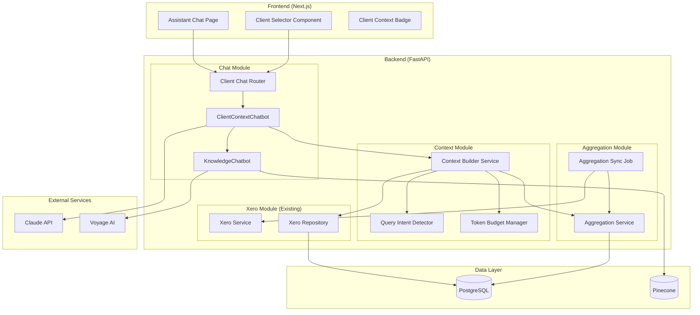
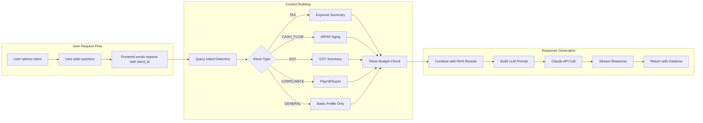
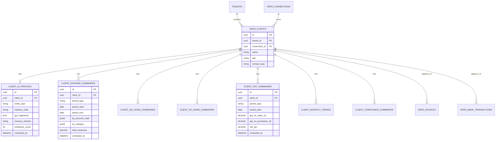
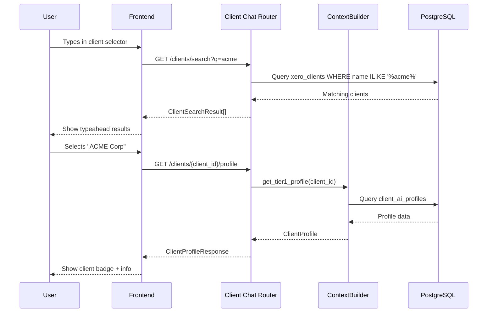
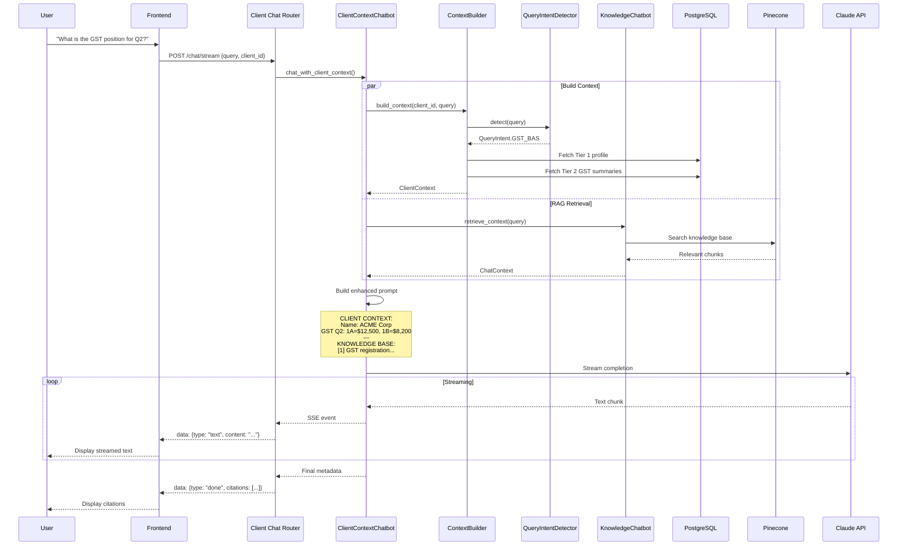
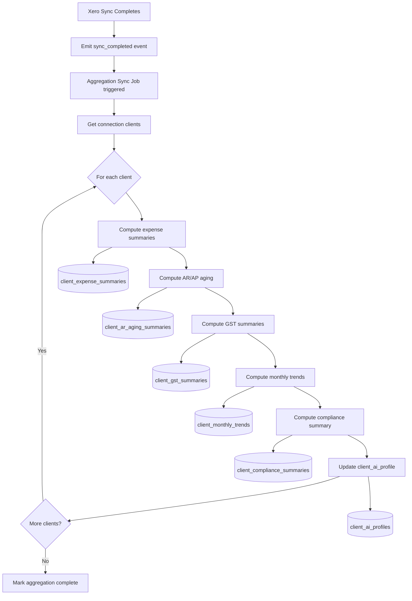
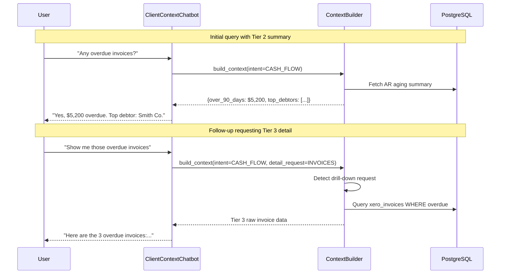
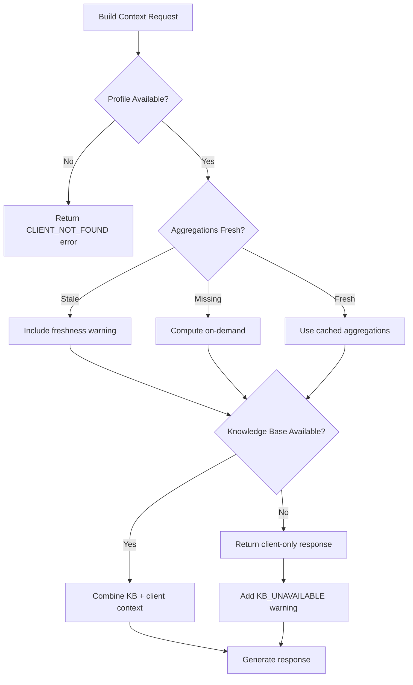

# Design Document: Client-Context Chat (Spec 013)

## Overview

This design document details the implementation of client-specific context in the AI Knowledge Assistant chat. The feature transforms the AI from a generic tax knowledge assistant into a personalized advisor that understands each client's unique financial position, enabling accountants to provide faster, more accurate, and more tailored advice.

**Key Design Decisions:**
- PostgreSQL aggregation tables for pre-computed summaries (NOT per-client vectors)
- Tiered context strategy: Profile (always) + Query-relevant summaries + On-demand detail
- Integration with existing `KnowledgeChatbot` class without breaking changes
- Token budget management across context tiers

---

## Architecture

### System Architecture Diagram



### Data Flow Diagram



---

## Components and Interfaces

### Component 1: ClientContextChatbot

Extends the existing `KnowledgeChatbot` to add client context injection capabilities.

**File:** `backend/app/modules/knowledge/client_chatbot.py`

```python
from dataclasses import dataclass
from uuid import UUID

@dataclass
class ClientContext:
    """Client context data for AI prompt injection."""
    client_id: UUID
    profile: ClientProfile
    query_intent: QueryIntent
    summaries: dict[str, Any]
    raw_data: list[dict] | None  # Tier 3 on-demand
    token_count: int
    data_freshness: datetime

@dataclass
class ClientProfile:
    """Tier 1: Always included client profile."""
    id: UUID
    name: str
    abn: str | None
    entity_type: str | None  # sole_trader, company, trust, partnership
    industry_code: str | None
    gst_registered: bool
    revenue_bracket: str | None
    employee_count: int | None
    connection_id: UUID
    last_sync_at: datetime | None

class ClientContextChatbot:
    """AI chatbot with client-specific context injection."""

    def __init__(
        self,
        knowledge_chatbot: KnowledgeChatbot,
        context_builder: ContextBuilderService,
        anthropic_settings: AnthropicSettings,
    ):
        pass

    async def chat_with_client_context(
        self,
        query: str,
        client_id: UUID,
        tenant_id: UUID,
        conversation_history: list[dict] | None = None,
        stream: bool = True,
    ) -> tuple[AsyncGenerator[str, None] | str, ClientChatContext]:
        """Chat with client context injection."""
        pass

    async def search_clients(
        self,
        tenant_id: UUID,
        query: str,
        limit: int = 20,
    ) -> list[ClientSearchResult]:
        """Search clients by name for typeahead."""
        pass
```

**Responsibilities:**
- Orchestrate context building and RAG retrieval
- Combine client context with knowledge base results
- Build enhanced prompts with client data
- Manage streaming responses

**Interfaces:**
- `chat_with_client_context()` - Main chat entry point
- `search_clients()` - Typeahead client search

**Dependencies:**
- `KnowledgeChatbot` (existing)
- `ContextBuilderService` (new)
- `AnthropicSettings` (existing)

---

### Component 2: ContextBuilderService

Builds client context based on query intent and token budget.

**File:** `backend/app/modules/knowledge/context_builder.py`

```python
class ContextBuilderService:
    """Builds client context for AI chat."""

    def __init__(
        self,
        aggregation_repo: AggregationRepository,
        xero_repo: XeroRepository,
        intent_detector: QueryIntentDetector,
        token_manager: TokenBudgetManager,
    ):
        pass

    async def build_context(
        self,
        client_id: UUID,
        tenant_id: UUID,
        query: str,
        conversation_history: list[dict] | None = None,
    ) -> ClientContext:
        """Build tiered context for client."""
        pass

    async def get_tier1_profile(
        self,
        client_id: UUID,
        tenant_id: UUID,
    ) -> ClientProfile:
        """Fetch always-included profile data."""
        pass

    async def get_tier2_summaries(
        self,
        client_id: UUID,
        intent: QueryIntent,
        token_budget: int,
    ) -> dict[str, Any]:
        """Fetch intent-relevant aggregated summaries."""
        pass

    async def get_tier3_details(
        self,
        client_id: UUID,
        detail_request: DetailRequest,
        token_budget: int,
    ) -> list[dict]:
        """Fetch on-demand raw transaction data."""
        pass

    def format_context_for_prompt(
        self,
        context: ClientContext,
    ) -> str:
        """Format context as structured text for LLM prompt."""
        pass
```

**Responsibilities:**
- Fetch and assemble context tiers
- Apply token budgets to each tier
- Format context for prompt injection
- Track data freshness

---

### Component 3: QueryIntentDetector

Classifies user queries to determine relevant context summaries.

**File:** `backend/app/modules/knowledge/intent_detector.py`

```python
from enum import Enum

class QueryIntent(str, Enum):
    """Query intent categories for context selection."""
    TAX_DEDUCTIONS = "tax_deductions"
    CASH_FLOW = "cash_flow"
    GST_BAS = "gst_bas"
    COMPLIANCE = "compliance"
    GENERAL = "general"

class QueryIntentDetector:
    """Detects query intent for context selection."""

    # Keyword patterns for each intent
    INTENT_PATTERNS: dict[QueryIntent, list[str]] = {
        QueryIntent.TAX_DEDUCTIONS: [
            "deduct", "expense", "claim", "tax", "depreciation",
            "asset", "write-off", "business expense", "fy", "financial year"
        ],
        QueryIntent.CASH_FLOW: [
            "cash flow", "cashflow", "receivable", "payable", "debtor",
            "creditor", "overdue", "payment", "aging", "outstanding"
        ],
        QueryIntent.GST_BAS: [
            "gst", "bas", "1a", "1b", "activity statement", "tax period",
            "quarterly", "input tax", "output tax"
        ],
        QueryIntent.COMPLIANCE: [
            "payg", "withholding", "super", "superannuation", "contractor",
            "tpar", "stp", "single touch", "payroll", "employee"
        ],
    }

    def detect(
        self,
        query: str,
        conversation_history: list[dict] | None = None,
    ) -> QueryIntent:
        """Detect query intent from text."""
        pass

    def detect_with_confidence(
        self,
        query: str,
        conversation_history: list[dict] | None = None,
    ) -> tuple[QueryIntent, float]:
        """Detect intent with confidence score."""
        pass
```

**Algorithm:**
1. Normalize query text (lowercase, remove punctuation)
2. Check for pattern matches against each intent category
3. Score each intent based on keyword matches
4. Consider conversation history for follow-up context
5. Return highest-scoring intent (default to GENERAL if no clear match)

---

### Component 4: TokenBudgetManager

Manages token budgets across context tiers.

**File:** `backend/app/modules/knowledge/token_budget.py`

```python
@dataclass
class TokenBudget:
    """Token budget allocation."""
    tier1_profile: int = 500      # ~500 tokens for profile
    tier2_summaries: int = 4000   # ~4000 tokens for summaries
    tier3_details: int = 2000     # ~2000 tokens for raw data
    rag_context: int = 2000       # ~2000 tokens for knowledge base
    total_max: int = 12500        # Max total context tokens

class TokenBudgetManager:
    """Manages token budgets for context building."""

    CHARS_PER_TOKEN = 4  # Rough estimate

    def __init__(self, budget: TokenBudget | None = None):
        self.budget = budget or TokenBudget()

    def estimate_tokens(self, text: str) -> int:
        """Estimate token count from text."""
        pass

    def fits_budget(self, text: str, tier: str) -> bool:
        """Check if text fits within tier budget."""
        pass

    def truncate_to_budget(self, text: str, tier: str) -> str:
        """Truncate text to fit tier budget."""
        pass

    def allocate_remaining(
        self,
        used: dict[str, int],
    ) -> dict[str, int]:
        """Reallocate unused budget to other tiers."""
        pass
```

---

### Component 5: AggregationService

Computes and manages client financial aggregations.

**File:** `backend/app/modules/knowledge/aggregation_service.py`

```python
class AggregationService:
    """Computes and caches client financial aggregations."""

    def __init__(
        self,
        session: AsyncSession,
        aggregation_repo: AggregationRepository,
    ):
        pass

    async def compute_all_for_connection(
        self,
        connection_id: UUID,
    ) -> AggregationResult:
        """Compute all aggregations for a connection's clients."""
        pass

    async def compute_expense_summary(
        self,
        client_id: UUID,
        period: AggregationPeriod,
    ) -> ExpenseSummary:
        """Compute expense summary by category."""
        pass

    async def compute_ar_aging(
        self,
        client_id: UUID,
        as_of_date: date,
    ) -> ARAgingSummary:
        """Compute accounts receivable aging buckets."""
        pass

    async def compute_ap_aging(
        self,
        client_id: UUID,
        as_of_date: date,
    ) -> APAgingSummary:
        """Compute accounts payable aging buckets."""
        pass

    async def compute_gst_summary(
        self,
        client_id: UUID,
        period: BASPeriod,
    ) -> GSTSummary:
        """Compute GST summary for BAS period."""
        pass

    async def compute_monthly_trends(
        self,
        client_id: UUID,
        months: int = 12,
    ) -> list[MonthlyTrend]:
        """Compute monthly financial trends."""
        pass

    async def invalidate_for_client(
        self,
        client_id: UUID,
    ) -> None:
        """Invalidate cached aggregations for a client."""
        pass
```

---

### Component 6: Client Chat Router

API endpoints for client context chat.

**File:** `backend/app/modules/knowledge/client_chat_router.py`

```python
router = APIRouter(prefix="/api/v1/knowledge/client-chat", tags=["client-chat"])

@router.get("/clients/search")
async def search_clients(
    q: str = Query(..., min_length=1, max_length=100),
    limit: int = Query(default=20, ge=1, le=50),
    current_user: PracticeUser = Depends(get_current_user),
    db: AsyncSession = Depends(get_db),
) -> list[ClientSearchResult]:
    """Search clients for typeahead selection."""
    pass

@router.get("/clients/{client_id}/profile")
async def get_client_profile(
    client_id: UUID,
    current_user: PracticeUser = Depends(get_current_user),
    db: AsyncSession = Depends(get_db),
) -> ClientProfileResponse:
    """Get client profile for context display."""
    pass

@router.post("/chat/stream")
async def chat_with_client_stream(
    request: ClientChatRequest,
    current_user: PracticeUser = Depends(get_current_user),
    db: AsyncSession = Depends(get_db),
    chatbot: ClientContextChatbot = Depends(get_client_chatbot),
) -> StreamingResponse:
    """Chat with client context (streaming SSE)."""
    pass

@router.post("/chat/persistent/stream")
async def chat_persistent_with_client_stream(
    request: ClientChatRequestWithConversation,
    current_user: PracticeUser = Depends(get_current_user),
    db: AsyncSession = Depends(get_db),
    chatbot: ClientContextChatbot = Depends(get_client_chatbot),
) -> StreamingResponse:
    """Chat with conversation persistence and client context."""
    pass
```

---

## Data Models

### Core Data Structure Definitions

#### Aggregation Tables

```python
# backend/app/modules/knowledge/aggregation_models.py

class ClientAIProfile(Base, TimestampMixin):
    """Tier 1: Client profile for AI context."""

    __tablename__ = "client_ai_profiles"

    id: Mapped[uuid.UUID] = mapped_column(UUID, primary_key=True, default=uuid.uuid4)
    tenant_id: Mapped[uuid.UUID] = mapped_column(UUID, ForeignKey("tenants.id"), index=True)
    client_id: Mapped[uuid.UUID] = mapped_column(UUID, ForeignKey("xero_clients.id"), unique=True)
    connection_id: Mapped[uuid.UUID] = mapped_column(UUID, ForeignKey("xero_connections.id"))

    # Derived profile data
    entity_type: Mapped[str | None] = mapped_column(String(50))  # sole_trader, company, trust
    industry_code: Mapped[str | None] = mapped_column(String(20))  # ANZSIC code
    gst_registered: Mapped[bool] = mapped_column(Boolean, default=False)
    revenue_bracket: Mapped[str | None] = mapped_column(String(20))  # under_75k, 75k_500k, etc
    employee_count: Mapped[int | None] = mapped_column(Integer)

    # Computed at
    computed_at: Mapped[datetime] = mapped_column(DateTime(timezone=True))

    __table_args__ = (
        Index("ix_client_ai_profiles_tenant", "tenant_id"),
    )


class ClientExpenseSummary(Base, TimestampMixin):
    """Tier 2: Expense summary by category and period."""

    __tablename__ = "client_expense_summaries"

    id: Mapped[uuid.UUID] = mapped_column(UUID, primary_key=True, default=uuid.uuid4)
    tenant_id: Mapped[uuid.UUID] = mapped_column(UUID, ForeignKey("tenants.id"), index=True)
    client_id: Mapped[uuid.UUID] = mapped_column(UUID, ForeignKey("xero_clients.id"), index=True)

    # Period
    period_type: Mapped[str] = mapped_column(String(20))  # month, quarter, year
    period_start: Mapped[date] = mapped_column(Date)
    period_end: Mapped[date] = mapped_column(Date)

    # Aggregated data (JSONB for flexibility)
    by_account_code: Mapped[dict] = mapped_column(JSONB)  # {code: {total, gst, count}}
    by_category: Mapped[dict] = mapped_column(JSONB)  # {category: {total, gst, count}}
    total_expenses: Mapped[Decimal] = mapped_column(Numeric(15, 2))
    total_gst: Mapped[Decimal] = mapped_column(Numeric(15, 2))
    transaction_count: Mapped[int] = mapped_column(Integer)

    computed_at: Mapped[datetime] = mapped_column(DateTime(timezone=True))

    __table_args__ = (
        UniqueConstraint("client_id", "period_type", "period_start", name="uq_expense_summary"),
        Index("ix_expense_summary_client_period", "client_id", "period_start"),
    )


class ClientARAgingSummary(Base, TimestampMixin):
    """Tier 2: Accounts receivable aging summary."""

    __tablename__ = "client_ar_aging_summaries"

    id: Mapped[uuid.UUID] = mapped_column(UUID, primary_key=True, default=uuid.uuid4)
    tenant_id: Mapped[uuid.UUID] = mapped_column(UUID, ForeignKey("tenants.id"), index=True)
    client_id: Mapped[uuid.UUID] = mapped_column(UUID, ForeignKey("xero_clients.id"), index=True)

    as_of_date: Mapped[date] = mapped_column(Date)

    # Aging buckets
    current_amount: Mapped[Decimal] = mapped_column(Numeric(15, 2), default=Decimal("0.00"))
    days_31_60: Mapped[Decimal] = mapped_column(Numeric(15, 2), default=Decimal("0.00"))
    days_61_90: Mapped[Decimal] = mapped_column(Numeric(15, 2), default=Decimal("0.00"))
    over_90_days: Mapped[Decimal] = mapped_column(Numeric(15, 2), default=Decimal("0.00"))
    total_outstanding: Mapped[Decimal] = mapped_column(Numeric(15, 2), default=Decimal("0.00"))

    # Top debtors (JSONB list)
    top_debtors: Mapped[list] = mapped_column(JSONB)  # [{name, amount, days_overdue}]

    invoice_count: Mapped[int] = mapped_column(Integer, default=0)
    computed_at: Mapped[datetime] = mapped_column(DateTime(timezone=True))

    __table_args__ = (
        UniqueConstraint("client_id", "as_of_date", name="uq_ar_aging"),
        Index("ix_ar_aging_client_date", "client_id", "as_of_date"),
    )


class ClientAPAgingSummary(Base, TimestampMixin):
    """Tier 2: Accounts payable aging summary."""

    __tablename__ = "client_ap_aging_summaries"

    id: Mapped[uuid.UUID] = mapped_column(UUID, primary_key=True, default=uuid.uuid4)
    tenant_id: Mapped[uuid.UUID] = mapped_column(UUID, ForeignKey("tenants.id"), index=True)
    client_id: Mapped[uuid.UUID] = mapped_column(UUID, ForeignKey("xero_clients.id"), index=True)

    as_of_date: Mapped[date] = mapped_column(Date)

    # Aging buckets
    current_amount: Mapped[Decimal] = mapped_column(Numeric(15, 2), default=Decimal("0.00"))
    days_31_60: Mapped[Decimal] = mapped_column(Numeric(15, 2), default=Decimal("0.00"))
    days_61_90: Mapped[Decimal] = mapped_column(Numeric(15, 2), default=Decimal("0.00"))
    over_90_days: Mapped[Decimal] = mapped_column(Numeric(15, 2), default=Decimal("0.00"))
    total_outstanding: Mapped[Decimal] = mapped_column(Numeric(15, 2), default=Decimal("0.00"))

    # Top creditors (JSONB list)
    top_creditors: Mapped[list] = mapped_column(JSONB)

    invoice_count: Mapped[int] = mapped_column(Integer, default=0)
    computed_at: Mapped[datetime] = mapped_column(DateTime(timezone=True))

    __table_args__ = (
        UniqueConstraint("client_id", "as_of_date", name="uq_ap_aging"),
    )


class ClientGSTSummary(Base, TimestampMixin):
    """Tier 2: GST summary for BAS periods."""

    __tablename__ = "client_gst_summaries"

    id: Mapped[uuid.UUID] = mapped_column(UUID, primary_key=True, default=uuid.uuid4)
    tenant_id: Mapped[uuid.UUID] = mapped_column(UUID, ForeignKey("tenants.id"), index=True)
    client_id: Mapped[uuid.UUID] = mapped_column(UUID, ForeignKey("xero_clients.id"), index=True)

    # BAS Period
    period_type: Mapped[str] = mapped_column(String(20))  # monthly, quarterly
    period_start: Mapped[date] = mapped_column(Date)
    period_end: Mapped[date] = mapped_column(Date)

    # GST amounts (BAS labels)
    gst_on_sales_1a: Mapped[Decimal] = mapped_column(Numeric(15, 2), default=Decimal("0.00"))
    gst_on_purchases_1b: Mapped[Decimal] = mapped_column(Numeric(15, 2), default=Decimal("0.00"))
    net_gst: Mapped[Decimal] = mapped_column(Numeric(15, 2), default=Decimal("0.00"))

    # Supporting totals
    total_sales: Mapped[Decimal] = mapped_column(Numeric(15, 2), default=Decimal("0.00"))
    total_purchases: Mapped[Decimal] = mapped_column(Numeric(15, 2), default=Decimal("0.00"))

    # Adjustments (JSONB for flexibility)
    adjustments: Mapped[dict | None] = mapped_column(JSONB)

    computed_at: Mapped[datetime] = mapped_column(DateTime(timezone=True))

    __table_args__ = (
        UniqueConstraint("client_id", "period_type", "period_start", name="uq_gst_summary"),
        Index("ix_gst_summary_client_period", "client_id", "period_start"),
    )


class ClientMonthlyTrend(Base, TimestampMixin):
    """Tier 2: Monthly financial trends."""

    __tablename__ = "client_monthly_trends"

    id: Mapped[uuid.UUID] = mapped_column(UUID, primary_key=True, default=uuid.uuid4)
    tenant_id: Mapped[uuid.UUID] = mapped_column(UUID, ForeignKey("tenants.id"), index=True)
    client_id: Mapped[uuid.UUID] = mapped_column(UUID, ForeignKey("xero_clients.id"), index=True)

    # Month
    year: Mapped[int] = mapped_column(Integer)
    month: Mapped[int] = mapped_column(Integer)

    # Metrics
    revenue: Mapped[Decimal] = mapped_column(Numeric(15, 2), default=Decimal("0.00"))
    expenses: Mapped[Decimal] = mapped_column(Numeric(15, 2), default=Decimal("0.00"))
    gross_profit: Mapped[Decimal] = mapped_column(Numeric(15, 2), default=Decimal("0.00"))
    net_cashflow: Mapped[Decimal] = mapped_column(Numeric(15, 2), default=Decimal("0.00"))

    invoice_count: Mapped[int] = mapped_column(Integer, default=0)
    transaction_count: Mapped[int] = mapped_column(Integer, default=0)

    computed_at: Mapped[datetime] = mapped_column(DateTime(timezone=True))

    __table_args__ = (
        UniqueConstraint("client_id", "year", "month", name="uq_monthly_trend"),
        Index("ix_monthly_trend_client_date", "client_id", "year", "month"),
    )


class ClientComplianceSummary(Base, TimestampMixin):
    """Tier 2: Compliance summary (payroll, super, contractors)."""

    __tablename__ = "client_compliance_summaries"

    id: Mapped[uuid.UUID] = mapped_column(UUID, primary_key=True, default=uuid.uuid4)
    tenant_id: Mapped[uuid.UUID] = mapped_column(UUID, ForeignKey("tenants.id"), index=True)
    client_id: Mapped[uuid.UUID] = mapped_column(UUID, ForeignKey("xero_clients.id"), index=True)

    # Period
    period_type: Mapped[str] = mapped_column(String(20))  # quarter, year
    period_start: Mapped[date] = mapped_column(Date)
    period_end: Mapped[date] = mapped_column(Date)

    # Payroll summary
    total_wages: Mapped[Decimal] = mapped_column(Numeric(15, 2), default=Decimal("0.00"))
    total_payg_withheld: Mapped[Decimal] = mapped_column(Numeric(15, 2), default=Decimal("0.00"))
    total_super: Mapped[Decimal] = mapped_column(Numeric(15, 2), default=Decimal("0.00"))
    employee_count: Mapped[int] = mapped_column(Integer, default=0)

    # Contractor summary (TPAR relevant)
    contractor_payments: Mapped[Decimal] = mapped_column(Numeric(15, 2), default=Decimal("0.00"))
    contractor_count: Mapped[int] = mapped_column(Integer, default=0)

    computed_at: Mapped[datetime] = mapped_column(DateTime(timezone=True))

    __table_args__ = (
        UniqueConstraint("client_id", "period_type", "period_start", name="uq_compliance_summary"),
    )
```

### Data Model Diagram



### API Request/Response Schemas

```python
# backend/app/modules/knowledge/client_chat_schemas.py

class ClientSearchResult(BaseModel):
    """Result from client search."""
    id: UUID
    name: str
    abn: str | None
    contact_type: str
    connection_id: UUID
    organization_name: str
    last_sync_at: datetime | None

class ClientProfileResponse(BaseModel):
    """Client profile for display."""
    id: UUID
    name: str
    abn: str | None
    entity_type: str | None
    gst_registered: bool
    connection_id: UUID
    organization_name: str
    connection_status: str
    last_sync_at: datetime | None
    data_freshness_warning: str | None  # If stale

class ClientChatRequest(BaseModel):
    """Request for client context chat."""
    query: str = Field(..., min_length=1, max_length=2000)
    client_id: UUID
    collections: list[str] | None = None

class ClientChatRequestWithConversation(BaseModel):
    """Chat request with conversation persistence."""
    query: str = Field(..., min_length=1, max_length=2000)
    client_id: UUID
    conversation_id: UUID | None = None
    collections: list[str] | None = None

class ClientChatCitation(BaseModel):
    """Citation in client context response."""
    number: int
    title: str | None
    url: str
    source_type: str  # "knowledge_base" or "client_data"
    effective_date: str | None
    text_preview: str
    score: float | None  # Only for knowledge_base citations

class ClientChatMetadata(BaseModel):
    """Metadata for client context response."""
    client_id: UUID
    client_name: str
    query_intent: str
    data_freshness: datetime
    context_tokens: int
    citations: list[ClientChatCitation]
```

---

## Business Processes

### Process 1: Client Selection and Context Loading



### Process 2: Client Context Chat Flow



### Process 3: Aggregation Computation on Sync



### Process 4: Multi-Turn Drill-Down



---

## Error Handling Strategy

### Error Categories and Handling

| Error Category | Example | Handling Strategy |
|----------------|---------|-------------------|
| No Xero Connection | User has no synced clients | Display setup message, link to Xero connect |
| Client Not Found | Invalid client_id | Return 404, clear client context in UI |
| Stale Data | Aggregations > 24 hours old | Show freshness warning, still provide response |
| Aggregation Missing | New client, not yet computed | Fall back to on-demand computation |
| Connection NEEDS_REAUTH | Token expired | Show warning banner, prompt re-auth |
| Rate Limit | Xero API limit reached | Use cached data, show staleness warning |
| Context Too Large | Token budget exceeded | Truncate context tiers, prioritize profile |
| Knowledge Base Unavailable | Pinecone down | Return client-only insights with message |

### Error Response Schemas

```python
class ClientChatError(BaseModel):
    """Error response for client chat."""
    error_code: str
    message: str
    details: dict | None = None
    recoverable: bool = True

# Error codes:
# - NO_XERO_CONNECTION: No Xero connections for tenant
# - CLIENT_NOT_FOUND: Client ID not found or not accessible
# - CONNECTION_NEEDS_REAUTH: Xero connection needs re-authorization
# - DATA_STALE: Data may be outdated (still provides response)
# - AGGREGATION_FAILED: Could not compute aggregations
# - KNOWLEDGE_BASE_UNAVAILABLE: Knowledge base service down
# - CONTEXT_LIMIT_EXCEEDED: Token budget exceeded
```

### Graceful Degradation



---

## Testing Strategy

### Unit Tests

```python
# tests/unit/modules/knowledge/test_intent_detector.py

class TestQueryIntentDetector:
    def test_detects_gst_intent(self):
        detector = QueryIntentDetector()
        assert detector.detect("What is the GST liability?") == QueryIntent.GST_BAS

    def test_detects_cash_flow_intent(self):
        detector = QueryIntentDetector()
        assert detector.detect("Show me overdue invoices") == QueryIntent.CASH_FLOW

    def test_falls_back_to_general(self):
        detector = QueryIntentDetector()
        assert detector.detect("Hello, how are you?") == QueryIntent.GENERAL

    def test_considers_conversation_context(self):
        detector = QueryIntentDetector()
        history = [{"role": "user", "content": "What's my GST position?"}]
        assert detector.detect("Tell me more", history) == QueryIntent.GST_BAS


# tests/unit/modules/knowledge/test_token_budget.py

class TestTokenBudgetManager:
    def test_estimate_tokens(self):
        manager = TokenBudgetManager()
        # Roughly 4 chars per token
        assert manager.estimate_tokens("a" * 100) == 25

    def test_truncate_to_budget(self):
        manager = TokenBudgetManager()
        long_text = "x" * 10000
        result = manager.truncate_to_budget(long_text, "tier1_profile")
        assert manager.estimate_tokens(result) <= manager.budget.tier1_profile


# tests/unit/modules/knowledge/test_context_builder.py

class TestContextBuilder:
    async def test_builds_tier1_always(self):
        builder = ContextBuilderService(...)
        context = await builder.build_context(client_id, tenant_id, "hello")
        assert context.profile is not None

    async def test_includes_gst_for_gst_intent(self):
        builder = ContextBuilderService(...)
        context = await builder.build_context(
            client_id, tenant_id, "What's my GST?"
        )
        assert "gst_summary" in context.summaries
```

### Integration Tests

```python
# tests/integration/modules/knowledge/test_client_chat_api.py

class TestClientChatAPI:
    async def test_search_clients_returns_results(self, client, auth_headers, seeded_clients):
        response = await client.get(
            "/api/v1/knowledge/client-chat/clients/search?q=acme",
            headers=auth_headers,
        )
        assert response.status_code == 200
        results = response.json()
        assert len(results) > 0
        assert results[0]["name"].lower().contains("acme")

    async def test_search_clients_enforces_tenant_isolation(
        self, client, other_tenant_headers, seeded_clients
    ):
        response = await client.get(
            "/api/v1/knowledge/client-chat/clients/search?q=acme",
            headers=other_tenant_headers,
        )
        assert response.status_code == 200
        assert len(response.json()) == 0

    async def test_chat_stream_includes_client_context(
        self, client, auth_headers, seeded_client_with_data
    ):
        response = await client.post(
            "/api/v1/knowledge/client-chat/chat/stream",
            json={
                "query": "What is the GST liability?",
                "client_id": str(seeded_client_with_data.id),
            },
            headers=auth_headers,
        )
        assert response.status_code == 200
        # Parse SSE events
        events = parse_sse_events(response.content)
        done_event = next(e for e in events if e["type"] == "done")
        assert done_event["metadata"]["client_name"] == seeded_client_with_data.name
```

### E2E Tests

```python
# tests/e2e/test_client_context_chat.py

class TestClientContextChatE2E:
    async def test_full_chat_flow(self, browser, logged_in_user):
        page = await browser.new_page()
        await page.goto("/assistant")

        # Select client
        await page.click('[data-testid="client-selector"]')
        await page.fill('[data-testid="client-search-input"]', "ACME")
        await page.click('[data-testid="client-option-acme"]')

        # Verify client badge shown
        assert await page.is_visible('[data-testid="client-context-badge"]')

        # Ask question
        await page.fill('[data-testid="chat-input"]', "What is the GST for Q2?")
        await page.click('[data-testid="send-button"]')

        # Wait for response
        await page.wait_for_selector('[data-testid="assistant-message"]')

        # Verify response includes client data
        response_text = await page.text_content('[data-testid="assistant-message"]')
        assert "ACME" in response_text or "$" in response_text
```

---

## Implementation Plan

### Phase 1: Foundation (Days 1-3)
1. Create aggregation table migrations
2. Implement `AggregationRepository` with CRUD operations
3. Implement `QueryIntentDetector` with keyword matching
4. Implement `TokenBudgetManager`
5. Add RLS policies to new tables

### Phase 2: Aggregation Pipeline (Days 4-6)
1. Implement `AggregationService` with computation methods
2. Create aggregation Celery task triggered on sync complete
3. Integrate aggregation job into Xero sync completion
4. Add fallback on-demand computation
5. Write unit tests for aggregation service

### Phase 3: Context Builder (Days 7-9)
1. Implement `ContextBuilderService`
2. Implement tiered context fetching
3. Implement prompt formatting with client context
4. Write integration tests for context builder
5. Handle edge cases (missing data, stale data)

### Phase 4: Chat Integration (Days 10-12)
1. Implement `ClientContextChatbot`
2. Create `client_chat_router.py` with endpoints
3. Integrate with existing `KnowledgeChatbot`
4. Implement SSE streaming with client metadata
5. Add conversation persistence support

### Phase 5: Frontend (Days 13-15)
1. Create `ClientSelector` component with typeahead
2. Add client context badge to chat header
3. Update `AssistantPage` with client mode
4. Implement client context state management
5. Add freshness warnings and error handling

### Phase 6: Testing and Polish (Days 16-18)
1. Complete integration test suite
2. E2E tests for full flow
3. Performance testing (p95 latency targets)
4. Documentation
5. Code review and refinements

---

## Open Questions

1. **Entity Type Detection**: How do we infer entity type (sole trader, company, trust) from Xero data? May need user input or ABN lookup.

2. **Industry Code Mapping**: Should we map Xero account types to ANZSIC codes, or require manual configuration?

3. **Aggregation Frequency**: Should aggregations be computed on every sync, or on a scheduled basis (e.g., nightly)?

4. **Multi-Client Queries**: The spec excludes "Compare ACME to XYZ" - should we add explicit blocking for such queries?

5. **Conversation History with Client Switch**: When user switches clients mid-conversation, should we start a new conversation or allow mixing?

---

## Appendix: System Prompt Enhancement

The enhanced system prompt for client context mode:

```text
You are Clairo AI, a tax compliance assistant for Australian accountants and bookkeepers.

You are currently advising on a specific client. Use the client context provided below to give personalized, data-driven answers.

CLIENT CONTEXT:
{formatted_client_context}

When referencing client data:
- Cite specific amounts, dates, and figures from the context
- Show your calculations when answering numerical questions
- Note the data freshness date for time-sensitive information
- If data is missing or incomplete, acknowledge this clearly

When combining with knowledge base sources:
- Distinguish between client-specific data and general tax rules
- Use [1], [2], etc. for knowledge base citations
- Apply general rules to the client's specific situation

For time-sensitive matters (rates, deadlines), verify on ato.gov.au.

KNOWLEDGE BASE SOURCES:
{formatted_rag_context}

QUESTION: {query}
```

---

Does the design look good? If so, we can move on to the implementation plan.
