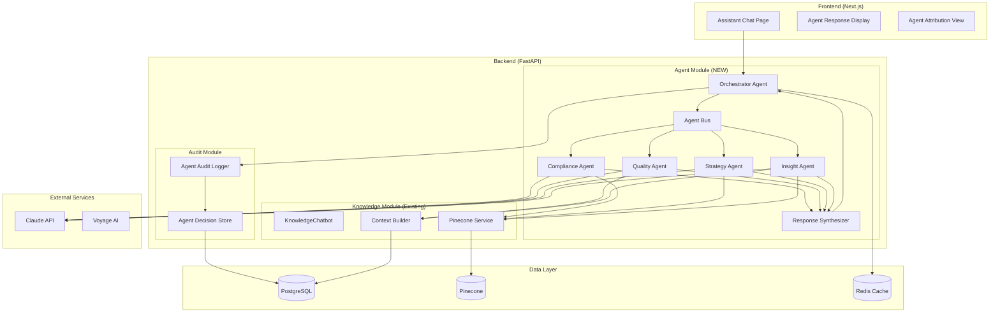
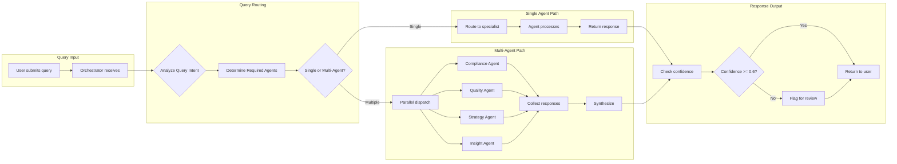
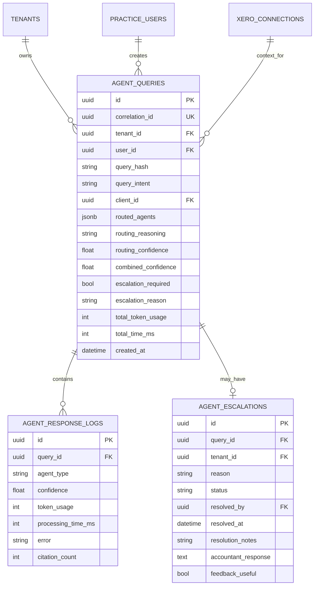
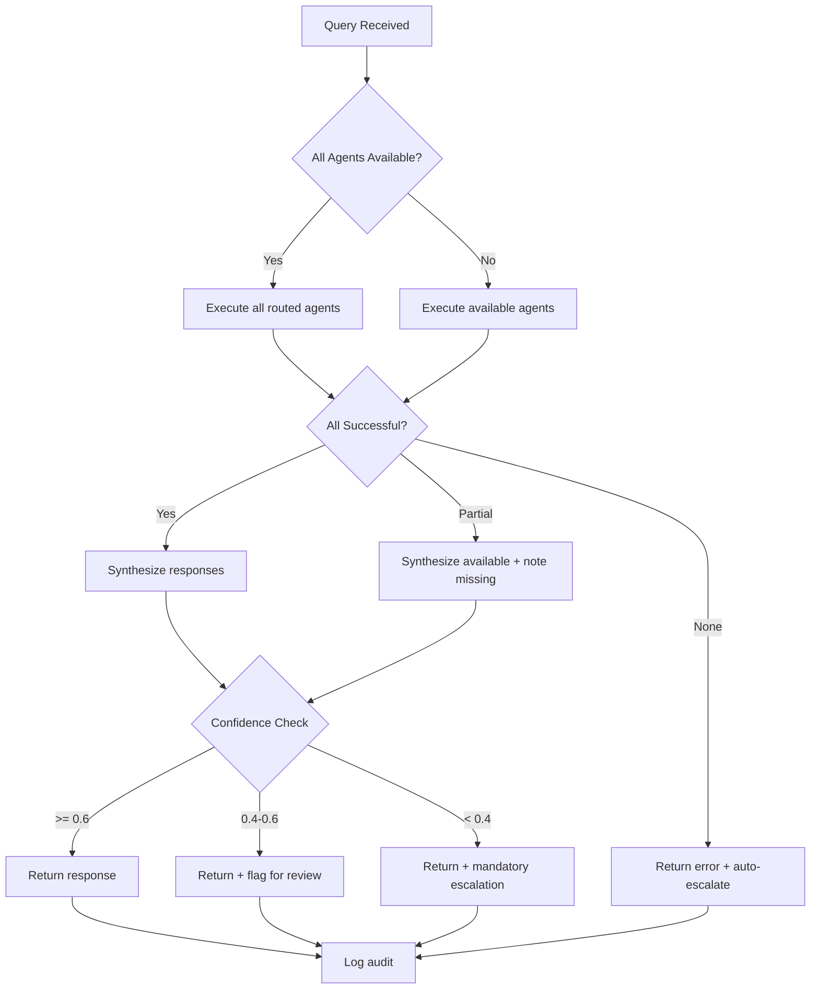

# Design Document: Multi-Agent Framework (Spec 014)

## Overview

This design document details the implementation of a multi-agent AI system for Clairo that enables specialized agents to collaborate in answering complex accountant questions. Building upon the Knowledge Base (Spec 012) and Client-Context Chat (Spec 013), the framework routes queries to appropriate specialist agents and synthesizes their responses.

**Key Design Decisions:**
- Orchestrator pattern for query routing and response synthesis
- Four specialist agents: Compliance, Quality, Strategy, Insight
- Parallel agent execution for latency optimization
- Confidence scoring with human escalation thresholds
- Full audit trail for agent decisions and contributions

---

## Architecture

### System Architecture Diagram



### Agent Communication Flow



---

## Components and Interfaces

### Component 1: Orchestrator Agent

The central coordinator that routes queries and synthesizes responses.

**File:** `backend/app/modules/agents/orchestrator.py`

```python
from dataclasses import dataclass
from enum import Enum
from uuid import UUID
import asyncio

class AgentType(str, Enum):
    """Available specialist agents."""
    COMPLIANCE = "compliance"
    QUALITY = "quality"
    STRATEGY = "strategy"
    INSIGHT = "insight"

@dataclass
class AgentRequest:
    """Request to a specialist agent."""
    correlation_id: UUID
    query: str
    client_context: ClientContext | None
    token_budget: int
    agent_type: AgentType
    priority: int = 1

@dataclass
class AgentResponse:
    """Response from a specialist agent."""
    correlation_id: UUID
    agent_type: AgentType
    content: str
    confidence: float  # 0.0 - 1.0
    citations: list[Citation]
    token_usage: int
    processing_time_ms: int
    error: str | None = None

@dataclass
class OrchestratorResult:
    """Final synthesized result from orchestrator."""
    correlation_id: UUID
    synthesized_response: str
    agent_contributions: list[AgentContribution]
    combined_confidence: float
    citations: list[Citation]
    escalation_required: bool
    escalation_reason: str | None
    total_token_usage: int
    total_time_ms: int

class Orchestrator:
    """Central agent orchestrator for query routing and synthesis."""

    def __init__(
        self,
        compliance_agent: ComplianceAgent,
        quality_agent: QualityAgent,
        strategy_agent: StrategyAgent,
        insight_agent: InsightAgent,
        synthesizer: ResponseSynthesizer,
        router: QueryRouter,
        audit_logger: AgentAuditLogger,
        settings: AgentSettings,
    ):
        self.agents = {
            AgentType.COMPLIANCE: compliance_agent,
            AgentType.QUALITY: quality_agent,
            AgentType.STRATEGY: strategy_agent,
            AgentType.INSIGHT: insight_agent,
        }
        self.synthesizer = synthesizer
        self.router = router
        self.audit_logger = audit_logger
        self.settings = settings

    async def process_query(
        self,
        query: str,
        tenant_id: UUID,
        client_context: ClientContext | None = None,
        conversation_history: list[dict] | None = None,
    ) -> OrchestratorResult:
        """Main entry point for query processing."""
        correlation_id = uuid.uuid4()

        # Log query receipt
        await self.audit_logger.log_query_received(correlation_id, query, tenant_id)

        # Determine routing
        routing = await self.router.determine_routing(
            query, client_context, conversation_history
        )

        # Log routing decision
        await self.audit_logger.log_routing_decision(
            correlation_id, routing.selected_agents, routing.reasoning
        )

        # Execute agents (parallel or single)
        if len(routing.selected_agents) == 1:
            responses = [await self._execute_single_agent(
                correlation_id, routing.selected_agents[0], query, client_context
            )]
        else:
            responses = await self._execute_parallel_agents(
                correlation_id, routing.selected_agents, query, client_context
            )

        # Filter failed responses
        successful = [r for r in responses if r.error is None]
        failed = [r for r in responses if r.error is not None]

        # Synthesize responses
        result = await self.synthesizer.synthesize(
            correlation_id, query, successful, failed
        )

        # Check escalation thresholds
        result = self._check_escalation(result, query)

        # Log final result
        await self.audit_logger.log_result(correlation_id, result)

        return result

    async def _execute_parallel_agents(
        self,
        correlation_id: UUID,
        agent_types: list[AgentType],
        query: str,
        client_context: ClientContext | None,
    ) -> list[AgentResponse]:
        """Execute multiple agents in parallel."""
        budget_per_agent = self.settings.total_token_budget // len(agent_types)

        tasks = [
            self._execute_single_agent(
                correlation_id, agent_type, query, client_context, budget_per_agent
            )
            for agent_type in agent_types
        ]

        # Wait with timeout
        try:
            responses = await asyncio.wait_for(
                asyncio.gather(*tasks, return_exceptions=True),
                timeout=self.settings.agent_timeout_seconds,
            )
            return [
                r if isinstance(r, AgentResponse)
                else AgentResponse(
                    correlation_id=correlation_id,
                    agent_type=agent_types[i],
                    content="",
                    confidence=0.0,
                    citations=[],
                    token_usage=0,
                    processing_time_ms=0,
                    error=str(r),
                )
                for i, r in enumerate(responses)
            ]
        except asyncio.TimeoutError:
            return [
                AgentResponse(
                    correlation_id=correlation_id,
                    agent_type=at,
                    content="",
                    confidence=0.0,
                    citations=[],
                    token_usage=0,
                    processing_time_ms=0,
                    error="Agent timeout",
                )
                for at in agent_types
            ]

    async def _execute_single_agent(
        self,
        correlation_id: UUID,
        agent_type: AgentType,
        query: str,
        client_context: ClientContext | None,
        token_budget: int | None = None,
    ) -> AgentResponse:
        """Execute a single specialist agent."""
        agent = self.agents[agent_type]
        budget = token_budget or self.settings.single_agent_token_budget

        request = AgentRequest(
            correlation_id=correlation_id,
            query=query,
            client_context=client_context,
            token_budget=budget,
            agent_type=agent_type,
        )

        return await agent.process(request)

    def _check_escalation(
        self,
        result: OrchestratorResult,
        query: str,
    ) -> OrchestratorResult:
        """Check if escalation to human is required."""
        # Confidence threshold check
        if result.combined_confidence < 0.4:
            result.escalation_required = True
            result.escalation_reason = f"Low confidence ({result.combined_confidence:.2f})"
            return result

        if result.combined_confidence < 0.6:
            result.escalation_required = True
            result.escalation_reason = "Moderate confidence - review recommended"
            return result

        # Complex scenario detection
        complex_indicators = [
            "trust", "international", "restructure", "penalty",
            "fraud", "audit", "ato investigation"
        ]
        query_lower = query.lower()
        for indicator in complex_indicators:
            if indicator in query_lower:
                result.escalation_required = True
                result.escalation_reason = f"Complex scenario detected: {indicator}"
                return result

        return result
```

---

### Component 2: Query Router

Determines which agents should handle a query.

**File:** `backend/app/modules/agents/router.py`

```python
@dataclass
class RoutingDecision:
    """Routing decision for a query."""
    selected_agents: list[AgentType]
    reasoning: str
    confidence: float

class QueryRouter:
    """Routes queries to appropriate specialist agents."""

    # Agent routing patterns
    AGENT_PATTERNS: dict[AgentType, list[str]] = {
        AgentType.COMPLIANCE: [
            "gst", "bas", "ato", "tax", "deduct", "claim", "compliance",
            "ruling", "regulation", "requirement", "obligation", "lodge",
            "payg", "withholding", "super", "superannuation", "stp"
        ],
        AgentType.QUALITY: [
            "data", "quality", "error", "issue", "problem", "wrong",
            "reconcile", "duplicate", "missing", "incomplete", "check",
            "verify", "validate", "fix", "correct"
        ],
        AgentType.STRATEGY: [
            "strategy", "optimize", "structure", "incorporate", "growth",
            "benchmark", "improve", "save", "reduce", "planning",
            "advice", "recommend", "should i", "best way"
        ],
        AgentType.INSIGHT: [
            "trend", "pattern", "anomaly", "unusual", "change", "why",
            "analyze", "compare", "forecast", "predict", "alert",
            "threshold", "approaching", "risk"
        ],
    }

    # Multi-agent query patterns (require multiple agents)
    MULTI_AGENT_PATTERNS: list[tuple[str, list[AgentType]]] = [
        ("should.*register.*gst", [AgentType.COMPLIANCE, AgentType.INSIGHT]),
        ("what.*wrong.*bas", [AgentType.QUALITY, AgentType.COMPLIANCE]),
        ("how.*reduce.*tax", [AgentType.STRATEGY, AgentType.COMPLIANCE, AgentType.INSIGHT]),
        ("optimize.*deduction", [AgentType.STRATEGY, AgentType.COMPLIANCE]),
        ("data.*issue.*compliance", [AgentType.QUALITY, AgentType.COMPLIANCE]),
    ]

    def __init__(self, intent_detector: QueryIntentDetector):
        self.intent_detector = intent_detector

    async def determine_routing(
        self,
        query: str,
        client_context: ClientContext | None,
        conversation_history: list[dict] | None,
    ) -> RoutingDecision:
        """Determine which agents should handle the query."""
        query_lower = query.lower()

        # Check for explicit multi-agent patterns first
        for pattern, agents in self.MULTI_AGENT_PATTERNS:
            if re.search(pattern, query_lower):
                return RoutingDecision(
                    selected_agents=agents,
                    reasoning=f"Multi-agent pattern match: {pattern}",
                    confidence=0.9,
                )

        # Score each agent based on keyword matches
        scores: dict[AgentType, float] = {}
        for agent_type, patterns in self.AGENT_PATTERNS.items():
            score = sum(1 for p in patterns if p in query_lower)
            if score > 0:
                scores[agent_type] = score

        if not scores:
            # No matches - default to compliance
            return RoutingDecision(
                selected_agents=[AgentType.COMPLIANCE],
                reasoning="No specific pattern match - defaulting to compliance",
                confidence=0.5,
            )

        # Get top scoring agents
        max_score = max(scores.values())
        top_agents = [
            agent for agent, score in scores.items()
            if score >= max_score * 0.7  # Include agents within 70% of max
        ]

        # If client context exists and involves data, consider Quality agent
        if client_context and AgentType.QUALITY not in top_agents:
            if any(word in query_lower for word in ["client", "their", "this"]):
                top_agents.append(AgentType.QUALITY)

        return RoutingDecision(
            selected_agents=top_agents[:3],  # Max 3 agents
            reasoning=f"Pattern scores: {scores}",
            confidence=min(0.9, 0.5 + (max_score * 0.1)),
        )
```

---

### Component 3: Specialist Agent Base Class

Base class for all specialist agents.

**File:** `backend/app/modules/agents/base.py`

```python
from abc import ABC, abstractmethod
import time

class BaseAgent(ABC):
    """Base class for specialist agents."""

    agent_type: AgentType

    def __init__(
        self,
        anthropic_client: AsyncAnthropic,
        pinecone_service: PineconeService,
        context_builder: ContextBuilderService,
        settings: AgentSettings,
    ):
        self.anthropic = anthropic_client
        self.pinecone = pinecone_service
        self.context_builder = context_builder
        self.settings = settings

    async def process(self, request: AgentRequest) -> AgentResponse:
        """Process a query request."""
        start_time = time.time()

        try:
            # Build agent-specific context
            context = await self._build_context(request)

            # Build prompt
            prompt = self._build_prompt(request.query, context)

            # Call LLM
            response = await self._call_llm(prompt, request.token_budget)

            # Extract citations
            citations = self._extract_citations(context)

            # Calculate confidence
            confidence = self._calculate_confidence(response, context)

            processing_time = int((time.time() - start_time) * 1000)

            return AgentResponse(
                correlation_id=request.correlation_id,
                agent_type=self.agent_type,
                content=response.content,
                confidence=confidence,
                citations=citations,
                token_usage=response.usage.total_tokens,
                processing_time_ms=processing_time,
            )
        except Exception as e:
            processing_time = int((time.time() - start_time) * 1000)
            return AgentResponse(
                correlation_id=request.correlation_id,
                agent_type=self.agent_type,
                content="",
                confidence=0.0,
                citations=[],
                token_usage=0,
                processing_time_ms=processing_time,
                error=str(e),
            )

    @abstractmethod
    async def _build_context(self, request: AgentRequest) -> AgentContext:
        """Build agent-specific context. Override in subclasses."""
        pass

    @abstractmethod
    def _build_prompt(self, query: str, context: AgentContext) -> str:
        """Build agent-specific prompt. Override in subclasses."""
        pass

    async def _call_llm(self, prompt: str, token_budget: int) -> Message:
        """Call Claude API with the prompt."""
        return await self.anthropic.messages.create(
            model=self.settings.model,
            max_tokens=min(token_budget, 4096),
            system=self._get_system_prompt(),
            messages=[{"role": "user", "content": prompt}],
        )

    @abstractmethod
    def _get_system_prompt(self) -> str:
        """Get agent-specific system prompt. Override in subclasses."""
        pass

    def _calculate_confidence(
        self,
        response: Message,
        context: AgentContext,
    ) -> float:
        """Calculate confidence score for the response."""
        base_confidence = 0.7

        # Adjust based on citation quality
        if context.citations:
            avg_score = sum(c.score for c in context.citations) / len(context.citations)
            base_confidence += avg_score * 0.2

        # Adjust based on context completeness
        if context.is_complete:
            base_confidence += 0.1

        return min(1.0, base_confidence)

    def _extract_citations(self, context: AgentContext) -> list[Citation]:
        """Extract citations from context."""
        return context.citations if context.citations else []
```

---

### Component 4: Compliance Agent

Specialist for tax compliance and ATO rules.

**File:** `backend/app/modules/agents/compliance_agent.py`

```python
class ComplianceAgent(BaseAgent):
    """Specialist agent for tax compliance and ATO rules."""

    agent_type = AgentType.COMPLIANCE

    # Pinecone namespace for compliance knowledge
    NAMESPACE = "compliance_knowledge"

    async def _build_context(self, request: AgentRequest) -> AgentContext:
        """Build compliance-specific context."""
        # Search compliance knowledge base
        search_results = await self.pinecone.search(
            query=request.query,
            namespace=self.NAMESPACE,
            top_k=5,
        )

        # Build citations from search results
        citations = [
            Citation(
                number=i + 1,
                title=r.metadata.get("title"),
                url=r.metadata.get("url", ""),
                source_type="knowledge_base",
                text_preview=r.text[:200],
                score=r.score,
            )
            for i, r in enumerate(search_results)
        ]

        # Add client context if available
        client_data = None
        if request.client_context:
            client_data = {
                "entity_type": request.client_context.profile.entity_type,
                "gst_registered": request.client_context.profile.gst_registered,
                "revenue_bracket": request.client_context.profile.revenue_bracket,
            }

        return AgentContext(
            knowledge_chunks=[r.text for r in search_results],
            citations=citations,
            client_data=client_data,
            is_complete=len(search_results) >= 3,
        )

    def _build_prompt(self, query: str, context: AgentContext) -> str:
        """Build compliance-focused prompt."""
        prompt_parts = [
            "You are answering a tax compliance question for an Australian accountant.",
            "",
            "RELEVANT ATO GUIDANCE:",
        ]

        for i, chunk in enumerate(context.knowledge_chunks, 1):
            prompt_parts.append(f"[{i}] {chunk}")

        if context.client_data:
            prompt_parts.extend([
                "",
                "CLIENT CONTEXT:",
                f"- Entity Type: {context.client_data.get('entity_type', 'Unknown')}",
                f"- GST Registered: {context.client_data.get('gst_registered', 'Unknown')}",
                f"- Revenue Bracket: {context.client_data.get('revenue_bracket', 'Unknown')}",
            ])

        prompt_parts.extend([
            "",
            "INSTRUCTIONS:",
            "- Reference specific ATO rulings, GST Act sections, or guidance using [1], [2], etc.",
            "- If information is about recent rule changes (last 90 days), flag for verification",
            "- Tailor advice to the client's entity type if provided",
            "- Be precise about thresholds, deadlines, and rates",
            "",
            f"QUESTION: {query}",
        ])

        return "\n".join(prompt_parts)

    def _get_system_prompt(self) -> str:
        """Compliance agent system prompt."""
        return """You are Clairo Compliance Agent, a specialist in Australian tax compliance.

Your expertise includes:
- GST registration, reporting, and BAS lodgement
- PAYG withholding and income tax
- Superannuation guarantee obligations
- ATO rulings and determinations
- Compliance deadlines and penalties

When responding:
1. Always cite specific ATO guidance using numbered references
2. Be precise about thresholds, rates, and deadlines
3. Note any recent changes that may need verification
4. If client context is provided, tailor advice to their situation
5. Flag complex scenarios that require professional judgment

You provide information, not financial advice. Always recommend verification for critical decisions."""
```

---

### Component 5: Quality Agent

Specialist for data quality and reconciliation issues.

**File:** `backend/app/modules/agents/quality_agent.py`

```python
class QualityAgent(BaseAgent):
    """Specialist agent for data quality and reconciliation."""

    agent_type = AgentType.QUALITY

    async def _build_context(self, request: AgentRequest) -> AgentContext:
        """Build quality-specific context from client data."""
        if not request.client_context:
            return AgentContext(
                knowledge_chunks=[],
                citations=[],
                client_data=None,
                is_complete=False,
            )

        # Get client data quality information
        quality_data = await self._fetch_quality_data(
            request.client_context.connection_id
        )

        return AgentContext(
            knowledge_chunks=[],
            citations=[],
            client_data={
                "profile": request.client_context.profile,
                "quality_issues": quality_data.issues,
                "reconciliation_status": quality_data.reconciliation,
                "gst_coding_warnings": quality_data.gst_warnings,
            },
            is_complete=quality_data.is_complete,
        )

    async def _fetch_quality_data(self, connection_id: UUID) -> QualityData:
        """Fetch data quality information for the client."""
        # Query existing quality scores from Spec 008
        # Query unreconciled transactions
        # Query GST coding inconsistencies
        pass

    def _build_prompt(self, query: str, context: AgentContext) -> str:
        """Build quality-focused prompt."""
        prompt_parts = [
            "You are analyzing data quality for a client's financial records.",
        ]

        if context.client_data:
            prompt_parts.extend([
                "",
                "DATA QUALITY SUMMARY:",
                f"- Issues Found: {len(context.client_data.get('quality_issues', []))}",
                f"- Reconciliation Status: {context.client_data.get('reconciliation_status', 'Unknown')}",
                f"- GST Coding Warnings: {len(context.client_data.get('gst_warnings', []))}",
                "",
                "SPECIFIC ISSUES:",
            ])

            for issue in context.client_data.get('quality_issues', []):
                prompt_parts.append(f"- {issue['severity']}: {issue['description']}")
        else:
            prompt_parts.append("\nNo client data available for quality analysis.")

        prompt_parts.extend([
            "",
            f"QUESTION: {query}",
        ])

        return "\n".join(prompt_parts)

    def _get_system_prompt(self) -> str:
        """Quality agent system prompt."""
        return """You are Clairo Quality Agent, a specialist in financial data quality.

Your expertise includes:
- Identifying duplicate or missing transactions
- GST coding errors and inconsistencies
- Bank reconciliation issues
- Data completeness analysis
- Coding pattern analysis

When responding:
1. Categorize issues by severity (Critical, Warning, Info)
2. Provide specific transaction references or date ranges
3. Suggest remediation steps for each issue
4. If no issues found, confirm what checks were performed
5. Reference relevant compliance implications

Be specific and actionable in your recommendations."""
```

---

### Component 6: Strategy Agent

Specialist for tax optimization and business strategy.

**File:** `backend/app/modules/agents/strategy_agent.py`

```python
class StrategyAgent(BaseAgent):
    """Specialist agent for tax optimization and business strategy."""

    agent_type = AgentType.STRATEGY
    NAMESPACE = "strategic_advisory"

    async def _build_context(self, request: AgentRequest) -> AgentContext:
        """Build strategy-specific context."""
        # Search strategic knowledge base
        search_results = await self.pinecone.search(
            query=request.query,
            namespace=self.NAMESPACE,
            top_k=5,
        )

        citations = [
            Citation(
                number=i + 1,
                title=r.metadata.get("title"),
                url=r.metadata.get("url", ""),
                source_type="knowledge_base",
                text_preview=r.text[:200],
                score=r.score,
            )
            for i, r in enumerate(search_results)
        ]

        client_data = None
        if request.client_context:
            client_data = {
                "profile": request.client_context.profile,
                "revenue_trend": request.client_context.summaries.get("monthly_trend"),
                "expense_breakdown": request.client_context.summaries.get("expense_summary"),
            }

        return AgentContext(
            knowledge_chunks=[r.text for r in search_results],
            citations=citations,
            client_data=client_data,
            is_complete=len(search_results) >= 3,
        )

    def _build_prompt(self, query: str, context: AgentContext) -> str:
        """Build strategy-focused prompt."""
        prompt_parts = [
            "You are providing strategic tax and business advice.",
            "",
            "STRATEGIC GUIDANCE:",
        ]

        for i, chunk in enumerate(context.knowledge_chunks, 1):
            prompt_parts.append(f"[{i}] {chunk}")

        if context.client_data:
            prompt_parts.extend([
                "",
                "CLIENT SITUATION:",
                f"- Entity Type: {context.client_data['profile'].entity_type}",
                f"- Industry: {context.client_data['profile'].industry_code}",
            ])

            if context.client_data.get('revenue_trend'):
                prompt_parts.append(f"- Revenue Trend: {context.client_data['revenue_trend']}")

        prompt_parts.extend([
            "",
            "IMPORTANT DISCLAIMERS:",
            "- Distinguish between general information and professional advice",
            "- Note when recommendations require professional judgment",
            "- Estimate potential savings where quantifiable",
            "",
            f"QUESTION: {query}",
        ])

        return "\n".join(prompt_parts)

    def _get_system_prompt(self) -> str:
        """Strategy agent system prompt."""
        return """You are Clairo Strategy Agent, a specialist in tax optimization and business strategy.

Your expertise includes:
- Tax optimization strategies
- Business structure recommendations
- Entity type implications (sole trader, company, trust)
- Growth and scaling advice
- Industry benchmarking

When responding:
1. Consider the client's entity type and industry
2. Estimate potential savings or benefits where possible
3. Clearly distinguish information from advice
4. Flag complex strategies for professional review
5. Include relevant disclaimers

Provide strategic guidance while emphasizing the need for professional advice on implementation."""
```

---

### Component 7: Insight Agent

Specialist for pattern detection and trend analysis.

**File:** `backend/app/modules/agents/insight_agent.py`

```python
class InsightAgent(BaseAgent):
    """Specialist agent for pattern detection and trend analysis."""

    agent_type = AgentType.INSIGHT

    async def _build_context(self, request: AgentRequest) -> AgentContext:
        """Build insight-specific context."""
        if not request.client_context:
            return AgentContext(
                knowledge_chunks=[],
                citations=[],
                client_data=None,
                is_complete=False,
            )

        # Get trend and pattern data
        trends = request.client_context.summaries.get("monthly_trends", [])
        gst_summaries = request.client_context.summaries.get("gst_summaries", [])
        ar_aging = request.client_context.summaries.get("ar_aging")

        # Detect anomalies
        anomalies = self._detect_anomalies(trends)

        # Check compliance thresholds
        threshold_alerts = self._check_thresholds(
            request.client_context.profile, trends
        )

        return AgentContext(
            knowledge_chunks=[],
            citations=[],
            client_data={
                "profile": request.client_context.profile,
                "trends": trends,
                "gst_summaries": gst_summaries,
                "ar_aging": ar_aging,
                "anomalies": anomalies,
                "threshold_alerts": threshold_alerts,
            },
            is_complete=len(trends) >= 6,
        )

    def _detect_anomalies(self, trends: list[dict]) -> list[dict]:
        """Detect anomalies in financial trends."""
        if len(trends) < 3:
            return []

        anomalies = []

        # Calculate averages and standard deviations
        revenues = [t.get("revenue", 0) for t in trends]
        expenses = [t.get("expenses", 0) for t in trends]

        avg_revenue = sum(revenues) / len(revenues)
        avg_expense = sum(expenses) / len(expenses)

        # Check for significant deviations (>50% from average)
        for i, trend in enumerate(trends):
            if trend.get("revenue", 0) > avg_revenue * 1.5:
                anomalies.append({
                    "type": "revenue_spike",
                    "period": f"{trend['year']}-{trend['month']:02d}",
                    "value": trend["revenue"],
                    "average": avg_revenue,
                    "deviation_pct": ((trend["revenue"] - avg_revenue) / avg_revenue) * 100,
                })
            elif trend.get("revenue", 0) < avg_revenue * 0.5:
                anomalies.append({
                    "type": "revenue_drop",
                    "period": f"{trend['year']}-{trend['month']:02d}",
                    "value": trend["revenue"],
                    "average": avg_revenue,
                    "deviation_pct": ((avg_revenue - trend["revenue"]) / avg_revenue) * 100,
                })

        return anomalies

    def _check_thresholds(
        self,
        profile: ClientProfile,
        trends: list[dict],
    ) -> list[dict]:
        """Check for compliance threshold alerts."""
        alerts = []

        # GST threshold check ($75,000)
        if not profile.gst_registered:
            annual_revenue = sum(t.get("revenue", 0) for t in trends[-12:])
            if annual_revenue >= 65000:  # Warning at $65k
                alerts.append({
                    "type": "gst_threshold",
                    "current": annual_revenue,
                    "threshold": 75000,
                    "status": "approaching" if annual_revenue < 75000 else "exceeded",
                    "message": "GST registration may be required",
                })

        return alerts

    def _build_prompt(self, query: str, context: AgentContext) -> str:
        """Build insight-focused prompt."""
        prompt_parts = [
            "You are analyzing patterns and trends in client financial data.",
        ]

        if context.client_data:
            prompt_parts.extend([
                "",
                "TREND ANALYSIS:",
            ])

            trends = context.client_data.get("trends", [])
            for trend in trends[-6:]:  # Last 6 months
                prompt_parts.append(
                    f"- {trend['year']}-{trend['month']:02d}: "
                    f"Revenue ${trend.get('revenue', 0):,.2f}, "
                    f"Expenses ${trend.get('expenses', 0):,.2f}"
                )

            anomalies = context.client_data.get("anomalies", [])
            if anomalies:
                prompt_parts.extend(["", "DETECTED ANOMALIES:"])
                for a in anomalies:
                    prompt_parts.append(
                        f"- {a['type']} in {a['period']}: "
                        f"{a['deviation_pct']:.1f}% deviation from average"
                    )

            alerts = context.client_data.get("threshold_alerts", [])
            if alerts:
                prompt_parts.extend(["", "COMPLIANCE ALERTS:"])
                for alert in alerts:
                    prompt_parts.append(f"- {alert['message']} ({alert['status']})")

        prompt_parts.extend([
            "",
            f"QUESTION: {query}",
        ])

        return "\n".join(prompt_parts)

    def _get_system_prompt(self) -> str:
        """Insight agent system prompt."""
        return """You are Clairo Insight Agent, a specialist in financial pattern analysis.

Your expertise includes:
- Trend detection and forecasting
- Anomaly identification
- Compliance threshold monitoring
- Cash flow pattern analysis
- Risk indicator detection

When responding:
1. Distinguish between observed facts and inferences
2. Quantify deviations and trends with specific numbers
3. Flag compliance-triggering patterns as "Compliance Alert"
4. Project future trends where data supports it
5. Identify specific indicators and timelines for risks

Be data-driven and specific in your analysis."""
```

---

### Component 8: Response Synthesizer

Combines responses from multiple agents.

**File:** `backend/app/modules/agents/synthesizer.py`

```python
class ResponseSynthesizer:
    """Synthesizes responses from multiple specialist agents."""

    def __init__(
        self,
        anthropic_client: AsyncAnthropic,
        settings: AgentSettings,
    ):
        self.anthropic = anthropic_client
        self.settings = settings

    async def synthesize(
        self,
        correlation_id: UUID,
        query: str,
        successful_responses: list[AgentResponse],
        failed_responses: list[AgentResponse],
    ) -> OrchestratorResult:
        """Synthesize multiple agent responses into a coherent answer."""

        if not successful_responses:
            return self._create_error_result(correlation_id, failed_responses)

        if len(successful_responses) == 1:
            return self._create_single_agent_result(
                correlation_id, successful_responses[0], failed_responses
            )

        # Multiple responses - need synthesis
        synthesized = await self._llm_synthesize(query, successful_responses)

        # Calculate combined confidence (weighted average)
        total_tokens = sum(r.token_usage for r in successful_responses)
        combined_confidence = sum(
            r.confidence * r.token_usage for r in successful_responses
        ) / total_tokens if total_tokens > 0 else 0.5

        # Merge citations
        all_citations = []
        citation_num = 1
        for response in successful_responses:
            for citation in response.citations:
                citation.number = citation_num
                all_citations.append(citation)
                citation_num += 1

        # Build contributions list
        contributions = [
            AgentContribution(
                agent_type=r.agent_type,
                content=r.content,
                confidence=r.confidence,
            )
            for r in successful_responses
        ]

        # Note any failed agents
        missing_agents = [r.agent_type for r in failed_responses]

        return OrchestratorResult(
            correlation_id=correlation_id,
            synthesized_response=synthesized,
            agent_contributions=contributions,
            combined_confidence=combined_confidence,
            citations=all_citations,
            escalation_required=False,
            escalation_reason=None,
            total_token_usage=total_tokens + 500,  # Synthesis overhead
            total_time_ms=max(r.processing_time_ms for r in successful_responses),
        )

    async def _llm_synthesize(
        self,
        query: str,
        responses: list[AgentResponse],
    ) -> str:
        """Use LLM to synthesize multiple agent responses."""
        prompt_parts = [
            "Synthesize the following specialist agent responses into a single coherent answer.",
            "Maintain attribution by indicating which agent provided each insight.",
            "Use format: [Agent Name] insight... for key contributions.",
            "",
            f"ORIGINAL QUESTION: {query}",
            "",
            "AGENT RESPONSES:",
        ]

        for response in responses:
            prompt_parts.extend([
                f"",
                f"--- {response.agent_type.value.upper()} AGENT (confidence: {response.confidence:.2f}) ---",
                response.content,
            ])

        prompt_parts.extend([
            "",
            "SYNTHESIZED RESPONSE:",
        ])

        result = await self.anthropic.messages.create(
            model=self.settings.model,
            max_tokens=2000,
            system="You are a synthesis agent that combines specialist insights into coherent answers. Preserve attribution and maintain factual accuracy.",
            messages=[{"role": "user", "content": "\n".join(prompt_parts)}],
        )

        return result.content[0].text

    def _create_single_agent_result(
        self,
        correlation_id: UUID,
        response: AgentResponse,
        failed: list[AgentResponse],
    ) -> OrchestratorResult:
        """Create result from a single agent response."""
        return OrchestratorResult(
            correlation_id=correlation_id,
            synthesized_response=response.content,
            agent_contributions=[
                AgentContribution(
                    agent_type=response.agent_type,
                    content=response.content,
                    confidence=response.confidence,
                )
            ],
            combined_confidence=response.confidence,
            citations=response.citations,
            escalation_required=False,
            escalation_reason=None,
            total_token_usage=response.token_usage,
            total_time_ms=response.processing_time_ms,
        )

    def _create_error_result(
        self,
        correlation_id: UUID,
        failed: list[AgentResponse],
    ) -> OrchestratorResult:
        """Create error result when all agents fail."""
        return OrchestratorResult(
            correlation_id=correlation_id,
            synthesized_response="I apologize, but I was unable to process your question due to technical issues. Please try again or contact support.",
            agent_contributions=[],
            combined_confidence=0.0,
            citations=[],
            escalation_required=True,
            escalation_reason="All agents failed",
            total_token_usage=0,
            total_time_ms=0,
        )
```

---

## Data Models

### Agent Audit Tables

```python
# backend/app/modules/agents/models.py

class AgentQuery(Base, TimestampMixin):
    """Audit log for agent queries."""

    __tablename__ = "agent_queries"

    id: Mapped[uuid.UUID] = mapped_column(UUID, primary_key=True, default=uuid.uuid4)
    correlation_id: Mapped[uuid.UUID] = mapped_column(UUID, unique=True, index=True)
    tenant_id: Mapped[uuid.UUID] = mapped_column(UUID, ForeignKey("tenants.id"), index=True)
    user_id: Mapped[uuid.UUID] = mapped_column(UUID, ForeignKey("practice_users.id"))

    # Query details
    query_hash: Mapped[str] = mapped_column(String(64))  # SHA-256 of query
    query_intent: Mapped[str | None] = mapped_column(String(50))
    client_id: Mapped[uuid.UUID | None] = mapped_column(UUID, ForeignKey("xero_connections.id"))

    # Routing
    routed_agents: Mapped[list] = mapped_column(JSONB)  # ["compliance", "insight"]
    routing_reasoning: Mapped[str | None] = mapped_column(Text)
    routing_confidence: Mapped[float] = mapped_column(Float)

    # Result
    combined_confidence: Mapped[float] = mapped_column(Float)
    escalation_required: Mapped[bool] = mapped_column(Boolean, default=False)
    escalation_reason: Mapped[str | None] = mapped_column(String(255))

    # Performance
    total_token_usage: Mapped[int] = mapped_column(Integer)
    total_time_ms: Mapped[int] = mapped_column(Integer)

    # Relationships
    agent_responses: Mapped[list["AgentResponse"]] = relationship(back_populates="query")

    __table_args__ = (
        Index("ix_agent_queries_tenant_created", "tenant_id", "created_at"),
    )


class AgentResponseLog(Base, TimestampMixin):
    """Individual agent response in a query."""

    __tablename__ = "agent_response_logs"

    id: Mapped[uuid.UUID] = mapped_column(UUID, primary_key=True, default=uuid.uuid4)
    query_id: Mapped[uuid.UUID] = mapped_column(UUID, ForeignKey("agent_queries.id"), index=True)

    # Agent details
    agent_type: Mapped[str] = mapped_column(String(50))

    # Response (content NOT stored for privacy - only metadata)
    confidence: Mapped[float] = mapped_column(Float)
    token_usage: Mapped[int] = mapped_column(Integer)
    processing_time_ms: Mapped[int] = mapped_column(Integer)
    error: Mapped[str | None] = mapped_column(Text)

    # Citations stored separately
    citation_count: Mapped[int] = mapped_column(Integer, default=0)

    # Relationship
    query: Mapped["AgentQuery"] = relationship(back_populates="agent_responses")


class AgentEscalation(Base, TimestampMixin):
    """Human escalation record."""

    __tablename__ = "agent_escalations"

    id: Mapped[uuid.UUID] = mapped_column(UUID, primary_key=True, default=uuid.uuid4)
    query_id: Mapped[uuid.UUID] = mapped_column(UUID, ForeignKey("agent_queries.id"), index=True)
    tenant_id: Mapped[uuid.UUID] = mapped_column(UUID, ForeignKey("tenants.id"), index=True)

    # Escalation details
    reason: Mapped[str] = mapped_column(String(255))
    status: Mapped[str] = mapped_column(String(20))  # pending, resolved, dismissed

    # Resolution
    resolved_by: Mapped[uuid.UUID | None] = mapped_column(UUID, ForeignKey("practice_users.id"))
    resolved_at: Mapped[datetime | None] = mapped_column(DateTime(timezone=True))
    resolution_notes: Mapped[str | None] = mapped_column(Text)

    # Learning (accountant feedback)
    accountant_response: Mapped[str | None] = mapped_column(Text)
    feedback_useful: Mapped[bool | None] = mapped_column(Boolean)

    __table_args__ = (
        Index("ix_agent_escalations_tenant_status", "tenant_id", "status"),
    )
```

### Data Model Diagram



---

## API Endpoints

### Agent Router

**File:** `backend/app/modules/agents/router.py`

```python
router = APIRouter(prefix="/api/v1/agents", tags=["agents"])

@router.post("/chat/stream")
async def agent_chat_stream(
    request: AgentChatRequest,
    current_user: PracticeUser = Depends(get_current_user),
    db: AsyncSession = Depends(get_db),
    orchestrator: Orchestrator = Depends(get_orchestrator),
) -> StreamingResponse:
    """Chat with multi-agent system (streaming SSE)."""

    # Build client context if provided
    client_context = None
    if request.client_id:
        client_context = await context_builder.build_context(
            request.client_id, current_user.tenant_id, request.query
        )

    # Process through orchestrator
    result = await orchestrator.process_query(
        query=request.query,
        tenant_id=current_user.tenant_id,
        client_context=client_context,
        conversation_history=request.conversation_history,
    )

    # Stream response
    async def generate():
        # Send agent attribution first
        yield f"data: {json.dumps({'type': 'agents', 'agents': [c.agent_type.value for c in result.agent_contributions]})}\n\n"

        # Stream synthesized response
        yield f"data: {json.dumps({'type': 'text', 'content': result.synthesized_response})}\n\n"

        # Send metadata
        yield f"data: {json.dumps({'type': 'done', 'metadata': result.to_metadata_dict()})}\n\n"

    return StreamingResponse(
        generate(),
        media_type="text/event-stream",
    )


@router.get("/escalations")
async def list_escalations(
    status: str | None = Query(None),
    current_user: PracticeUser = Depends(get_current_user),
    db: AsyncSession = Depends(get_db),
) -> list[EscalationResponse]:
    """List pending escalations for review."""
    pass


@router.post("/escalations/{escalation_id}/resolve")
async def resolve_escalation(
    escalation_id: UUID,
    request: ResolveEscalationRequest,
    current_user: PracticeUser = Depends(get_current_user),
    db: AsyncSession = Depends(get_db),
) -> EscalationResponse:
    """Resolve an escalation with accountant response."""
    pass


@router.get("/queries/{correlation_id}/detail")
async def get_query_detail(
    correlation_id: UUID,
    current_user: PracticeUser = Depends(get_current_user),
    db: AsyncSession = Depends(get_db),
) -> QueryDetailResponse:
    """Get detailed agent contributions for a query (audit view)."""
    pass
```

### Request/Response Schemas

```python
# backend/app/modules/agents/schemas.py

class AgentChatRequest(BaseModel):
    """Request for multi-agent chat."""
    query: str = Field(..., min_length=1, max_length=2000)
    client_id: UUID | None = None
    conversation_history: list[dict] | None = None

class AgentContributionResponse(BaseModel):
    """Individual agent contribution."""
    agent_type: str
    confidence: float
    summary: str  # First 200 chars

class AgentChatMetadata(BaseModel):
    """Metadata for agent chat response."""
    correlation_id: UUID
    agents_used: list[str]
    combined_confidence: float
    escalation_required: bool
    escalation_reason: str | None
    total_tokens: int
    processing_time_ms: int
    citations: list[Citation]

class EscalationResponse(BaseModel):
    """Escalation record."""
    id: UUID
    correlation_id: UUID
    reason: str
    status: str
    query_preview: str
    client_name: str | None
    created_at: datetime
    resolved_at: datetime | None
    resolved_by_name: str | None

class ResolveEscalationRequest(BaseModel):
    """Request to resolve an escalation."""
    resolution_notes: str = Field(..., min_length=1, max_length=2000)
    accountant_response: str | None = None
    feedback_useful: bool | None = None

class QueryDetailResponse(BaseModel):
    """Detailed query information for audit."""
    correlation_id: UUID
    query_intent: str
    routed_agents: list[str]
    routing_reasoning: str
    agent_responses: list[AgentContributionResponse]
    combined_confidence: float
    escalation: EscalationResponse | None
    created_at: datetime
```

---

## Error Handling Strategy

### Error Categories

| Category | Example | Handling |
|----------|---------|----------|
| Agent Timeout | Agent doesn't respond in 10s | Continue with available agents, note missing |
| All Agents Fail | All agents error out | Return error result, auto-escalate |
| Low Confidence | Combined confidence < 0.4 | Flag for mandatory review |
| Knowledge Base Down | Pinecone unavailable | Agents fall back to client data only |
| Client Context Missing | No client data available | Agents provide general responses |
| Token Budget Exceeded | Context too large | Truncate context, prioritize recent data |

### Graceful Degradation



---

## Configuration

### Agent Settings

```python
# backend/app/modules/agents/settings.py

class AgentSettings(BaseSettings):
    """Configuration for multi-agent system."""

    # Model settings
    model: str = "claude-3-5-sonnet-20241022"

    # Token budgets
    total_token_budget: int = 15000
    single_agent_token_budget: int = 10000
    synthesis_token_budget: int = 2000

    # Timeouts
    agent_timeout_seconds: float = 10.0
    total_timeout_seconds: float = 15.0

    # Confidence thresholds
    confidence_review_threshold: float = 0.6
    confidence_escalation_threshold: float = 0.4

    # Cost tracking
    max_cost_per_query: float = 0.50
    cost_warning_threshold: float = 0.40

    # Parallel execution
    max_parallel_agents: int = 4

    model_config = SettingsConfigDict(
        env_prefix="AGENT_",
        env_file=".env",
    )
```

---

## Testing Strategy

### Unit Tests

```python
# tests/unit/modules/agents/test_router.py

class TestQueryRouter:
    def test_routes_gst_to_compliance(self):
        router = QueryRouter(intent_detector)
        decision = await router.determine_routing("What is the GST liability?", None, None)
        assert AgentType.COMPLIANCE in decision.selected_agents

    def test_multi_agent_for_optimization(self):
        router = QueryRouter(intent_detector)
        decision = await router.determine_routing(
            "How can this client reduce their tax?", client_context, None
        )
        assert AgentType.STRATEGY in decision.selected_agents
        assert AgentType.COMPLIANCE in decision.selected_agents

    def test_defaults_to_compliance_on_ambiguous(self):
        router = QueryRouter(intent_detector)
        decision = await router.determine_routing("Hello", None, None)
        assert decision.selected_agents == [AgentType.COMPLIANCE]


# tests/unit/modules/agents/test_synthesizer.py

class TestResponseSynthesizer:
    async def test_single_response_passthrough(self):
        synthesizer = ResponseSynthesizer(anthropic, settings)
        result = await synthesizer.synthesize(
            correlation_id, "query", [single_response], []
        )
        assert result.synthesized_response == single_response.content

    async def test_combines_multiple_responses(self):
        synthesizer = ResponseSynthesizer(anthropic, settings)
        result = await synthesizer.synthesize(
            correlation_id, "query", [response1, response2], []
        )
        assert "[Compliance]" in result.synthesized_response or "[Strategy]" in result.synthesized_response

    async def test_handles_all_failures(self):
        synthesizer = ResponseSynthesizer(anthropic, settings)
        result = await synthesizer.synthesize(
            correlation_id, "query", [], [failed1, failed2]
        )
        assert result.escalation_required
        assert result.combined_confidence == 0.0
```

### Integration Tests

```python
# tests/integration/modules/agents/test_orchestrator.py

class TestOrchestrator:
    async def test_full_flow_single_agent(self, orchestrator, tenant_id):
        result = await orchestrator.process_query(
            query="What are the GST thresholds?",
            tenant_id=tenant_id,
            client_context=None,
        )
        assert result.combined_confidence > 0
        assert len(result.agent_contributions) == 1
        assert result.agent_contributions[0].agent_type == AgentType.COMPLIANCE

    async def test_full_flow_multi_agent(self, orchestrator, tenant_id, client_context):
        result = await orchestrator.process_query(
            query="Should this client register for GST?",
            tenant_id=tenant_id,
            client_context=client_context,
        )
        assert len(result.agent_contributions) >= 2

    async def test_escalation_on_low_confidence(self, orchestrator, tenant_id):
        # Inject mock agent with low confidence
        result = await orchestrator.process_query(
            query="Very complex international trust query",
            tenant_id=tenant_id,
        )
        assert result.escalation_required
```

---

## Implementation Plan

### Phase 1: Foundation (Days 1-3)
1. Create agent module structure (`backend/app/modules/agents/`)
2. Implement base agent class with LLM integration
3. Implement agent settings and configuration
4. Create database migrations for audit tables
5. Implement agent audit logger

### Phase 2: Orchestrator (Days 4-6)
1. Implement QueryRouter with routing patterns
2. Implement Orchestrator with parallel execution
3. Implement ResponseSynthesizer
4. Add timeout and error handling
5. Write unit tests for orchestrator components

### Phase 3: Specialist Agents (Days 7-10)
1. Implement ComplianceAgent with Pinecone integration
2. Implement QualityAgent with data quality checks
3. Implement StrategyAgent with strategic knowledge
4. Implement InsightAgent with trend detection
5. Write unit tests for each agent

### Phase 4: API Integration (Days 11-13)
1. Create agent router with streaming endpoints
2. Implement escalation management endpoints
3. Integrate with existing chat interface
4. Add conversation persistence support
5. Write integration tests

### Phase 5: Frontend (Days 14-16)
1. Update chat UI to show agent attributions
2. Add escalation queue for accountants
3. Add agent detail view for audit
4. Update conversation history with agent info
5. Add confidence indicators

### Phase 6: Testing & Polish (Days 17-20)
1. Complete integration test suite
2. Performance testing (latency, parallelism)
3. Cost tracking validation
4. Documentation
5. Code review and refinements

---

## Open Questions

1. **Agent Memory**: Should agents maintain conversation-specific memory across turns, or rebuild context each time?

2. **Prompt Versioning**: How do we version and A/B test different agent prompts?

3. **Cost Attribution**: Should we track costs per agent, per tenant, or both?

4. **Escalation Queue**: Should escalations be per-tenant queues or a global queue?

5. **Agent Feedback Loop**: How do we use accountant corrections to improve agent performance over time?

---

## Appendix: Agent System Prompts

### Orchestrator Synthesis Prompt

```text
You are synthesizing responses from multiple specialist agents into a single coherent answer.

Rules:
1. Maintain attribution using [Agent Name] format for key insights
2. Resolve conflicts by presenting both perspectives with confidence scores
3. Prioritize information by relevance to the original question
4. Note any missing agent perspectives due to failures
5. Keep the synthesized response focused and actionable

The user should receive a comprehensive answer that draws from all successful agents.
```

### Escalation Prompt (for accountant review)

```text
This query has been escalated for human review.

ORIGINAL QUESTION: {query}

PARTIAL AGENT ANALYSIS:
{agent_responses}

AREAS OF UNCERTAINTY:
{uncertainty_areas}

SUGGESTED FOLLOW-UP QUESTIONS:
{suggested_questions}

Please provide your response below. Your input will help improve future agent accuracy.
```
